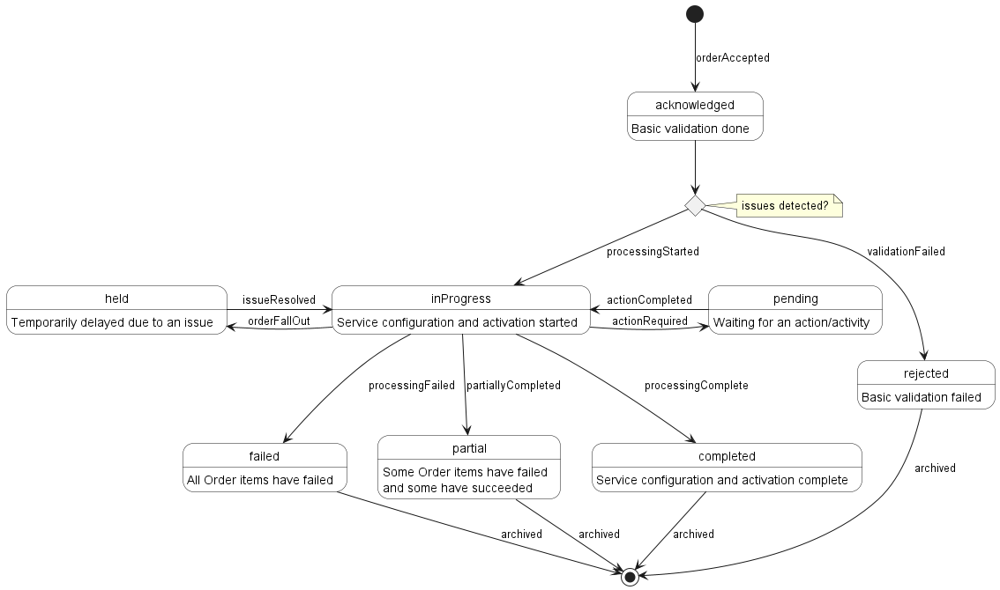

<style>
img
{
  display:block;
  float:none;
  margin-left:auto;
  margin-right:auto;
}
</style>


<div style="font-weight:bold; font-size:33pt; font-family: sensation;  text-align:center">
Working Draft
</br>
MEF W99 v0.91
</br>
LSO Service Ordering Management API - Developer Guide
</br>
<p style="color:red;font-weight:bold; font-size:18pt">This draft represents MEF work in progress and is subject to change.</p>
</br>
January 2023
</br>
<p style="color:red;font-weight:bold; font-size:18pt">EXPORT CONTROL: This document contains technical data. The download, export, re-export or disclosure of the technical data contained in this document may be restricted by applicable U.S. or foreign export laws, regulations and rules and/or applicable U.S. or foreign sanctions ("Export Control Laws or Sanctions"). You agree that you are solely responsible for determining whether any Export Control Laws or Sanctions may apply to your download, export, reexport or disclosure of this document, and for obtaining (if available) any required U.S. or foreign export or reexport licenses and/or other required authorizations.</p>
</div>

<div class="page"/>

<!-- TODO - check page formatting -->

**Disclaimer**

© MEF Forum 2023. All Rights Reserved.

The information in this publication is freely available for reproduction and
use by any recipient and is believed to be accurate as of its publication date.
Such information is subject to change without notice and MEF Forum (MEF) is not
responsible for any errors. MEF does not assume responsibility to update or
correct any information in this publication. No representation or warranty,
expressed or implied, is made by MEF concerning the completeness, accuracy, or
applicability of any information contained herein and no liability of any kind
shall be assumed by MEF as a result of reliance upon such information.

The information contained herein is intended to be used without modification by
the recipient or user of this document. MEF is not responsible or liable for
any modifications to this document made by any other party.

The receipt or any use of this document or its contents does not in any way
create, by implication or otherwise:

- (a) any express or implied license or right to or under any patent,
  copyright, trademark or trade secret rights held or claimed by any MEF member
  which are or may be associated with the ideas, techniques, concepts or
  expressions contained herein; nor

- (b) any warranty or representation that any MEF member will announce any
  product(s) and/or service(s) related thereto, or if such announcements are
  made, that such announced product(s) and/or service(s) embody any or all of
  the ideas, technologies, or concepts contained herein; nor

- (c) any form of relationship between any MEF member and the recipient or user
  of this document.

Implementation or use of specific MEF standards, specifications or
recommendations will be voluntary, and no Member shall be obliged to implement
them by virtue of participation in MEF Forum. MEF is a non-profit international
organization to enable the development and worldwide adoption of agile, assured
and orchestrated network services. MEF does not, expressly or otherwise,
endorse or promote any specific products or services.

**Copyright**

© MEF Forum 2023. Any reproduction of this document, or any portion thereof,
shall contain the following statement: "Reproduced with permission of MEF
Forum." No user of this document is authorized to modify any of the information
contained herein.

<div class="page"/>

**Table of Contents**

<!-- code_chunk_output -->

- [List of Contributing Members](#list-of-contributing-members)
- [1. Abstract](#1-abstract)
- [2. Terminology and Abbreviations](#2-terminology-and-abbreviations)
- [3. Compliance Levels](#3-compliance-levels)
- [4. Introduction](#4-introduction)
  - [4.1. Description](#41-description)
  - [4.2. Conventions in the Document](#42-conventions-in-the-document)
  - [4.3. Relation to Other Documents](#43-relation-to-other-documents)
  - [4.4. Approach](#44-approach)
  - [4.5. High-Level Flow](#45-high-level-flow)
- [5. API Description](#5-api-description)
  - [5.1. High-level Use Cases](#51-high-level-use-cases)
  - [5.2. API Endpoints and Operations Summary](#52-api-endpoints-and-operations-summary)
    - [5.2.1. SOF Service Ordering API Endpoints](#521-sof-service-ordering-api-endpoints)
    - [5.2.2. BUS Service Ordering API Endpoints](#522-bus-service-ordering-api-endpoints)
  - [5.3. Integration of Service Specifications into Service Order Management API](#53-integration-of-service-specifications-into-service-order-management-api)
  - [5.4. Sample Service Specification](#54-sample-service-specification)
  - [5.5. Model structure and validation](#55-model-structure-and-validation)
  - [5.6. Security Considerations](#56-security-considerations)
- [6. API Interactions and Flows](#6-api-interactions-and-flows)
  - [6.1. Use case 1: Create Service Order](#61-use-case-1-create-service-order)
    - [6.1.1. Interaction flow](#611-interaction-flow)
    - [6.1.2. Create Service Order Request](#612-create-service-order-request)
    - [6.1.3. Create Service Order Response](#613-create-service-order-response)
    - [6.1.4. Use Case 1a: Service Order Item to Add Service](#614-use-case-1a-service-order-item-to-add-service)
    - [6.1.5. Use case 1b: Service Order Item to Modify Existing Service](#615-use-case-1b-service-order-item-to-modify-existing-service)
    - [6.1.6. Use case 1c: Service Order Item to Delete Existing Service](#616-use-case-1c-service-order-item-to-delete-existing-service)
    - [6.1.7. Service Order and Service Order Items State Machine](#617-service-order-and-service-order-items-state-machine)
    - [6.1.8. Specifying Place Details](#618-specifying-place-details)
      - [6.1.8.1. Fielded Address](#6181-fielded-address)
      - [6.1.8.2. Formatted Address](#6182-formatted-address)
      - [6.1.8.3. Geographic Point](#6183-geographic-point)
      - [6.1.8.4. Geographic Address Label](#6184-geographic-address-label)
      - [6.1.8.5. Geographic Site Reference](#6185-geographic-site-reference)
      - [6.1.8.6. Geographic Address Reference](#6186-geographic-address-reference)
  - [6.2. Use Case 2: Retrieve List of Service Orders](#62-use-case-2-retrieve-list-of-service-orders)
  - [6.3. Use Case 3: Retrieve Service Order by Service Order Identifier](#63-use-case-3-retrieve-service-order-by-service-order-identifier)
  - [6.4. Use case 4: Register for Notifications](#64-use-case-4-register-for-notifications)
  - [6.5. Use case 5: Send Notification](#65-use-case-5-send-notification)
  - [6.6. Service Lifecycle](#66-service-lifecycle)
- [7. API Details](#7-api-details)
  - [7.1. API patterns](#71-api-patterns)
    - [7.1.1. Indicating errors](#711-indicating-errors)
      - [7.1.1.1. Type Error](#7111-type-error)
      - [7.1.1.2. Type Error400](#7112-type-error400)
      - [7.1.1.3. `enum` Error400Code](#7113-enum-error400code)
      - [7.1.1.4. Type Error401](#7114-type-error401)
      - [7.1.1.5. `enum` Error401Code](#7115-enum-error401code)
      - [7.1.1.6. Type Error403](#7116-type-error403)
      - [7.1.1.7. `enum` Error403Code](#7117-enum-error403code)
      - [7.1.1.8. Type Error404](#7118-type-error404)
      - [7.1.1.9. Type Error422](#7119-type-error422)
      - [7.1.1.10. `enum` Error422Code](#71110-enum-error422code)
      - [7.1.1.11. Type Error500](#71111-type-error500)
  - [7.2. Management API Data model](#72-management-api-data-model)
    - [7.2.1. ServiceOrder](#721-serviceorder)
      - [7.2.1.1 Type ServiceOrder\_Common](#7211-type-serviceorder_common)
      - [7.2.1.2. Type ServiceOrder\_Create](#7212-type-serviceorder_create)
      - [7.2.1.3. Type ServiceOrder](#7213-type-serviceorder)
      - [7.2.1.4. `enum` ServiceOrderStateType](#7214-enum-serviceorderstatetype)
      - [7.2.1.5. Type ServiceOrderRef](#7215-type-serviceorderref)
      - [7.2.1.6. Type ServiceOrderRelationship](#7216-type-serviceorderrelationship)
    - [7.2.2. Service Order Item](#722-service-order-item)
      - [7.2.2.1 Type ServiceOrderItem\_Common](#7221-type-serviceorderitem_common)
      - [7.2.2.2. Type ServiceOrderItem\_Create](#7222-type-serviceorderitem_create)
      - [7.2.2.3. Type ServiceOrderItem](#7223-type-serviceorderitem)
      - [7.2.2.4. `enum` ServiceActionType](#7224-enum-serviceactiontype)
      - [7.2.2.5. Type ServiceOrderItemRef](#7225-type-serviceorderitemref)
      - [7.2.2.6. Type ServiceOrderItemRelationship](#7226-type-serviceorderitemrelationship)
    - [7.2.3. Service representation](#723-service-representation)
      - [7.2.3.1. Type ServiceValue](#7231-type-servicevalue)
      - [7.2.3.2. Type MefServiceConfiguration](#7232-type-mefserviceconfiguration)
      - [7.2.3.3. Type ServiceRelationship](#7233-type-servicerelationship)
      - [7.2.3.3. `enum` ServiceStateType](#7233-enum-servicestatetype)
      - [7.2.3.3. Type ServiceRef](#7233-type-serviceref)
    - [7.2.4. Place representation](#724-place-representation)
      - [7.2.4.1. Type RelatedPlaceRefOrValue](#7241-type-relatedplacereforvalue)
      - [7.2.4.2. Type FieldedAddress](#7242-type-fieldedaddress)
      - [7.2.4.3. Type FieldedAddressValue](#7243-type-fieldedaddressvalue)
      - [7.2.4.4. Type FormattedAddress](#7244-type-formattedaddress)
      - [7.2.4.5. Type GeographicPoint](#7245-type-geographicpoint)
      - [7.2.4.6. Type GeographicAddressLabel](#7246-type-geographicaddresslabel)
      - [7.2.4.7. Type GeographicSubAddress](#7247-type-geographicsubaddress)
      - [7.2.4.8. Type GeographicSubAddressUnit](#7248-type-geographicsubaddressunit)
      - [7.2.4.9. Type GeographicAddressRef](#7249-type-geographicaddressref)
      - [7.2.4.10. Type GeographicSiteRef](#72410-type-geographicsiteref)
    - [7.2.5. Notification registration](#725-notification-registration)
      - [7.2.5.1. Type EventSubscriptionInput](#7251-type-eventsubscriptioninput)
      - [7.2.5.2. Type EventSubscription](#7252-type-eventsubscription)
    - [7.2.6. Common](#726-common)
      - [7.2.6.1. Type OrderCoordinatedAction](#7261-type-ordercoordinatedaction)
      - [7.2.6.2. Type OrderItemCoordinatedAction](#7262-type-orderitemcoordinatedaction)
      - [7.2.6.2. `enum` OrderItemCoordinationDependencyType](#7262-enum-orderitemcoordinationdependencytype)
      - [7.2.6.11. Type Note\_BusSof](#72611-type-note_bussof)
      - [7.2.6.13. Type RelatedContactInformation](#72613-type-relatedcontactinformation)
      - [7.2.6.14. Type TerminationError](#72614-type-terminationerror)
      - [7.2.6.15. `enum` TimeUnit](#72615-enum-timeunit)
  - [7.3. Notification API Data model](#73-notification-api-data-model)
    - [7.3.1. Type Event](#731-type-event)
    - [7.3.2. Type ServiceOrderEvent](#732-type-serviceorderevent)
    - [7.3.3. Type ServiceOrderEventPayload](#733-type-serviceordereventpayload)
    - [7.3.4. `enum` ServiceOrderEventType](#734-enum-serviceordereventtype)
- [8. References](#8-references)

<!-- /code_chunk_output -->

<div style="page-break-after: always;"></div>

# List of Contributing Members

The following members of the MEF participated in the development of this
document and have requested to be included in this list.

| **Member** |
| ---------- |

**Table 1. Contributing Members**

<div class="page"/>

# 1. Abstract

This standard is intended to assist the implementation of the Application
Programming Interfaces (APIs) for the Service Provisioning function of the
Service Orchestration Functionality at the LSO Legato Interface Reference
Point. The Legato Interface Reference Point is defined in the MEF 55.1
[[MEF55.1](#8-references)] at the interface between the Business Application
Systems layer and Service Orchestration Functionality layer.

This Standard normatively incorporates the following OpenAPI 3.0 definitions by
reference as if they were part of this document, from the MEF-GIT GitHub
repository _working_draft_ branch:

<https://github.com/MEF-GIT/MEF-LSO-Legato-SDK>

- `serviceApi\order\serviceOrderingManagement.api.yaml`
- `serviceApi\order\serviceOrderingNotification.api.yaml`

# 2. Terminology and Abbreviations

This section defines the terms used in this document. In many cases, the
normative definitions to terms are found in other documents. In these cases,
the third column is used to provide the reference that is controlling, in other
MEF or external documents.

In addition, terms defined in the following documents are included in this
document by reference, and are not repeated in the tables below.

- MEF 55.1, _Lifecycle Service Orchestration (LSO): Reference Architecture and
  Framework_ February 2021 [[MEF 55.1](#8-references)]

| **Term**                            | **Definition**                                                                                                                                                                                                                                                                                                                                                                                                                                  | **Source**                                                                        |
| ----------------------------------- | ----------------------------------------------------------------------------------------------------------------------------------------------------------------------------------------------------------------------------------------------------------------------------------------------------------------------------------------------------------------------------------------------------------------------------------------------- | --------------------------------------------------------------------------------- |
| API Endpoint                        | The endpoint of a communication channel (the complete URL of an API Resource) to which the HTTP-REST requests are addressed in order to operate on the _API Resource_                                                                                                                                                                                                                                                                           | [rapidapi.com](https://rapidapi.com/blog/api-glossary/endpoint/)<br>This document |
| API Resource                        | A REST Resource. In REST, the primary data representation is called Resource. In this document, _API Resource_ is defined as a OAS _SchemaObject_ with specified _API Endpoints_                                                                                                                                                                                                                                                                | [restfulapi.net](https://restfulapi.net/resource-naming/)<br>This document        |
| Business Applications               | The Service Provider functionality supporting Business Management Layer functionality                                                                                                                                                                                                                                                                                                                                                           | MEF 55.1                                                                          |
| OAS Document                        | An API description document in the OpenAPI specification format.                                                                                                                                                                                                                                                                                                                                                                                | [openapis.org](https://www.openapis.org/faq/style-guide)                          |
| OpenAPI                             | The OpenAPI 3.0 Specification, formerly known as the Swagger specification is an API description format for REST APIs.                                                                                                                                                                                                                                                                                                                          | [spec.openapis.org](http://spec.openapis.org/oas/v3.0.3)                          |
| Operation                           | An interaction between the BUS and SOF, potentially involving multiple back and forth transactions.                                                                                                                                                                                                                                                                                                                                             | This document                                                                     |
| SchemaObject                        | The construct that allows the definition of input and output data types. These types can represent object classes, as well as primitives and arrays. specification                                                                                                                                                                                                                                                                              | [spec.openapis.org](http://spec.openapis.org/oas/v3.0.3#schema-object)            |
| Service Orchestration Functionality | The set of service management layer functionality supporting an agile framework to streamline and automate the service lifecycle in a sustainable fashion for coordinated management supporting design, fulfillment, control, testing, problem management, quality management, usage measurements, security management, analytics, and policy-based management capabilities providing coordinated end-to-end management and control of Services | MEF 55.1                                                                          |

**Table 2. Terminology**

| **Term** | **Definition**                                                                               | **Source**                                               |
| -------- | -------------------------------------------------------------------------------------------- | -------------------------------------------------------- |
| API      | Application Programming Interface. In this document, API is used synonymously with REST API. | This document                                            |
| BUS      | Business Applications                                                                        | MEF 55.1                                                 |
| IRP      | Interface Reference Point                                                                    | This document                                            |
| OAS      | OpenAPI Specification                                                                        | [openapis.org](https://www.openapis.org/faq/style-guide) |
| SOF      | Service Orchestration Functionality                                                          | MEF 55.1                                                 |

**Table 3. Abbreviations**

<div class="page"/>

# 3. Compliance Levels

The key words **"MUST"**, **"MUST NOT"**, **"REQUIRED"**, **"SHALL"**, **"SHALL
NOT"**, **"SHOULD"**, **"SHOULD NOT"**, **"RECOMMENDED"**, **"NOT
RECOMMENDED"**, **"MAY"**, and **"OPTIONAL"** in this document are to be
interpreted as described in BCP 14 (RFC 2119 [[RFC 2119](#8-references)], RFC
8174 [[RFC8174](#8-references)]) when, and only when, they appear in all
capitals, as shown here. All key words must be in bold text.

Items that are **REQUIRED** (contain the words **MUST** or **MUST NOT**) are
labeled as **[Rx]** for required. Items that are **RECOMMENDED** (contain the
words **SHOULD** or **SHOULD NOT**) are labeled as **[Dx]** for desirable.
Items that are **OPTIONAL** (contain the words MAY or OPTIONAL) are labeled as
**[Ox]** for optional.

A paragraph preceded by **[CRa]<** specifies a conditional mandatory
requirement that **MUST** be followed if the condition(s) following the "<"
have been met. For example, **"[CR1]<[D38]"** indicates that Conditional
Mandatory Requirement 1 must be followed if Desirable Requirement 38 has been
met. A paragraph preceded by **[CDb]<** specifies a Conditional Desirable
Requirement that **SHOULD** be followed if the condition(s) following the "<"
have been met. A paragraph preceded by **[COc]<**specifies a Conditional
Optional Requirement that **MAY** be followed if the condition(s) following the
"<" have been met.

<div class="page"/>

# 4. Introduction

This standard specification document describes the Application Programming
Interface (API) for Service Order Management functionality of the LSO Legato
Interface Reference Point (IRP) as defined in the _MEF 55.1 Lifecycle Service
Orchestration (LSO): Reference Architecture and Framework_
[[MEF55.1](#8-references)]. The LSO Reference Architecture is shown in Figure 1
with the IRP highlighted.


**Figure 1. The LSO Reference Architecture**

## 4.1. Description

This standard is scoped to cover APIs for following Service Orchestration
Functionalities:

- Service Ordering and Fulfillment
  - Includes Service Configuration & Activation functions
- Service Notification
  - Includes Event Subscription/Hub and Listener notification functions

Other Service Orchestration Functionalities not addressed in this standard
include (but not limited to):

- Service Inventory Management
- Service Catalog Management
- Service Qualification
- Service Activation Testing
- Service Problem Management
- Service Quality Management
- Service Usage measurements and Reporting (in support of billing)
- License Management

This document primarily supports the requirements defined in section 8.2 (Order
Fulfillment and Service Control) of MEF 55.1, LSO Reference Architecture for
interactions over the Legato interface within a single operator. Both the
Business Applications (BUS) and Service Orchestration Functionality (SOF)
systems use the information contained within this document.

This standard is intended to support the design of API implementations that
enable inter-operable SOF operations (in scope of this standard) across the
Legato IRP.

This standard is based on TMF Open API (v4.1.0) for Service Ordering (TMF 641)
[TMF641](#8-references).

## 4.2. Conventions in the Document

- Code samples are formatted using code blocks. When notation `<< some text >>`
  is used in the payload sample it indicates that a comment is provided instead
  of an example value and it might not comply with the OpenAPI definition.
- Model definitions are formatted as in-line code (e.g. `ServiceOrder`).
- In UML diagrams the default cardinality of associations is `0..1`. Other
  cardinality markers are compliant with the UML standard.
- In the API details tables and UML diagrams required attributes are marked
  with a `*` next to their names.
- In UML sequence diagrams `{{variable}}` notation is used to indicate a
  variable to be substituted with a correct value.

## 4.3. Relation to Other Documents

The API definition builds on _TMF641 Service Order Management API REST
Specification v4.1.0_ [[TMF641](#8-references)]. Service Order Use Cases must
support the use of any of MEF service specifications as payload, in particular
those defined in:

- _LSO Legato Service Specification - SD-WAN Schema Guide_ in MEF W100
  [[MEF W100](#8-references)].
- _LSO Legato Service Specification - Carrier Ethernet Schema Guide_ in MEF
  W101 [[MEF W101](#8-references)].
- _LSO Legato Service Specification - IP/IP-VPN Schema Guide_ in MEF W102
  [[MEF W102](#8-references)].

## 4.4. Approach

As presented in Figure 2. the Legato API frameworks consist of three structural
components:

- Generic API framework
- Service-independent information (Function-specific information and
  Function-specific operations)
- Service-specific information (MEF service specification data model)


**Figure 2. Legato API Structure**

The essential concept behind the framework is to decouple the common structure,
information, and operations from the specific service information content.  
Firstly, the Generic API Framework defines a set of design rules and patterns
that are applied across all Legato APIs.  
Secondly, the service-independent information of the framework focuses on a
model of a particular Legato functionality and is agnostic to any of the
service specifications. For example, this standard is describing the Service
Order model and operations that allow ordering of any service that is aligned
with either MEF or custom service specifications.  
Finally, the service-specific information part of the framework focuses on MEF
service specifications that define business-relevant attributes and
requirements for trading MEF subscriber and MEF operator services.

This Developer Guide is not defining MEF service specifications but can be used
in combination with any service specifications defined by or compliant with
MEF. Examples of MEF Service Model (MSM) schema include:

- MEF W100: SD-WAN Services based on MEF 70 [[MEF70](#8-references)]
- MEF W101: Carrier Ethernet services based on MEF 10.4
  [[MEF10.4](#8-references)] and MEF 26.2 [[MEF26.2](#8-references)]
- MEF W102: IP Services based on MEF 61.1 [[MEF61.1](#8-references)] and MEF
  61.1.1 [[MEF61.1.1](#8-references)]

Figure 3 presents the relations between the Legato API components and the
Service Model. A Service Order contains one or more Service Order Items. Each
Service Order Item is an intent of action on a given Service (add, modify or
delete). A Service references Service Specification to identify the Service
Type. The Service specification points to the schema of the Service, as
provided by (but not limited to) MEF Standard. The Service also has the
`MefServiceConfiguration` attribute, which provides an instance of the
configuration of a given Service (attributes of MEF Service model populated
with desired values)


**Figure 3. Legato and MSM Schema**

## 4.5. High-Level Flow

The Legato Service Catalog, Service Order, Service Inventory, and Service
Notification APIs in essence allow the BUS to request SOF to configure and
activate one or more services as part of an order fulfillment process. Figure 4
presents a high-level flow of use of all of the above-mentioned APIs.


**Figure 4. High-Level Flow**

The following steps describe the high-level flow:

- The BUS system registers for notifications.
- As part of the ordering flow, the BUS system receives the product order
  (through Cantata or Sonata) which triggers the fulfillment processes in the
  BUS system.
- The BUS system first queries the _Service Catalog_ to retrieve the
  `ServiceSpecifications` supported by the SOF <br>**_Note1_**: _Service
  Catalog and the process of mapping and decomposing a product order to
  identify appropriate `ServiceSpecifications` is out of scope for this
  standard._ **_Note2_**: _The mechanisms to design, construct and populate the
  `ServiceSpecifications` into SOF Service Catalog is out of scope for this
  standard._
  - Each specific instance of a `ServiceSpecification` (retrieved from the
    _Service Catalog_) minimally contains a reference to target `Service`
    schema. A Service schema describes the set of properties that characterize
    that service and are exchanged over Legato IRP.
- During the service configuration and activation phase, the BUS system uses
  the _Service Order API_ to instantiate the `Service` utilizing the
  `ServiceSpecifications` (retrieved from the _Service Catalog_).
  - The BUS achieves this by creating a `ServiceOrder` which contains a one or
    more `ServiceOrderItems`.
  - Each `ServiceOrderItem` carries some `ServiceConfiguration` data and the
    type of operation (_`add`/`modify`/`delete`_) to be performed (instructions
    to SOF).
  - The SOF utilizes `Service` schema referenced in the `ServiceSpecification`
    to validate the `ServiceConfiguration` data passed in by the BUS.
  - The `ServiceOrder` / `ServiceOrderItem` is processed by the SOF as per the
    state transition rules described in
    [6.1.7. Service Order and Service Order Items State Machine](#617-service-order-and-service-order-items-state-machine)
  - The SOF reports the `ServiceOrder` and `ServiceOrderItem` state changes
  - The SOF performs the actions (_`add`/`modify`/`delete`_) specified in a
    `ServiceOrderItem` on the specified target `Service` instance in the
    _Service Inventory_ as per the state transition rules described in
    [6.6. Service Lifecycle](#66-service-lifecycle)
  - The SOF reports the `Service` instance state changes
- The BUS system uses the same _Service Order API_ to create **new** `Service`
  instances as well as update **existing** `Service` instance's properties or
  trigger state transitions, and delete **existing** `Service` instance.

<div class="page"/>

# 5. API Description

This section presents the API structure and design patterns. It starts with the
high-level use cases diagram. Then it describes the REST endpoints with use
case mapping. Next, it gives an explanation of the design pattern that is used
to combine service-agnostic and service-specific parts of API payloads.
Finally, payload validation and API security aspects are discussed.

## 5.1. High-level Use Cases

Figure 5. presents a high-level use case diagram. It aims to help understand
the endpoint mapping. Use cases are described extensively in
[chapter 6](#6-api-interactions-and-flows)


**Figure 5. Use cases**

## 5.2. API Endpoints and Operations Summary

### 5.2.1. SOF Service Ordering API Endpoints

**Base URL**:
`https://{{serverBase}}:{{port}}{{?/sof_prefix}}/mefApi/legato/serviceOrderingManagement/v5/`

The following API Endpoints are used by BUS to create and query for
`ServiceOrder` instances and to subscribe/unsubscribe to `ServiceOrder`
notifications. The endpoints and corresponding data model are defined in
`serviceApi/order/serviceOrderingManagement.api.yaml`

| API Endpoint               | Description                                                                                                                                                                                            | Use Case mapping                                         |
| -------------------------- | ------------------------------------------------------------------------------------------------------------------------------------------------------------------------------------------------------ | -------------------------------------------------------- |
| `POST /serviceOrder`       | A request initiated by the BUS to _create_ new `Service` instances as well as _update_ `Service` instance's properties or trigger their state transitions and/or _delete_ existing `Service` instance. | UC 1: Create Service Order                               |
| `GET /serviceOrder`        | A request initiated by the BUS to retrieve a list of `ServiceOrders` from the service order management system in SOF, that match the filter criteria provided as _`query`_ parameters                  | UC 2: Retrieve List of Service Orders                    |
| `GET /serviceOrder/{{id}}` | A request initiated by the BUS to retrieve a specific `ServiceOrder` from the service order management system in SOF, that match the _`id`_ provided as _`path`_ parameter                             | UC 3: Retrieve Service Order by Service Order Identifier |
| `POST /hub`                | A request initiated by the BUS to instruct the SOF to send notification                                                                                                                                | UC 4: Register for Notifications                         |
| `GET /hub/{{id}}`          | A request initiated by the BUS to retrieve a specific `EventSubscription` from the service order management system in SOF, that matches the provided _`id`_ provided as _`path`_ parameter             | UC 4: Register for Notifications                         |
| `DELETE /hub/{{id}}`       | A request initiated by the BUS to instruct the SOF to stop sending notifications                                                                                                                       | UC 4: Register for Notifications                         |

**Table 4. SOF Service Ordering API Endpoints**

**[R1]** SOF **MUST** support all API endpoints listed in Table 4.

### 5.2.2. BUS Service Ordering API Endpoints

**Base URL**:
`https://{{serverBase}}:{{port}}{{?/bus_prefix}}/mefApi/legato/serviceOrderingNotification/v5/`

The following API Endpoints are used by SOF to post notifications to registered
BUS listeners. The endpoints and corresponding data model are defined in
`serviceApi/order/serviceOrderingNotification.api.yaml`

| API Endpoint                                          | Description                                                                                                              | Use Case mapping      |
| ----------------------------------------------------- | ------------------------------------------------------------------------------------------------------------------------ | --------------------- |
| `POST /listener/serviceOrderCreateEvent`              | A request initiated by the SOF to notify BUS on _`ServiceOrder`_ instance creation                                       | 5. Send Notifications |
| `POST /listener/serviceOrderInformationRequiredEvent` | A request initiated by the SOF to notify BUS that additional information is required for given _`ServiceOrder`_ instance | 5. Send Notifications |
| `POST /listener/serviceOrderStateChangeEvent`         | A request initiated by the SOF to notify BUS on _`ServiceOrder`_ instance state change                                   | 5. Send Notifications |
| `POST /listener/serviceOrderItemStateChangeEvent`     | A request initiated by the SOF to notify BUS on _`ServiceOrderItem`_ instance state change                               | 5. Send Notifications |

**Table 5. BUS Service Ordering API Endpoints**

**[O1]** The BUS **MAY** support API endpoints listed in Table 5.

**[O2]** The BUS **MAY** register to receive service notifications.

**[R2]** The SOF **MUST** support sending notification to API endpoints listed
in Table 5 to registered BUS.

## 5.3. Integration of Service Specifications into Service Order Management API

Service specifications are defined using JsonSchema (draft 7) format
[JSON Schema draft 7](#8-references) and are integrated into the `ServiceOrder`
using the TMF extension pattern.

The extension hosting type in the API data model is `MefServiceConfiguration`.
The `@type` attribute of that type must be set to a value that uniquely
identifies the service specification. A unique identifier for MEF standard
service specifications is in URN format and is assigned by MEF. This identifier
is provided as root schema `$id` and in service specification documentation.
Use of non-MEF standard service definitions is allowed. In such a case the
schema identifier must be agreed upon between the BUS and the SOF.

The example below shows a header of a Service Specification schema, which is
describing the IP Uni, where `"$id": urn:mef:lso:spec:legato:ip-uni:v0.0.1:all`
is the above-mentioned URN:

```yaml
"$schema": http://json-schema.org/draft-07/schema#
"$id": $id": urn:mef:lso:spec:legato:ip-uni:v0.0.1:all
title: MEF LSO Legato - IP UNI Specification
```

Service specifications are provided as Json schemas without the
`MefServiceConfiguration` context.

Service-specific attributes are introduced via the `ServiceValue` (defined by
the BUS). This entity has the `serviceConfiguration` attribute of type
`MefServiceConfiguration` which is used as an extension point for
service-specific attributes.

Implementations might choose to integrate selected service specifications to
data model during development. In such a case an integrated data model is built
and service specifications are in an inheritance relationship with
`MefServiceConfiguration` as described in the OAS specification. This pattern
is called **Static Binding**. The SDK is additionally shipped with a set of API
definitions that statically bind all service-related APIs (POQ, Quote, Order,
Inventory) with all corresponding service specifications available in the
release. The snippets below present an example of a static binding of the
envelope API with several MEF service specifications, from both
`MefServiceConfiguration` and service specification point of view:

```yaml
MefServiceConfiguration:
  description:
    MefServiceConfiguration is used as an extension point for MEF-specific
    service payload. The `@type` attribute is used as a discriminator
  discriminator:
    mapping:
      urn:mef:lso:spec:legato:ip-enni:v0.0.1:all: '#/components/schemas/IpEnni'
      urn:mef:lso:spec:legato:ipvc-endpoint:v0.0.1:all: '#/components/schemas/IpvcEndpoint'
      urn:mef:lso:spec:legato:ip-uni:v0.0.1:all: '#/components/schemas/IpUni'
      urn:mef:lso:spec:legato:ethernet-uni-access-link-trunk:0.0.1:all: '#/components/schemas/EthernetUniAccessLinkTrunk'
      urn:mef:lso:spec:legato:ip-uni-access-link:0.0.1:all: '#/components/schemas/IpUniAccessLink'
      urn:mef:lso:spec:legato:ipvc:v0.0.1:all: '#/components/schemas/Ipvc'
      urn:mef:lso:spec:legato:ip-uni-access-link-trunk.0.1:all: '#/components/schemas/IpUniAccessLinkTrunk'
      urn:mef:lso:spec:legato:ip-enni-link:v0.0.1:all: '#/components/schemas/IpEnniLink'
    propertyName: '@type'
  properties:
    '@type':
      description:
        The name of the type, defined in the JSON schema specified above, for
        the service that is the subject of the Request. The named type must be
        a subclass of MefServiceConfiguration.
      type: string
```

```yaml
IpvcEndpoint:
  allOf:
    - $ref: '#/components/schemas/MefServiceConfiguration'
    - description:
        'An IPVC End Point is a logical entity at an EI, to which a subset of
        packets that traverse the EI is mapped. Reference MEF 61.1 Section 7.4
        IP Virtual Connections and IPVC End Points.'
```

Alternatively, implementations might choose not to build an integrated model
and choose a different mechanism allowing runtime validation of
service-specific fragments of the payload. The system can validate a given
service against a new schema without redeployment. This pattern is called
**Dynamic Binding.**

Regardless of chosen implementation pattern, the HTTP payload is exactly the
same. Both implementation approaches must conform to the requirements specified
below.

**[R3]** `MefServiceConfiguration` type is an extension point that **MUST** be
used to integrate service specifications' properties into a request/response
payload.

**[R4]** The `@type` property of `MefServiceConfiguration` **MUST** be used to
specify the type of the extending entity.

**[R5]** Service attributes specified in the payload must conform to the
service specification specified in the `@type` property.


**Figure 6. The Extension Pattern with Sample Service-Specific Extensions**

Figure 6 presents two MEF `<<ServiceSpecifications>>` that represent IPVC and
IPVC Endpoint services. When these services are used as a Service Order payload
the `@type` of `MefServiceConfiguration` takes
`"urn:mef:lso:spec:legato:ipvc:v0.0.1:all"` or
`"urn:mef:lso:spec:legato:ipvc-endpoint:v0.0.1:all"` value to indicate which
service specification should be used to interpret a set of service-specific
attributes included in the payload. An example of a service definition inside
the `ServiceOrderItem` is presented in
[Section 6.1.4](#614-use-case-1a-service-order-item-to-add-service).

The _all_ suffix after the service type name in the URN comes from the approach
that the service schemas may differ depending on the function (POQ, Quote,
Order, or Inventory) they are used with. The value _all_ means that one version
of the schema is shared by all functions.

## 5.4. Sample Service Specification

The Legato SDK contains service specification definitions, from which IPVC and
IPVC End Point are used in the payload samples in this section. The schemas are
located in the SDK package at:

- `serviceSchema\ip\ipvc.yaml`
- `serviceSchema\ip\ipvcEndPoint.yaml`

The service specification data model definitions are available as JsonSchema
(version `draft 7`) documents. Figures 7 and 8 depict simplified UML views on
these data models in which:

- the mandatory attributes are marked with `*`,
- the mandatory relations have a cardinality of `1` or `1..*`,
- some relations and attributes that are not essential to the understanding of
  the service specification model are omitted.

The red color in figures 7 and 8 below highlights the data model of services.
Some parts of the model are skipped for examples clarity. This is denoted by
the `<<skipped>>` text in diagrams and in json snippets later in the document.
Please note that this document uses service specifications just for the sake of
example on how to use the Service Order API together with the Service payload.
The detailed examples of any service specification are not in the scope of this
document.


**Figure 7. A simplified view of IPVC service specification data model**


**Figure 8. A simplified view of IPVC End Point service specification data
model**

Service specifications define several service-related and envelope-related
requirements. For example:

- for an IPVC End Point service two mandatory relationships must be specified,
  one toward the IPVC (`IPUNI_ENDPOINT_OF_IPVC`), and a second towards the IP
  UNI (`CONNECTS_TO_IPUNI`) for the `add` action.
- in the case of a `modify` action, service relationships must have the same
  value as in the `add` action. They must not be changed
- for an IP UNI Access Link Trunk service a place relationship
  (`INSTALL_LOCATION`) must be specified
- in the case of a `modify` action, place relationships must have the same
  value as in the `add` action. They must not be changed

In case, some of these requirements are violated the SOF returns an error
response to the BUS that indicates specific functional errors. These errors are
listed in the response body (a list of `Error422` entries) for HTTP `422`
response.


**Figure 9. Example use case configuration**

Figure 9 shows a setup of service configuration used by the example. The
Advanced Internet Access is built from 5 services:

- IPVC
- IPVC End Point
- IP UNI
- IP UNI Access Link
- IP UNI Access Link Trunk

The example assumes a situation, where IP UNI, IP UNI Access Link, and IP UNI
Access Link Trunk are already provisioned and are available in Service
Inventory. They are marked with black lines. The Service Order includes
requests to create 2 services: IPVC and IPVC End Point (marked with red lines).
This means there are 2 Service Order Items with `action=add`. As mentioned
earlier, there are 2 mandatory relations to be provided with IPVC End Point. In
this case:

- `IPUNI_ENDPOINT_OF_IPVC` is provided with the use of
  `serviceOrderItemRelationship` as pointing to the `Ipvc` being part of the
  same Service Order,
- `CONNECTS_TO_IPUNI` is provided with the use of `serviceRelationship` as
  pointing to an `IpUni` service that is already provisioned and available in
  Service Inventory.

## 5.5. Model structure and validation

The structure of the payloads exchanged via Legato Service API endpoints is
defined using:

- OpenAPI version 3.0 for the service-agnostic part of the payload
- JsonSchema (draft 7) for the service-specific part of the payload

**[R6]** Implementations **MUST** use payloads that conform to these
definitions.

**[R7]** A service specification may define additional consistency rules and
requirements that **MUST** be respected by implementations. These are defined
for:

- required relation type, multiplicity to other items within the same or
  another Service Order request
- required relation type, multiplicity to entities in the SOF's service
  inventory
- related contact information roles that are to be defined at the Service Order
  Item level
- relations to places (locations) and their roles that are to be defined at the
  order item level

## 5.6. Security Considerations

Although the Legato IRP is internal to a Service Provider/Operator business
boundary, it is expected that some minimal security mechanisms are in place for
any communication over this IRP. There must also be authorization mechanisms in
place to control what a particular BUS or SOF is allowed to do and what
information may be obtained. However, the definition of the exact security
mechanism and configuration is outside the scope of this document. The LSO
Security mechanisms are defined by MEF 128 _LSO API Security Profiles_
[[MEF128](#8-references)].

<div class="page"/>

# 6. API Interactions and Flows

This section provides a detailed insight into the API functionality, use cases,
and flows. It starts with Table 6 presenting a list and short description of
all business use cases then presents the variants of end-to-end interaction
flows, and in the following subchapters describes the API usage flow and
examples for each of the use cases.

| Use Case # | Use Case Name                                                                                                           | Use Case Description                                                                                                                                                                                                                                                                                                                                       |
| ---------- | ----------------------------------------------------------------------------------------------------------------------- | ---------------------------------------------------------------------------------------------------------------------------------------------------------------------------------------------------------------------------------------------------------------------------------------------------------------------------------------------------------- |
| 1          | [Create Service Order](#61-use-case-1-create-service-order)                                                             | A request initiated by the BUS to order a new service or service component(s). A Service Order must contain at least one Service Order Item (Use Case # 1-a, 1-b, or 1-c) as shown below. A Service Order may contain more than one Service Order Item and Service Order Items within a Service Order are not required to have relationships between them. |
| 1-a        | [Service Order Item to Add Service](#614-use-case-1a-service-order-item-to-add-service)                                 | Service Order Item adds a new Service.                                                                                                                                                                                                                                                                                                                     |
| 1-b        | [Service Order Item to Modify Existing Service](#615-use-case-1b-service-order-item-to-modify-existing-service)         | Service Order Item modifies attributes of a specific active Service.                                                                                                                                                                                                                                                                                       |
| 1-c        | [Service Order Item to Delete Existing Service](#616-use-case-1c-service-order-item-to-delete-existing-service)         | Service Order Item disconnects an active Service.                                                                                                                                                                                                                                                                                                          |
| 2          | [Retrieve List of Service Orders](#62-use-case-2-retrieve-list-of-service-orders)                                       | A request initiated by the BUS to retrieve a list of Service Orders that match the provided filter criteria                                                                                                                                                                                                                                                |
| 3          | [Retrieve Service Order by Service Order Identifier](#63-use-case-3-retrieve-service-order-by-service-order-identifier) | A request initiated by the BUS to retrieve the details associated with a specific Service Order with the given Service Order Identifier.                                                                                                                                                                                                                   |
| 4          | [Register for Notifications](#64-use-case-4-register-for-notifications)                                                 | The BUS requests to subscribe to notifications.                                                                                                                                                                                                                                                                                                            |
| 5          | [Send Notification](#65-use-case-5-send-notification)                                                                   | A notification initiated by the SOF to the BUS                                                                                                                                                                                                                                                                                                             |

**Table 6. Use cases description**

## 6.1. Use case 1: Create Service Order

This is the initial step for Service Order processing.

### 6.1.1. Interaction flow

The flow of this use case is very simple and is described in Figure 10.


**Figure 10. Use Case 1 - Service Order create request flow**

The BUS sends a request with a `ServiceOrder_Create` type in the body. The SOF
performs request validation, assigns an `id`, and returns `ServiceOrder` type
in the response body, with a `state` set to `acknowledged`. From this point,
the Service Order is ready for further processing. The BUS can track the
progress of the process either by subscribing for notifications or by
periodically polling the `ServiceOrder`. The two patterns are presented in the
following two diagrams.


**Figure 11. Service Order progress tracking - Notifications**


**Figure 12. Service Order progress tracking - Polling**

**_Note_**: The context of notifications is not a part of the considered use
case itself. It is presented to show the big picture of end-to-end flow. This
applies also to all further use case flow diagrams with notifications.

so to all further use case flow diagrams with notifications.

### 6.1.2. Create Service Order Request

Figure 13 presents the most important part of the data model used during the
Create Service Order request (`POST /serviceOrder`) and response. The model of
the request message - `ServiceOrder_Create` is a subset of the `ServiceOrder`
model and contains only attributes that can (or must) be set by the BUS. The
SOF then enriches the entity in the response with additional information.

**_Note:_** `ServiceOrder_Create` and `ServiceOrderItem_Create` are entities
used by the BUS to make a request. `ServiceOrder` and `ServiceOrderItem` are
entities used by the SOF to provide a response. The request entities have a
subset of attributes of the response entities. Thus for visibility of these
shared attributes `ServiceOrder_Common` and `ServiceOrderItem_Common` have been
introduced. Though, these are not to be used directly in the exchange.

A `ServiceOrderItem_Create` defines details of the service(s) being subject of
the ordering (in `ServiceValue` structure) and allows for the definition of
additional information like related parties (`RelatedContactInformation`) or
relations to other items (`ServiceOrderItemRelationship`,
`ServiceOrderRelationship`).

`ServiceValue` allows for the introduction of service-specific properties as
the Service Order payload. The extension mechanism is described in detail in
[Section 5.3](#53-integration-of-service-specifications-into-service-order-management-api).
`ServiceValue` may be also used to specify relations to places (using
specializations of `RelatedPlaceOrValue`, as described in
[Section 6.1.8.](#618-specifying-place-details)) and/or to a service that
exists in the SOF's inventory (using `ServiceRelationship`).

The full list of attributes is available in [Section 7](#7-api-details) and in
the API specification which is an integral part of this standard.


**Figure 13. Service Order Key Entities**

To send a Service Order request the BUS uses the `createServiceOrder` operation
from the API: `POST /serviceOrder`. For clarity, some of the Service Order
payload's attributes might be omitted to improve examples' readability. The
`ServiceOrder_Create` is a simple structure that is common for all types of
requests (`add`, `modify`, `delete`), most of the information is in the
`ServiceOrderItem_Create`.

**`Service Order` Create Request**

```json
{
  "description": "Example Service Order",
  "externalId": "busOrder-101",
  "requestedCompletionDate": "2023-01-28T20:45:23.796Z",
  "requestedStartDate": "2023-01-02T00:00:00.000Z",
  "relatedContactInformation": [
    {
      "emailAddress": "john.example@example.com",
      "name": "John Example",
      "number": "12-345-6789",
      "numberExtension": "1234",
      "organization": "Example Co.",
      "role": "serviceOrderContact"
    }
  ],
  "note": [
    {
      "author": "John Example",
      "date": "2022-12-28T20:45:23.796Z",
      "id": "note-001",
      "source": "bus",
      "text": "This is an example text"
    }
  ],
  "serviceOrderItem": [
    {
      "id": "item-001",
      "action": "add",
      "service": {
        "description": "IP Virtual Connection",
        "externalId": "BUS_IPVC-0001",
        "serviceType": "Internet Access",
        "name": "IPVC",
        "state": "feasibilityChecked",
        "relatedContactInformation": [
          {
            "emailAddress": "BUS.ServiceOrderItemContact@example.com",
            "name": "BUS Service Order Item Contact",
            "number": "+12-345-678-90",
            "role": "busServiceOrderItemContact"
          }
        ],
        "serviceConfiguration": {
          "@type": "urn:mef:lso:spec:legato:ipvc:v0.0.1:all",
          "administrativeState": {
            "state": "UNLOCKED"
          },
          "operationalState": {
            "state": "ENABLED"
          },
          "ipvcIdentifier": "IPVC-0000-0001",
          "ipvcTopology": "CLOUD_ACCESS",
          "packetDelivery": "STANDARD_ROUTING",
          "maximumNumberOfIpv4Routes": 1,
          "maximumNumberOfIpv6Routes": 0,
          "dscpPreservation": "ENABLED",
          "serviceLevelSpecification": {}, <<skipped>>
          "maximumTransferUnit": 1522,
          "pathMtuDiscovery": "ENABLED",
          "fragmentation": "DISABLED",
          "cloud": {}, <<skipped>>
          "reservedPrefixes": {}, <<skipped>>
          "listOfClassOfServiceNames": ["low"]
        }
      }
    },
    {
      "id": "item-002",
      "action": "add",
      "serviceOrderItemRelationship": [
        {
          "orderItem": {  << Relationship to IPVC in the same Service Order >>
            "itemId": "item-001"
          },
          "relationshipType": "IPUNI_ENDPOINT_OF_IPVC"
        }
      ],
      "service": {
        "description": "IPVC End Point",
        "externalId": "BUS_IPVC_END_POINT-0001",
        "serviceType": "Internet Access",
        "name": "IPVCEndpoint",
        "serviceRelationship": [
          { << Relationship to already configured IP UNI in Service Inventory >>
            "relationshipType": "CONNECTS_TO_IPUNI",
            "service": {
              "id": "IP_UNI_0000-0001"
            }
          }
        ],
        "relatedContactInformation": [
          {
            "emailAddress": "BUS.ServiceOrderItemContact@example.com",
            "name": "BUS Service Order Item Contact",
            "number": "+12-345-678-90",
            "role": "busServiceOrderItemContact"
          }
        ],
        "serviceConfiguration": {
          "@type": "urn:mef:lso:spec:legato:ipvc-end-point:v0.0.1:all",
          "administrativeState": {
            "state": "UNLOCKED"
          },
          "operationalState": {
            "state": "ENABLED"
          },
          "identifier": "IPVC-EndPoint-0000-0001",
          "eiType": "UNI",
          "role": "ROOT",
          "prefixMapping": {},
          "maximumNumberOfIpv4Routes": 1,
          "maximumNumberOfIpv6Routes": 0,
          "ingressClassOfServiceMap": {}, <<skipped>>
          "egressClassOfServiceMap": {}, <<skipped>>
          "ingressBwpEnvelope": {}, <<skipped>>
          "egressBwpEnvelope": {} <<skipped>>
        }
      }
    }
  ]
}
```

**[R8]** The BUS's request **MUST** contain `requestedStartDate`,
`requestedCompletionDate` and at least one `serviceOrderItem`.

**[R9]** The BUS's request **MUST** contain at least one `serviceOrderItem`.

**[D1]** The BUS and SOF **SHOULD** agree on using specific contact `roles`.

**_Note:_** During the onboarding the SOF may require to provide an additional
contact `role`.

**_Note:_** It is up to SOF's discretion on how to react in case the BUS
provides a contact `role` that is not agreed upon during the onboarding.
Preferably the SOF should return an error with a message stating which `roles`
are accepted. It may also be ignored

For each `serviceOrderItem`:

**[R10]** The BUS's Create Service Order request **MUST** contain:

- `id`
- `action`
- `service`

**[R11]** When adding a note, BUS **MUST** add a `note` only with `source=bus`.

### 6.1.3. Create Service Order Response

Entities use for providing a response to Create Service Order request are
presented in Figure 13. The main types used for response are `ServiceOrder` and
`ServiceOrderItem`, which add attributes set by SOF (like `id` or `state`)
`ServiceOrder` is the root entity of a response. The response echoes back all
attributes as provided by the BUS and contains the same number of
`ServiceOrderItems` as in the request.

The following snippet presents the SOF's response.

**`Service Order` Create Response**

```json
{
  "id": "00000000-3333-4444-5555-000000004567", << added by SOF >>
  "href": "{{baseUrl}}/serviceOrder/00000000-3333-4444-5555-000000004567", << added by SOF >>
  "state": "acknowledged", << added by SOF >>
  "orderDate": "2022-12-28T20:45:24.796Z", << added by SOF >>
  "expectedCompletionDate": "2023-01-25T20:00:00.000Z", << added by SOF >>
  "description": "Example Service Order",
  "externalId": "busOrder-101",
  "requestedCompletionDate": "2023-01-28T20:45:23.796Z",
  "requestedStartDate": "2023-01-02T00:00:00.000Z",
  "relatedContactInformation": [
    {
      "emailAddress": "john.example@example.com",
      "name": "John Example",
      "number": "12-345-6789",
      "numberExtension": "1234",
      "organization": "Example Co.",
      "role": "serviceOrderContact"
    },
    { << added by SOF >>
      "emailAddress": "ella.sof@example.com",
      "name": "Ella SOF",
      "number": "98-765-4321",
      "organization": "SOF Co.",
      "role": "sofContact"
    }
  ],
  "note": [
    {
      "id": "note-001",
      "author": "John Example",
      "date": "2022-12-28T20:45:23.796Z",
      "source": "bus",
      "text": "This is an example text"
    },
    { << added by SOF >>
      "id": "note-002",
      "author": "Ella SOF",
      "date": "2022-12-28T20:45:24.796Z",
      "source": "sof",
      "text": "This is an example response text"
    }
  ],
  "serviceOrderItem": [
    {
      "id": "item-001",
      "action": "add",
      "state": "acknowledged", << added by SOF >>
      "service": {
        "id": "00000000-5555-6666-7777-000000008888", << added by SOF >>
        "href": "{{baseUrl}}/service/00000000-5555-6666-7777-000000008888", << added by SOF >>
        "state": "feasibilityChecked",
        "description": "IP Virtual Connection",
        "externalId": "BUS_IPVC-0001",
        "serviceType": "Internet Access",
        "name": "IPVC"
        ...
        << skipped, as provided by BUS >>
      }
    },
    {
      "id": "item-002",
      "action": "add",
      "state": "acknowledged", << added by SOF >>
      "serviceOrderItemRelationship": [
        {
          "orderItem": {
            "itemId": "item-001",
            "serviceOrderHref": "string",
            "serviceOrderId": "string"
          },
          "relationshipType": "IPUNI_ENDPOINT_OF_IPVC"
        }
      ],
      "service": {
        "id": "00000000-5555-6666-7777-000000009999", << added by SOF >>
        "href": "{{baseUrl}}/service/00000000-5555-6666-7777-000000009999", << added by SOF >>
        "state": "feasibilityChecked",
        "description": "IPVC End Point",
        "externalId": "BUS_IPVC_END_POINT-0001",
        "serviceType": "Internet Access",
        "name": "IPVCEndpoint",
        "serviceRelationship": [
          {
            "relationshipType": "CONNECTS_TO_IPUNI",
            "service": {
              "id": "IP_UNI_0000-0001"
            }
          }
        ]
        ...
        << skipped, as provided by BUS >>

      }
    }
  ]
}
```

Attributes that are set by the SOF in the response are marked with the
`<< added by SOF >>` tag. The response to the create request does not contain
all possible attributes. Some of them are valid only in the future lifecycle of
the `ServiceOrder` (e.g. `completionDate`, `startDate`).

**[R12]** The SOF's response **MUST** include all and unchanged attributes'
values as provided by BUS in the request.

The SOF might append related contact information or notes if required, but
cannot modify items set by the BUS.

**[R13]** The SOF **MUST** specify the following attributes in a response:

- `id`
- `state`
- `orderDate`

**[R14]** The `id` **MUST** remain the same value for the life of the Service
Order.

**[R15]** When adding a note, SOF **MUST** add a `note` only with `source=sof`.

**[R16]** Notes **MUST NOT** be modified or deleted once entered.

For each `serviceOrderItem`:

**[R17]** The response **MUST** have the `state` attribute set.

**[R18]** If the Service Order Item `state` in the SOF's response is not
`completed`, the response **MUST NOT** contain the `expectedCompletionDate`.

### 6.1.4. Use Case 1a: Service Order Item to Add Service

When requesting a new service installation (`action` equal to `add`) the BUS
needs to provide all of its configuration information. The example for `add`
action is already provided in the snippets above.

The following requirements apply when `serviceOrderItem.action` is `add`:

**[R19]** The BUS **MUST** provide:

- `service.state`
- `service.serviceConfiguration`

**[R20]** If there is a relationship with a Service Order Item within the same
Service Order, the `serviceOrderItemRelationship.itemId` **MUST** be specified.

**[R21]** If there is a relationship with a Service Order Item within the same
Service Order, the `serviceOrderItemRelationship.itemId` and
`serviceOrderItemRelationship.serviceOrderId` **MUST NOT** be specified.

**[R22]** If there is a relationship with a Service Order Item of another
Service Order, the `serviceOrderItemRelationship.itemId` and
`serviceOrderItemRelationship.serviceOrderId` **MUST** be specified.

**[R23]** The BUS **MUST NOT** specify the `serviceOrderItem.service.id` in the
request. It is the SOF who assigns this id.

**_Note:_** The service.id might not be assigned yet at the moment the SOF
provides a response for the Create Service Order Request.

### 6.1.5. Use case 1b: Service Order Item to Modify Existing Service

The following example shows a request for an order for an existing IPVC End
Point Service modification (`action` equal to `modify`). In particular, a
change to `maximumNumberOfIpv4Routes` is introduced.  
The IPVC End Point service exists in SOF's inventory and is identified as
`00000000-5555-6666-7777-000000009999`, as provided in SOF response presented
in [Chapter 6.1.3](#613-create-service-order-response).

The following requirements apply to `serviceOrderItem` when `action` is
`modify`:

**[R24]** The modify request **MUST** specify a reference (provide
`service.id`) to an existing service that is a subject of this order and
provide the desired `service.serviceConfiguration`.

**[R25]** The modify request **MUST** provide:

- `service.id` - a reference to an existing service that is a subject of this
  order
- `service.state`
- `service.serviceConfiguration`

**[R26]** The modify request **MUST** repeat the same values (specified or
empty) of `service.serviceRelationship`, and `service.place` as they are
available in the inventory for a given service instance. These values cannot be
updated or deleted.

**[R27]** If there is a relationship with another Service Order Item, the
`serviceOrderItemRelationship` **MUST** be also specified unchanged.

There is no possibility to send an update to single attributes. The BUS must
send a full service description (the whole `service.serviceConfiguration`
section and if set previously or to be set: `service.serviceRelationship` and
`service.place`), which means all attributes that represent the desired state,
even if some of them do not change.  
If SOF does not allow for some of the attributes to change an appropriate error
response (`422`) must be returned to the BUS.

Please also note, that in the `add` case, a reference to the IPVC service used
the `serviceOrderItemRelationship` pointing to another `serviceOrderItem` in
the same Service Order Request. This is because the IPVC did not exist at that
moment and was also a part of the order. In the case of ordering the update of
an existing IPVC End Point, the IPVC is also existing and it must be referenced
with the use of `serviceRelationship`. This example assumes that the IPVC
service is available in SOF's Inventory with the `id` equals
`"00000000-5555-6666-7777-000000008888"` (as provided in SOF response presented
in [Chapter 6.1.3](#613-create-service-order-response).

**Service Order Item to Modify Existing Service**

```json
{
  "description": "Example Service Order to Modify IPVC End Point service",
  "externalId": "busOrder-102",
  "requestedCompletionDate": "2023-02-03T20:45:23.796Z",
  "requestedStartDate": "2023-02-02T00:00:00.000Z",
  "relatedContactInformation": [
    {
      "emailAddress": "john.example@example.com",
      "name": "John Example",
      "number": "12-345-6789",
      "numberExtension": "1234",
      "organization": "Example Co.",
      "role": "serviceOrderContact"
    }
  ],
  "serviceOrderItem": [
    {
      "id": "item-001",
      "action": "modify",
      "service": {
        "id": "00000000-5555-6666-7777-000000009999", << id to point to service instance >>
        "description": "IPVC End Point",
        "externalId": "BUS_IPVC_END_POINT-0001",
        "serviceType": "Internet Access",
        "name": "IPVCEndpoint",
        "state": "active",
        "serviceRelationship": [
          { << relation to IP UNI - not changed >>
            "relationshipType": "CONNECTS_TO_IPUNI",
            "service": {
              "id": "IP_UNI_0000-0001"
            }
          },
          { << relation to IPVC - not changed, but provided with serviceRelationship instead of serviceOrderItemRelationship >>
            "relationshipType": "IPUNI_ENDPOINT_OF_IPVC",
            "service": {
              "id": "00000000-5555-6666-7777-000000008888"
            }
          }
        ],
        "serviceConfiguration": {
          "@type": "urn:mef:lso:spec:legato:ipvc-end-point:v0.0.1:all",
          "administrativeState": {
            "state": "UNLOCKED"
          },
          "operationalState": {
            "state": "ENABLED"
          },
          "identifier": "IPVC-EndPoint-0000-0001",
          "eiType": "UNI",
          "role": "ROOT",
          "prefixMapping": {},
          "maximumNumberOfIpv4Routes": 2, << modified value >>
          "maximumNumberOfIpv6Routes": 0,
          "ingressClassOfServiceMap": {},
          "egressClassOfServiceMap": {},
          "ingressBwpEnvelope": {},
          "egressBwpEnvelope": {}
        }
      }
    }
  ]
}
```

### 6.1.6. Use case 1c: Service Order Item to Delete Existing Service

The example below represents a single Service Order request for deletion
(`action=delete`) of an existing IPVC End Point service.

**Service Order to Delete Existing Service**

```json
{
  "description": "Example Service Order to Delete IPVC End Point service",
  "externalId": "busOrder-103",
  "requestedCompletionDate": "2023-03-03T20:45:23.796Z",
  "requestedStartDate": "2023-03-02T00:00:00.000Z",
  "serviceOrderItem": [
    {
      "id": "item-001",
      "action": "delete",
      "service": {
        "id": "00000000-5555-6666-7777-000000009999" << id to point to service instance >>
      }
    }
  ]
}

```

The following requirements apply to `serviceOrderItem` when `action` is
`delete`:

**[R28]** `service.id` **MUST** be provided.

**[R29]** The BUS **MUST NOT** provide any `service` attributes other than
`service.id`.

### 6.1.7. Service Order and Service Order Items State Machine



**Figure 14. Service Order and Service Order Items State Machine**

Service Order and Service Order Item share the same list of possible states and
states' transitions. They are presented in Figure 14.

After receiving the request, the SOF performs basic checks of the message. If
any problem is found an Error response is provided. If the validation passes a
response is provided with `ServiceOrder` and all `ServiceOrderItems` in the
`acknowledged` state. Before moving the order to the `inProgress` state, the
BUS performs all the remaining business and time-consuming validations. At this
point, an Error response cannot be provided anymore so the order moves to a
`rejected` state if some issues are found. The
`serviceOrderItem.terminationError` acts as a placeholder to provide a detailed
description of what caused the problem.

Table 7 presents the states' descriptions.

| State        | Description                                                                                                                                                                                                                                                                                                                                                                                                                                                                                                                                             |
| ------------ | ------------------------------------------------------------------------------------------------------------------------------------------------------------------------------------------------------------------------------------------------------------------------------------------------------------------------------------------------------------------------------------------------------------------------------------------------------------------------------------------------------------------------------------------------------- |
| acknowledged | A `ServiceOrder` request has been received and has passed message and basic validations and a _Success Response_ has been sent.                                                                                                                                                                                                                                                                                                                                                                                                                         |
| rejected     | This state indicates that: <br>- Invalid information is provided through the `ServiceOrder` / `ServiceOrderItem` request <br>- The request fails to meet validation rules for `Service` delivery (processing) <br>If one `ServiceOrderItem` is rejected, then the entire `ServiceOrder` request is rejected and a _Error Response_ is sent.                                                                                                                                                                                                             |
| inProgress   | This state indicates that all `ServiceOrderItems` have successfully passed the validations checks and the scheduled `Service` delivery/processing has started. <br> The `ServiceOrder` will be in _`inProgress`_ state if _at least one_ `ServiceOrderItem` is in _`inProgress`_ state                                                                                                                                                                                                                                                                  |
| pending      | This state indicates that a `ServiceOrderItem` is currently in a waiting stage for an action/activity to be completed before the order-processing can progress further, pending order amend or cancel assessment. <br> A _`pending`_ state can lead into auto cancellation of an `ServiceOrderItem`, if no action is taken within the agreed timeframe.<br>The `ServiceOrder` will be in _`pending`_ state if _at least one_ `ServiceOrderItem` is in _`pending`_ state                                                                                 |
| held         | This state indicates that a `ServiceOrderItem` cannot be progressed due to an issue. The `Service` delivery (processing) has been temporarily delayed to resolve an infrastructure shortfall to facilitate the supply of order. Upon resolution of the issue, the `ServiceOrderItem` will continue to progress.<br> A _`held`_ state can lead into auto cancellation of a `ServiceOrderItem` if no action is taken within the agreed timeframe.<br>The `ServiceOrder` will be in _`held`_ state if at least one `ServiceOrderItem` is in _`held`_ state |
| failed       | This state indicates that `Service` delivery (processing) associated with a `ServiceOrderItem` has failed. This indicates an irrecoverable error as opposed to _`held`_ or _`pending`_ issues.<br>The `ServiceOrder` will be in _`failed`_ state if at _ALL_ `ServiceOrderItems` are in _`failed`_ state                                                                                                                                                                                                                                                |
| completed    | This state indicates that `Service` delivery (processing) associated with a `ServiceOrderItem` has completed. <br>The `ServiceOrder` will be in _`completed`_ state if at _ALL_ `ServiceOrderItems` are in _`completed`_ state                                                                                                                                                                                                                                                                                                                          |
| partial      | This state indicates that some `ServiceOrderItem` are in _`completed`_ state while others are in _`cancelled`_ and/or _`failed`_ states, so the entire `ServiceOrder` is in a _`partial`_ state.                                                                                                                                                                                                                                                                                                                                                        |

**Table 7. Service Order and Service Order Item states**

### 6.1.8. Specifying Place Details

Some service specifications may define requirements concerning place definition
in case `add` or `modify` action is used. For example, an IP UNI Access Link
Trunk service specification requires an `INSTALL_LOCATION` place definition.

There are different formats in which place information may be provided:
`MEFGeographicPoint`, `FieldedAddress`, `FormattedAddress`,
`GeographicAddressLabel`, `GeographicSiteRef`, `GeographicAddressRef`. The
first four of them can be used to provide place description by value. The site
and address reference allow specifying the place information as a reference to
previously validated address or site available through SOF's Addressing and
Site API endpoints, which definition is provided in the SDK:

- `productApi/serviceability/address/geographicAddressManagement.api.yaml`
- `productApi/serviceability/site/geographicSiteManagement.api.yaml`

The Address Validation and Site APIs are standardized by:

- Address, Service Site, and Product Offering Qualification Management,
  Requirements and Use Cases [MEF 79](#8-references)
- Amendment to MEF 79: Address, Service Site, and Product Offering
  Qualification Management, Requirements, and Use Cases
  [MEF 79.0.1](#8-references)
- Amendment to MEF 79: Address Validation [MEF 79.0.2](#8-references)
- LSO Cantata and LSO Sonata Address Management API - Developer Guide
  [MEF 121](#8-references)
- LSO Cantata and LSO Sonata Site Management API - Developer Guide
  [MEF 122](#8-references)

The superclass for all address types is the `RelatedPlaceRefOrValue` which adds
the `role` to add more context to the specified address. To distinguish between
place types the `@type` discriminator is used.

**_Note:_** The _RefOrValue_ stands for a pattern where an address can be
provided either by `id` (using `GeographicSiteRef` or `GeographicAddressRef`)
OR by value (with use of `MEFGeographicPoint`, `FieldedAddress`,
`FormattedAddress`, `GeographicAddressLabel`). There is no way to specify an
address with use both ref AND value at the same time.


**Figure 15. The data model for place representation**

Examples of different place specification formats are provided below.

#### 6.1.8.1. Fielded Address

```json
{
  "@type": "FieldedAddress",
  "streetType": "ul.",
  "streetName": "Edmunda Wasilewskiego",
  "streetNr": "20",
  "streetNrSuffix": "14",
  "city": "Kraków",
  "stateOrProvince": "Lesser Poland",
  "postcode": "30-305",
  "country": "Poland",
  "geographicSubAddress": {
    "levelType": "floor",
    "levelNumber": "4"
  },
  "role": "INSTALL_LOCATION"
}
```

Fielded address example of a place specification. The type discriminator has
the value `FieldedAddress`. A subset of available attributes is used to
describe the place. The fielded address has an optional `geographicSubAddress`
structure that defines several attributes that can be used in case precise
address information has to be provided. In the example above, a floor in the
building at the given address is specified using this structure. The role of
the place is assigned according to the requirements of the Operator UNI service
specification.

#### 6.1.8.2. Formatted Address

```json
{
  "@type": "FormattedAddress",
  "addrLine1": "ul. Edmunda Wasilewskiego 20/14",
  "addrLine2": "Floor 4",
  "city": "Kraków",
  "stateOrProvince": "Lesser Poland",
  "postcode": "30-305",
  "country": "Poland",
  "role": "INSTALL_LOCATION"
}
```

Place information in a form of a formatted address. The type discriminator has
the value `FormattedAddress`. This example contains the same information as the
previous `FieldedAddress` example.

#### 6.1.8.3. Geographic Point

```json
{
  "@type": "MEFGeographicPoint",
  "spatialRef": "EPSG:4326 WGS 84",
  "x": "50.048868",
  "y": "19.929523",
  "role": "INSTALL_LOCATION"
}
```

Place information in a form of a geographic point. `spatialRef` determines the
standard that has to be used to interpret coordinates provided in the required
`x` (latitude), `y` (longitude), and optional `z` (elevation) values.

This type allows only providing a point. It cannot carry more detailed
information like the floor number from previous examples.

**[R30]** The `spatialRef` value that can be used **MUST** be agreed between
BUS and SOF.

#### 6.1.8.4. Geographic Address Label

```json
{
  "@type": "GeographicAddressLabel",
  "externalReferenceType": "CLLI",
  "externalReferenceId": "PLTXCL01",
  "role": "INSTALL_LOCATION"
}
```

The Geographic Address Label represents a unique identifier controlled by a
generally accepted independent administrative authority that specifies a fixed
geographical location. The example above is a place that represents a CLLI
(Common Language Location Identifier) identifier which is commonly used to
refer locations in North America for network equipment installations.

#### 6.1.8.5. Geographic Site Reference

```json
{
  "@type": "GeographicSiteRef",
  "id": "18d3bb74-997a-4a62-8198-84250766765a",
  "role": "INSTALL_LOCATION"
}
```

`GeographicSiteRef` type is used to specify a `GeographicSite` by reference in
the request. In the above example, a `GeographicSite` identified as
`18d3bb74-997a-4a62-8198-84250766765a` in the SOFs Service Site API is used.

#### 6.1.8.6. Geographic Address Reference

```json
{
  "@type": "GeographicAddressRef",
  "id": "8198bb74-18d3-9ef0-4913-66765a842507",
  "role": "INSTALL_LOCATION"
}
```

`GeographicAddressRef` type is used to specify a `GeographicAddress` by
reference in the request. In the above example, a `GeographicAddress`
identified as `8198bb74-18d3-9ef0-4913-66765a842507` in the SOFs Service Site
API is used.

## 6.2. Use Case 2: Retrieve List of Service Orders

The BUS can retrieve a list of `ServiceOrders` by using a `GET /serviceOrder`
operation with desired filtering criteria.

**[O3]** The BUS's request **MAY** contain none or more of the following
attributes:

- `state`
- `orderDate.gt`
- `orderDate.lt`
- `completionDate.gt`
- `completionDate.lt`
- `expectedCompletionDate.gt`
- `expectedCompletionDate.lt`
- `startDate.gt`
- `startDate.lt`

A response to retrieve a list of results can be paginated. The BUS can specify
following query attributes related to pagination:

- `limit` - number of expected list items
- `offset` - offset of the first element in the result list

The filtering and pagination attributes must be specified in URI query format
[RFC3986](#8-references). The SOF returns a list of elements that comply with
the requested `limit`. If the requested `limit` is higher than the supported
list size the smaller list result is returned. In that case, the size of the
result is returned in the header attribute `X-Result-Count`. The SOF can
indicate that there are additional results available using:

- `X-Total-Count` header attribute with the total number of available results
- `X-Pagination-Throttled` header set to `true`

```
https://serverRoot/mefApi/legato/serviceOrderingManagement/v5/serviceOrder?state=completed&limit=10&offset=0
```

The example above shows a BUS's request to get all `ServiceOrders` that are in
the `completed` state. Additionally, the BUS asks only for a first (`offset=0`)
pack of 10 results (`limit=10`) to be returned. The correct response (HTTP code
`200`) in the response body contains a list of `ServiceOrder` objects matching
the criteria.

**[R31]** In case no items matching the criteria are found, the SOF **MUST**
return a valid response with an empty list.

## 6.3. Use Case 3: Retrieve Service Order by Service Order Identifier

The BUS can get detailed information about the Service Order from the SOF by
using a `GET /serviceOrder/{{id}}` operation. The payload returned in the
response includes all attributes the BUS has provided while sending a Service
Order create request. The attributes provided by the SOF depend on the status
of the `ServiceOrder` and may require some time to be set.

Both Get List and Get by Identifier operations return the same `ServiceOrder`
representation, so a response to a get by id for a `ServiceOrder` with
`id=00000000-3333-4444-5555-000000004567` would return exactly sae response as
presented in [section 6.1.3](#613-create-service-order-response).

**[R32]** In case `id` does not allow finding a `ServiceOrder` in SOF's system,
an error response `Error404` **MUST** be returned.

**[R33]** Once the service identifier
(`serviceOrder.serviceOrderItem.service.id`) is assigned, it **MUST** be
provided in the SOF's response.

## 6.4. Use case 4: Register for Notifications

The SOF communicates with the BUS with Notifications provided that:

- BUS supports a notification mechanism
- BUS has registered to receive notifications from the SOF

**[O4]** BUS **MAY** register for Notifications.

Supporting Notification is mandatory for SOF.

To register for notifications the BUS uses the `registerListener` operation
from the API: `POST /hub`. The request contains only 2 attributes:

- `callback` - mandatory, to provide the callback address the events will be
  notified to,
- `query` - optional, to provide the required types of event.

The figure below shows all entities involved in the Notification use cases.


**Figure 16. Service Ordering Notification Data Model**

By using a simple request:

```json
{
  "callback": "https://bus.com/listenerEndpoint"
}
```

The BUS subscribes for notification of all types of events. Those are:

- `serviceOrderCreateEvent`
- `serviceOrderStateChangeEvent`
- `serviceOrderItemStateChangeEvent`
- `serviceOrderInformationRequiredEvent`

If the BUS wishes to receive only notifications of a certain type, a `query`
must be added:

```json
{
  "callback": "https://bus.com/listenerEndpoint",
  "query": "eventType=serviceOrderStateChangeEvent"
}
```

If the BUS wishes to subscribe to 2 different types of events, there are 2
possible syntax variants [[TMF630](#8-references)]:

```
eventType=serviceOrderStateChangeEvent,serviceOrderItemStateChangeEvent
```

or

```
eventType=serviceOrderStateChangeEvent&eventType=serviceOrderItemStateChangeEvent
```

The `query` formatting complies with RFC3986 [RFC3986](#8-references).
According to it, every attribute defined in the Event model (from notification
API) can be used in the `query`. However, this standard requires only
`eventType` attribute to be supported.

**[R34]** `eventType` is the only attribute that the SOF **MUST** support in
the query.

The SOF responds to the subscription request by adding the `id` of the
subscription to the message that must be further used for unsubscribing.

```json
{
  "id": "00000000-0000-0000-0000-000000000678",
  "callback": "https://bus.com/listenerEndpoint",
  "query": "eventType=serviceOrderStateChangeEvent"
}
```

Example of a final address that the Notifications will be sent to (for
`serviceOrderStateChangeEvent`):

- `https://bus.com/listenerEndpoint/mefApi/legato/serviceOrderingNotification/v5/listener/serviceOrderStateChangeEvent`

## 6.5. Use case 5: Send Notification

Notifications are used to asynchronously inform the BUS about the respective
objects and attributes changes.

For sake of readability, all previous flow diagrams presented only cases of
using only the `serviceOrderStateChangeEvent`. Figure 17 presents the an
end-to-end sequence of communication in Use Case 1 - Create Service Order with
BUS's subscription to both `serviceOrderStateChangeEvent` and
`serviceOrderItemStateChangeEvent` event types.


**Figure 17. Use Case 1 - Create Service Order with all Notifications**

After a successful Notification subscription, the BUS sends a Service Order
create request. The SOF responds with Service Order and all items in
`acknowledged` state. Creation of Service Order is notified with a
`serviceOrderCreateEvent`. When the first Service Order Item moves to
`inProgress`, a `serviceOrderItemStateChangeEvent` is sent. Immediately the
Service Order also changes its state to `inProgress` and the
`serviceOrderStateChangeEvent` is sent. Then the rest (if any) of the Service
Order Items are processed. When particular items are done processing they reach
the `completed` state. Once all are successfully done, the Service Order also
changes state to `completed`. The BUS will likely now ask for the Service Order
details.

**_Note:_** The state change notification are sent only when the state
attribute actually changes it's value. There are no status change notifications
sent upon Service Order or Service Order Item creation.

**[R35]** The SOF **MUST NOT** send Notifications to BUS that have not
registered for them.

**[R36]** The SOF **MUST** send Notifications to BUS that have registered for
them.

Following snippets present examples of `serviceOrderStateChangeEvent` and
`serviceOrderItemStateChangeEvent`:

```json
{
  "eventId": "event-001",
  "eventType": "serviceOrderStateChangeEvent",
  "eventTime": "2022-12-28T20:45:24.796Z",
  "event": {
    "id": "00000000-3333-4444-5555-000000004567"
  }
}
```

**[R37]** An event triggered by the Service Order Item
(`serviceOrderItemStateChangeEvent`) **MUST** additionally contain the relative
`orderItemId`.

```json
{
  "eventId": "event-002",
  "eventType": "serviceOrderItemStateChangeEvent",
  "eventTime": "2023-01-15T20:45:24.796Z",
  "event": {
    "id": "00000000-3333-4444-5555-000000004567",
    "orderItemId": "item-001"
  }
}
```

**_Note_**: the body of the event carries only the source object's `id`. The
BUS needs to query it later by `id` to get details.

To stop receiving events, the BUS has to use the `unregisterListener` operation
from the `DELETE /hub/{id}` endpoint. The `id` is the identifier received from
the SOF during the listener registration.

<div class="page"/>

## 6.6. Service Lifecycle

Above chapters focus on the requirements and the lifecycle of `ServiceOrder`
and `ServiceOrderItem`. It is also very important to understand the lifecycle
of the `Service` itself and how to manage it with the Service Ordering.


**Figure 18. Service Lifecycle**

Figure 19 depicts the Service available states and their transitions.

The service lifecycle starts with the `state` provided in the add request. All
but `terminated` can be the initial state.

BUS can order Service state transition by placing a `ServiceOrderItem` with
`action=modify` and providing the desired `service.state` attribute.
Transitions triggered by the same desired state form sort of use cases that can
be performed on a Service. They are gathered in Table 8 together with
requirements on the Service state they are applicable for.

| Use case         | action | state              | pre-condition                                             |
| ---------------- | ------ | ------------------ | --------------------------------------------------------- |
| checkFeasibility | add    | feasibilityChecked | N/A                                                       |
| designService    | add    | designed           | N/A                                                       |
|                  | modify | designed           | feasibilityChecked</br>reserved                           |
| reserveService   | add    | reserved           | N/A                                                       |
|                  | modify | reserved           | feasibilityChecked</br>designed                           |
| provisionService | add    | inactive           | N/A                                                       |
|                  | modify | inactive           | feasibilityChecked</br>designed</br>reserved              |
| activateService  | add    | active             | N/A                                                       |
|                  | modify | active             | feasibilityChecked</br>designed</br>reserved</br>inactive |
| deactivate       | modify | inactive           | active                                                    |
| terminateService | modify | terminated         | inactive</br>active                                       |

**Table 9. Service Life Use Cases**

A Service in `state=terminated` can be retired (deleted) with a
`ServiceOrderItem` with `action=delete`.

Table 10 summarizes the states and their descriptions:

| State              | Description                                                                                                           |
| ------------------ | --------------------------------------------------------------------------------------------------------------------- |
| feasibilityChecked | Initial check whether the necessary resources are available and sufficient for the installation of a given service.   |
| designed           | The Service is designed. The resources are identified and/or allocated, but not reserved.                             |
| reserved           | All required resources for given service are reserved and ready.                                                      |
| inactive           | The service is deactivated and is no longer available.                                                                |
| active             | The service is fully available and active                                                                             |
| terminated         | The service is 'logically deleted'. All associated resources are freed and made available for service to other users. |

**Table 10. Service states**

# 7. API Details

## 7.1. API patterns

### 7.1.1. Indicating errors

Erroneous situations are indicated by appropriate HTTP responses. An error
response is indicated by HTTP status 4xx (for client errors) or 5xx (for server
errors) and appropriate response payload. The Service Order API uses the error
responses as depicted and described below.

Implementations can use HTTP error codes not specified in this standard in
compliance with rules defined in RFC 7231 [[RFC7231](#8-references)]. In such a
case, the error message body structure might be aligned with the `Error`.


**Figure 20. Data model types to represent an erroneous response**

#### 7.1.1.1. Type Error

**Description:** Standard Class used to describe API response error Not
intended to be used directly. The `code` in the HTTP header is used as a
discriminator for the type of error returned in runtime.

<table id="T_Error">
    <thead style="font-weight:bold;">
        <tr>
            <td>Name</td>
            <td>Type</td>
            <td>Description</td>
        </tr>
    </thead>
    <tbody>
        <tr>
            <td>message</td>
            <td>string</td>
            <td>Text that provides mode details and corrective actions related to the error. This can be shown to a client user.</td>
        </tr><tr>
            <td>reason*</td>
            <td>string</td>
            <td>Text that explains the reason for the error. This can be shown to a client user.</td>
        </tr><tr>
            <td>referenceError</td>
            <td>uri</td>
            <td>URL pointing to documentation describing the error</td>
        </tr>
    </tbody>
</table>

#### 7.1.1.2. Type Error400

**Description:** Bad Request.
(https://tools.ietf.org/html/rfc7231#section-6.5.1)

Inherits from:

- <a href="#T_Error">Error</a>

<table id="T_Error400">
    <thead style="font-weight:bold;">
        <tr>
            <td>Name</td>
            <td>Type</td>
            <td>Description</td>
        </tr>
    </thead>
    <tbody>
        <tr>
            <td>code*</td>
            <td><a href="#T_Error400Code">Error400Code</a></td>
            <td>One of the following error codes:
- missingQueryParameter: The URI is missing a required query-string parameter
- missingQueryValue: The URI is missing a required query-string parameter value
- invalidQuery: The query section of the URI is invalid.
- invalidBody: The request has an invalid body</td>
        </tr>
    </tbody>
</table>

#### 7.1.1.3. `enum` Error400Code

**Description:** One of the following error codes:

- missingQueryParameter: The URI is missing a required query-string parameter
- missingQueryValue: The URI is missing a required query-string parameter value
- invalidQuery: The query section of the URI is invalid.
- invalidBody: The request has an invalid body

<table id="T_Error400Code">
    <thead style="font-weight:bold;">
        <tr>
            <td>Value</td>
        </tr>
    </thead>
    <tbody>
        <tr>
            <td>missingQueryParameter</td>
        </tr><tr>
            <td>missingQueryValue</td>
        </tr><tr>
            <td>invalidQuery</td>
        </tr><tr>
            <td>invalidBody</td>
        </tr>
    </tbody>
</table>

#### 7.1.1.4. Type Error401

**Description:** Unauthorized.
(https://tools.ietf.org/html/rfc7235#section-3.1)

Inherits from:

- <a href="#T_Error">Error</a>

<table id="T_Error401">
    <thead style="font-weight:bold;">
        <tr>
            <td>Name</td>
            <td>Type</td>
            <td>Description</td>
        </tr>
    </thead>
    <tbody>
        <tr>
            <td>code*</td>
            <td><a href="#T_Error401Code">Error401Code</a></td>
            <td>One of the following error codes:
- missingCredentials: No credentials provided.
- invalidCredentials: Provided credentials are invalid or expired</td>
        </tr>
    </tbody>
</table>

#### 7.1.1.5. `enum` Error401Code

**Description:** One of the following error codes:

- missingCredentials: No credentials provided.
- invalidCredentials: Provided credentials are invalid or expired

<table id="T_Error401Code">
    <thead style="font-weight:bold;">
        <tr>
            <td>Value</td>
        </tr>
    </thead>
    <tbody>
        <tr>
            <td>missingCredentials</td>
        </tr><tr>
            <td>invalidCredentials</td>
        </tr>
    </tbody>
</table>

#### 7.1.1.6. Type Error403

**Description:** Forbidden. This code indicates that the server understood the
request but refuses to authorize it.
(https://tools.ietf.org/html/rfc7231#section-6.5.3)

Inherits from:

- <a href="#T_Error">Error</a>

<table id="T_Error403">
    <thead style="font-weight:bold;">
        <tr>
            <td>Name</td>
            <td>Type</td>
            <td>Description</td>
        </tr>
    </thead>
    <tbody>
        <tr>
            <td>code*</td>
            <td><a href="#T_Error403Code">Error403Code</a></td>
            <td>This code indicates that the server understood
the request but refuses to authorize it because
of one of the following error codes:
- accessDenied: Access denied
- forbiddenRequester: Forbidden requester
- tooManyUsers: Too many users</td>
        </tr>
    </tbody>
</table>

#### 7.1.1.7. `enum` Error403Code

**Description:** This code indicates that the server understood the request but
refuses to authorize it because of one of the following error codes:

- accessDenied: Access denied
- forbiddenRequester: Forbidden requester
- tooManyUsers: Too many users

<table id="T_Error403Code">
    <thead style="font-weight:bold;">
        <tr>
            <td>Value</td>
        </tr>
    </thead>
    <tbody>
        <tr>
            <td>accessDenied</td>
        </tr><tr>
            <td>forbiddenRequester</td>
        </tr><tr>
            <td>tooManyUsers</td>
        </tr>
    </tbody>
</table>

#### 7.1.1.8. Type Error404

**Description:** Resource for the requested path not found.
(https://tools.ietf.org/html/rfc7231#section-6.5.4)

Inherits from:

- <a href="#T_Error">Error</a>

<table id="T_Error404">
    <thead style="font-weight:bold;">
        <tr>
            <td>Name</td>
            <td>Type</td>
            <td>Description</td>
        </tr>
    </thead>
    <tbody>
        <tr>
            <td>code*</td>
            <td>string</td>
            <td>The following error code:
- notFound: A current representation for the target resource not found</td>
        </tr>
    </tbody>
</table>

#### 7.1.1.9. Type Error422

The response for HTTP status `422` is a list of elements that are structured
using the `Error422` data type. Each list item describes a business validation
problem. This type introduces the `propertyPath` attribute which points to the
erroneous property of the request, so that the BUS may fix it easier. It is
highly recommended that this property should be used, yet remains optional
because it might be hard to implement.

**Description:** Unprocessable entity due to a business validation problem.
(https://tools.ietf.org/html/rfc4918#section-11.2)

Inherits from:

- <a href="#T_Error">Error</a>

<table id="T_Error422">
    <thead style="font-weight:bold;">
        <tr>
            <td>Name</td>
            <td>Type</td>
            <td>Description</td>
        </tr>
    </thead>
    <tbody>
        <tr>
            <td>code*</td>
            <td><a href="#T_Error422Code">Error422Code</a></td>
            <td>One of the following error codes:
  - missingProperty: The property that was expected is not present in the payload
  - invalidValue: The property has an incorrect value
  - invalidFormat: The property value does not comply with the expected value format
  - referenceNotFound: The object referenced by the property cannot be identified in the target system
  - unexpectedProperty: Additional, not expected property has been provided
  - tooManyRecords: the number of records to be provided in the response exceeds the  threshold.
  - otherIssue: Other problem was identified (detailed information provided in a reason)
</td>
        </tr><tr>
            <td>propertyPath</td>
            <td>string</td>
            <td>A pointer to a particular property of the payload that caused the validation issue. It is highly recommended that this property should be used.
Defined using JavaScript Object Notation (JSON) Pointer (https://tools.ietf.org/html/rfc6901).
</td>
        </tr>
    </tbody>
</table>

#### 7.1.1.10. `enum` Error422Code

**Description:** One of the following error codes:

- missingProperty: The property that was expected is not present in the payload
- invalidValue: The property has an incorrect value
- invalidFormat: The property value does not comply with the expected value
  format
- referenceNotFound: The object referenced by the property cannot be identified
  in the target system
- unexpectedProperty: Additional, not expected property has been provided
- tooManyRecords: the number of records to be provided in the response exceeds
  the threshold.
- otherIssue: Other problem was identified (detailed information provided in a
  reason)

<table id="T_Error422Code">
    <thead style="font-weight:bold;">
        <tr>
            <td>Value</td>
        </tr>
    </thead>
    <tbody>
        <tr>
            <td>missingProperty</td>
        </tr><tr>
            <td>invalidValue</td>
        </tr><tr>
            <td>invalidFormat</td>
        </tr><tr>
            <td>referenceNotFound</td>
        </tr><tr>
            <td>unexpectedProperty</td>
        </tr><tr>
            <td>tooManyRecords</td>
        </tr><tr>
            <td>otherIssue</td>
        </tr>
    </tbody>
</table>

#### 7.1.1.11. Type Error500

**Description:** Internal Server Error.
(https://tools.ietf.org/html/rfc7231#section-6.6.1)

Inherits from:

- <a href="#T_Error">Error</a>

<table id="T_Error500">
    <thead style="font-weight:bold;">
        <tr>
            <td>Name</td>
            <td>Type</td>
            <td>Description</td>
        </tr>
    </thead>
    <tbody>
        <tr>
            <td>code*</td>
            <td>string</td>
            <td>The following error code:
- internalError: Internal server error - the server encountered an unexpected condition that prevented it from fulfilling the request.</td>
        </tr>
    </tbody>
</table>

## 7.2. Management API Data model

Figure 21 presents the whole Service Order Management data model. The data
types are discussed later in this section.


**Figure 21. Service Order Management Data Model**

### 7.2.1. ServiceOrder

#### 7.2.1.1 Type ServiceOrder_Common

**Description:** A Service Order is used to request operations on a Service
instance. A Service Order groups one or more one Service Order Items - one per
specific action on a Service instance. The Action associated with the Service
Order Item describes the operation (add, modify, delete) to be applied on the
specified Service instance.The Service Order Item and its associated Action can
operate on both existing (modify, delete) as well as future (add) Service
instance.The Service Order is triggered from the Business Application (BA)
system in charge of the Service Order management to the Service Orchestration
Function (SOF) system that will orchestrate the Service fulfillment.

This type defines all attributes common to objects used in request and
response.

<table id="T_ServiceOrder_Common">
    <thead style="font-weight:bold;">
        <tr>
            <td>Name</td>
            <td>Type</td>
            <td>Multiplicity</td>
            <td>Description</td>
        </tr>
    </thead>
    <tbody>
        <tr>
            <td>coordinatedAction</td>
            <td><a href="#T_OrderCoordinatedAction">OrderCoordinatedAction</a>[]</td>
            <td>0..*</td>
            <td>The interval after the completion of one or more related Service Order Items that this Service Order Item can be started or completed</td>
        </tr><tr>
            <td>description</td>
            <td>string</td>
            <td>0..1</td>
            <td>A free-text description of the service order</td>
        </tr><tr>
            <td>externalId</td>
            <td>string</td>
            <td>0..1</td>
            <td>ID given by the consumer to facilitate searches</td>
        </tr><tr>
            <td>note</td>
            <td><a href="#T_Note_BusSof">Note_BusSof</a>[]</td>
            <td>0..*</td>
            <td>Extra-information about the order; e.g. useful to add extra delivery information that could be useful for a human process</td>
        </tr><tr>
            <td>orderRelationship</td>
            <td><a href="#T_ServiceOrderRelationship">ServiceOrderRelationship</a>[]</td>
            <td>0..*</td>
            <td>A list of service orders related to this order (e.g. prerequisite, dependent on)</td>
        </tr><tr>
            <td>relatedContactInformation</td>
            <td><a href="#T_RelatedContactInformation">RelatedContactInformation</a>[]</td>
            <td>0..*</td>
            <td>Contact information of an individual or organization playing a role for this Service Order.
For providing Notification Contact, &#x60;role&#x3D;notificationContact&#x60; MUST be used.</td>
        </tr><tr>
            <td>requestedCompletionDate*</td>
            <td>date-time</td>
            <td>1</td>
            <td>Requested delivery date from the requestors perspective</td>
        </tr><tr>
            <td>requestedStartDate*</td>
            <td>date-time</td>
            <td>1</td>
            <td>Order start date wished by the requestor</td>
        </tr>
    </tbody>
</table>

#### 7.2.1.2. Type ServiceOrder_Create

**Description:** A Service Order is used to request operations on a Service
instance. A Service Order groups one or more one Service Order Items - one per
specific action on a Service instance. The Action associated with the Service
Order Item describes the operation (add, modify, delete) to be applied on the
specified Service instance.The Service Order Item and its associated Action can
operate on both existing (modify, delete) as well as future (add) Service
instance.The Service Order is triggered from the Business Application (BA)
system in charge of the Service Order management to the Service Orchestration
Function (SOF) system that will orchestrate the Service fulfillment. This type
extends `ServiceOrder_Common` and adds attributes specific to the request
response.

Inherits from:

- <a href="#T_ServiceOrder_Common">ServiceOrder_Common</a>

<table id="T_ServiceOrder_Create">
    <thead style="font-weight:bold;">
        <tr>
            <td>Name</td>
            <td>Type</td>
            <td>Multiplicity</td>
            <td>Description</td>
        </tr>
    </thead>
    <tbody>
        <tr>
            <td>serviceOrderItem*</td>
            <td><a href="#T_ServiceOrderItem_Create">ServiceOrderItem_Create</a>[]</td>
            <td>1..*</td>
            <td>A list of service order items to be processed by this order</td>
        </tr>
    </tbody>
</table>

#### 7.2.1.3. Type ServiceOrder

**Description:** A Service Order is used to request operations on a Service
instance. A Service Order groups one or more one Service Order Items - one per
specific action on a Service instance. The Action associated with the Service
Order Item describes the operation (add, modify, delete) to be applied on the
specified Service instance.The Service Order Item and its associated Action can
operate on both existing (modify, delete) as well as future (add) Service
instance.The Service Order is triggered from the Business Application (BA)
system in charge of the Service Order management to the Service Orchestration
Function (SOF) system that will orchestrate the Service fulfillment.

Inherits from:

- <a href="#T_ServiceOrder_Common">ServiceOrder_Common</a>

<table id="T_ServiceOrder">
    <thead style="font-weight:bold;">
        <tr>
            <td>Name</td>
            <td>Type</td>
            <td>Multiplicity</td>
            <td>Description</td>
        </tr>
    </thead>
    <tbody>
        <tr>
            <td>href</td>
            <td>uri</td>
            <td>0..1</td>
            <td>Hyperlink reference</td>
        </tr><tr>
            <td>id*</td>
            <td>string</td>
            <td>1</td>
            <td>unique identifier</td>
        </tr><tr>
            <td>completionDate</td>
            <td>date-time</td>
            <td>0..1</td>
            <td>Effective delivery date amended by the provider</td>
        </tr><tr>
            <td>expectedCompletionDate</td>
            <td>date-time</td>
            <td>0..1</td>
            <td>Expected delivery date amended by the provider</td>
        </tr><tr>
            <td>serviceOrderItem*</td>
            <td><a href="#T_ServiceOrderItem">ServiceOrderItem</a>[]</td>
            <td>1..*</td>
            <td>A list of service order items to be processed by this order</td>
        </tr><tr>
            <td>startDate</td>
            <td>date-time</td>
            <td>0..1</td>
            <td>Date when the order was started for processing</td>
        </tr><tr>
            <td>state*</td>
            <td><a href="#T_ServiceOrderStateType">ServiceOrderStateType</a></td>
            <td>1</td>
            <td>The state of the Service Order</td>
        </tr><tr>
            <td>orderDate*</td>
            <td>date-time</td>
            <td>1</td>
            <td>Date when the Service Order was created in the SOF's system and a Service Order Identifier was assigned</td>
        </tr>
    </tbody>
</table>

#### 7.2.1.4. `enum` ServiceOrderStateType

**Description:** Possible values for the state of a Service Order

| State        | Description                                                                                                                                                                                                                                                                                                                                                                                                                                                                                                                                           |
| ------------ | ----------------------------------------------------------------------------------------------------------------------------------------------------------------------------------------------------------------------------------------------------------------------------------------------------------------------------------------------------------------------------------------------------------------------------------------------------------------------------------------------------------------------------------------------------- |
| acknowledged | A `ServiceOrder` request has been received and has passed message and basic validations and a _Success Response_ has been sent.                                                                                                                                                                                                                                                                                                                                                                                                                       |
| rejected     | This state indicates that: <br>- Invalid information is provided through the `ServiceOrder` / `ServiceOrderItem` request <br>- The request fails to meet validation rules for `Service` delivery (processing) <br>If one `ServiceOrderItem` is rejected, then the entire `ServiceOrder` request is rejected and a _Error Response_ is sent.                                                                                                                                                                                                           |
| inProgress   | This state indicates that all `ServiceOrderItems` have successfully passed the validations checks and the scheduled `Service` delivery/processing has started. <br> The `ServiceOrder` will be in _`inProgress`_ state if _at least one_ `ServiceOrderItem` is in _`inProgress`_ state                                                                                                                                                                                                                                                                |
| pending      | This state indicates that a `ServiceOrderItem` is currently in a waiting stage for an action/activity to be completed before the order-processing can progress further, pending order amend or cancel assessment. <br> A _`pending`_ state can lead into auto cancellation of an `ServiceOrderItem`, if no action is taken within the agreed timeframe.<br>The `ServiceOrder` will be in _`pending`_ state if _at least one_ `ServiceOrderItem` is in _`pending`_ state                                                                               |
| held         | This state indicates that a `ServiceOrderItem` cannot be progressed due to an issue. The `Service` delivery (processing) has been temporarily delayed to resolve an infrastructure shortfall to facilitate supply of order. Upon resolution of the issue, the `ServiceOrderItem` will continue to progress.<br> A _`held`_ state can lead into auto cancellation of an `ServiceOrderItem`, if no action is taken within the agreed timeframe.<br>The `ServiceOrder` will be in _`held`_ state if at least one `ServiceOrderItem` is in _`held`_ state |
| failed       | This state indicates that `Service` delivery (processing) associated with a `ServiceOrderItem` has failed. This indicates an irrecoverable error as opposed to _`held`_ or _`pending`_ issues.<br>The `ServiceOrder` will be in _`failed`_ state if at _ALL_ `ServiceOrderItems` are in _`failed`_ state                                                                                                                                                                                                                                              |
| completed    | This state indicates that `Service` delivery (processing) associated with a `ServiceOrderItem` has completed. <br>The `ServiceOrder` will be in _`completed`_ state if at _ALL_ `ServiceOrderItems` are in _`completed`_ state                                                                                                                                                                                                                                                                                                                        |
| partial      | This state indicates that some `ServiceOrderItem` are in _`completed`_ state while others are in _`cancelled`_ and/or _`failed`_ states, so the entire `ServiceOrder` is in a _`partial`_ state.                                                                                                                                                                                                                                                                                                                                                      |

#### 7.2.1.5. Type ServiceOrderRef

**Description:** Reference to a Service Order instance.

<table id="T_ServiceOrderRef">
    <thead style="font-weight:bold;">
        <tr>
            <td>Name</td>
            <td>Type</td>
            <td>Multiplicity</td>
            <td>Description</td>
        </tr>
    </thead>
    <tbody>
        <tr>
            <td>href</td>
            <td>string</td>
            <td>0..1</td>
            <td>A hyperlink to the related order</td>
        </tr><tr>
            <td>id*</td>
            <td>string</td>
            <td>1</td>
            <td>The id of the related order</td>
        </tr>
    </tbody>
</table>

#### 7.2.1.6. Type ServiceOrderRelationship

**Description:** Reference to a related Service Order and the type of that
association.

<table id="T_ServiceOrderRelationship">
    <thead style="font-weight:bold;">
        <tr>
            <td>Name</td>
            <td>Type</td>
            <td>Multiplicity</td>
            <td>Description</td>
        </tr>
    </thead>
    <tbody>
        <tr>
            <td>serviceOrder*</td>
            <td><a href="#T_ServiceOrderRef">ServiceOrderRef</a></td>
            <td>1</td>
            <td>A reference to a Service Order</td>
        </tr><tr>
            <td>relationshipType*</td>
            <td>string</td>
            <td>1</td>
            <td>Specifies the type (nature) of the relationship to the related Service. The nature of required relationships varies for Services of different types. For example, a UNI or ENNI Service may not have any relationships, but an Access E-Line may have two mandatory relationships (related to the UNI on one end and the ENNI on the other). More complex Services such as multipoint IP or Firewall Services may have more complex relationships. As a result, the allowed and mandatory &#x60;relationshipType&#x60; values are defined in the Service Specification.</td>
        </tr>
    </tbody>
</table>

### 7.2.2. Service Order Item

#### 7.2.2.1 Type ServiceOrderItem_Common

**Description:** An identified part of the order. A service order is decomposed
into one or more order items. This type holds the attributes common to request
and response representation of the Service Order Item.

<table id="T_ServiceOrderItem_Common">
    <thead style="font-weight:bold;">
        <tr>
            <td>Name</td>
            <td>Type</td>
            <td>Multiplicity</td>
            <td>Description</td>
        </tr>
    </thead>
    <tbody>
        <tr>
            <td>id*</td>
            <td>string</td>
            <td>1</td>
            <td>Identifier of the order item (generally it is a sequence number 01, 02, 03, ...)</td>
        </tr><tr>
            <td>action*</td>
            <td><a href="#T_ServiceActionType">ServiceActionType</a></td>
            <td>1</td>
            <td>Action to be applied to the Service referred by this Service Order Item</td>
        </tr><tr>
            <td>coordinatedAction</td>
            <td><a href="#T_OrderItemCoordinatedAction">OrderItemCoordinatedAction</a>[]</td>
            <td>0..*</td>
            <td>The interval after the completion of one or more related Service Order Items that this Service Order Item can be started or completed</td>
        </tr><tr>
            <td>note</td>
            <td><a href="#T_Note_BusSof">Note_BusSof</a>[]</td>
            <td>0..*</td>
            <td>Extra-information about the order item; e.g. useful to add extra delivery information that could be useful for a human process</td>
        </tr><tr>
            <td>service*</td>
            <td><a href="#T_ServiceValue">ServiceValue</a></td>
            <td>1</td>
            <td>A description of the service that is the subject of this service order item.</td>
        </tr><tr>
            <td>serviceOrderItemRelationship</td>
            <td><a href="#T_ServiceOrderItemRelationship">ServiceOrderItemRelationship</a>[]</td>
            <td>0..*</td>
            <td>Specifies the type (nature) of the relationship to the related
Service. The nature of required relationships varies for Services of
different types. For example, a UNI or ENNI Service may not have any
relationships, but an E-Line may have two mandatory
relationships (related to the UNI on one end and the ENNI on the
other). More complex Services such as multipoint IP or Firewall
Services may have more complex relationships. As a result, the
allowed and mandatory &#x60;relationshipType&#x60; values are defined in the
Service Specification.
Related items can be both from within the same Service Order or from
other one. When referencing item within the same Service Order,
</td>
        </tr>
    </tbody>
</table>

#### 7.2.2.2. Type ServiceOrderItem_Create

**Description:** An identified part of the order. A service order is decomposed
into one or more order items. This type is used in the request.

Inherits from:

- <a href="#T_ServiceOrderItem_Common">ServiceOrderItem_Common</a>

#### 7.2.2.3. Type ServiceOrderItem

**Description:** An identified part of the order. A service order is decomposed
into one or more order items. The modelling pattern introduces the `Common`
supertype to aggregate attributes that are common to both `ServiceOrderItem`
and `ServiceOrderItem_Create`. The `Create` type has a subset of attributes of
the response type and does not introduce any new, thus the `Create` type has an
empty definition

Inherits from:

- <a href="#T_ServiceOrderItem_Common">ServiceOrderItem_Common</a>

<table id="T_ServiceOrderItem">
    <thead style="font-weight:bold;">
        <tr>
            <td>Name</td>
            <td>Type</td>
            <td>Multiplicity</td>
            <td>Description</td>
        </tr>
    </thead>
    <tbody>
        <tr>
            <td>state*</td>
            <td><a href="#T_ServiceOrderStateType">ServiceOrderStateType</a></td>
            <td>1</td>
            <td>State of the Service Order Item</td>
        </tr><tr>
            <td>terminationError</td>
            <td><a href="#T_TerminationError">TerminationError</a>[]</td>
            <td>0..*</td>
            <td>When the SOF cannot process the request, the SOF returns a text-based list of reasons here.</td>
        </tr>
    </tbody>
</table>

#### 7.2.2.4. `enum` ServiceActionType

**Description:** Action to be applied to the Service referred by this Service
Order Item

<table id="T_ServiceActionType">
    <thead style="font-weight:bold;">
        <tr>
            <td>Value</td>
        </tr>
    </thead>
    <tbody>
        <tr>
            <td>add</td>
        </tr><tr>
            <td>modify</td>
        </tr><tr>
            <td>delete</td>
        </tr>
    </tbody>
</table>

#### 7.2.2.5. Type ServiceOrderItemRef

**Description:** A reference to a Service Order Item. When referencing item
from within the same Service Order, the `serviceOrderId` and `serviceOrderHref`
MUST be empty.

<table id="T_ServiceOrderItemRef">
    <thead style="font-weight:bold;">
        <tr>
            <td>Name</td>
            <td>Type</td>
            <td>Multiplicity</td>
            <td>Description</td>
        </tr>
    </thead>
    <tbody>
        <tr>
            <td>itemId*</td>
            <td>string</td>
            <td>1</td>
            <td>Identifier of referenced item within the referenced Service Order</td>
        </tr><tr>
            <td>serviceOrderHref</td>
            <td>string</td>
            <td>0..1</td>
            <td>Link to the order to which the referenced item belongs to</td>
        </tr><tr>
            <td>serviceOrderId</td>
            <td>string</td>
            <td>0..1</td>
            <td>Identifier of the order to which the referenced item belongs to</td>
        </tr>
    </tbody>
</table>

#### 7.2.2.6. Type ServiceOrderItemRelationship

**Description:** Specifies the type (nature) of the relationship to the related
Service. The nature of required relationships varies for Services of different
types. For example, a UNI or ENNI Service may not have any relationships, but
an E-Line may have two mandatory relationships (related to the UNI on one end
and the ENNI on the other). More complex Services such as multipoint IP or
Firewall Services may have more complex relationships. As a result, the allowed
and mandatory `relationshipType` values are defined in the Service
Specification. Related item can be both from within the same Service Order or
from other one. When referencing item from within the same Service Order, the
`orderItem.serviceOrderId` and `orderItem.serviceOrderHref` MUST be empty.

<table id="T_ServiceOrderItemRelationship">
    <thead style="font-weight:bold;">
        <tr>
            <td>Name</td>
            <td>Type</td>
            <td>Multiplicity</td>
            <td>Description</td>
        </tr>
    </thead>
    <tbody>
        <tr>
            <td>orderItem*</td>
            <td><a href="#T_ServiceOrderItemRef">ServiceOrderItemRef</a></td>
            <td>1</td>
            <td>A reference to a Service Order Item</td>
        </tr><tr>
            <td>relationshipType*</td>
            <td>string</td>
            <td>1</td>
            <td>Specifies the nature of the relationship to the related Service Order Item. A string that is one of the relationship types specified in the Service Specification.</td>
        </tr>
    </tbody>
</table>

### 7.2.3. Service representation

#### 7.2.3.1. Type ServiceValue

**Description:** ServiceValue is a base class for defining the Service.

<table id="T_ServiceValue">
    <thead style="font-weight:bold;">
        <tr>
            <td>Name</td>
            <td>Type</td>
            <td>Multiplicity</td>
            <td>Description</td>
        </tr>
    </thead>
    <tbody>
        <tr>
            <td>href</td>
            <td>string</td>
            <td>0..1</td>
            <td>Hyperlink reference to a Service</td>
        </tr><tr>
            <td>id</td>
            <td>string</td>
            <td>0..1</td>
            <td>unique identifier of a Service</td>
        </tr><tr>
            <td>description</td>
            <td>string</td>
            <td>0..1</td>
            <td>Free-text description of the service</td>
        </tr><tr>
            <td>externalId</td>
            <td>string</td>
            <td>0..1</td>
            <td>ID given by the consumer to facilitate searches</td>
        </tr><tr>
            <td>startDate</td>
            <td>date-time</td>
            <td>0..1</td>
            <td>Date when the service starts</td>
        </tr><tr>
            <td>endDate</td>
            <td>date-time</td>
            <td>0..1</td>
            <td>Date when the service ends</td>
        </tr><tr>
            <td>state</td>
            <td><a href="#T_ServiceStateType">ServiceStateType</a></td>
            <td>0..1</td>
            <td>Represent the state of lifecycle of the Service Order.</td>
        </tr><tr>
            <td>note</td>
            <td><a href="#T_Note_BusSof">Note_BusSof</a>[]</td>
            <td>0..*</td>
            <td>A list of notes made on this service</td>
        </tr><tr>
            <td>serviceType</td>
            <td>string</td>
            <td>0..1</td>
            <td>Business type of the service</td>
        </tr><tr>
            <td>name</td>
            <td>string</td>
            <td>0..1</td>
            <td>Name of the service</td>
        </tr><tr>
            <td>serviceRelationship</td>
            <td><a href="#T_ServiceRelationship">ServiceRelationship</a>[]</td>
            <td>0..*</td>
            <td>Specifies the type (nature) of the relationship to the related Service. The nature of required relationships varies for Services of different types. For example, a UNI or ENNI Service may not have any relationships, but an Access E-Line may have two mandatory relationships (related to the UNI on one end and the ENNI on the other). More complex Services such as multipoint IP or Firewall Services may have more complex relationships. As a result, the allowed and mandatory &#x60;relationshipType&#x60; values are defined in the Service Specification.</td>
        </tr><tr>
            <td>relatedContactInformation</td>
            <td><a href="#T_RelatedContactInformation">RelatedContactInformation</a>[]</td>
            <td>0..*</td>
            <td>Contact information of an individual or organization playing a role for this Service</td>
        </tr><tr>
            <td>place</td>
            <td><a href="#T_RelatedPlaceRefOrValue">RelatedPlaceRefOrValue</a>[]</td>
            <td>0..*</td>
            <td>The relationships between this Service Order Item and one or more Places as defined in the Service Specification.</td>
        </tr><tr>
            <td>serviceConfiguration</td>
            <td><a href="#T_MefServiceConfiguration">MefServiceConfiguration</a></td>
            <td>0..1</td>
            <td>MEFServiceConfiguration is used to specify the MEF specific service payload. This field MUST be populated for all item &#x27;actions&#x27; other than &#x27;delete&#x27;. It MUST NOT be populated when  an item &#x60;action&#x60; is &#x60;delete&#x60;. The @type is used as a discriminator.</td>
        </tr>
    </tbody>
</table>

#### 7.2.3.2. Type MefServiceConfiguration

**Description:** MEFServiceConfiguration is used as an extension point for MEF
specific service payload. The `@type` attribute is used as a discriminator

<table id="T_MefServiceConfiguration">
    <thead style="font-weight:bold;">
        <tr>
            <td>Name</td>
            <td>Type</td>
            <td>Multiplicity</td>
            <td>Description</td>
        </tr>
    </thead>
    <tbody>
        <tr>
            <td>@type*</td>
            <td>string</td>
            <td>1</td>
            <td>The value of the &quot;$id&quot; as defined in the JSON schema of the service.</td>
        </tr>
    </tbody>
</table>

#### 7.2.3.3. Type ServiceRelationship

**Description:** A relationship to an existing Service. The requirements for
usage for given Service are described in the Service Specification.

<table id="T_ServiceRelationship">
    <thead style="font-weight:bold;">
        <tr>
            <td>Name</td>
            <td>Type</td>
            <td>Multiplicity</td>
            <td>Description</td>
        </tr>
    </thead>
    <tbody>
        <tr>
            <td>relationshipType*</td>
            <td>string</td>
            <td>1</td>
            <td>Specifies the type (nature) of the relationship to the related
Service. The nature of required relationships varies for Services of
different types. For example, a UNI or ENNI Service may not have any
relationships, but an Access E-Line may have two mandatory
relationships (related to the UNI on one end and the ENNI on the
other). More complex Services such as multipoint IP or Firewall
Services may have more complex relationships. As a result, the
allowed and mandatory &#x60;relationshipType&#x60; values are defined in the
Service Specification.
</td>
        </tr><tr>
            <td>service*</td>
            <td><a href="#T_ServiceRef">ServiceRef</a></td>
            <td>1</td>
            <td>A reference to a Service</td>
        </tr>
    </tbody>
</table>

#### 7.2.3.3. `enum` ServiceStateType

**Description:** Valid values for the lifecycle state of the Service.

| State              | Description                                                                                                           |
| ------------------ | --------------------------------------------------------------------------------------------------------------------- |
| feasibilityChecked | Initial check whether the necessary resources are available and sufficient for the installation of a given service.   |
| designed           | The Service is designed. The resources are identified and/or allocated, but not reserved.                             |
| reserved           | All required resources for given service are reserved and ready.                                                      |
| inactive           | The service is deactivated and is no longer available.                                                                |
| active             | The service is fully available and active                                                                             |
| terminated         | The service is 'logically deleted'. All associated resources are freed and made available for service to other users. |

#### 7.2.3.3. Type ServiceRef

**Description:** Reference to a Service instance.

<table id="T_ServiceRef">
    <thead style="font-weight:bold;">
        <tr>
            <td>Name</td>
            <td>Type</td>
            <td>Multiplicity</td>
            <td>Description</td>
        </tr>
    </thead>
    <tbody>
        <tr>
            <td>href</td>
            <td>string</td>
            <td>0..1</td>
            <td>Hyperlink reference to Service</td>
        </tr><tr>
            <td>id*</td>
            <td>string</td>
            <td>1</td>
            <td>unique identifier of Service</td>
        </tr>
    </tbody>
</table>

### 7.2.4. Place representation

There are several formats in which place information can be introduced to the
Service Order request. They are described in
[Section 6.1.8.](#618-specifying-place-details)

#### 7.2.4.1. Type RelatedPlaceRefOrValue

**Description:** A Place provided either by value or by reference

<table id="T_RelatedPlaceRefOrValue">
    <thead style="font-weight:bold;">
        <tr>
            <td>Name</td>
            <td>Type</td>
            <td>Multiplicity</td>
            <td>Description</td>
        </tr>
    </thead>
    <tbody>
        <tr>
            <td>@type*</td>
            <td>string</td>
            <td>1</td>
            <td>This field is used as a discriminator and is used between different place representations. This type might discriminate for additional related place as defined in &#x27;@schemaLocation&#x27;.
</td>
        </tr><tr>
            <td>@schemaLocation</td>
            <td>uri</td>
            <td>0..1</td>
            <td>A URI to a JSON-Schema file that defines additional attributes and relationships. May be used to define additional related place types.</td>
        </tr><tr>
            <td>role*</td>
            <td>string</td>
            <td>1</td>
            <td>Role of this place</td>
        </tr>
    </tbody>
</table>

#### 7.2.4.2. Type FieldedAddress

**Description:** A type of Address that has a discrete field and value for each
type of boundary or identifier down to the lowest level of detail. For example
"street number" is one field, "street name" is another field, etc. Reference:
MEF 79 (Sn 8.9.2)

Inherits from:

- <a href="#T_RelatedPlaceRefOrValue">RelatedPlaceRefOrValue</a>

<table id="T_FieldedAddress">
    <thead style="font-weight:bold;">
        <tr>
            <td>Name</td>
            <td>Type</td>
            <td>Multiplicity</td>
            <td>Description</td>
        </tr>
    </thead>
    <tbody>
        <tr>
            <td>city*</td>
            <td>string</td>
            <td>1</td>
            <td>The city that the address is in</td>
        </tr><tr>
            <td>country*</td>
            <td>string</td>
            <td>1</td>
            <td>Country that the address is in</td>
        </tr><tr>
            <td>geographicSubAddress</td>
            <td><a href="#T_GeographicSubAddress">GeographicSubAddress</a></td>
            <td>0..1</td>
            <td>Additional fields used to specify an address, as detailed as possible.</td>
        </tr><tr>
            <td>locality</td>
            <td>string</td>
            <td>0..1</td>
            <td>The locality that the address is in</td>
        </tr><tr>
            <td>postcode</td>
            <td>string</td>
            <td>0..1</td>
            <td>Descriptor for a postal delivery area, used to speed and simplify the delivery of mail (also known as zip code)</td>
        </tr><tr>
            <td>postcodeExtension</td>
            <td>string</td>
            <td>0..1</td>
            <td>An extension of a postal code. E.g. the part following the dash in a US urban property address</td>
        </tr><tr>
            <td>stateOrProvince</td>
            <td>string</td>
            <td>0..1</td>
            <td>The State or Province that the address is in</td>
        </tr><tr>
            <td>streetName*</td>
            <td>string</td>
            <td>1</td>
            <td>Name of the street or other street type</td>
        </tr><tr>
            <td>streetNr</td>
            <td>string</td>
            <td>0..1</td>
            <td>Number identifying a specific property on a public street. It may be combined with streetNrLast for ranged addresses. MEF 79 defines it as required however as in certain countries it is not used we make it optional in API.</td>
        </tr><tr>
            <td>streetNrLast</td>
            <td>string</td>
            <td>0..1</td>
            <td>Last number in a range of street numbers allocated to a property</td>
        </tr><tr>
            <td>streetNrLastSuffix</td>
            <td>string</td>
            <td>0..1</td>
            <td>Last street number suffix for a ranged address</td>
        </tr><tr>
            <td>streetNrSuffix</td>
            <td>string</td>
            <td>0..1</td>
            <td>The first street number suffix</td>
        </tr><tr>
            <td>streetSuffix</td>
            <td>string</td>
            <td>0..1</td>
            <td>A modifier denoting a relative direction</td>
        </tr><tr>
            <td>streetType</td>
            <td>string</td>
            <td>0..1</td>
            <td>The type of street (e.g., alley, avenue, boulevard, brae, crescent, drive, highway, lane, terrace, parade, place, tarn, way, wharf)</td>
        </tr>
    </tbody>
</table>

#### 7.2.4.3. Type FieldedAddressValue

**Description:** A type of Address that has a discrete field and value for each
type of boundary or identifier down to the lowest level of detail. For example
"street number" is one field, "street name" is another field, etc. Reference:
MEF 79 (Sn 8.9.2)

<table id="T_FieldedAddressValue">
    <thead style="font-weight:bold;">
        <tr>
            <td>Name</td>
            <td>Type</td>
            <td>Multiplicity</td>
            <td>Description</td>
        </tr>
    </thead>
    <tbody>
        <tr>
            <td>city*</td>
            <td>string</td>
            <td>1</td>
            <td>The city that the address is in</td>
        </tr><tr>
            <td>country*</td>
            <td>string</td>
            <td>1</td>
            <td>Country that the address is in</td>
        </tr><tr>
            <td>geographicSubAddress</td>
            <td><a href="#T_GeographicSubAddress">GeographicSubAddress</a></td>
            <td>0..1</td>
            <td>Additional fields used to specify an address, as detailed as possible.</td>
        </tr><tr>
            <td>locality</td>
            <td>string</td>
            <td>0..1</td>
            <td>The locality that the address is in</td>
        </tr><tr>
            <td>postcode</td>
            <td>string</td>
            <td>0..1</td>
            <td>Descriptor for a postal delivery area, used to speed and simplify the delivery of mail (also known as zip code)</td>
        </tr><tr>
            <td>postcodeExtension</td>
            <td>string</td>
            <td>0..1</td>
            <td>An extension of a postal code. E.g. the part following the dash in a US urban property address</td>
        </tr><tr>
            <td>stateOrProvince</td>
            <td>string</td>
            <td>0..1</td>
            <td>The State or Province that the address is in</td>
        </tr><tr>
            <td>streetName*</td>
            <td>string</td>
            <td>1</td>
            <td>Name of the street or other street type</td>
        </tr><tr>
            <td>streetNr</td>
            <td>string</td>
            <td>0..1</td>
            <td>Number identifying a specific property on a public street. It may be combined with streetNrLast for ranged addresses. MEF 79 defines it as required however as in certain countries it is not used we make it optional in API.</td>
        </tr><tr>
            <td>streetNrLast</td>
            <td>string</td>
            <td>0..1</td>
            <td>Last number in a range of street numbers allocated to a property</td>
        </tr><tr>
            <td>streetNrLastSuffix</td>
            <td>string</td>
            <td>0..1</td>
            <td>Last street number suffix for a ranged address</td>
        </tr><tr>
            <td>streetNrSuffix</td>
            <td>string</td>
            <td>0..1</td>
            <td>The first street number suffix</td>
        </tr><tr>
            <td>streetSuffix</td>
            <td>string</td>
            <td>0..1</td>
            <td>A modifier denoting a relative direction</td>
        </tr><tr>
            <td>streetType</td>
            <td>string</td>
            <td>0..1</td>
            <td>The type of street (e.g., alley, avenue, boulevard, brae, crescent, drive, highway, lane, terrace, parade, place, tarn, way, wharf)</td>
        </tr>
    </tbody>
</table>

#### 7.2.4.4. Type FormattedAddress

**Description:** A type of Address that has discrete fields for each type of
boundary or identifier with the exception of street and more specific location
details, which are combined into a maximum of two strings based on local postal
addressing conventions. Reference: MEF 79 (Sn 8.9.3)

Inherits from:

- <a href="#T_RelatedPlaceRefOrValue">RelatedPlaceRefOrValue</a>

<table id="T_FormattedAddress">
    <thead style="font-weight:bold;">
        <tr>
            <td>Name</td>
            <td>Type</td>
            <td>Multiplicity</td>
            <td>Description</td>
        </tr>
    </thead>
    <tbody>
        <tr>
            <td>addrLine1*</td>
            <td>string</td>
            <td>1</td>
            <td>The first address line in a formatted address</td>
        </tr><tr>
            <td>addrLine2</td>
            <td>string</td>
            <td>0..1</td>
            <td>The second address line in a formatted address</td>
        </tr><tr>
            <td>city*</td>
            <td>string</td>
            <td>1</td>
            <td>The city that the address is in</td>
        </tr><tr>
            <td>country*</td>
            <td>string</td>
            <td>1</td>
            <td>Country that the address is in</td>
        </tr><tr>
            <td>locality</td>
            <td>string</td>
            <td>0..1</td>
            <td>An area of defined or undefined boundaries within a local authority or other legislatively defined area, usually rural or semi-rural in nature</td>
        </tr><tr>
            <td>postcode</td>
            <td>string</td>
            <td>0..1</td>
            <td>Descriptor for a postal delivery area, used to speed and simplify the delivery of mail (also known as ZIP code)</td>
        </tr><tr>
            <td>postcodeExtension</td>
            <td>string</td>
            <td>0..1</td>
            <td>An extension of a postal code. E.g. the part following the dash in an US urban property address</td>
        </tr><tr>
            <td>stateOrProvince</td>
            <td>string</td>
            <td>0..1</td>
            <td>The State or Province that the address is in</td>
        </tr>
    </tbody>
</table>

#### 7.2.4.5. Type GeographicPoint

**Description:** A GeographicPoint defines a geographic point through
coordinates. Reference: MEF 79 (Sn 8.9.5)

Inherits from:

- <a href="#T_RelatedPlaceRefOrValue">RelatedPlaceRefOrValue</a>

<table id="T_GeographicPoint">
    <thead style="font-weight:bold;">
        <tr>
            <td>Name</td>
            <td>Type</td>
            <td>Multiplicity</td>
            <td>Description</td>
        </tr>
    </thead>
    <tbody>
        <tr>
            <td>spatialRef*</td>
            <td>string</td>
            <td>1</td>
            <td>The spatial reference system used to determine the coordinates (e.g. &quot;WGS84&quot;). The system used and the value of this field are to be agreed during the onboarding process.</td>
        </tr><tr>
            <td>x*</td>
            <td>string</td>
            <td>1</td>
            <td>The latitude expressed in the format specified by the &#x60;spacialRef&#x60;</td>
        </tr><tr>
            <td>y*</td>
            <td>string</td>
            <td>1</td>
            <td>The longitude expressed in the format specified by the &#x60;spacialRef&#x60;</td>
        </tr><tr>
            <td>z</td>
            <td>string</td>
            <td>0..1</td>
            <td>The elevation expressed in the format specified by the &#x60;spacialRef&#x60;</td>
        </tr>
    </tbody>
</table>

#### 7.2.4.6. Type GeographicAddressLabel

**Description:** A unique identifier controlled by a generally accepted
independent administrative authority that specifies a fixed geographical
location. Reference: MEF 79 (Sn 8.9.4)

Inherits from:

- <a href="#T_RelatedPlaceRefOrValue">RelatedPlaceRefOrValue</a>

<table id="T_GeographicAddressLabel">
    <thead style="font-weight:bold;">
        <tr>
            <td>Name</td>
            <td>Type</td>
            <td>Multiplicity</td>
            <td>Description</td>
        </tr>
    </thead>
    <tbody>
        <tr>
            <td>externalReferenceId*</td>
            <td>string</td>
            <td>1</td>
            <td>A reference to an address by id</td>
        </tr><tr>
            <td>externalReferenceType*</td>
            <td>string</td>
            <td>1</td>
            <td>Uniquely identifies the authority that specifies the addresses reference and/or its type (if the authority specifies more than one type of address). The value(s) to be used are to be agreed during the onboarding. For North American providers this would normally be CLLI (Common Language Location Identifier) code.</td>
        </tr>
    </tbody>
</table>

#### 7.2.4.7. Type GeographicSubAddress

**Description:** Additional fields used to specify an address, as detailed as
possible.

<table id="T_GeographicSubAddress">
    <thead style="font-weight:bold;">
        <tr>
            <td>Name</td>
            <td>Type</td>
            <td>Multiplicity</td>
            <td>Description</td>
        </tr>
    </thead>
    <tbody>
        <tr>
            <td>buildingName</td>
            <td>string</td>
            <td>0..1</td>
            <td>Allows for identification of places that require building name  as part of addressing information
</td>
        </tr><tr>
            <td>levelNumber</td>
            <td>string</td>
            <td>0..1</td>
            <td>Used where a level type may be repeated e.g. BASEMENT 1, BASEMENT 2</td>
        </tr><tr>
            <td>levelType</td>
            <td>string</td>
            <td>0..1</td>
            <td>Describes level types within a building</td>
        </tr><tr>
            <td>privateStreetName</td>
            <td>string</td>
            <td>0..1</td>
            <td>&quot;Private streets internal to a property (e.g. a university) may have internal names that are not recorded by the land title office</td>
        </tr><tr>
            <td>privateStreetNumber</td>
            <td>string</td>
            <td>0..1</td>
            <td>Private streets numbers internal to a private street</td>
        </tr><tr>
            <td>subUnit</td>
            <td><a href="#T_GeographicSubAddressUnit">GeographicSubAddressUnit</a>[]</td>
            <td>0..*</td>
            <td>Representation of a MEFSubUnit It is used for describing subunit within a subAddress e.g. BERTH, FLAT, PIER, SUITE, SHOP, TOWER, UNIT, WHARF.</td>
        </tr>
    </tbody>
</table>

#### 7.2.4.8. Type GeographicSubAddressUnit

**Description:** Allows for sub unit identification

<table id="T_GeographicSubAddressUnit">
    <thead style="font-weight:bold;">
        <tr>
            <td>Name</td>
            <td>Type</td>
            <td>Multiplicity</td>
            <td>Description</td>
        </tr>
    </thead>
    <tbody>
        <tr>
            <td>subUnitNumber*</td>
            <td>string</td>
            <td>1</td>
            <td>The discriminator used for the subunit, often just a simple number but may also be a range.</td>
        </tr><tr>
            <td>subUnitType*</td>
            <td>string</td>
            <td>1</td>
            <td>The type of subunit e.g.BERTH, FLAT, PIER, SUITE, SHOP, TOWER, UNIT, WHARF.</td>
        </tr>
    </tbody>
</table>

#### 7.2.4.9. Type GeographicAddressRef

**Description:** A reference to a Geographic Address resource available through
Address Validation API.

Inherits from:

- <a href="#T_RelatedPlaceRefOrValue">RelatedPlaceRefOrValue</a>

<table id="T_GeographicAddressRef">
    <thead style="font-weight:bold;">
        <tr>
            <td>Name</td>
            <td>Type</td>
            <td>Multiplicity</td>
            <td>Description</td>
        </tr>
    </thead>
    <tbody>
        <tr>
            <td>href</td>
            <td>string</td>
            <td>0..1</td>
            <td>Hyperlink to the referenced GeographicAddress. Hyperlink MAY be provided by the SOF in responses. Hyperlink MUST be ignored by the SOF in case it is provided by the BA in a request
</td>
        </tr><tr>
            <td>id*</td>
            <td>string</td>
            <td>1</td>
            <td>Identifier of the referenced Geographic Address. This identifier is assigned during a successful address validation request (Geographic Address Validation API)</td>
        </tr>
    </tbody>
</table>

#### 7.2.4.10. Type GeographicSiteRef

**Description:** A reference to a Geographic Site resource available through
Service Site API

Inherits from:

- <a href="#T_RelatedPlaceRefOrValue">RelatedPlaceRefOrValue</a>

<table id="T_GeographicSiteRef">
    <thead style="font-weight:bold;">
        <tr>
            <td>Name</td>
            <td>Type</td>
            <td>Multiplicity</td>
            <td>Description</td>
        </tr>
    </thead>
    <tbody>
        <tr>
            <td>href</td>
            <td>string</td>
            <td>0..1</td>
            <td>Hyperlink to the referenced GeographicSite. Hyperlink MAY be provided by the SOF in responses. Hyperlink MUST be ignored by the SOF in case it is provided by the BA in a request
</td>
        </tr><tr>
            <td>id*</td>
            <td>string</td>
            <td>1</td>
            <td>Identifier of the referenced Geographic Site.</td>
        </tr>
    </tbody>
</table>

### 7.2.5. Notification registration

Notification registration and management are done through `/hub` API endpoint.
The below sections describe data models related to this endpoint.

#### 7.2.5.1. Type EventSubscriptionInput

**Description:** This class is used to register for Notifications.

<table id="T_EventSubscriptionInput">
    <thead style="font-weight:bold;">
        <tr>
            <td>Name</td>
            <td>Type</td>
            <td>Multiplicity</td>
            <td>Description</td>
        </tr>
    </thead>
    <tbody>
        <tr>
            <td>callback*</td>
            <td>string</td>
            <td>1</td>
            <td>This callback value must be set to *host* property from Service Order Notification API (serviceOrderNotification.api.yaml). This property is appended with the base path and notification resource path specified in that API to construct an URL to which notification is sent. E.g. for &quot;callback&quot;: &quot;https://bus.com/listenerEndpoint&quot;, the service order state change event notification will be sent to: &#x60;https://bus.com/listenerEndpoint/mefApi/legato/serviceOrderingManagement/v5/listener/serviceOrderStateChangeEvent&#x60;</td>
        </tr><tr>
            <td>query</td>
            <td>string</td>
            <td>0..1</td>
            <td>This attribute is used to define to which type of events to register to. Example: &quot;query&quot;:&quot;eventType &#x3D; serviceOrderStateChangeEvent&quot;. To subscribe for more than one event type, put the values separated by comma: &#x60;eventType&#x3D;serviceOrderStateChangeEvent,serviceOrderItemStateChangeEvent&#x60;. The possible values are enumerated by &#x27;serviceOrderEventType&#x27; in serviceOrderNotification.api.yaml. An empty query is treated as specifying no filters - ending in subscription for all event types.</td>
        </tr>
    </tbody>
</table>

#### 7.2.5.2. Type EventSubscription

**Description:** This resource is used to respond to notification
subscriptions.

<table id="T_EventSubscription">
    <thead style="font-weight:bold;">
        <tr>
            <td>Name</td>
            <td>Type</td>
            <td>Multiplicity</td>
            <td>Description</td>
        </tr>
    </thead>
    <tbody>
        <tr>
            <td>callback*</td>
            <td>string</td>
            <td>1</td>
            <td>The value provided by in &#x60;EventSubscriptionInput&#x60; during notification registration</td>
        </tr><tr>
            <td>id*</td>
            <td>string</td>
            <td>1</td>
            <td>An identifier of this Event Subscription assigned when a resource is created.</td>
        </tr><tr>
            <td>query</td>
            <td>string</td>
            <td>0..1</td>
            <td>The value provided by the &#x60;EventSubscriptionInput&#x60; during notification registration</td>
        </tr>
    </tbody>
</table>

### 7.2.6. Common

Types described in this subsection are shared among two or more Cantata and
Sonata APIs.

#### 7.2.6.1. Type OrderCoordinatedAction

**Description:** The interval after the completion of one or more related Order
that this Order can be started or completed

<table id="T_OrderCoordinatedAction">
    <thead style="font-weight:bold;">
        <tr>
            <td>Name</td>
            <td>Type</td>
            <td>Multiplicity</td>
            <td>Description</td>
        </tr>
    </thead>
    <tbody>
        <tr>
            <td>coordinatedActionDelay*</td>
            <td><a href="#T_Duration">Duration</a></td>
            <td>1</td>
            <td>The period of time for which the coordinated action is delayed.</td>
        </tr><tr>
            <td>coordinationDependency*</td>
            <td><a href="#T_OrderItemCoordinationDependencyType">OrderItemCoordinationDependencyType</a></td>
            <td>1</td>
            <td>A dependency between the Order and a related Order</td>
        </tr><tr>
            <td>orderId*</td>
            <td>string</td>
            <td>1</td>
            <td>Specifies Order that is to be coordinated with this Order.</td>
        </tr>
    </tbody>
</table>

#### 7.2.6.2. Type OrderItemCoordinatedAction

**Description:** The interval after the completion of one or more related Order
Items that this Order Item can be started or completed

<table id="T_OrderItemCoordinatedAction">
    <thead style="font-weight:bold;">
        <tr>
            <td>Name</td>
            <td>Type</td>
            <td>Multiplicity</td>
            <td>Description</td>
        </tr>
    </thead>
    <tbody>
        <tr>
            <td>coordinatedActionDelay*</td>
            <td><a href="#T_Duration">Duration</a></td>
            <td>1</td>
            <td>The period of time for which the coordinated action is delayed.</td>
        </tr><tr>
            <td>coordinationDependency*</td>
            <td><a href="#T_OrderItemCoordinationDependencyType">OrderItemCoordinationDependencyType</a></td>
            <td>1</td>
            <td>A dependency between the Order Item and a related Order Item</td>
        </tr><tr>
            <td>itemId*</td>
            <td>string</td>
            <td>1</td>
            <td>Specifies Order Item that is to be coordinated with this Order Item.</td>
        </tr>
    </tbody>
</table>

#### 7.2.6.2. `enum` OrderItemCoordinationDependencyType

**Description:** Possible values of the Order Item Coordination Dependency

| OrderItemCoordinationDependencyType | Description                                                                                        |
| ----------------------------------- | -------------------------------------------------------------------------------------------------- |
| startToStart                        | Work on the Specified Order Item can only be started after the Coordinated Order Items are started |
| startToFinish                       | The Coordinated Order Items must complete before work on the Specified Order Item begins           |
| finishToStart                       | Work on the Related Order Items begins after the completion of the Specified Order Item            |
| finishToFinish                      | Work on the Related Order Items completes at the same time as the Specified Order Item             |

#### 7.2.6.11. Type Note_BusSof

**Description:** Extra information about a given entity. Only useful in
processes involving human interaction. Not applicable for an automated process.

<table id="T_Note_BusSof">
    <thead style="font-weight:bold;">
        <tr>
            <td>Name</td>
            <td>Type</td>
            <td>Multiplicity</td>
            <td>Description</td>
        </tr>
    </thead>
    <tbody>
        <tr>
            <td>author*</td>
            <td>string</td>
            <td>1</td>
            <td>Author of the note</td>
        </tr><tr>
            <td>date*</td>
            <td>date-time</td>
            <td>1</td>
            <td>Date of the note</td>
        </tr><tr>
            <td>id*</td>
            <td>string</td>
            <td>1</td>
            <td>Identifier of the note within its containing entity (may or may not be globally unique, depending on provider implementation)</td>
        </tr><tr>
            <td>source*</td>
            <td><a href="#T_BusSofType">BusSofType</a></td>
            <td>1</td>
            <td>Indicates if this Note was added by BUS or SOF.</td>
        </tr><tr>
            <td>text*</td>
            <td>string</td>
            <td>1</td>
            <td>Text of the note</td>
        </tr>
    </tbody>
</table>

#### 7.2.6.13. Type RelatedContactInformation

**Description:** Contact information of an individual or organization playing a
role for this Order Item. The rule for mapping a represented attribute value to
a `role` is to use the _lowerCamelCase_ pattern

<table id="T_RelatedContactInformation">
    <thead style="font-weight:bold;">
        <tr>
            <td>Name</td>
            <td>Type</td>
            <td>Multiplicity</td>
            <td>Description</td>
        </tr>
    </thead>
    <tbody>
        <tr>
            <td>emailAddress*</td>
            <td>string</td>
            <td>1</td>
            <td>Email address</td>
        </tr><tr>
            <td>name*</td>
            <td>string</td>
            <td>1</td>
            <td>Name of the contact</td>
        </tr><tr>
            <td>number*</td>
            <td>string</td>
            <td>1</td>
            <td>Phone number</td>
        </tr><tr>
            <td>numberExtension</td>
            <td>string</td>
            <td>0..1</td>
            <td>Phone number extension</td>
        </tr><tr>
            <td>organization</td>
            <td>string</td>
            <td>0..1</td>
            <td>The organization or company that the contact belongs to</td>
        </tr><tr>
            <td>postalAddress</td>
            <td><a href="#T_FieldedAddressValue">FieldedAddressValue</a></td>
            <td>0..1</td>
            <td>Identifies the postal address of the person or office to be contacted.</td>
        </tr><tr>
            <td>role*</td>
            <td>string</td>
            <td>1</td>
            <td>A role the party plays in a given context.</td>
        </tr>
    </tbody>
</table>

The `role` attribute is used to provide a reason the particular party
information is used. It can result from business requirements (e.g. SOF Contact
Information) or from the Service Specification requirements.

The rule for mapping a represented attribute value to a `role` is to use the
_lowerCamelCase_ pattern e.g.

- BUS Contact: `role` equal to `busInformation`
- SOF Contact: `role` equal to `sofContact`

#### 7.2.6.14. Type TerminationError

**Description:** This indicates an error that caused an Item to be terminated.
The code and propertyPath should be used like in Error422.

<table id="T_TerminationError">
    <thead style="font-weight:bold;">
        <tr>
            <td>Name</td>
            <td>Type</td>
            <td>Description</td>
        </tr>
    </thead>
    <tbody>
        <tr>
            <td>code</td>
            <td><a href="#T_Error422Code">Error422Code</a></td>
            <td>One of the following error codes:
  - missingProperty: The property the SOF has expected is not present in the payload
  - invalidValue: The property has an incorrect value
  - invalidFormat: The property value does not comply with the expected value format
  - referenceNotFound: The object referenced by the property cannot be identified in the SOF system
  - unexpectedProperty: Additional property, not expected by the SOF has been provided
  - tooManyRecords: the number of records to be provided in the response exceeds the SOF&#x27;s threshold.
  - otherIssue: Other problem was identified (detailed information provided in a reason)
</td>
        </tr><tr>
            <td>propertyPath</td>
            <td>string</td>
            <td>A pointer to a particular property of the payload that caused the validation issue. It is highly recommended that this property should be used.
Defined using JavaScript Object Notation (JSON) Pointer (https://tools.ietf.org/html/rfc6901).
</td>
        </tr><tr>
            <td>value</td>
            <td>string</td>
            <td>Text to describe the reason of the termination.</td>
        </tr>
    </tbody>
</table>

#### 7.2.6.15. `enum` TimeUnit

**Description:** Represents a unit of time.

<table id="T_TimeUnit">
    <thead style="font-weight:bold;">
        <tr>
            <td>Value</td>
        </tr>
    </thead>
    <tbody>
        <tr>
            <td>calendarMonths</td>
        </tr><tr>
            <td>calendarDays</td>
        </tr><tr>
            <td>calendarHours</td>
        </tr><tr>
            <td>calendarMinutes</td>
        </tr><tr>
            <td>businessDays</td>
        </tr><tr>
            <td>businessHours</td>
        </tr><tr>
            <td>businessMinutes</td>
        </tr>
    </tbody>
</table>

## 7.3. Notification API Data model

Figure 22 presents the Service Order Management Notification data model.


**Figure 22. Service Order Management Notification Data Model**

This data model is used to construct requests and responses of the API
endpoints described in
[Section 5.2.2.](#522-bus-service-ordering-api-endpoints)

### 7.3.1. Type Event

**Description:** Event class is used to describe information structure used for
notification.

<table id="T_Event">
    <thead style="font-weight:bold;">
        <tr>
            <td>Name</td>
            <td>Type</td>
            <td>Multiplicity</td>
            <td>Description</td>
        </tr>
    </thead>
    <tbody>
        <tr>
            <td>eventId*</td>
            <td>string</td>
            <td>1</td>
            <td>Id of the event</td>
        </tr><tr>
            <td>eventTime*</td>
            <td>date-time</td>
            <td>1</td>
            <td>Date-time when the event occurred</td>
        </tr>
    </tbody>
</table>

### 7.3.2. Type ServiceOrderEvent

**Description:**

Inherits from:

- <a href="#T_Event">Event</a>

<table id="T_ServiceOrderEvent">
    <thead style="font-weight:bold;">
        <tr>
            <td>Name</td>
            <td>Type</td>
            <td>Multiplicity</td>
            <td>Description</td>
        </tr>
    </thead>
    <tbody>
        <tr>
            <td>eventType*</td>
            <td><a href="#T_ServiceOrderEventType">ServiceOrderEventType</a></td>
            <td>1</td>
            <td>Indicates the type of the event.
</td>
        </tr><tr>
            <td>event*</td>
            <td><a href="#T_ServiceOrderEventPayload">ServiceOrderEventPayload</a></td>
            <td>1</td>
            <td>A reference to the Service Order that is source of the notification.
</td>
        </tr>
    </tbody>
</table>

### 7.3.3. Type ServiceOrderEventPayload

**Description:** The identifier of the Service Order and Order Item being
subject of this event.

<table id="T_ServiceOrderEventPayload">
    <thead style="font-weight:bold;">
        <tr>
            <td>Name</td>
            <td>Type</td>
            <td>Multiplicity</td>
            <td>Description</td>
        </tr>
    </thead>
    <tbody>
        <tr>
            <td>orderItemId</td>
            <td>string</td>
            <td>0..1</td>
            <td>ID of the Service Order Item (within the Service Order) which state change triggered the event. Mandatory for `serviceOrderItemStateChangeEvent`.</td>
        </tr><tr>
            <td>id*</td>
            <td>string</td>
            <td>1</td>
            <td>ID of the Service Order</td>
        </tr><tr>
            <td>href</td>
            <td>string</td>
            <td>0..1</td>
            <td>Hyperlink to access the Service Order</td>
        </tr>
    </tbody>
</table>

### 7.3.4. `enum` ServiceOrderEventType

**Description:** Indicates the type of Service Order event.

<table id="T_ServiceOrderEventType">
    <thead style="font-weight:bold;">
        <tr>
            <td>Value</td>
        </tr>
    </thead>
    <tbody>
        <tr>
            <td>serviceOrderCreateEvent</td>
        </tr><tr>
            <td>serviceOrderStateChangeEvent</td>
        </tr><tr>
            <td>serviceOrderItemStateChangeEvent</td>
        </tr><tr>
            <td>serviceOrderInformationRequiredEvent</td>
        </tr>
    </tbody>
</table>

# 8. References

- [JSON Schema draft 7](https://json-schema.org/specification-links.html#draft-7),
  JSON Schema: A Media Type for Describing JSON Documents and associated
  documents, by Austin Wright and Henry Andrews, March 2018. Copyright © 2018
  IETF Trust and the persons identified as the document authors. All rights
  reserved.
- [MEF 10.4](https://www.mef.net/wp-content/uploads/2018/12/MEF-10-4.pdf),
  Subscriber Ethernet Services Attributes, December 2018
- [MEF 26.2](https://www.mef.net/wp-content/uploads/2016/08/MEF-26-2.pdf),
  External Network Network Interface (ENNI) and Operator Service Attributes,
  August 2016
- [MEF 55.1](https://www.mef.net/wp-content/uploads/2021/02/MEF-55.1.pdf)
  Lifecycle Service Orchestration (LSO): Reference Architecture and Framework,
  February 2021
- [MEF 61.1](https://www.mef.net/wp-content/uploads/2019/05/MEF-61-1.pdf), IP
  Service Attributes, May 2019
- [MEF 61.1.1](https://www.mef.net/wp-content/uploads/MEF-61.1.1.pdf),
  Amendment to MEF 61.1: UNI Access Link Trunks, IP Addresses, and Mean Time to
  Repair Performance Metric, July 2022
- [MEF 70](https://www.mef.net/wp-content/uploads/2019/07/MEF-70.pdf), SD-WAN
  Service Attributes and Services, July 2019
- [MEF 79](https://www.mef.net/wp-content/uploads/2019/11/MEF-79.pdf), Address,
  Service Site, and Product Offering Qualification Management, Requirements and
  Use Cases, November 2019
- [MEF 79.0.1](https://www.mef.net/wp-content/uploads/2020/12/MEF-79-0-1.pdf),
  Amendment to MEF 79: Address, Service Site, and Product Offering
  Qualification Management, Requirements, and Use Cases, December 2020
- [MEF 79.0.2](https://www.mef.net/wp-content/uploads/MEF-79.0.2.pdf),
  Amendment to MEF 79: Address Validation, July 2021
- [MEF W100], LSO Legato Service Specification - SD-WAN Schema Guide
- [MEF W101], LSO Legato Service Specification - Carrier Ethernet Schema Guide
- [MEF W102], LSO Legato Service Specification - IP/IP-VPN Schema Guide
- [MEF 121](https://www.mef.net/wp-content/uploads/MEF-121.pdf), LSO Cantata
  and LSO Sonata Address Management API - Developer Guide, May 2022
- [MEF 122](https://www.mef.net/wp-content/uploads/MEF-122.pdf), LSO Cantata
  and LSO Sonata Site Management API - Developer Guide, May 2022
- [MEF 128](https://www.mef.net/wp-content/uploads/MEF-128.pdf), LSO API
  Security Profile, July 2022
- [RFC2119](https://tools.ietf.org/html/rfc2119), Key words for use in RFCs to
  Indicate Requirement Levels, by S. Bradner, March 1997
- [RFC3986](https://tools.ietf.org/html/rfc3986#section-3) Uniform Resource
  Identifier (URI): Generic Syntax, January 2005
- [RFC8174](https://tools.ietf.org/html/rfc8174), Ambiguity of Uppercase vs
  Lowercase in RFC 2119 Key Words, by B. Leiba, May 2017, Copyright (c) 2017
  IETF Trust and the persons identified as the document authors. All rights
  reserved.
- [RFC7231](https://tools.ietf.org/html/rfc7231), Hypertext Transfer Protocol
  (HTTP/1.1): Semantics and Content, June 2014
  https://tools.ietf.org/html/rfc7231
- [TMF630](https://www.tmforum.org/resources/specification/tmf630-rest-api-design-guidelines-4-2-0/)
  TMF630 API Design Guidelines 4.2.0
- [TMF641](https://www.tmforum.org/resources/specification/tmf641-service-ordering-api-user-guide-v4-1-0/)
TMF641 Service Order Management API REST Specification v4.1.0
