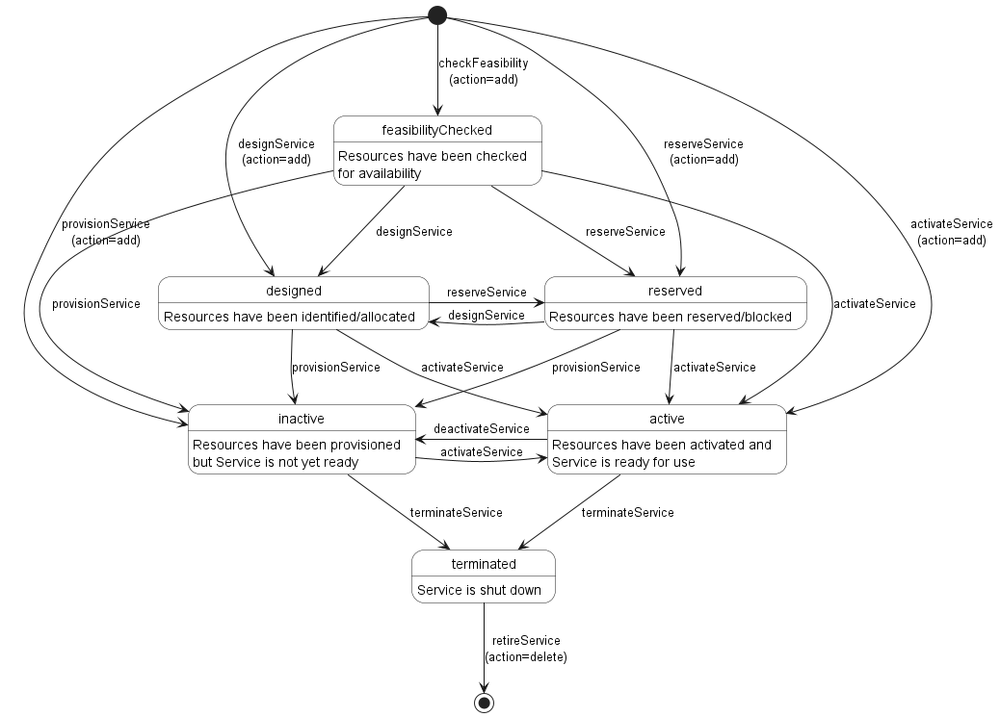

<div align="center">


<!-- omit in toc -->
## Working Draft

<!-- omit in toc -->
# **MEF W99 v0.9**

<!-- omit in toc -->
# **LSO Legato Service Order Management API - Developer Guide**

<!-- omit in toc -->
# **January 2022**

**This draft represents MEF work in progress and is subject to change.**
</div>

<div style="page-break-after: always;"></div>

**Disclaimer**
 
The information in this publication is freely available for reproduction
and use by any recipient and is believed to be accurate as of its
publication date. Such information is subject to change without notice
and the MEF Forum (MEF) is not responsible for any errors. The MEF does
not assume responsibility to update or correct any information in this
publication. No representation or warranty, expressed or implied, is
made by the MEF concerning the completeness, accuracy, or applicability
of any information contained herein and no liability of any kind shall
be assumed by the MEF as a result of reliance upon such information.

The information contained herein is intended to be used without
modification by the recipient or user of this document. The MEF is not
responsible or liable for any modifications to this document made by any
other party.

The receipt or any use of this document or its contents does not in any
way create, by implication or otherwise:

  - any express or implied license or right to or under any patent,
    copyright, trademark or trade secret rights held or claimed by any
    MEF member company which are or may be associated with the ideas,
    techniques, concepts or expressions contained herein; nor

  - any warranty or representation that any MEF member companies will
    announce any product(s) and/or service(s) related thereto, or if
    such announcements are made, that such announced product(s) and/or
    service(s) embody any or all of the ideas, technologies, or concepts
    contained herein; nor

  - any form of relationship between any MEF member companies and the
    recipient or user of this document.
    
Implementation or use of specific MEF standards or recommendations and
MEF specifications will be voluntary, and no company shall be obliged to
implement them by virtue of participation in the MEF Forum. The MEF is a
non-profit international organization accelerating industry cooperation
on Ethernet technology. The MEF does not, expressly or otherwise,
endorse or promote any specific products or services.

© The MEF Forum 2020. All Rights Reserved.

**Copyright**

© The MEF Forum 2019. Any reproduction of this document, or any portion
thereof, shall contain the following statement: "Reproduced with
permission of the MEF Forum." No user of this document is authorized to
modify any of the information contained herein.

<div style="page-break-after: always;"></div>

**Table of Contents**

<!-- code_chunk_output -->

- [List of Contributing Members](#list-of-contributing-members)
- [1. Abstract](#1-abstract)
- [2. Terminology and Abbreviations](#2-terminology-and-abbreviations)
- [3. Compliance Levels](#3-compliance-levels)
- [4. Introduction](#4-introduction)
  - [4.1. Description](#41-description)
  - [4.2. Conventions in the Document](#42-conventions-in-the-document)
  - [4.3. Relation to Other Documents](#43-relation-to-other-documents)
  - [4.4. Approach](#44-approach)
  - [4.5. High Level Flow](#45-high-level-flow)
- [5. API Description](#5-api-description)
  - [5.1. API Endpoint and Operation summary](#51-api-endpoint-and-operation-summary)
    - [5.1.1. SOF Service Catalog API Endpoints](#511-sof-service-catalog-api-endpoints)
    - [5.1.2. BUS Service Catalog API Endpoints](#512-bus-service-catalog-api-endpoints)
    - [5.1.3. SOF Service Inventory API Endpoints](#513-sof-service-inventory-api-endpoints)
    - [5.1.4. BUS Service Inventory API Endpoints](#514-bus-service-inventory-api-endpoints)
    - [5.1.5. SOF Service Ordering API Endpoints](#515-sof-service-ordering-api-endpoints)
    - [5.1.6. BUS Service Ordering API Endpoints](#516-bus-service-ordering-api-endpoints)
  - [5.2. API Error Responses and Codes](#52-api-error-responses-and-codes)
  - [5.3. API Resource Schema summary](#53-api-resource-schema-summary)
  - [5.4. Model structure and validation](#54-model-structure-and-validation)
    - [5.4.1 Polymorphism and Schema Extensions Support](#541-polymorphism-and-schema-extensions-support)
    - [5.4.2 Characteristics Pattern for Specifications Integration](#542-characteristics-pattern-for-specifications-integration)
  - [5.5. Security Considerations](#55-security-considerations)
- [6. API Interactions and Flows](#6-api-interactions-and-flows)
  - [6.1. Service Configuration and Activation Flow](#61-service-configuration-and-activation-flow)
    - [6.1.1. Use Cases](#611-use-cases)
      - [6.1.1.1. Design Service](#6111-design-service)
      - [6.1.1.2. Reserve Service](#6112-reserve-service)
      - [6.1.1.3. Provision Service](#6113-provision-service)
      - [6.1.1.4. Activate (Resume) Service](#6114-activate-resume-service)
      - [6.1.1.5. Deactivate (Suspend) Service](#6115-deactivate-suspend-service)
      - [6.1.1.6. Amend Service](#6116-amend-service)
    - [6.1.2 Process Steps and Sequence](#612-process-steps-and-sequence)
    - [6.1.3. JSON Representation Sample](#613-json-representation-sample)
  - [6.2. Service Termination and Cancellation Flow](#62-service-termination-and-cancellation-flow)
    - [6.2.1. Use Cases](#621-use-cases)
      - [6.2.1.1. Terminate Service](#6211-terminate-service)
      - [6.2.1.2. Retire Service](#6212-retire-service)
      - [6.2.1.3. Cancel Service](#6213-cancel-service)
    - [6.2.2 Process Steps and Sequence](#622-process-steps-and-sequence)
    - [6.2.3. JSON Representation Sample](#623-json-representation-sample)
  - [6.3 Event Subscription and Notification Flow](#63-event-subscription-and-notification-flow)
    - [6.3.1. Use Cases](#631-use-cases)
      - [6.3.1.1. Register for ServiceSpecification Event Notifications](#6311-register-for-servicespecification-event-notifications)
      - [6.3.1.2. Deregister for ServiceSpecification Event Notifications](#6312-deregister-for-servicespecification-event-notifications)
      - [6.3.1.3. Notify Listeners of ServiceSpecification Events](#6313-notify-listeners-of-servicespecification-events)
      - [6.3.1.4. Register for Service Event Notifications](#6314-register-for-service-event-notifications)
      - [6.3.1.5. Deregister for Service Event Notifications](#6315-deregister-for-service-event-notifications)
      - [6.3.1.6. Notify Listeners of Service Events](#6316-notify-listeners-of-service-events)
      - [6.3.1.7. Register for ServiceOrder Event Notifications](#6317-register-for-serviceorder-event-notifications)
      - [6.3.1.8. Deregister for ServiceOrder Event Notifications](#6318-deregister-for-serviceorder-event-notifications)
      - [6.3.1.9. Notify Listeners of ServiceOrder Events](#6319-notify-listeners-of-serviceorder-events)
    - [6.3.2 Process Steps and Sequence](#632-process-steps-and-sequence)
    - [6.3.3. JSON Representation Sample](#633-json-representation-sample)
  - [6.4. Inventory Query and Retrieval Flow](#64-inventory-query-and-retrieval-flow)
    - [6.4.1. Use Cases](#641-use-cases)
      - [6.4.1.1. Query Service Catalog](#6411-query-service-catalog)
      - [6.4.1.2. Query Service Inventory](#6412-query-service-inventory)
      - [6.4.1.3. Query Service Ordering](#6413-query-service-ordering)
    - [6.4.2 Process Steps and Sequence](#642-process-steps-and-sequence)
    - [6.4.3. JSON Representation Sample](#643-json-representation-sample)
- [7 State Transitions](#7-state-transitions)
  - [7.1 Service Order State Transitions](#71-service-order-state-transitions)
  - [7.2 Service State Transitions](#72-service-state-transitions)
- [8. API Details](#8-api-details)
  - [8.1. API Operation and Parameter Definitions](#81-api-operation-and-parameter-definitions)
    - [8.1.1 ServiceCatalog](#811-servicecatalog)
      - [8.1.1.1. Operation: serviceSpecificationFind](#8111-operation-servicespecificationfind)
      - [8.1.1.2. Operation: serviceSpecificationGet](#8112-operation-servicespecificationget)
    - [8.1.2. ServiceInventory](#812-serviceinventory)
      - [8.1.2.1. Operation: serviceFind](#8121-operation-servicefind)
      - [8.1.2.2. Operation: serviceGet](#8122-operation-serviceget)
    - [8.1.3. ServiceOrder](#813-serviceorder)
      - [8.1.3.1. Operation: serviceOrderFind](#8131-operation-serviceorderfind)
      - [8.1.3.2. Operation: serviceOrderGet](#8132-operation-serviceorderget)
      - [8.1.3.3. Operation: serviceOrderCreate](#8133-operation-serviceordercreate)
  - [8.2. API Schema and Attribute Definitions](#82-api-schema-and-attribute-definitions)
- [9. References](#9-references)
- [A.1 Appendix: TMF and ONAP API Mapping](#a1-appendix-tmf-and-onap-api-mapping)
  - [A.1.1. BasePath Mapping](#a11-basepath-mapping)
  - [A.1.2. Endpoint Mapping](#a12-endpoint-mapping)
  - [A.1.3. SchemaObject Mapping](#a13-schemaobject-mapping)

<!-- /code_chunk_output -->

<div style="page-break-after: always;"></div>

# List of Contributing Members

The following members of the MEF participated in the development of this
document and have requested to be included in this list.

| **Member** |
| ---------- |

**Table 1. Contributing Members**

# 1. Abstract

This standard is intended to assist the implementation of the Application
Programming Interfaces (APIs) for Service Order Management function of the
Service Orchestration Functionality at the LSO Legato Interface Reference Point.
The Legato Interface Reference Point is defined in the MEF 55 at the interface
between the Business Application Systems layer and Service Orchestration
Functionality layer.

This standard consists of this document and complementary API definitions for
Service Order Management and Service Order Notification.

This Standard normatively incorporates the following OpenAPI 3.0
definitions by reference as if they were part of this document, from
MEF-GIT GitHub repository _working_draft_ branch:

<https://github.com/MEF-GIT/MEF-LSO-Legato-SDK>

  - `serviceApi/common/apiSchema.openapi.yaml`
  - `serviceApi/common/errorSchema.openapi.yaml`
  - `serviceApi/common/hubSchema.openapi.yaml`
  - `serviceApi/order/serviceOrderingApi.openapi.yaml`
  - `serviceApi/order/serviceOrderingSchema.openapi.yaml`
  - `serviceApi/order/serviceNotificationApi.openapi.yaml`

# 2. Terminology and Abbreviations

This section defines the terms used in this document. In many cases, the
normative definitions to terms are found in other documents. In these
cases, the third column is used to provide the reference that is
controlling, in other MEF or external documents.

In addition, terms defined in the following documents are included in
this document by reference, and are not repeated in the table below.

  - MEF 55, *MEF LSO Reference Architecture and Framework*, March 2016

  - MEF 55.0.1, *Amendment to MEF 55 - Operational Threads*, October,
    2017

| **Term**                            | **Definition**                                                                                                                                                                                                                                                                                                                                                                                                                                                                    | **Source**                                                                        |
| ----------------------------------- | --------------------------------------------------------------------------------------------------------------------------------------------------------------------------------------------------------------------------------------------------------------------------------------------------------------------------------------------------------------------------------------------------------------------------------------------------------------------------------- | --------------------------------------------------------------------------------- |
| API                                 | Application Programming Interface. In this document, API is used synomously with REST API.                                                                                                                                                                                                                                                                                                                                                                                        | This document                                                                     |
| API Endpoint                        | The endpoint of an communication channel (the complete URL of an API Resource) to which the HTTP-REST requests are addressed in order to operate on the *API Resource*                                                                                                                                                                                                                                                                                                            | [rapidapi.com](https://rapidapi.com/blog/api-glossary/endpoint/)<br>This document |
| API Resource                        | A REST Resource. In REST, the primary data representation is called Resource. In this document, *API Resource* is defined as a OAS *SchemaObject* with specified *API Endpoints*                                                                                                                                                                                                                                                                                                  | [restfulapi.net](https://restfulapi.net/resource-naming/)<br>This document        |
| Business Applications               | The Service Provider functionality supporting Business Management Layer functionality                                                                                                                                                                                                                                                                                                                                                                                             | MEF 55.0.1                                                                        |
| BUS                                 | Business Applications                                                                                                                                                                                                                                                                                                                                                                                                                                                             | MEF 55.0.1                                                                        |
| Deferred Response                   | A SOF’s response to a BUS’s request whereby the SOF immediately acknowledges that the request was received, and, over time, sends notifications to update the BUS on the status and results of the request (assuming the BUS has subscribed to receive the notifications). The BUS sends additional fetch requests to synchronize its state with the SOF.                                                                                                                         | This document                                                                     |
| Immediate Response                  | A SOF’s response to the BUS whereby the SOF responds immediately with the results of the request or indicates that the request cannot be processed.                                                                                                                                                                                                                                                                                                                               | This document                                                                     |
| IRP                                 | Interface Reference Point                                                                                                                                                                                                                                                                                                                                                                                                                                                         | This document                                                                     |
| OAS                                 | OpenAPI Specification                                                                                                                                                                                                                                                                                                                                                                                                                                                             | [openapis.org](https://www.openapis.org/faq/style-guide)                          |
| OAS Document                        | An API description document in the OpenAPI specification format.                                                                                                                                                                                                                                                                                                                                                                                                                  | [openapis.org](https://www.openapis.org/faq/style-guide)                          |
| OpenAPI                             | The OpenAPI 3.0 Specification, formerly known as the Swagger specification is an API description format for REST APIs.                                                                                                                                                                                                                                                                                                                                                            | [spec.openapis.org](http://spec.openapis.org/oas/v3.0.3)                          |
| Operation                           | An interaction between the BUS and SOF, potentially involving multiple back and forth transactions.                                                                                                                                                                                                                                                                                                                                                                               | This document                                                                     |
| SchemaObject                        | The construct that allows the definition of input and output data types. These types can represent object classes, as well as primitives and arrays. specification                                                                                                                                                                                                                                                                                                                | [spec.openapis.org](http://spec.openapis.org/oas/v3.0.3#schema-object)            |
| Service Orchestration Functionality | The set of service management layer functionality supporting an agile framework to streamline and automate the service lifecycle in a sustainable fashion for coordinated management supporting design, fulfillment, control, testing, problem management, quality management, usage measurements, security management, analytics, and policy-based management capabilities providing coordinated end-to-end management and control of Layer 2 and Layer 3 Connectivity Services. | MEF 55.0.1                                                                        |
| SOF                                 | Service Orchestration Functionality                                                                                                                                                                                                                                                                                                                                                                                                                                               | MEF 55.0.1                                                                        |

**Table 2: Terminology and Abbreviations**

# 3. Compliance Levels

The key words **"MUST"**, **"MUST NOT"**, **"REQUIRED"**, **"SHALL"**, **"SHALL
NOT"**, **"SHOULD"**, **"SHOULD NOT"**, **"RECOMMENDED"**, **"NOT
RECOMMENDED"**, **"MAY"**, and **"OPTIONAL"** in this document are to be
interpreted as described in BCP 14 (RFC 2119 [[rfc2119](#8-references)], RFC
8174 [[rfc8174](#8-references)]) when, and only when, they appear in all
capitals, as shown here. All key words must be in bold text.

Items that are **REQUIRED** (contain the words **MUST** or **MUST NOT**) are
labeled as **[Rx]** for required. Items that are **RECOMMENDED** (contain the
words **SHOULD** or **SHOULD NOT**) are labeled as **[Dx]** for desirable.
Items that are **OPTIONAL** (contain the words MAY or OPTIONAL) are labeled as
**[Ox]** for optional.

# 4. Introduction

This standard specification document describes the Application Programming
Interface (API) for Service Order Management functionality of the LSO Legato
Interface Reference Point (IRP) as defined in the _MEF 55.1 Lifecycle Service
Orchestration (LSO): Reference Architecture and Framework_
[[MEF55.1](#8-references)]. The LSO Reference Architecture is shown in Figure 1
with the IRP highlighted.


**Figure 1. The LSO Reference Architecture**

## 4.1. Description

This standard is scoped to cover APIs for following Service
Orchestration Functionalities:

  - Service Ordering and Fulfillment
      - Includes Service Configuration & Activation functions
  - Service Notification
      - Includes Event Subscription/Hub and Listener notification
        functions

Other  Service Orchestration Functionalities not addressed in this
standard include (but not limited to):

  - Service Inventory Management
  - Service Catalog Management
  - Service Qualification
  - Service Activation Testing
  - Service Problem Management
  - Service Quality Management
  - Service Usage measurements and Reporting (in support of billing)
  - License Management

This document primarily supports the requirements defined in section 8.2
(Order Fulfillment and Service Control) of MEF-55, LSO Reference
Architecture \[1\] for interactions over the Legato interface within a
single operator. Both the Business Applications (BUS) and Service
Orchestration Functionality (SOF) systems use the information contained
within this document.

This standard is intended to support the design of API implementations
that enable inter-operable SOF operations (in scope of this standard)
across the Legato IRP.

This standard is based on ONAP External API (el-alto release) and TMF Open API 
(v3.0.0) for Service Ordering (TMF 641).

## 4.2. Conventions in the Document

- Code samples are formatted using code blocks. When notation `<< some text >>`
  is used in the payload sample it indicates that a comment is provided instead
  of an example value and it might not comply with the OpenAPI definition.
- Model definitions are formatted as in-line code (e.g. `ServiceOrder`).
- In UML diagrams the default cardinality of associations is `0..1`. Other
  cardinality markers are complaint with the UML standard.
- In the API details tables and UML diagrams required attributes are marked
  with a `*` next to their names.
- In UML sequence diagrams `{{variable}}` notation is used to indicates a
  variable to be substituted with a correct value.

## 4.3. Relation to Other Documents

The API definition builds on _TMF641 Service Order Management API REST 
Specification R19.0.1_ [[TMF641](#8-references)]. Service Order Use Cases must 
support the use of any of MEF service specifications as payload, in particular 
those defined in: 
- _LSO Legato Service Specification – SD-WAN Schema Guide_ in MEF W100 [[MEF100](#8-references)].
- _LSO Legato Service Specification – Carrier Ethernet Schema Guide_ in MEF W101 [[MEF101](#8-references)].
- _LSO Legato Service Specification – IP/IP-VPN Schema Guide_ in MEF W102 [[MEF102](#8-references)].
- _LSO Legato Service Specification – L1CS Schema Guide_ in MEF W103 [[MEF103](#8-references)].

## 4.4. Approach 

As presented in Figure 2. the Legato API frameworks consist of
three structural components:

- Generic API framework
- Service-independent information (Function-specific information and
  Function-specific operations)
- Service-specific information (MEF service specification data model)


**Figure 2. Legato API Structure**

The essential concept behind the framework is to decouple the common structure,
information, and operations from the specific service information content.  
Firstly, the Generic API Framework defines a set of design rules and patterns
that are applied across all Legato APIs.  
Secondly, the service-independent information of the framework focuses on a
model of a particular Legato functionality and is agnostic to any of
the service specifications. For example, this standard is describing the 
Service Order model and operations that allow performing quoting of any product 
that is aligned with either MEF or custom service specifications.  
Finally, the service-specific information part of the framework focuses on MEF
service specifications that define business-relevant attributes and
requirements for trading MEF subscriber and MEF operator services.

This Developer Guide is not defining MEF service specifications but can be used
in combination with any service specifications defined by or compliant with
MEF. Examples of MEF Service Model (MSM) schema include:

  - MEF W100: SD-WAN Services based on MEF 70
  - MEF W101: Carrier Ethernet services based on MEF 10.4 and MEF 26.2
  - MEF W102: IP Services based on MEF 61.1
  - MEF W103: Optical Transport services based on MEF 63 and MEF W64


## 4.5. High Level Flow

The Legato Service Catalog, Service Order, Service Inventory and Service
Notification APIs in essence allow the BUS to request SOF to configure
and activate one or more services as part of an order fulfillment
process.


The following steps describe the high level flow:

  - As part of the ordering flow, the BUS system receives the
    product order (through Cantata or Sonata) which triggers the
    fulfillment processes in the BUS system.

  - The BUS system first queries the *Service Catalog* to retrieve the 
    `ServiceSpecifications` supported by the SOF
    <br>**_Note1_**: *The process of maping and decomposing a product order to 
    identify appropriate `ServiceSpecifications` is out of scope for this 
    standard.*
    <br>**_Note2_**: *The mechanisms to design, construct and populate the `ServiceSpecifications` into SOF Service Catalog is out of scope for this standard.*

      - Each specific instance of a `ServiceSpecification` (retrieved
        from the *Service Catalog*) minimally contains a reference
        to target `Service` schema. A `Service` schema describes the set
        of properties that characterize that service and are exchanged
        over Legato IRP.
    
      - The BUS may register for notifications on specific `ServiceSpecifications`
          - In such cases, the SOF also reports the `ServiceSpecification`
            life-cycle state change event as per the [ServiceSpecification
            State Transitions](#Bookmark104)

  - During the service configuration and activation phase, the BUS
    system uses the *Service Order API* to instantiate the `Service`
    utilizing the `ServiceSpecifications` (retrieved from the *Service
    Catalog*).
    
      - The BUS achieves this by creating a `ServiceOrder` which
        contains a one or more `ServiceOrderItems`.
    
      - Each `ServiceOrderItem` carries some `ServiceConfiguration` data
        and the type of operation (*`add`/`delete`/`modify`*) to be performed 
        (instructions to SOF).
    
      - The SOF utilizes `Service` schema referenced in the 
        `ServiceSpecification` to validate the `ServiceConfiguration` data
        passed in by the BUS.
    
      - The `ServiceOrder` / `ServiceOrderItem` is processed by the SOF as per 
        the state transition rules described in
        [Service Order State Transitions](#81-service-order-state-transitions)
    
      - The BUS may register for notifications on specific `ServiceOrders` \ `ServiceOrderItems`
        - In such cases, the SOF also reports the `ServiceOrder` \ 
          `ServiceOrderItem` state changes as per the
          [Service Order State Transitions](#81-service-order-state-transitions)
    
      - The SOF performs the actions (*`add`/`delete`/`modify`*) specified in a 
        `ServiceOrderItem` on the specified target `Service` instance in the 
        *Service Inventory* as per the state transition rules described in
        [Service State Transitions](#82-service-state-transitions)
    
      - The BUS may register for notifications on `Service` instances
          - In such cases, the SOF also reports the `Service` instance
            state changes as per the
            [Service State Transitions](#82-service-state-transitions)

  - The BUS system uses the same *Service Order API* to create **new**
    `Service` instances as well as update **existing** `Service`
    instance's properties, trigger state transitions and delete
    **existing** `Service` instance.

# 5. API Description

## 5.1. API Endpoint and Operation summary

### 5.1.1. SOF Service Catalog API Endpoints

**BasePath**: `https://<server>:<port>/api/serviceCatalog/v0`

The following API Endpoints are used by BUS to query for `ServiceSpecification` 
instances and to subscribe/unsubscribe to `ServiceSpecification` notifications.

| API Endpoint <br> (Operation ID)                                                                          | Description                                                                                                                                                                    | Use Case mapping                                                                                                         |
| --------------------------------------------------------------------------------------------------------- | ------------------------------------------------------------------------------------------------------------------------------------------------------------------------------ | -------------------------------------------------------------------------------------------------------------------------- |
| `GET /serviceSpecification` <br> ([serviceSpecificationFind](#8111-operation-servicespecificationfind))   | A request initiated by the BUS to retrieve list of `ServiceSpecifications` from service catalog system in SOF, that match the provided filter criteria as *`query`* parameters | - [Query Service Catalog](#6411-query-service-catalog)                                                                     |
| `GET /serviceSpecification/{ID}` <br>([serviceSpecificationGet](#8112-operation-servicespecificationget)) | A request initiated by the BUS to retrieve a specific `ServiceSpecification` from service catalog system in SOF, that match the provided *`ID`* as *`path`* parameter          | - [Query Service Catalog](#6411-query-service-catalog)                                                                     |
| `POST /hub` <br> (hubCreate)                                                                              | A request initiated by the BUS to instruct the SOF to send notifications on `ServiceSpecification` change events                                                               | - [Register for ServiceSpecification Event Notifications](#6311-register-for-servicespecification-event-notifications)     |
| `DELETE /hub/{ID}` <br> (hubDelete)                                                                       | A request initiated by the BUS to instruct the SOF to stop sending notifications on `ServiceSpecification` change events                                                       | - [Deregister for ServiceSpecification Event Notifications](#6312-deregister-for-servicespecification-event-notifications) |

### 5.1.2. BUS Service Catalog API Endpoints

**BasePath**: `https://<server>:<port>/api/serviceCatalog/v0/listener`

The following API Endpoints are used by SOF to post `ServiceSpecification` 
notifications to registered BUS listeners.

| API Endpoint <br> (Operation ID)                                                       | Description                                                                                | Use Case mapping                                                                                         |
| -------------------------------------------------------------------------------------- | ------------------------------------------------------------------------------------------ | ---------------------------------------------------------------------------------------------------------- |
| `POST /serviceSpecificationCreateNotification` <br> (serviceSpecificationCreateNotify) | A request initiated by the SOF to notify BUS on *`ServiceSpecification`* instance creation | - [Notify Listeners of ServiceSpecification Events](#6313-notify-listeners-of-servicespecification-events) |
| `POST /serviceSpecificationDeleteNotification` <br> (serviceSpecificationDeleteNotify) | A request initiated by the SOF to notify BUS on *`ServiceSpecification`* instance deletion | - [Notify Listeners of ServiceSpecification Events](#6313-notify-listeners-of-servicespecification-events) |
| `POST /serviceSpecificationChangeNotification` <br> (serviceSpecificationChangeNotify) | A request initiated by the SOF to notify BUS on *`ServiceSpecification`* instance change   | - [Notify Listeners of ServiceSpecification Events](#6313-notify-listeners-of-servicespecification-events) |

### 5.1.3. SOF Service Inventory API Endpoints

**BasePath**: `https://<server>:<port>/api/serviceInventory/v0`

The following API Endpoints are used by BUS to query for `Service` instances and
to subscribe/unsubscribe to `Service` notifications.

| API Endpoint <br> (Operation ID)                                    | Description                                                                                                                                                                             | Use Case mapping                                                                               |
| ------------------------------------------------------------------- | --------------------------------------------------------------------------------------------------------------------------------------------------------------------------------------- | ------------------------------------------------------------------------------------------------ |
| `GET /service/` <br> ([serviceFind](#8121-operation-servicefind))   | A request initiated by the BUS to retrieve list of `Service` instances from service inventory management system in SOF, that match the provided filter criteria as *`query`* parameters | - [Query Service Inventory](#6412-query-service-inventory)                                       |
| `GET /service/{ID}` <br> ([serviceGet](#8122-operation-serviceget)) | A request initiated by the BUS to retrieve a specific `Service` Instance from service inventory management system in SOF, that match the provided *`ID`* as *`path`* parameter          | - [Query Service Inventory](#6412-query-service-inventory)                                       |
| `POST /hub` <br> (hubCreate)                                        | A request initiated by the BUS to instruct the SOF to send notifications on `Service` Instance change events                                                                            | - [Register for Service Event Notifications](#6314-register-for-service-event-notifications)     |
| `DELETE /hub/{ID}` <br> (hubDelete)                                 | A request initiated by the BUS to instruct the SOF to stop sending notifications on `Service` Instance change events                                                                    | - [Deregister for Service Event Notifications](#6315-deregister-for-service-event-notifications) |

### 5.1.4. BUS Service Inventory API Endpoints

**BasePath**: `https://<server>:<port>/api/serviceInventory/v0/listener`

The following API Endpoints are used by SOF to post `Service` 
notifications to registered BUS listeners.

| API Endpoint <br> (Operation ID)                                                         | Description                                                                                 | Use Case mapping                                                               |
| ---------------------------------------------------------------------------------------- | ------------------------------------------------------------------------------------------- | -------------------------------------------------------------------------------- |
| `POST /serviceCreateNotification` <br> (serviceCreateNotify)                             | A request initiated by the SOF to notify BUS on *`Service`* instance creation               | - [Notify Listeners of Service Events](#6316-notify-listeners-of-service-events) |
| `POST /serviceDeleteNotification` <br> (serviceDeleteNotify)                             | A request initiated by the SOF to notify BUS on *`Service`* instance deletion               | - [Notify Listeners of Service Events](#6316-notify-listeners-of-service-events) |
| `POST /serviceStateChangeNotification` <br> (serviceStateChangeNotify)                   | A request initiated by the SOF to notify BUS on *`Service`* instance state change           | - [Notify Listeners of Service Events](#6316-notify-listeners-of-service-events) |
| `POST /serviceAttributeValueChangeNotification` <br> (serviceAttributeValueChangeNotify) | A request initiated by the SOF to notify BUS on *`Service`* instance attribute value change | - [Notify Listeners of Service Events](#6316-notify-listeners-of-service-events) |

### 5.1.5. SOF Service Ordering API Endpoints

**BasePath**: `https://<server>:<port>/api/serviceOrdering/v0`

The following API Endpoints are used by BUS to create and query for 
`ServiceOrder` instances and to subscribe/unsubscribe to `ServiceOrder` 
notifications.

| API Endpoint <br> (Operation ID)                                                     | Description                                                                                                                                                                                     | Use Case mapping                                                                                                                                                                                                                                                                                                                                                                                                                                               |
| ------------------------------------------------------------------------------------ | ----------------------------------------------------------------------------------------------------------------------------------------------------------------------------------------------- | ---------------------------------------------------------------------------------------------------------------------------------------------------------------------------------------------------------------------------------------------------------------------------------------------------------------------------------------------------------------------------------------------------------------------------------------------------------------- |
| `POST /serviceOrder` <br> ([serviceOrderCreate](#8133-operation-serviceordercreate)) | A request initiated by the BUS to *create* new `Service` instances as well as *update*  `Service` instance's properties, trigger state transitions and/or *delete* existing `Service` instance. | - [Design Service](#6111-design-service) <br> - [Reserve Service](#6112-reserve-service) <br>  - [Provision Service](#6113-provision-service) <br> - [Activate Service](#6114-activate-resume-service) <br> - [Deactivate Service](#6115-deactivate-suspend-service) <br> - [Amend Service](#6116-amend-service) <br> - [Terminate Service](#6211-terminate-service) <br> - [Retire Service](#6212-retire-service) <br> - [Cancel Service](#6213-cancel-service) |
| `GET /serviceOrder` <br> ([serviceOrderFind](#8131-operation-serviceorderfind))      | A request initiated by the BUS to retrieve list of `ServiceOrders` from service order management system in SOF, that match the provided filter criteria as *`query`* parameters                 | - [Query Service Order](#6413-query-service-ordering)                                                                                                                                                                                                                                                                                                                                                                                                            |
| `GET /serviceOrder/{ID}` <br> ([serviceOrderGet](#8132-operation-serviceorderget))   | A request initiated by the BUS to retrieve a specific `ServiceOrder` from service order management system in SOF, that match the provided *`ID`* as *`path`* parameter                          | - [Query Service Order](#6413-query-service-ordering)                                                                                                                                                                                                                                                                                                                                                                                                            |
| `POST /hub` <br> (hubCreate)                                                         | A request initiated by the BUS to instruct the SOF to send notifications on `ServiceOrder` Instance change events                                                                               | - [Register for ServiceOrder Event Notifications](#6317-register-for-serviceorder-event-notifications)                                                                                                                                                                                                                                                                                                                                                           |
| `DELETE /hub/{ID}` <br> (hubDelete)                                                  | A request initiated by the BUS to instruct the SOF to stop sending notifications on `ServiceOrder` Instance change events                                                                       | - [Deregister for ServiceOrder Event Notifications](#6318-deregister-for-serviceorder-event-notifications)                                                                                                                                                                                                                                                                                                                                                       |
### 5.1.6. BUS Service Ordering API Endpoints

**BasePath**: `https://<server>:<port>/api/serviceOrdering/v0/listener`

The following API Endpoints are used by SOF to post `ServiceOrder` 
notifications to registered BUS listeners.

| API Endpoint <br> (Operation ID)                                                                   | Description                                                                                      | Use Case mapping                                                                         |
| -------------------------------------------------------------------------------------------------- | ------------------------------------------------------------------------------------------------ | ------------------------------------------------------------------------------------------ |
| `POST /serviceOrderCreateNotification` <br> (serviceOrderCreateNotify)                             | A request initiated by the SOF to notify BUS on *`ServiceOrder`* instance creation               | - [Notify Listeners of ServiceOrder Events](#6319-notify-listeners-of-serviceorder-events) |
| `POST /serviceOrderAttributeValueChangeNotification` <br> (serviceOrderAttributeValueChangeNotify) | A request initiated by the SOF to notify BUS on *`ServiceOrder`* instance attribute value change | - [Notify Listeners of ServiceOrder Events](#6319-notify-listeners-of-serviceorder-events) |
| `POST /serviceOrderStateChangeNotification` <br> (serviceOrderStateChangeNotify)                   | A request initiated by the SOF to notify BUS on *`ServiceOrder`* instance state change           | - [Notify Listeners of ServiceOrder Events](#6319-notify-listeners-of-serviceorder-events) |
| `POST /serviceOrderItemStateChangeNotification` <br> (serviceOrderItemStateChangeNotify)           | A request initiated by the SOF to notify BUS on *`ServiceOrderItem`* instance state change       | - [Notify Listeners of ServiceOrder Events](#6319-notify-listeners-of-serviceorder-events) |

## 5.2. API Error Responses and Codes

In case of error responses for the above operations, the SOF returns an Error
structure that contains additional information reated to the exception 
including an application error code. The following is the list of supported
application error codes:
  
| Http Status Code           | Application Error Code                                                                                                                                                                                                                                                                                                                                                                                                                                                                                                                                                                                                                                                                                                                                                                                                                                                                                                                                   |
| -------------------------- | -------------------------------------------------------------------------------------------------------------------------------------------------------------------------------------------------------------------------------------------------------------------------------------------------------------------------------------------------------------------------------------------------------------------------------------------------------------------------------------------------------------------------------------------------------------------------------------------------------------------------------------------------------------------------------------------------------------------------------------------------------------------------------------------------------------------------------------------------------------------------------------------------------------------------------------------------------- |
| 400: Bad Request           | - 20: Invalid URL parameter value <br> - 21: Missing body <br> - 22: Invalid body <br> - 23: Missing body field <br> - 24: Invalid body field <br> - 25: Missing header <br> - 26: Invalid header value <br> - 27: Missing query-string parameter <br> - 28: Invalid query-string parameter value                                                                                                                                                                                                                                                                                                                                                                                                                                                                                                                                                                                                                                                        |
| 401: Unauthorized          | - 40: Missing credentials <br> - 41: Invalid credentials <br> - 42: Expired credentials                                                                                                                                                                                                                                                                                                                                                                                                                                                                                                                                                                                                                                                                                                                                                                                                                                                                  |
| 403: Forbidden             | - 50: Access denied <br> - 51: Forbidden requestor <br> - 52: Forbidden user <br> - 53: Too many requests                                                                                                                                                                                                                                                                                                                                                                                                                                                                                                                                                                                                                                                                                                                                                                                                                                                |
| 404: Not Found             | - 60: Resource not found                                                                                                                                                                                                                                                                                                                                                                                                                                                                                                                                                                                                                                                                                                                                                                                                                                                                                                                                 |
| 405: Method Not Allowed    | - 61: Method not allowed                                                                                                                                                                                                                                                                                                                                                                                                                                                                                                                                                                                                                                                                                                                                                                                                                                                                                                                                 |
| 408: Request Timeout       | - 63: Request time-out                                                                                                                                                                                                                                                                                                                                                                                                                                                                                                                                                                                                                                                                                                                                                                                                                                                                                                                                   |
| 409: Conflict              | - 64: Resource Conflict                                                                                                                                                                                                                                                                                                                                                                                                                                                                                                                                                                                                                                                                                                                                                                                                                                                                                                                                  |
| 422: Unprocessable Entity  | Functional Error codes specific to following operation: <br> **Operation: `serviceOrderCreate`**<br>- 100: `RelatedParty` (customer) for `Service`(s) is provided but the record does not exist <br>- 101: `ServiceOrderItem` with *`add`* action but `serviceSpecification` id missing <br>- 102: `ServiceOrderItem` with *`add`* action - `ServiceSpecification` id provided but instance does not exist <br>- 103: `ServiceOrderItem` with *`add`* action but `Service` id already exists in the inventory <br>- 104: `ServiceOrderItem` with *`modify`/`noChange`/`delete`* action but `Service` id missing <br>- 105: `ServiceOrderItem` with *`modify`/`noChange`/`delete`* action - `Service` id provided but it does not exist in the inventory <br>- 106: `ServiceOrderItem` with *`modify`/`noChange`/`delete`* action - `Service` instance exists, but illegal state as per [Service State Transistions](#82-service-state-transitions) rules |
| 500: Internal Server Error | - 1: Internal Error                                                                                                                                                                                                                                                                                                                                                                                                                                                                                                                                                                                                                                                                                                                                                                                                                                                                                                                                      |
| 501: Not Implemented       | - 2: Functionality not Implemented                                                                                                                                                                                                                                                                                                                                                                                                                                                                                                                                                                                                                                                                                                                                                                                                                                                                                                                       |
| 503: Service Unavailable   | - 5: The service is temporarily unavailable <br> - 6: API is over capacity, retry later                                                                                                                                                                                                                                                                                                                                                                                                                                                                                                                                                                                                                                                                                                                                                                                                                                                                  |

## 5.3. API Resource Schema summary


Diagram above depicts most important entities from data model which can
be found in API specification.

For detailed description and complete definition of data model please
refer to API Details.

## 5.4. Model structure and validation

Structure of the payloads exchanged via Legato Service API endpoints is
defined using:

  - OpenAPI 3.0 schema for service-agnostic part of the payload

  - OpenAPI 3.0 schema for service-specific part of the payload

Implementations MUST use payload that conforms with these definitions.

In addition, specific service may define additional consistency rules
that MUST be respected by implementations. These rules may be defined
with respect to:

  - relations to other service order items in the same service order
    request (e.g. required relation type, multiplicity)

  - requirements for the relations from an service order item to
    entities in the service inventory

  - requirements for the party roles that are to be defined at service
    order item level

### 5.4.1 Polymorphism and Schema Extensions Support

Support for polymorphic *schema-based* extension is provided through a set of 
generic meta-properties as described below. Polymorphism as described in this 
document allows for a generalized base `SchemaObject` to be extended with 
additional properties defined in a specialized `SchemaObject` much like 
inheritance hierarchy relationship between *base-class* and *sub-classes* in 
*Object Oriented* modeling.

- **_`@type`_**: This attribute provides a way to represent the actual class 
  type of an entity. For example, within a list of `ServiceOrder` instances 
  some may be instances of `TypeAServiceOrder` while others could be instances 
  of `TypeBServiceOrder`. The *`@type`* property is valued with concrete 
  *class-type* of the `SchemaObject` instances and is specified as the 
  `discriminator` for the base `SchemaObject`.
  
- **_`@baseType`_**: This attribute provides a way to explicitly name the 
  base  *class-type* of a given `SchemaObject` from which the current instance 
  has been extended.
  
- **_`@referredType`_**: This attribute provides a way for reference entities 
  (entities that contain pointers such as *ID/name/URI* to another *API 
  Resource* instance) to explicitly denote the *class-type* of the instance 
  being referenced. Notice that in reference entities the *`@type`*, when used, 
  denotes the *class-type* of the reference entity itself, and not the 
  *class-type* of the referenced instance. However since reference entity 
  classes are rarely sub-classed, *`@type`* is generally not useful in 
  reference entities.
  
- **_`@schemaLocation`_**: This property provides a way for `SchemaObject` 
  instances to specify the location of its corresponding schema which allows 
  for specifying user-defined properties or expected characteristics for it. 

### 5.4.2 Characteristics Pattern for Specifications Integration

In support of the [envelope/payload approach](#54-approach) described earlier, 
the *characteristics* pattern is used to integrate the MEF-defined `Service` 
characteristics with the generic `Service` structure. The figure below 
illustrates an example `Service` instance with a specific *MEF Service* payload 
using this pattern.


`MapCharacteristic` is the only type of `Characteristics` supported in this 
standard (additional types are supported in TMF OpenAPI). The `Service` 
specific payload is provided as value of *`value`* property whereas the 
*`valueType`* property indicates the type of the payload (a *MEF Service type* 
such as EVC, OVC, SD-WAN, etc).

The schema for all supported payload types are maintained in the form of 
`ServiceSpecifications` within the SOF *Service Catalog*. Every 
`ServiceSpecification` includes a reference to the target `Service` schema 
which corresponds to one of supported `MapCharacteristic` *`valueTypes`*.

The following JSON representation provides an example usage of the `MapCharacteristic` pattern:
```json
TBD
```
 
## 5.5. Security Considerations

Although the Legato IRP is internal to an Service Provider/Operator
business boundary, it is expected that some minimal security mechanisms
are in place for any communication over this IRP. For example, the
following considerations may apply:

  - All BUS-SOF interaction happen over an established secure
    communication protocol such as TLS (Transport Layer Security)

  - An authentication mechanism is in place whereby a SOF can be assured
    of the identity of BUS and vice-versa

  - An authorization mechanisms is in place to control what a particular
    BUS or SOF installation is allowed to do and what information may be
    obtained.

  - Others considerations..

 However, definition of exact security mechanism are out of the scope of
this document.

# 6. API Interactions and Flows

The use cases in this section are described in the context of four API 
interaction patterns:
- [Service Configuration and Activation](#61-service-configuration-and-activation-flow)
- [Service Termination and Cancellation](#62-service-termination-and-cancellation-flow) 
- [Event Subscription and Notification](#63-event-subscription-and-notification-flow)
- [Inventory Query and Retrieval](#64-inventory-query-and-retrieval-flow)


Each of the following sections describe the expected BUS and SOF behaviors and 
sample message structure and flows at a high level.

## 6.1. Service Configuration and Activation Flow

The Service Configuration and Activation Flow supports the execution of following use cases:
- [Design Service](#6111-design-service)
- [Reserve Service](#6112-reserve-service)
- [Provision Service](#6113-provision-service)
- [Activate (Resume) Service](#6114-activate-resume-service)
- [Deactivate (Suspend) Service](#6115-deactivate-suspend-service)
- [Amend Service](#6116-amend-service)

### 6.1.1. Use Cases

#### 6.1.1.1. Design Service

| **Field**        | **Description**                                                                                                                                                                                                                                                                                                                                                                                                                                                                                                                                                                                                                                                                                                                                                                                                                             |
| ---------------- | ------------------------------------------------------------------------------------------------------------------------------------------------------------------------------------------------------------------------------------------------------------------------------------------------------------------------------------------------------------------------------------------------------------------------------------------------------------------------------------------------------------------------------------------------------------------------------------------------------------------------------------------------------------------------------------------------------------------------------------------------------------------------------------------------------------------------------------------- |
| Use Case Name  | Design Service                                                                                                                                                                                                                                                                                                                                                                                                                                                                                                                                                                                                                                                                                                                                                                                                                              |
| Description      | The BUS wishes to *design* a `Service` in SOF, but does not yet want to *reserve/block* any network resources nor *provision* them into the network. This scenario could be aplied towards *desiging* a new `Service` or *re-designing* an existing `Service`. In either case, SOF identifies and configures the `Service` with the network resources information necessary to fulfill the `Service`.                                                                                                                                                                                                                                                                                                                                                                                                                                       |
| Actors/Subject   | BUS / SOF                                                                                                                                                                                                                                                                                                                                                                                                                                                                                                                                                                                                                                                                                                                                                                                                                                   |
| Pre-conditions   | 1. Corresponding `ServiceSpecification`(s) for the `Service` to be *designed* exists in SOF *Service Catalog* and has been retrieved by BUS.<br>2. BUS has registered listeners to receive notifications on changes to `ServiceOrder` `ServiceOrderItem` and `Service` <br>3. The corresponding `Service` instance either does not exist in SOF *Service Inventory* or exists in one of these valid states: <br>- `ServiceStateType.feasibilityChecked` <br>- `ServiceStateType.reserved`                                                                                                                                                                                                                                                                                                                                                   |
| Process Steps    | 1. The BUS populates the `ServiceOrderConfiguration` with the restriction that <br>`ServiceConfiguration` state property is set to <br>- `ServiceStateType.designed` <br>`ServiceOrderItemConfiguration` action property is set to either <br>- `ActionType.add` <br>- `ActionType.modify`<br>2. BUS posts `ServiceOrderConfiguration` data:  `POST {basePath}/serviceOrder` <br>3. SOF acknowledges BUS request with either *Success* or *Error* response using *Deferred Response* pattern <br>4. SOF sends notifications to registered BUS listeners on changes to `ServiceOrder`, `ServiceOrderItem` and `Service` instance <br>5. BUS may query SOF inventory to fetch updated snapshots of `ServiceOrder` or `Service` instances <br> The above steps are detailed in   [Process Steps and Sequence](#612-process-steps-and-sequence) |
| Post-conditions  | 1. The `Service` instance is available in the *Service Inventory* and the value of the state attribute: `state`=`ServiceStateType.designed` state. <br> 2. The *`supportingResource`* attribute contains list of references to the supporting *Resources*                                                                                                                                                                                                                                                                                                                                                                                                                                                                                                                                                                                   |
| Error-Conditions | Processes error conditions to reflect (422) functional errors described in [Error Responses and Codes](#62-api-error-responses-and-codes) table                                                                                                                                                                                                                                                                                                                                                                                                                                                                                                                                                                                                                                                                                             |

#### 6.1.1.2. Reserve Service

| **Field**        | **Description**                                                                                                                                                                                                                                                                                                                                                                                                                                                                                                                                                                                                                                                                                                                                                                                                                             |
| ---------------- | ------------------------------------------------------------------------------------------------------------------------------------------------------------------------------------------------------------------------------------------------------------------------------------------------------------------------------------------------------------------------------------------------------------------------------------------------------------------------------------------------------------------------------------------------------------------------------------------------------------------------------------------------------------------------------------------------------------------------------------------------------------------------------------------------------------------------------------------- |
| Use Case Name  | Reserve Service                                                                                                                                                                                                                                                                                                                                                                                                                                                                                                                                                                                                                                                                                                                                                                                                                             |
| Description      | The BUS wishes to *reserve* a `Service` in SOF by blocking the network resources assigned to it. In case of a new `Service` SOF first  identifies, verifies and confirms the availability of the network resources necessary to fulfill the `Service` and then *reserves* these for exclusive use of this `Service`. This scenario does not include provisioning of resources into the network and could be applied in context of multi-step iterating design processes (*design->reserve->redesign*) or as a preparation step for provisioning/activation of complex multi-domain `Services` thus avoiding potential rollbacks or partial network provisioning failures.                                                                                                                                                                   |
| Actors/Subject   | BUS / SOF                                                                                                                                                                                                                                                                                                                                                                                                                                                                                                                                                                                                                                                                                                                                                                                                                                   |
| Pre-conditions   | 1. Corresponding `ServiceSpecification`(s) for the `Service` to be *reserved* exists in SOF *Service Catalog* and has been retrieved by BUS.<br>2. BUS has registered listeners to receive notifications on changes to `ServiceOrder` `ServiceOrderItem` and `Service` <br>2. The corresponding `Service` instance either does not exist in SOF *Service Inventory* or exists in one of these valid states: <br>- `ServiceStateType.feasibilityChecked` <br>- `ServiceStateType.designed`                                                                                                                                                                                                                                                                                                                                                   |
| Process Steps    | 1. The BUS populates the `ServiceOrderConfiguration` with the restriction that <br>`ServiceConfiguration` state property is set to <br>- `ServiceStateType.reserved` <br>`ServiceOrderItemConfiguration` action property is set to either <br>- `ActionType.add` <br>- `ActionType.modify`<br>2. BUS posts `ServiceOrderConfiguration` data:  `POST {basePath}/serviceOrder` <br>3. SOF acknowledges BUS request with either *Success* or *Error* response using *Deferred Response* pattern <br>4. SOF sends notifications to registered BUS listeners on changes to `ServiceOrder`, `ServiceOrderItem` and `Service` instance <br>5. BUS may query SOF inventory to fetch updated snapshots of `ServiceOrder` or `Service` instances <br> The above steps are detailed in   [Process Steps and Sequence](#612-process-steps-and-sequence) |
| Post-conditions  | 1. The `Service` instance is available in the *Service Inventory* and the value of the state attribute: `state`=`ServiceStateType.reserved` state. <br> 2. The *`supportingResource`* attribute contains list of references to the supporting *Resources*                                                                                                                                                                                                                                                                                                                                                                                                                                                                                                                                                                                   |
| Error-Conditions | Processes error conditions to reflect (422) functional errors described in [Error Responses and Codes](#62-api-error-responses-and-codes) table                                                                                                                                                                                                                                                                                                                                                                                                                                                                                                                                                                                                                                                                                             |

#### 6.1.1.3. Provision Service

| **Field**        | **Description**                                                                                                                                                                                                                                                                                                                                                                                                                                                                                                                                                                                                                                                                                                                                                                                                                            |
| ---------------- | ------------------------------------------------------------------------------------------------------------------------------------------------------------------------------------------------------------------------------------------------------------------------------------------------------------------------------------------------------------------------------------------------------------------------------------------------------------------------------------------------------------------------------------------------------------------------------------------------------------------------------------------------------------------------------------------------------------------------------------------------------------------------------------------------------------------------------------------ |
| Use Case Name  | Provision Service                                                                                                                                                                                                                                                                                                                                                                                                                                                                                                                                                                                                                                                                                                                                                                                                                          |
| Description      | The BUS wishes to request SOF to *provision* a new or previously (*designed / reserved*) `Service`. In case of a new `Service`, SOF first has to identify, verify and confirm the availability of the network resources necessary to fulfill the `Service` and then *provision* these into the network. This scenario does not include activation of the network resources and could be applied in context of multi-step configuration-activation process involving service turn-up testing procedures.                                                                                                                                                                                                                                                                                                                                    |
| Actors/Subject   | BUS / SOF                                                                                                                                                                                                                                                                                                                                                                                                                                                                                                                                                                                                                                                                                                                                                                                                                                  |
| Pre-conditions   | 1. Corresponding `ServiceSpecification`(s) for the `Service` to be *provisioned* exists in SOF *Service Catalog* and has been retrieved by BUS.<br>2. BUS has registered listeners to receive notifications on changes to `ServiceOrder` `ServiceOrderItem` and `Service` <br>2. The corresponding `Service` instance either does not exist in SOF *Service Inventory* or exists in one of these valid states: <br>- `ServiceStateType.feasibilityChecked` <br>- `ServiceStateType.designed`<br>- `ServiceStateType.reserved`                                                                                                                                                                                                                                                                                                              |
| Process Steps    | 1. The BUS populates the `ServiceOrderConfiguration` with the restriction that <br>`ServiceConfiguration` state property is set to <br>- `ServiceStateType.inactive` <br>`ServiceOrderItemConfiguration` action property is set to either <br>- `ActionType.add` <br>- `ActionType.modify`<br>2. BUS posts `ServiceOrderConfiguration` data:  `POST {basePath}/serviceOrder` <br>3. SOF acknowledges BUS request with either *Success* or *Error* response using *Deferred Response* pattern <br>4. SOF sends notifications to registered BUS listeners on changes to `ServiceOrder`, `ServiceOrderItem` and `Service` instance <br>5. BUS may query SOF inventory to fetch updated snapshots of `ServiceOrder` or `Service` instances <br> The above steps are detailed in  [Process Steps and Sequence](#612-process-steps-and-sequence) |
| Post-conditions  | 1. The `Service` instance is available in the *Service Inventory* and the value of the state attribute: `state`=`ServiceStateType.inactive` state. <br> 2. The *`supportingResource`* attribute contains list of references to the supporting *Resources*                                                                                                                                                                                                                                                                                                                                                                                                                                                                                                                                                                                  |
| Error-Conditions | Processes error conditions to reflect (422) functional errors described in [Error Responses and Codes](#62-api-error-responses-and-codes) table                                                                                                                                                                                                                                                                                                                                                                                                                                                                                                                                                                                                                                                                                            |

#### 6.1.1.4. Activate (Resume) Service

| **Field**        | **Description**                                                                                                                                                                                                                                                                                                                                                                                                                                                                                                                                                                                                                                                                                                                                                                                                                         |
| ---------------- | --------------------------------------------------------------------------------------------------------------------------------------------------------------------------------------------------------------------------------------------------------------------------------------------------------------------------------------------------------------------------------------------------------------------------------------------------------------------------------------------------------------------------------------------------------------------------------------------------------------------------------------------------------------------------------------------------------------------------------------------------------------------------------------------------------------------------------------- |
| Use Case Name  | Activate Service (*Resume Service*)                                                                                                                                                                                                                                                                                                                                                                                                                                                                                                                                                                                                                                                                                                                                                                                                     |
| Description      | The BUS wishes to request SOF to *activate* a new or previously (*designed / reserved/ provisioned / suspended*) `Service`. In case of new  `Service` SOF first has to identify, verify and confirm the availability of the network resources necessary to fulfill the `Service` and then provision these in a *active* state into the network. In case of an existing `Service`, this could either be the first time the `Service` is being *activated* or it could be  *resuming* a previously *suspended* `Service`. On successful  completion of this scenario, the `Service` is ready for customer usage.                                                                                                                                                                                                                          |
| Actors/Subject   | BUS / SOF                                                                                                                                                                                                                                                                                                                                                                                                                                                                                                                                                                                                                                                                                                                                                                                                                               |
| Pre-conditions   | 1. Corresponding `ServiceSpecification`(s) for the `Service` to be *activated* exists in SOF *Service Catalog* and has been retrieved by BUS.<br>2. BUS has registered listeners to receive notifications on changes to `ServiceOrder` `ServiceOrderItem` and `Service` <br>2. The corresponding `Service` instance either does not exist in SOF *Service Inventory* or exists in one of these valid states: <br>- `ServiceStateType.feasibilityChecked` <br>- `ServiceStateType.designed`<br>- `ServiceStateType.reserved`<br>- `ServiceStateType.inactive`                                                                                                                                                                                                                                                                            |
| Process Steps    | 1. The BUS populates the `ServiceOrderConfiguration` with the restriction that <br>`ServiceConfiguration` state property is set to <br>- `ServiceStateType.active` <br>`ServiceOrderItemConfiguration` action property is set to either <br>- `ActionType.add` <br>- `ActionType.modify`<br>2. BUS posts `ServiceOrderConfiguration` data:  `POST {basePath}/serviceOrder` <br>3. SOF acknowledges BUS request with either *Success* or *Error* response using *Deferred Response* pattern <br>4. SOF sends notifications to registered BUS listeners on changes to `ServiceOrder`, `ServiceOrderItem` and `Service` instance <br>5. BUS may query SOF inventory to fetch updated snapshots of `ServiceOrder` or `Service` instances <br> The above steps are detailed in [Process Steps and Sequence](#612-process-steps-and-sequence) |
| Post-conditions  | 1. The `Service` instance is available in the *Service Inventory* and the value of the state attribute: `state`=`ServiceStateType.active` state. <br> 2. The *`supportingResource`* attribute contains list of references to the supporting *Resources*                                                                                                                                                                                                                                                                                                                                                                                                                                                                                                                                                                                 |
| Error-Conditions | Processes error conditions to reflect (422) functional errors described in [Error Responses and Codes](#62-api-error-responses-and-codes) table                                                                                                                                                                                                                                                                                                                                                                                                                                                                                                                                                                                                                                                                                         |

#### 6.1.1.5. Deactivate (Suspend) Service

| **Field**        | **Description**                                                                                                                                                                                                                                                                                                                                                                                                                                                                                                                                                                                                                                                                                                                                                                                             |
| ---------------- | ----------------------------------------------------------------------------------------------------------------------------------------------------------------------------------------------------------------------------------------------------------------------------------------------------------------------------------------------------------------------------------------------------------------------------------------------------------------------------------------------------------------------------------------------------------------------------------------------------------------------------------------------------------------------------------------------------------------------------------------------------------------------------------------------------------- |
| Use Case Name  | Dectivate Service (*Suspend Service*)                                                                                                                                                                                                                                                                                                                                                                                                                                                                                                                                                                                                                                                                                                                                                                       |
| Description      | The BUS wishes to request SOF to *deactivate/suspend* a  previously *activated* `Service`. This scenario does not entail de-provisioning or release of the network resources assigned to the `Service` and is applied in the context of temporarily suspending active customer usage and/or to perform maintenance or certain in-flight updates.                                                                                                                                                                                                                                                                                                                                                                                                                                                            |
| Actors/Subject   | BUS / SOF                                                                                                                                                                                                                                                                                                                                                                                                                                                                                                                                                                                                                                                                                                                                                                                                   |
| Pre-conditions   | 1. Corresponding `ServiceSpecification`(s) for the `Service` to be *activated* exists in SOF *Service Catalog* and has been retrieved by BUS.<br>2. BUS has registered listeners to receive notifications on changes to `ServiceOrder` `ServiceOrderItem` and `Service` <br>2. The corresponding `Service` instance exists in SOF *Service Inventory* in the following state: <br>- `ServiceStateType.active`                                                                                                                                                                                                                                                                                                                                                                                               |
| Process Steps    | 1. The BUS populates the `ServiceOrderConfiguration` with the restriction that <br>`ServiceConfiguration` state property is set to <br>- `ServiceStateType.inactive` <br>`ServiceOrderItemConfiguration` action property is set to <br>- `ActionType.modify`<br>2. BUS posts `ServiceOrderConfiguration` data:  `POST {basePath}/serviceOrder` <br>3. SOF acknowledges BUS request with either *Success* or *Error* response using *Deferred Response* pattern <br>4. SOF sends notifications to registered BUS listeners on changes to `ServiceOrder`, `ServiceOrderItem` and `Service` instance <br>5. BUS may query SOF inventory to fetch updated snapshots of `ServiceOrder` or `Service` instances <br> The above steps are detailed in [Process Steps and Sequence](#612-process-steps-and-sequence) |
| Post-conditions  | 1. The `Service` instance is available in the *Service Inventory* and the value of the state attribute: `state`=`ServiceStateType.inactive` state. <br> 2. The *`supportingResource`* attribute contains list of references to the supporting *Resources*                                                                                                                                                                                                                                                                                                                                                                                                                                                                                                                                                   |
| Error-Conditions | Processes error conditions to reflect (422) functional errors described in [Error Responses and Codes](#62-api-error-responses-and-codes) table                                                                                                                                                                                                                                                                                                                                                                                                                                                                                                                                                                                                                                                             |

#### 6.1.1.6. Amend Service

| **Field**        | **Description**                                                                                                                                                                                                                                                                                                                                                                                                                                                                                                                                                                                                                                                                                                                                                              |
| ---------------- | ---------------------------------------------------------------------------------------------------------------------------------------------------------------------------------------------------------------------------------------------------------------------------------------------------------------------------------------------------------------------------------------------------------------------------------------------------------------------------------------------------------------------------------------------------------------------------------------------------------------------------------------------------------------------------------------------------------------------------------------------------------------------------- |
| Use Case Name  | Amend Service (*Modify Service*)                                                                                                                                                                                                                                                                                                                                                                                                                                                                                                                                                                                                                                                                                                                                             |
| Description      | The BUS wishes to request SOF to *amend/modify* a  previously configured (*designed / reserved / provisioned / activated / suspended*) `Service`. In case `Service` is <br>- *designed/reserved*: `Service` can be modified with comparatively minimal impact <br>- *provisioned/suspended*: this scenario may require de-provisioning/release of network resources in certain cases <br>- *actived*: when applied in the context of an *active* operational `Service`, certain modifications may require that the `Service` is first *suspended* to avoid SLA violations and/or genaration of Alarm/TCA notifications.                                                                                                                                                      |
| Actors/Subject   | BUS / SOF                                                                                                                                                                                                                                                                                                                                                                                                                                                                                                                                                                                                                                                                                                                                                                    |
| Pre-conditions   | 1. Corresponding `ServiceSpecification`(s) for the `Service` to be *activated* exists in SOF *Service Catalog* and has been retrieved by BUS.<br>2. BUS has registered listeners to receive notifications on changes to `ServiceOrder` `ServiceOrderItem` and `Service` <br>2. The corresponding `Service` instance exists in SOF *Service Inventory* in one of these valid states: <br>- `ServiceStateType.feasibilityChecked` <br>- `ServiceStateType.designed`<br>- `ServiceStateType.reserved`<br>- `ServiceStateType.inactive`<br>- `ServiceStateType.active`                                                                                                                                                                                                           |
| Process Steps    | 1. The BUS populates the `ServiceOrderConfiguration` with the restriction that <br>`ServiceConfiguration` state property is *not* set <br>`ServiceOrderItemConfiguration` action property is set to <br>- `ActionType.modify`<br>2. BUS posts `ServiceOrderConfiguration` data:  `POST {basePath}/serviceOrder` <br>3. SOF acknowledges BUS request with either *Success* or *Error* response using *Deferred Response* pattern <br>4. SOF sends notifications to registered BUS listeners on changes to `ServiceOrder`, `ServiceOrderItem` and `Service` instance <br>5. BUS may query SOF inventory to fetch updated snapshots of `ServiceOrder` or `Service` instances <br> The above steps are detailed in [Process Steps and Sequence](#612-process-steps-and-sequence) |
| Post-conditions  | 1. The `Service` instance is available in the *Service Inventory* in the same state as before the scenario and the value of the state attribute remains unchanged. <br> 2. The *`supportingResource`* attribute contains list of references to the supporting *Resources*                                                                                                                                                                                                                                                                                                                                                                                                                                                                                                    |
| Error-Conditions | Processes error conditions to reflect (422) functional errors described in [Error Responses and Codes](#62-api-error-responses-and-codes) table                                                                                                                                                                                                                                                                                                                                                                                                                                                                                                                                                                                                                              |

### 6.1.2 Process Steps and Sequence

The following sequence diagram illustrates the service configuration and 
activation flow.


At a high level, the process involves following steps:

1. BUS instantiates `ServiceOrderCofiguration` with one or more
    - `ServiceOrderItemConfiguration` instances, each of which includes an
      - `ActionType`- the operation to be performed on the `Service` instance
        - `ActionType.add` creates a new `Service` instance
        - `ActionType.modify` operates on an existing `Service` instance 
      - `ServiceConfiguration` - the configuration properties to be 
        applied to the `Service` instance. This includes
        - revelant state attribute value `ServiceStateType` to be applied as per
          the specific [use case](#611-use-cases) requirement
        - reference to the `ServiceSpecification` used by BUS to construct the 
          `ServiceConfiguration` (*`serviceSpecificationRef`* property).
        - references to an existing `Service` instance in the SOF *Service 
          Inventory* for `ActionType.modify` operation using the *`id`* and 
          *`href`* properties. These are left blank for `ActionType.add`.
    - If BUS is aware of any dependencies or cross-relationships with existing 
      `ServiceOrder`(s) in the SOF *Service Ordering* system, the 
      `ServiceOrderConfiguration` is populated with references to those 
      preceeding related `ServiceOrders` using the `OrderRelationship` 
      property. This is likely in cases of `ActionType.modify` operations on 
      existing `Service` instances.

2. BUS posts the `ServiceOrderConfiguration` to the SOF using the 
  [serviceOrderCreate](#8133-operation-serviceordercreate) operation URI path

3. SOF performs following steps and returns an *acknowledgement* response using 
   the *Deferred Response* pattern.
    - Creates a `ServiceOrder` instance in the *Service Order Management* system
      - Dispatches `ServiceOrder` *AddEvent* to the `Hub` for notifying 
        registered listeners
    - Sends an *Error Response* with appropriate error codes as per [API Error 
      Response Codes](#62-api-error-responses-and-codes), if the basic validation checks fail. These validation checks include 
      - Schema validation
      - Presence and consistency of required/mandatory parameters
      - Presence of existing `Service` instance for `ActionType.modify`
      - Presence of supporting/related *API Resources* such as `RelatedParty` 
        or `ServiceSpecification`
      - Non-conflicts with existing `Service` instances for `ActionType.add`
      - Target `ServiceStateType` state transition validation as per
        [Service State Transition](#82-service-state-transitions) rules
      - Validations against the lifecyle state of any dependent or related 
        existing `ServiceOrders` in the SOF *Service Ordering* system.
        - This is likely in case of `ActionType.modify` on exisitng `Service` 
          instances in the SOF *Service Inventory* 
      - Other basic validations
    - In case of successful validation, sends a *Success Response* after 
      performing the following operations
      - Schedules the `ServiceOrder` for processing as per 
        *`requestedStartDate`* with an internal *Task Scheduler*

4. At the scheduled execution time, the *Task Scheduler* triggers the 
   processing of the `ServiceOrder` to perform the following tasks in 
   accordance with the 
   [Service Order State Transition](#81-service-order-state-transitions) rules:
    - Processes each `ServiceOrderItem` contained in `ServiceOrder` in sequence 
      considering the *`priority`* attribute as per the [Service Order Item 
      State Transition](#81-service-order-state-transitions) rules.
      - In case of `ActionType.add` operation,
        - Creates the `Service` instance in the *Service Inventory* system 
          assigning it the *initial* `ServiceState.feasibilityChecked` state
        - Dispatches `Service` *AddEvent* to the `Hub` for notifying registered 
          listeners
      - In case of `ActionType.modify` operation, configures the `Service` with 
        values from `ServiceConfiguration` as per [Service State Transistion](#82-service-state-transitions) rules.
        - As part of this step, SOF may query its subordinate ICM(s) for more
          information or may request ICM(s) to reserve/provision/activate/
          deactivate resources.
          - **Note**: *SOF-ICM interaction mechanisms are out of scope for this 
            document*
        - Updates `Service` state and dispatches `Service` *ChangeEvents* to 
          the `Hub` for notifying registered listeners
      - Updates `ServiceOrderItem` state and dispatches `ServiceOrderItem` 
        *ChangeEvents* to the `Hub` for notifying registered listeners
    - Updates `ServiceOrderItem` state and dispatches `ServiceOrder` 
      *ChangeEvents* to the `Hub` for notifying registered listeners

### 6.1.3. JSON Representation Sample

The following is a sample JSON data for `ServiceOrderConfiguration` to *
(reserve, provision and activate Service)* posted to SOF <br>
`POST https://<server>:<port>/api/serviceOrdering/v0/serviceOrder`

```json
TBD
```

## 6.2. Service Termination and Cancellation Flow

The Service Termination and Cancellation Flow supports the execution of following use cases:
- [Terminate Service](#6211-terminate-service)
- [Retire Service](#6212-retire-service)
- [Cancel Service](#6213-cancel-service)

### 6.2.1. Use Cases

#### 6.2.1.1. Terminate Service

| **Field**        | **Description**                                                                                                                                                                                                                                                                                                                                                                                                                                                                                                                                                                                                                                                                                                                                                                                                |
| ---------------- | -------------------------------------------------------------------------------------------------------------------------------------------------------------------------------------------------------------------------------------------------------------------------------------------------------------------------------------------------------------------------------------------------------------------------------------------------------------------------------------------------------------------------------------------------------------------------------------------------------------------------------------------------------------------------------------------------------------------------------------------------------------------------------------------------------------- |
| Use Case Name  | Terminate Service                                                                                                                                                                                                                                                                                                                                                                                                                                                                                                                                                                                                                                                                                                                                                                                              |
| Description      | The BUS wishes to request SOF to *terminate* a previously (*activated / provisioned / suspended*) `Service`. This scenario logically deletes the `Service` and entails de-provisioning and releasing of the network resources assigned to the `Service`. It is applied in the context of permanentely de-commissioning an active provisioned `Service` offered to the customer.                                                                                                                                                                                                                                                                                                                                                                                                                                |
| Actors/Subject   | BUS / SOF                                                                                                                                                                                                                                                                                                                                                                                                                                                                                                                                                                                                                                                                                                                                                                                                      |
| Pre-conditions   | 1. Corresponding `ServiceSpecification`(s) for the `Service` to be *terminated* exists in SOF *Service Catalog* and has been retrieved by BUS.<br>2. BUS has registered listeners to receive notifications on changes to `ServiceOrder` `ServiceOrderItem` and `Service` <br>2. The corresponding `Service` instance exists in SOF *Service Inventory* in one of these valid states: <br>- `ServiceStateType.active`<br>- `ServiceStateType.inactive`                                                                                                                                                                                                                                                                                                                                                          |
| Process Steps    | 1. The BUS populates the `ServiceOrderConfiguration` with the restriction that <br>`ServiceConfiguration` state property is set to <br>- `ServiceStateType.terminated` <br>`ServiceOrderItemConfiguration` action property is set to <br>- `ActionType.modify`<br>2. BUS posts `ServiceOrderConfiguration` data:  `POST {basePath}/serviceOrder` <br>3. SOF acknowledges BUS request with either *Success* or *Error* response using *Deferred Response* pattern <br>4. SOF sends notifications to registered BUS listeners on changes to `ServiceOrder`, `ServiceOrderItem` and `Service` instance <br>5. BUS may query SOF inventory to fetch updated snapshots of `ServiceOrder` or `Service` instances <br> The above steps are detailed in  [Process Steps and Sequence](#622-process-steps-and-sequence) |
| Post-conditions  | 1. The `Service` instance is available in the *Service Inventory* and the value of the state attribute: `state`=`ServiceStateType.terminated` state. <br> 2. The *`supportingResource`* attribute is empty                                                                                                                                                                                                                                                                                                                                                                                                                                                                                                                                                                                                     |
| Error-Conditions | Processes error conditions to reflect (422) functional errors described in [Error Responses and Codes](#62-api-error-responses-and-codes) table                                                                                                                                                                                                                                                                                                                                                                                                                                                                                                                                                                                                                                                                |

#### 6.2.1.2. Retire Service

| **Field**        | **Description**                                                                                                                                                                                                                                                                                                                                                                                                                                                                                                                                                                                                               |
| ---------------- | ----------------------------------------------------------------------------------------------------------------------------------------------------------------------------------------------------------------------------------------------------------------------------------------------------------------------------------------------------------------------------------------------------------------------------------------------------------------------------------------------------------------------------------------------------------------------------------------------------------------------------- |
| Use Case Name  | Retire Service                                                                                                                                                                                                                                                                                                                                                                                                                                                                                                                                                                                                                |
| Description      | The BUS wishes to request SOF to *retire* a previously (*terminated*) `Service`. This scenario permanently deletes the `Service` from the SOF *Service Inventory*. It is applied in the context of permanentely de-commissioning an active provisioned `Service` offered to the customer.                                                                                                                                                                                                                                                                                                                                     |
| Actors/Subject   | BUS / SOF                                                                                                                                                                                                                                                                                                                                                                                                                                                                                                                                                                                                                     |
| Pre-conditions   | 1. BUS has registered listeners to receive notifications on changes to `ServiceOrder` `ServiceOrderItem` and `Service` <br>2. The corresponding `Service` instance exists in SOF *Service Inventory* in following valid state: <br>- `ServiceStateType.terminated`                                                                                                                                                                                                                                                                                                                                                            |
| Process Steps    | 1. The BUS populates the `ServiceOrderConfiguration` with the restriction that <br>`ServiceOrderItemConfiguration` action property is set to <br>- `ActionType.delete`<br>2. BUS posts `ServiceOrderConfiguration` data:  `POST {basePath}/serviceOrder` <br>3. SOF acknowledges BUS request with either *Success* or *Error* response using *Deferred Response* pattern <br>4. SOF sends notifications to registered BUS listeners on changes to `ServiceOrder`, `ServiceOrderItem` and on deletion of `Service` instance <br> The above steps are detailed in [Process Steps and Sequence](#622-process-steps-and-sequence) |
| Post-conditions  | 1. The `Service` instance is *not* available in the *Service Inventory*                                                                                                                                                                                                                                                                                                                                                                                                                                                                                                                                                       |
| Error-Conditions | Processes error conditions to reflect (422) functional errors described in [Error Responses and Codes](#62-api-error-responses-and-codes) table                                                                                                                                                                                                                                                                                                                                                                                                                                                                               |

#### 6.2.1.3. Cancel Service

| **Field**        | **Description**                                                                                                                                                                                                                                                                                                                                                                                                                                                                                                                                                                                                               |
| ---------------- | ----------------------------------------------------------------------------------------------------------------------------------------------------------------------------------------------------------------------------------------------------------------------------------------------------------------------------------------------------------------------------------------------------------------------------------------------------------------------------------------------------------------------------------------------------------------------------------------------------------------------------- |
| Use Case Name  | Cancel Service                                                                                                                                                                                                                                                                                                                                                                                                                                                                                                                                                                                                                |
| Description      | The BUS wishes to request SOF to *cancel* a previously (*designed / reserved*) `Service`. This scenario permanently deletes the `Service` from the SOF *Service Inventory*. It is applied in the context of permanentely abandoning an unprovisioned `Service` and releasing any logically-blocked network resources.                                                                                                                                                                                                                                                                                                         |
| Actors/Subject   | BUS / SOF                                                                                                                                                                                                                                                                                                                                                                                                                                                                                                                                                                                                                     |
| Pre-conditions   | 1. BUS has registered listeners to receive notifications on changes to `ServiceOrder` `ServiceOrderItem` and `Service` <br>2. The corresponding `Service` instance exists in SOF *Service Inventory* in one of these valid states: <br>- `ServiceStateType.designed` <br>- `ServiceStateType.reserved`                                                                                                                                                                                                                                                                                                                        |
| Process Steps    | 1. The BUS populates the `ServiceOrderConfiguration` with the restriction that <br>`ServiceOrderItemConfiguration` action property is set to <br>- `ActionType.delete`<br>2. BUS posts `ServiceOrderConfiguration` data:  `POST {basePath}/serviceOrder` <br>3. SOF acknowledges BUS request with either *Success* or *Error* response using *Deferred Response* pattern <br>4. SOF sends notifications to registered BUS listeners on changes to `ServiceOrder`, `ServiceOrderItem` and on deletion of `Service` instance <br> The above steps are detailed in [Process Steps and Sequence](#622-process-steps-and-sequence) |
| Post-conditions  | 1. The `Service` instance is *not* available in the *Service Inventory*                                                                                                                                                                                                                                                                                                                                                                                                                                                                                                                                                       |
| Error-Conditions | Processes error conditions to reflect (422) functional errors described in [Error Responses and Codes](#62-api-error-responses-and-codes) table                                                                                                                                                                                                                                                                                                                                                                                                                                                                               |

### 6.2.2 Process Steps and Sequence

The following sequence diagram illustrates the service termination and 
cancellation flow.


At a high level, the process involves following steps:

1. BUS instantiates `ServiceOrderCofiguration` with one or more
    - `ServiceOrderItemConfiguration` instances, each of which includes an
      - `ActionType`- the operation to be performed on the `Service` instance
        - `ActionType.modify` operates on an existing `Service` instance
        - `ActionType.delete` deletes an existing `Service` instance
      - `ServiceConfiguration` - the configuration properties to be 
        applied to the `Service` instance. This includes
        - revelant state attribute value `ServiceStateType` to be applied as per
          the specific [use case](#621-use-cases) requirement
        - reference to the `ServiceSpecification` used by BUS to construct the 
          `ServiceConfiguration` (*`serviceSpecificationRef`* property).
        - references to an existing `Service` instance in the SOF *Service 
          Inventory* for `ActionType.modify` and `ActionType.delete` operations 
          using the *`id`* and *`href`* properties.
    - If BUS is aware of any dependencies or cross-relationships with existing 
      `ServiceOrder`(s) in the SOF *Service Ordering* system, the 
      `ServiceOrderConfiguration` is populated with references to those 
      preceeding related `ServiceOrders` using the `OrderRelationship` 
      property. This is likely in cases of `ActionType.modify` and
      `ActionType.delete`operations on existing `Service` instances.

2. BUS posts the `ServiceOrderConfiguration` to the SOF using the 
  [serviceOrderCreate](#8133-operation-serviceordercreate) operation URI path

3. SOF performs following steps and returns an *acknowledgement* response using 
   the *Deferred Response* pattern.
    - Creates a `ServiceOrder` instance in the *Service Order Management* system
      - Dispatches `ServiceOrder` *AddEvent* to the `Hub` for notifying 
        registered listeners
    - Sends an *Error Response* with appropriate error codes as per [API Error 
      Response Codes](#62-api-error-responses-and-codes), if the basic validation checks fail. These validation checks include 
      - Schema validation
      - Presence and consistency of required/mandatory parameters
      - Presence of existing `Service` instance for `ActionType.modify` and 
        `ActionType.delete`
      - Presence of supporting/related *API Resources* such as `RelatedParty` 
        or `ServiceSpecification`
      - Target `ServiceStateType` state transition validation as per
        [Service State Transition](#83-service-state-transitions) rules
      - Validations against the lifecyle state of any dependent or related 
        existing `ServiceOrders` in the SOF *Service Ordering* system.
        - This is likely in case of `ActionType.modify` and `ActionType.delete` 
          on exisiting `Service` instances in the SOF *Service Inventory* 
      - Other basic validations
    - In case of successful validation, sends a *Success Response* after 
      performing the following operations
      - Schedules the `ServiceOrder` for processing as per 
        *`requestedStartDate`* with an internal *Task Scheduler*

4. At the scheduled execution time, the *Task Scheduler* triggers the 
   processing of the `ServiceOrder` to perform the following tasks in 
   accordance with the 
   [Service Order State Transition](#81-service-order-state-transitions) rules:
    - Processes each `ServiceOrderItem` contained in `ServiceOrder` in sequence 
      considering the *`priority`* attribute as per the [Service Order Item 
      State Transition](#81-service-order-state-transitions) rules.
      - In case of `ActionType.modify` operation, configures the `Service` with 
        values from `ServiceConfiguration` as per [Service State Transistion](#82-service-state-transitions) rules.
        - As part of this step, SOF may query its subordinate ICM(s) for more
          information or may request ICM(s) to de-provision/release resources.
          - **Note**: *SOF-ICM interaction mechanisms are out of scope for this 
            document*
        - Updates `Service` state and dispatches `Service` *ChangeEvents* to 
          the `Hub` for notifying registered listeners
      - In case of `ActionType.delete` operation,
        - Deletes the `Service` instance from the *Service Inventory* system
        - Dispatches `Service` *DeleteEvent* to the `Hub` for notifying 
          registered listeners
      - Updates `ServiceOrderItem` state and dispatches `ServiceOrderItem` 
        *ChangeEvents* to the `Hub` for notifying registered listeners
    - Updates `ServiceOrderItem` state and dispatches `ServiceOrder` 
      *ChangeEvents* to the `Hub` for notifying registered listeners

### 6.2.3. JSON Representation Sample

The following is a sample JSON data for `ServiceOrderConfiguration` to 
*(terminate and retire Service)* posted to SOF <br> 
`POST https://<server>:<port>/api/serviceOrdering/v0/serviceOrder`

```json
TBD
```

## 6.3 Event Subscription and Notification Flow

The Event Subscription and Notification Flow supports the execution of 
following use cases:
- [Register for ServiceSpecification Event Notifications](#6311-register-for-servicespecification-event-notifications)
- [Deregister for ServiceSpecification Event Notifications](#6312-deregister-for-servicespecification-event-notifications)
- [Notify Listeners of ServiceSpecification Events](#6313-notify-listeners-of-servicespecification-events)
- [Register for Service Event Notifications](#6314-register-for-service-event-notifications)
- [Deregister for Service Event Notifications](#6315-deregister-for-service-event-notifications)
- [Notify Listeners of Service Events](#6316-notify-listeners-of-service-events)
- [Register for ServiceOrder Event Notifications](#6317-register-for-serviceorder-event-notifications)
- [Deregister for ServiceOrder Event Notifications](#6318-deregister-for-serviceorder-event-notifications)
- [Notify Listeners of ServiceOrder Events](#6319-notify-listeners-of-serviceorder-events)

### 6.3.1. Use Cases

#### 6.3.1.1. Register for ServiceSpecification Event Notifications

| **Field**        | **Description**                                                                                                                                                                                                                                                                                                                                                                                                                                                                                                                                                                                                                                                                                                         |
| ---------------- | ----------------------------------------------------------------------------------------------------------------------------------------------------------------------------------------------------------------------------------------------------------------------------------------------------------------------------------------------------------------------------------------------------------------------------------------------------------------------------------------------------------------------------------------------------------------------------------------------------------------------------------------------------------------------------------------------------------------------- |
| Use Case Name  | Register for ServiceSpecification Event Notifications                                                                                                                                                                                                                                                                                                                                                                                                                                                                                                                                                                                                                                                                   |
| Description      | The BUS registers a listener to be notified of changes to `ServiceSpecification` instances in the SOF *Service Catalog*. This scenario logically creates a notification `Hub` in the SOF *Service Catalog* to distribute relevant events and is applied in the context of *autonomous* synchronization of information with SOF.                                                                                                                                                                                                                                                                                                                                                                                         |
| Actors/Subject   | BUS / SOF                                                                                                                                                                                                                                                                                                                                                                                                                                                                                                                                                                                                                                                                                                               |
| Pre-conditions   | 1. A corresponding *Event Listener Service* is configured and running in the BUS at an *API Endpoint (URL)* accesible to SOF <br>2. SOF *Service Catalog* notification `Hub` is either able to support multiple listeners or is not configured with any listener.                                                                                                                                                                                                                                                                                                                                                                                                                                                       |
| Process Steps    | 1. The BUS populates the `EventSubscriptionInput` with <br>- The *API Endpoint (URL)* information of its *Event Listener Service* <br>- Optionally a query to filter on one or more of following `EventType`: <br>--- `ServiceSpecificationCreateEvent` <br>--- `ServiceSpecificationDeleteEvent` <br>--- `ServiceSpecificationChangeEvent` <br>2. BUS posts `EventSubscriptionInput` data:  `POST {basePath}/hub` <br>3. SOF responds to BUS request with either *Success* or *Error* response using *Immediate Response* pattern. The *Success* response contains the created `EventSubscription` instance *`id`*. <br> The above steps are detailed in [Process Steps and Sequence](#632-process-steps-and-sequence) |
| Post-conditions  | 1. The `EventSubscription` instance is available in the SOF *Service Catalog* notification `Hub` <br> 2. Registered BUS listeners for the `EventSubscription` are being notified of the `ServiceSpecification` events matching the  `EventType` filter.                                                                                                                                                                                                                                                                                                                                                                                                                                                                 |
| Error-Conditions | Processes error conditions to reflect (422) functional errors described in [Error Responses and Codes](#62-api-error-responses-and-codes) table                                                                                                                                                                                                                                                                                                                                                                                                                                                                                                                                                                         |

#### 6.3.1.2. Deregister for ServiceSpecification Event Notifications

| **Field**        | **Description**                                                                                                                                                                                                                                                                                                                                                     |
| ---------------- | ------------------------------------------------------------------------------------------------------------------------------------------------------------------------------------------------------------------------------------------------------------------------------------------------------------------------------------------------------------------- |
| Use Case Name  | Deregister for ServiceSpecification Event Notifications                                                                                                                                                                                                                                                                                                             |
| Description      | The BUS deregisters a previously registered listener to stop being notified of changes to `ServiceSpecification` instances in the SOF *Service Catalog*. This scenario logically deletes a notification `Hub` in SOF *Service Catalog* created to distribute relevant events and is applied in the context of *autonomous* synchronization of information with SOF. |
| Actors/Subject   | BUS / SOF                                                                                                                                                                                                                                                                                                                                                           |
| Pre-conditions   | 1. The previously registered `EventSubscription` instance is avaialble in SOF *Service Catalog* notification `Hub`.                                                                                                                                                                                                                                                 |
| Process Steps    | 1. BUS posts a delete `EventSubscription` request with appropriate *`id`* from the original *hubCreate* response:  `DELETE {basePath}/hub/{id}` <br>2. SOF responds to BUS request with either *Success* or *Error* response using *Immediate Response* pattern. <br> The above steps are detailed in [Process Steps and Sequence](#632-process-steps-and-sequence) |
| Post-conditions  | 1. The `EventSubscription` instance is *not* available in the SOF *Service Catalog* notification `Hub` <br> 2. `ServiceSpecification` events are not sent to the deregistered BUS listener anymore.                                                                                                                                                                 |
| Error-Conditions | Processes error conditions to reflect (422) functional errors described in [Error Responses and Codes](#62-api-error-responses-and-codes) table                                                                                                                                                                                                                     |

#### 6.3.1.3. Notify Listeners of ServiceSpecification Events

| **Field**        | **Description**                                                                                                                                                                                                                                                                                                                                                                                                                                                                                                                                                                                                                                                                                                                                                                                                                                                                                                                                                                                                                                                                                                                                                          |
| ---------------- | ------------------------------------------------------------------------------------------------------------------------------------------------------------------------------------------------------------------------------------------------------------------------------------------------------------------------------------------------------------------------------------------------------------------------------------------------------------------------------------------------------------------------------------------------------------------------------------------------------------------------------------------------------------------------------------------------------------------------------------------------------------------------------------------------------------------------------------------------------------------------------------------------------------------------------------------------------------------------------------------------------------------------------------------------------------------------------------------------------------------------------------------------------------------------ |
| Use Case Name  | Notify Listeners of ServiceSpecification Events                                                                                                                                                                                                                                                                                                                                                                                                                                                                                                                                                                                                                                                                                                                                                                                                                                                                                                                                                                                                                                                                                                                          |
| Description      | The SOF notifies a previously registered BUS *Event Listener* of changes to `ServiceSpecification` instances in the SOF *Service Catalog*. This scenario utilizes the `EventSubscription` information that was registered in logical notification `Hub` in SOF *Service Catalog* to distribute relevant events and is applied in the context of *autonomous* synchronization of information with SOF.                                                                                                                                                                                                                                                                                                                                                                                                                                                                                                                                                                                                                                                                                                                                                                    |
| Actors/Subject   | BUS / SOF                                                                                                                                                                                                                                                                                                                                                                                                                                                                                                                                                                                                                                                                                                                                                                                                                                                                                                                                                                                                                                                                                                                                                                |
| Pre-conditions   | 1. The previously registered `EventSubscription` instance is avaialble in SOF *Service Catalog* notification `Hub`. <br>2. The  corresponding *Event Listener Service* is configured and running in the BUS at the *API Endpoint (URL)* specified in the `EventSubscription`                                                                                                                                                                                                                                                                                                                                                                                                                                                                                                                                                                                                                                                                                                                                                                                                                                                                                             |
| Process Steps    | 1. The SOF *Service Catalog* notifies its notification `hub` of following change events related to `ServiceSpecification` instances managed by it: <br>--- `ServiceSpecificationCreateEvent` <br>--- `ServiceSpecificationDeleteEvent` <br>--- `ServiceSpecificationChangeEvent` <br>2. For every registered `EventSubscription`, the SOF *Service Catalog* notification `Hub` applies the specified `EventType` filter <br>3. In case of matching filter query, posts the corresponding notification to the BUS *Event Listener Service* at the specified *API Endpoint (URL)*: <br>--- `POST {listenerBasePath}/ServiceSpecificationCreateNotification` <br>--- `POST {listenerBasePath}/ServiceSpecificationDeleteNotification` <br>--- `POST {listenerBasePath}/ServiceSpecificationChangeNotification` <br>4. BUS *Event Listener Service* responds to SOF request with either *Success* or *Error* response using *Immediate Response* pattern. In case of *Success*, the response contains the `EventSubscription` information that received the notification. <br> The above steps are detailed in [Process Steps and Sequence](#632-process-steps-and-sequence) |
| Post-conditions  | 1. The SOF *Service Catalog* notification `Hub` receives acknowledgement that `ServiceSpecification` change event was sucessfully delivered. .                                                                                                                                                                                                                                                                                                                                                                                                                                                                                                                                                                                                                                                                                                                                                                                                                                                                                                                                                                                                                           |
| Error-Conditions | Processes error conditions to reflect (422) functional errors described in [Error Responses and Codes](#62-api-error-responses-and-codes) table                                                                                                                                                                                                                                                                                                                                                                                                                                                                                                                                                                                                                                                                                                                                                                                                                                                                                                                                                                                                                          |

#### 6.3.1.4. Register for Service Event Notifications

| **Field**        | **Description**                                                                                                                                                                                                                                                                                                                                                                                                                                                                                                                                                                                                                                                                                                                  |
| ---------------- | -------------------------------------------------------------------------------------------------------------------------------------------------------------------------------------------------------------------------------------------------------------------------------------------------------------------------------------------------------------------------------------------------------------------------------------------------------------------------------------------------------------------------------------------------------------------------------------------------------------------------------------------------------------------------------------------------------------------------------- |
| Use Case Name  | Register for Service Event Notifications                                                                                                                                                                                                                                                                                                                                                                                                                                                                                                                                                                                                                                                                                         |
| Description      | The BUS registers a listener to be notified of changes to `Service` instances in the SOF *Service Inventory*. This scenario logically creates a notification `Hub` in the SOF *Service Inventory* to distribute relevant events and is applied in the context of *autonomous* synchronization of information with SOF.                                                                                                                                                                                                                                                                                                                                                                                                           |
| Actors/Subject   | BUS / SOF                                                                                                                                                                                                                                                                                                                                                                                                                                                                                                                                                                                                                                                                                                                        |
| Pre-conditions   | 1. A corresponding *Event Listener Service* is configured and running in the BUS at an *API Endpoint (URL)* accesible to SOF <br>2. SOF *Service Inventory* notification `Hub` is either able to support multiple listeners or is not configured with any listener.                                                                                                                                                                                                                                                                                                                                                                                                                                                              |
| Process Steps    | 1. The BUS populates the `EventSubscriptionInput` with <br>- The *API Endpoint (URL)* information of its *Event Listener Service* <br>- Optionally a query to filter on one or more of following `EventType`: <br>--- `ServiceCreateEvent` <br>--- `ServiceDeleteEvent` <br>--- `ServiceAttributeValueChangeEvent` <br>--- `ServiceStateChangeEvent` <br>2. BUS posts `EventSubscriptionInput` data:  `POST {basePath}/hub` <br>3. SOF responds to BUS request with either *Success* or *Error* response using *Immediate Response* pattern. The *Success* response contains the created `EventSubscription` instance *`id`*. <br> The above steps are detailed in [Process Steps and Sequence](#632-process-steps-and-sequence) |
| Post-conditions  | 1. The `EventSubscription` instance is available in the SOF *Service Inventory* notification `Hub` <br> 2. Registered BUS listeners for the `EventSubscription` are being notified of the `Service` events matching the  `EventType` filter.                                                                                                                                                                                                                                                                                                                                                                                                                                                                                     |
| Error-Conditions | Processes error conditions to reflect (422) functional errors described in [Error Responses and Codes](#62-api-error-responses-and-codes) table                                                                                                                                                                                                                                                                                                                                                                                                                                                                                                                                                                                  |

#### 6.3.1.5. Deregister for Service Event Notifications

| **Field**        | **Description**                                                                                                                                                                                                                                                                                                                                                     |
| ---------------- | ------------------------------------------------------------------------------------------------------------------------------------------------------------------------------------------------------------------------------------------------------------------------------------------------------------------------------------------------------------------- |
| Use Case Name  | Deregister for Service Event Notifications                                                                                                                                                                                                                                                                                                                          |
| Description      | The BUS deregisters a previously registered listener to stop being notified of changes to `Service` instances in the SOF *Service Inventory*. This scenario logically deletes a notification `Hub` in SOF *Service Inventory* created to distribute relevant events and is applied in the context of *autonomous* synchronization of information with SOF.          |
| Actors/Subject   | BUS / SOF                                                                                                                                                                                                                                                                                                                                                           |
| Pre-conditions   | 1. The previously registered `EventSubscription` instance is available in SOF *Service Inventory* notification `Hub`.                                                                                                                                                                                                                                               |
| Process Steps    | 1. BUS posts a delete `EventSubscription` request with appropriate *`id`* from the original *hubCreate* response:  `DELETE {basePath}/hub/{id}` <br>2. SOF responds to BUS request with either *Success* or *Error* response using *Immediate Response* pattern. <br> The above steps are detailed in [Process Steps and Sequence](#632-process-steps-and-sequence) |
| Post-conditions  | 1. The `EventSubscription` instance is *not* available in the SOF *Service Inventory* notification `Hub` <br> 2. `Service` events are not sent to the deregistered BUS listener anymore.                                                                                                                                                                            |
| Error-Conditions | Processes error conditions to reflect (422) functional errors described in [Error Responses and Codes](#62-api-error-responses-and-codes) table                                                                                                                                                                                                                     |

#### 6.3.1.6. Notify Listeners of Service Events

| **Field**        | **Description**                                                                                                                                                                                                                                                                                                                                                                                                                                                                                                                                                                                                                                                                                                                                                                                                                                                                                                                                                                                                                                                                                                                                                                                                   |
| ---------------- | ----------------------------------------------------------------------------------------------------------------------------------------------------------------------------------------------------------------------------------------------------------------------------------------------------------------------------------------------------------------------------------------------------------------------------------------------------------------------------------------------------------------------------------------------------------------------------------------------------------------------------------------------------------------------------------------------------------------------------------------------------------------------------------------------------------------------------------------------------------------------------------------------------------------------------------------------------------------------------------------------------------------------------------------------------------------------------------------------------------------------------------------------------------------------------------------------------------------- |
| Use Case Name  | Notify Listeners of Service Events                                                                                                                                                                                                                                                                                                                                                                                                                                                                                                                                                                                                                                                                                                                                                                                                                                                                                                                                                                                                                                                                                                                                                                                |
| Description      | The SOF notifies a previously registered BUS *Event Listener* of changes to `Service` instances in the SOF *Service Inventory*. This scenario utilizes the `EventSubscription` information that was registered in logical notification `Hub` in SOF *Service Inventory* to distribute relevant events and is applied in the context of *autonomous* synchronization of information with SOF.                                                                                                                                                                                                                                                                                                                                                                                                                                                                                                                                                                                                                                                                                                                                                                                                                      |
| Actors/Subject   | BUS / SOF                                                                                                                                                                                                                                                                                                                                                                                                                                                                                                                                                                                                                                                                                                                                                                                                                                                                                                                                                                                                                                                                                                                                                                                                         |
| Pre-conditions   | 1. The previously registered `EventSubscription` instance is avaialble in SOF *Service Inventory* notification `Hub`. <br>2. The  corresponding *Event Listener Service* is configured and running in the BUS at the *API Endpoint (URL)* specified in the `EventSubscription`                                                                                                                                                                                                                                                                                                                                                                                                                                                                                                                                                                                                                                                                                                                                                                                                                                                                                                                                    |
| Process Steps    | 1. The SOF *Service Inventory* notifies its notification `hub` of following change events related to `Service` instances managed by it: <br>--- `ServiceCreateEvent` <br>--- `ServicenDeleteEvent` <br>--- `ServiceAttributeValueChangeEvent` <br>--- `ServiceStateChangeEvent` <br>2. For every registered `EventSubscription`, the SOF *Service Inventory* notification `Hub` applies the specified `EventType` filter <br>3. In case of matching filter query, posts the corresponding notification to the BUS *Event Listener Service* at the specified *API Endpoint (URL)*: <br>--- `POST {listenerBasePath}/ServiceCreateNotification` <br>--- `POST {listenerBasePath}/ServiceDeleteNotification` <br>--- `POST {listenerBasePath}/ServiceAttributeValueChangeNotification` <br>--- `POST {listenerBasePath}/ServiceStateChangeNotification` <br>4. BUS *Event Listener Service* responds to SOF request with either *Success* or *Error* response using *Immediate Response* pattern. In case of *Success*, the response contains the `EventSubscription` information that received the notification. <br> The above steps are detailed in [Process Steps and Sequence](#632-process-steps-and-sequence) |
| Post-conditions  | 1. The SOF *Service Inventory* notification `Hub` receives acknowledgement that `Service` change event was sucessfully delivered. .                                                                                                                                                                                                                                                                                                                                                                                                                                                                                                                                                                                                                                                                                                                                                                                                                                                                                                                                                                                                                                                                               |
| Error-Conditions | Processes error conditions to reflect (422) functional errors described in [Error Responses and Codes](#62-api-error-responses-and-codes) table                                                                                                                                                                                                                                                                                                                                                                                                                                                                                                                                                                                                                                                                                                                                                                                                                                                                                                                                                                                                                                                                   |

#### 6.3.1.7. Register for ServiceOrder Event Notifications

| **Field**        | **Description**                                                                                                                                                                                                                                                                                                                                                                                                                                                                                                                                                                                                                                                                                                                                               |
| ---------------- | ------------------------------------------------------------------------------------------------------------------------------------------------------------------------------------------------------------------------------------------------------------------------------------------------------------------------------------------------------------------------------------------------------------------------------------------------------------------------------------------------------------------------------------------------------------------------------------------------------------------------------------------------------------------------------------------------------------------------------------------------------------- |
| Use Case Name  | Register for ServiceOrder Event Notifications                                                                                                                                                                                                                                                                                                                                                                                                                                                                                                                                                                                                                                                                                                                 |
| Description      | The BUS registers a listener to be notified of changes to `ServiceOrder` instances in the SOF *Service Ordering*. This scenario logically creates a notification `Hub` in the SOF *Service Ordering* to distribute relevant events and is applied in the context of *autonomous* synchronization of information with SOF.                                                                                                                                                                                                                                                                                                                                                                                                                                     |
| Actors/Subject   | BUS / SOF                                                                                                                                                                                                                                                                                                                                                                                                                                                                                                                                                                                                                                                                                                                                                     |
| Pre-conditions   | 1. A corresponding *Event Listener Service* is configured and running in the BUS at an *API Endpoint (URL)* accesible to SOF <br>2. SOF *Service Ordering* notification `Hub` is either able to support multiple listeners or is not configured with any listener.                                                                                                                                                                                                                                                                                                                                                                                                                                                                                            |
| Process Steps    | 1. The BUS populates the `EventSubscriptionInput` with <br>- The *API Endpoint (URL)* information of its *Event Listener Service* <br>- Optionally a query to filter on one or more of following `EventType`: <br>--- `ServiceOrderCreateEvent` <br>--- `ServiceOrderAttributeValueChangeEvent` <br>--- `ServiceOrderStateChangeEvent` <br>--- `ServiceOrderItemStateChangeEvent` <br>2. BUS posts `EventSubscriptionInput` data:  `POST {basePath}/hub` <br>3. SOF responds to BUS request with either *Success* or *Error* response using *Immediate Response* pattern. The *Success* response contains the created `EventSubscription` instance *`id`*. <br> The above steps are detailed in [Process Steps and Sequence](#632-process-steps-and-sequence) |
| Post-conditions  | 1. The `EventSubscription` instance is available in the SOF *Service Ordering* notification `Hub` <br> 2. Registered BUS listeners for the `EventSubscription` are being notified of the `ServiceOrder` events matching the  `EventType` filter.                                                                                                                                                                                                                                                                                                                                                                                                                                                                                                              |
| Error-Conditions | Processes error conditions to reflect (422) functional errors described in [Error Responses and Codes](#62-api-error-responses-and-codes) table                                                                                                                                                                                                                                                                                                                                                                                                                                                                                                                                                                                                               |

#### 6.3.1.8. Deregister for ServiceOrder Event Notifications

| **Field**        | **Description**                                                                                                                                                                                                                                                                                                                                                     |
| ---------------- | ------------------------------------------------------------------------------------------------------------------------------------------------------------------------------------------------------------------------------------------------------------------------------------------------------------------------------------------------------------------- |
| Use Case Name  | Deregister for ServiceOrder Event Notifications                                                                                                                                                                                                                                                                                                                     |
| Description      | The BUS deregisters a previously registered listener to stop being notified of changes to `ServiceOrder` instances in the SOF *Service Ordering*. This scenario logically deletes a notification `Hub` in SOF *Service Ordering* created to distribute relevant events and is applied in the context of *autonomous* synchronization of information with SOF.       |
| Actors/Subject   | BUS / SOF                                                                                                                                                                                                                                                                                                                                                           |
| Pre-conditions   | 1. The previously registered `EventSubscription` instance is avaialble in SOF *Service Ordering* notification `Hub`.                                                                                                                                                                                                                                                |
| Process Steps    | 1. BUS posts a delete `EventSubscription` request with appropriate *`id`* from the original *hubCreate* response:  `DELETE {basePath}/hub/{id}` <br>2. SOF responds to BUS request with either *Success* or *Error* response using *Immediate Response* pattern. <br> The above steps are detailed in [Process Steps and Sequence](#632-process-steps-and-sequence) |
| Post-conditions  | 1. The `EventSubscription` instance is *not* available in the SOF *Service Ordering* notification `Hub` <br> 2. `ServiceOrder` events are not sent to the deregistered BUS listener anymore.                                                                                                                                                                        |
| Error-Conditions | Processes error conditions to reflect (422) functional errors described in [Error Responses and Codes](#62-api-error-responses-and-codes) table                                                                                                                                                                                                                     |

#### 6.3.1.9. Notify Listeners of ServiceOrder Events

| **Field**        | **Description**                                                                                                                                                                                                                                                                                                                                                                                                                                                                                                                                                                                                                                                                                                                                                                                                                                                                                                                                                                                                                                                                                                                                                                                                                                                         |
| ---------------- | ----------------------------------------------------------------------------------------------------------------------------------------------------------------------------------------------------------------------------------------------------------------------------------------------------------------------------------------------------------------------------------------------------------------------------------------------------------------------------------------------------------------------------------------------------------------------------------------------------------------------------------------------------------------------------------------------------------------------------------------------------------------------------------------------------------------------------------------------------------------------------------------------------------------------------------------------------------------------------------------------------------------------------------------------------------------------------------------------------------------------------------------------------------------------------------------------------------------------------------------------------------------------- |
| Use Case Name  | Notify Listeners of ServiceOrder Events                                                                                                                                                                                                                                                                                                                                                                                                                                                                                                                                                                                                                                                                                                                                                                                                                                                                                                                                                                                                                                                                                                                                                                                                                                 |
| Description      | The SOF notifies a previously registered BUS *Event Listener* of changes to `ServiceOrder` instances in the SOF *Service Ordering*. This scenario utilizes the `EventSubscription` information that was registered in logical notification `Hub` in SOF *Service Ordering* to distribute relevant events and is applied in the context of *autonomous* synchronization of information with SOF.                                                                                                                                                                                                                                                                                                                                                                                                                                                                                                                                                                                                                                                                                                                                                                                                                                                                         |
| Actors/Subject   | BUS / SOF                                                                                                                                                                                                                                                                                                                                                                                                                                                                                                                                                                                                                                                                                                                                                                                                                                                                                                                                                                                                                                                                                                                                                                                                                                                               |
| Pre-conditions   | 1. The previously registered `EventSubscription` instance is avaialble in SOF *Service Ordering* notification `Hub`. <br>2. The  corresponding *Event Listener Service* is configured and running in the BUS at the *API Endpoint (URL)* specified in the `EventSubscription`                                                                                                                                                                                                                                                                                                                                                                                                                                                                                                                                                                                                                                                                                                                                                                                                                                                                                                                                                                                           |
| Process Steps    | 1. The SOF *Service Ordering* notifies its notification `hub` of following change events related to `ServiceOrder` instances managed by it: <br>--- `ServiceOrderCreateEvent` <br>--- `ServiceOrderAttributeValueEvent` <br>--- `ServiceOrderStateChangeEvent` <br>--- `ServiceOrderItemStateChangeEvent` <br>2. For every registered `EventSubscription`, the SOF *Service Ordering* notification `Hub` applies the specified `EventType` filter <br>3. In case of matching filter query, posts the corresponding notification to the BUS *Event Listener Service* at the specified *API Endpoint (URL)*: <br>--- `POST {listenerBasePath}/ServiceOrderCreateNotification` <br>--- `POST {listenerBasePath}/ServiceOrderAttributeValueChangeNotification` <br>--- `POST {listenerBasePath}/ServiceOrderStateChangeNotification` <br>--- `POST {listenerBasePath}/ServiceOrderItemStateChangeNotification` <br>4. BUS *Event Listener Service* responds to SOF request with either *Success* or *Error* response using *Immediate Response* pattern. In case of *Success*, the response contains the `EventSubscription` information that received the notification. <br> The above steps are detailed in [Process Steps and Sequence](#632-process-steps-and-sequence) |
| Post-conditions  | 1. The SOF *Service Ordering* notification `Hub` receives acknowledgement that `ServiceOrder` change event was sucessfully delivered. .                                                                                                                                                                                                                                                                                                                                                                                                                                                                                                                                                                                                                                                                                                                                                                                                                                                                                                                                                                                                                                                                                                                                 |
| Error-Conditions | Processes error conditions to reflect (422) functional errors described in [Error Responses and Codes](#62-api-error-responses-and-codes) table                                                                                                                                                                                                                                                                                                                                                                                                                                                                                                                                                                                                                                                                                                                                                                                                                                                                                                                                                                                                                                                                                                                         |

### 6.3.2 Process Steps and Sequence

The following sequence diagram illustrates the event subscription and 
notification flow.


### 6.3.3. JSON Representation Sample

The following is a sample JSON data for creating `hub` in SOF to register for 
`ServiceSpecification` event notifications 
<br> `POST https://<server>:<port>/api/serviceCatalog/v0/hub`

```json
TBD
```

The following is a sample JSON data for posting 
`ServiceSpecificationChangeNotification` to BUS registered event listeners 
<br> `POST https://<server>:<port>/api/serviceCatalog/v0/listener/serviceSpecificationChangeNotification`

```json
TBD
```

The following is a sample JSON data for creating `hub` in SOF to register for 
`Service` event notifications 
<br> `POST https://<server>:<port>/api/serviceInventory/v0/hub`

```json
TBD
```

The following is a sample JSON data for posting 
`ServiceStateChangeNotification` to BUS registered event listeners 
<br> `POST https://<server>:<port>/api/serviceInventory/v0/listener/serviceStateChangeNotification`

```json
TBD
```

The following is a sample JSON data for creating `hub` in SOF to register for 
`ServiceOrder` event notifications 
<br> `POST https://<server>:<port>/api/serviceOrdering/v0/hub`

```json
TBD
```

The following is a sample JSON data for posting 
`ServiceOrderStateChangeNotification` to BUS registered event listeners 
<br> `POST https://<server>:<port>/api/serviceOrdering/v0/listener/serviceOrderStateChangeNotification`

```json
TBD
```

## 6.4. Inventory Query and Retrieval Flow

The Inventory Query and Retrieval Flow supports the execution of following use 
cases:
- [Query Service Catalog](#6411-query-service-catalog)
- [Query Service Inventory](#6412-query-service-inventory)
- [Query Service Ordering](#6413-query-service-ordering)

### 6.4.1. Use Cases

#### 6.4.1.1. Query Service Catalog

| **Field**        | **Description**                                                                                                                                                                                                                                                                                                                                                                                                                                                                                                                                                                                                                                                                                                                                                                                                                                                                                                                                                                                                                                                                   |
| ---------------- | --------------------------------------------------------------------------------------------------------------------------------------------------------------------------------------------------------------------------------------------------------------------------------------------------------------------------------------------------------------------------------------------------------------------------------------------------------------------------------------------------------------------------------------------------------------------------------------------------------------------------------------------------------------------------------------------------------------------------------------------------------------------------------------------------------------------------------------------------------------------------------------------------------------------------------------------------------------------------------------------------------------------------------------------------------------------------------- |
| Use Case Name  | Query Service Catalog                                                                                                                                                                                                                                                                                                                                                                                                                                                                                                                                                                                                                                                                                                                                                                                                                                                                                                                                                                                                                                                             |
| Description      | The BUS wishes to query *Service Catalog* in SOF for a *set of* `ServiceSpecification` instances that match one or more of following optional filter query parameters: <br>- *`category`* <br>-	*`subCategory`* <br>- *`status`* <br> This scenario could be applied in BUS in context of decomposing/mapping a *Product Order Specification* to appropriate `ServiceSpecification`(s) and/or in construction of `ServiceConfiguration` instance to be dispatched as input in a *serviceOrderCreate* request.                                                                                                                                                                                                                                                                                                                                                                                                                                                                                                                                                                     |
| Actors/Subject   | BUS / SOF                                                                                                                                                                                                                                                                                                                                                                                                                                                                                                                                                                                                                                                                                                                                                                                                                                                                                                                                                                                                                                                                         |
| Pre-conditions   | 1. SOF *Service Catalog* has been populated with necessary `ServiceSpecification`(s) instances. The mechanisms to design, construct and populate the `ServiceSpecifications` in SOF *Service Catalog* is out of scope for this standard.                                                                                                                                                                                                                                                                                                                                                                                                                                                                                                                                                                                                                                                                                                                                                                                                                                          |
| Process Steps    | 1. The BUS first determines <br>- the filter query parameters such as:<br>--- *`state`* <br>--- *`category`* <br>--- *`subCategory`* <br>- the subset of `ServiceSpecification` properties to be retrieved (*`fields`* query parameter) <br>- the *pagination* strategy (*`offset`* and *`limit`* query parameters)<br> 2. BUS posts *serviceSpecificationFind* query request to:  `GET {basePath}/serviceSpecification` <br>3. SOF responds to the BUS request with either *Success* or *Error* response using *Immediate Response* pattern. In case of *Success*, the response contains the set of `ServiceSpecification` instances that match all of the specified criteria  <br>4. Based on the response header fields (*`X-Total-Count`* and *`X-Result-Count`*) and its *pagination* strategy, the BUS may send subsequent additional *serviceSpecificationFind* query requests with *pagination* query parameters (*`offset`* and *`limit`*) set to appropriate values. <br> The above steps are detailed in [Process Steps and Sequence](#642-process-steps-and-sequence) |
| Post-conditions  | 1. A set of `ServiceSpecification` instances that match all of the specified criteria is available in the BUS.                                                                                                                                                                                                                                                                                                                                                                                                                                                                                                                                                                                                                                                                                                                                                                                                                                                                                                                                                                    |
| Error-Conditions | Processes error conditions to reflect (422) functional errors described in [Error Responses and Codes](#62-api-error-responses-and-codes) table                                                                                                                                                                                                                                                                                                                                                                                                                                                                                                                                                                                                                                                                                                                                                                                                                                                                                                                                   |

#### 6.4.1.2. Query Service Inventory

| **Field**        | **Description**                                                                                                                                                                                                                                                                                                                                                                                                                                                                                                                                                                                                                                                                                                                                                                                                                                                                                                                                                                                                                                                            |
| ---------------- | -------------------------------------------------------------------------------------------------------------------------------------------------------------------------------------------------------------------------------------------------------------------------------------------------------------------------------------------------------------------------------------------------------------------------------------------------------------------------------------------------------------------------------------------------------------------------------------------------------------------------------------------------------------------------------------------------------------------------------------------------------------------------------------------------------------------------------------------------------------------------------------------------------------------------------------------------------------------------------------------------------------------------------------------------------------------------- |
| Use Case Name  | Query Service Inventory                                                                                                                                                                                                                                                                                                                                                                                                                                                                                                                                                                                                                                                                                                                                                                                                                                                                                                                                                                                                                                                    |
| Description      | The BUS wishes to query *Service Inventory* in SOF for a *set of* `Service` instances that match one or more of following optional filter query parameters: <br>- *`relatedParty.id`* <br>-	*`serviceSpecifiation.id`* <br>-	*`serviceSpecifiation.name`* <br>- *`state`* <br> This scenarios could be applied in BUS in context of synchronizing with SOF *Service Inventory* prior to executing modification operations (*redesign/reserve/provision/activate/deactivate/amend/terminate/retire/cancel*) on existing `Service` instances.                                                                                                                                                                                                                                                                                                                                                                                                                                                                                                                                |
| Actors/Subject   | BUS / SOF                                                                                                                                                                                                                                                                                                                                                                                                                                                                                                                                                                                                                                                                                                                                                                                                                                                                                                                                                                                                                                                                  |
| Pre-conditions   | 1. SOF *Service Inventory* has been populated with necessary `Service`(s) instances using the *serviceOrderCreate* operations.                                                                                                                                                                                                                                                                                                                                                                                                                                                                                                                                                                                                                                                                                                                                                                                                                                                                                                                                             |
| Process Steps    | 1. The BUS first determines <br>- the filter query parameters such as: <br>--- *`relatedParty.id`* <br>--- *`serviceSpecification.id`* <br>--- *`serviceSpecification.name`* <br>--- *`state`* <br>- the subset of `Service` properties to be retrieved (*`fields`* query parameter) <br>- the *pagination* strategy (*`offset`* and *`limit`* query parameters)<br> 2. BUS posts *serviceFind* query request to:  `GET {basePath}/service` <br>3. SOF responds to the BUS request with either *Success* or *Error* response using *Immediate Response* pattern. In case of *Success*, the response contains the set of `Service` instances that match all of the specified criteria  <br>4. Based on the response header fields (*`X-Total-Count`* and *`X-Result-Count`*) and its *pagination* strategy, the BUS may send subsequent additional *serviceFind* query requests with *pagination* query parameters (*`offset`* and *`limit`*) set to appropriate values. <br> The above steps are detailed in [Process Steps and Sequence](#632-process-steps-and-sequence) |
| Post-conditions  | 1. A set of `Service` instances that match all of the specified criteria is availble in the BUS                                                                                                                                                                                                                                                                                                                                                                                                                                                                                                                                                                                                                                                                                                                                                                                                                                                                                                                                                                            |
| Error-Conditions | Processes error conditions to reflect (422) functional errors described in [Error Responses and Codes](#62-api-error-responses-and-codes) table                                                                                                                                                                                                                                                                                                                                                                                                                                                                                                                                                                                                                                                                                                                                                                                                                                                                                                                            |

#### 6.4.1.3. Query Service Ordering

| **Field**        | **Description**                                                                                                                                                                                                                                                                                                                                                                                                                                                                                                                                                                                                                                                                                                                                                                                                                                                                                                                                                                                                                                                                          |
| ---------------- | ---------------------------------------------------------------------------------------------------------------------------------------------------------------------------------------------------------------------------------------------------------------------------------------------------------------------------------------------------------------------------------------------------------------------------------------------------------------------------------------------------------------------------------------------------------------------------------------------------------------------------------------------------------------------------------------------------------------------------------------------------------------------------------------------------------------------------------------------------------------------------------------------------------------------------------------------------------------------------------------------------------------------------------------------------------------------------------------- |
| Use Case Name  | Query Service Ordering System                                                                                                                                                                                                                                                                                                                                                                                                                                                                                                                                                                                                                                                                                                                                                                                                                                                                                                                                                                                                                                                            |
| Description      | The BUS wishes to query *Service Ordering* system in SOF for a *set of* `ServiceOrder` instances that match one or more of following optional filter query parameters: <br>- *`externalId`* <br>- *`category`* <br>-	*`orderDate.gt`* <br>-	*`orderDate.lt`* <br>- *`state`* <br> This scenarios could be applied in BUS in context of synchronizing with SOF *Service Ordering* system prior to executing modification operations (*redesign/reserve/provision/activate/deactivate/amend/terminate/retire/cancel*) on existing `Service` instances that were operated on by preceeding `ServiceOrder`(s).                                                                                                                                                                                                                                                                                                                                                                                                                                                                               |
| Actors/Subject   | BUS / SOF                                                                                                                                                                                                                                                                                                                                                                                                                                                                                                                                                                                                                                                                                                                                                                                                                                                                                                                                                                                                                                                                                |
| Pre-conditions   | 1. SOF *Service Ordering* system has been populated with necessary `ServiceOrder`(s) instances using the *serviceOrderCreate* operations.                                                                                                                                                                                                                                                                                                                                                                                                                                                                                                                                                                                                                                                                                                                                                                                                                                                                                                                                                |
| Process Steps    | 1. The BUS first determines <br>- the filter query parameters such as: <br>--- *`externalId`* <br>--- *`category`* <br>--- *`orderDate.gt`* <br>--- *`orderDate.lt`* <br>--- *`state`* <br>- the subset of `ServiceOrder` properties to be retrieved (*`fields`* query parameter) <br>- the *pagination* strategy (*`offset`* and *`limit`* query parameters)<br> 2. BUS posts *serviceOrderFind* query request:  `GET {basePath}/serviceOrder` <br>3. SOF responds to the BUS request with either *Success* or *Error* response using *Immediate Response* pattern. In case of *Success*, the response contains the set of `ServiceOrder` instances that match all of the specified criteria  <br>4. Based on the response header fields (*`X-Total-Count`* and *`X-Result-Count`*) and its *pagination* strategy, the BUS may send subsequent additional *serviceOrderFind* query requests with *pagination* query parameters (*`offset`* and *`limit`*) set to appropriate values. <br> The above steps are detailed in [Process Steps and Sequence](#632-process-steps-and-sequence) |
| Post-conditions  | 1. A set of `ServiceOrder` instances that match all of the specified criteria is availble in the BUS                                                                                                                                                                                                                                                                                                                                                                                                                                                                                                                                                                                                                                                                                                                                                                                                                                                                                                                                                                                     |
| Error-Conditions | Processes error conditions to reflect (422) functional errors described in [Error Responses and Codes](#62-api-error-responses-and-codes) table                                                                                                                                                                                                                                                                                                                                                                                                                                                                                                                                                                                                                                                                                                                                                                                                                                                                                                                                          |

### 6.4.2 Process Steps and Sequence

The following sequence diagram illustrates the inventory query and retrieval flow.
This flow depicts the sequence for two scenarios:
- BUS first retrieves a list of IDs from the inventory and then makes subsequent  *getById* request for every ID returned in the first operation
- BUS retrieves the entire set of properties of the *API Resource*, but uses a simple *limit/offset* pagination strategy to retrieve batches of data.


### 6.4.3. JSON Representation Sample

The following is a sample JSON data for `ServiceSpecification` find query 
posted to SOF <br>
`GET https://<server>:<port>/api/serviceCatalog/v0/serviceSpecification`

```json
TBD
```

The following is a sample JSON data for `ServiceSpecification` get query posted 
to SOF <br> 
`GET https://<server>:<port>/api/serviceCatalog/v0/serviceSpecification/{id}`

```json
TBD
```

The following is a sample JSON data for `ServiceOrder` find query posted to SOF <br>
`GET https://<server>:<port>/api/serviceOrdering/v0/serviceOrder`

```json
TBD
```

The following is a sample JSON data for `ServiceOrder` get query posted to SOF <br> 
`GET https://<server>:<port>/api/serviceOrdering/v0/serviceOrder/{id}`

```json
TBD
```

The following is a sample JSON data for `Service` find query posted to SOF <br> 
`GET https://<server>:<port>/api/serviceInventory/v0/service`

```json
TBD
```

The following is a sample JSON data for `Service` get query posted to SOF <br> 
`GET https://<server>:<port>/api/serviceInventory/v0/service/{id}`

```json
TBD
```

# 7 State Transitions

The [API Interactions and Flows](#7-api-interactions-and-flows) described above 
rely on the following key state machines types and transition rules:
   - Service Order State 
   - Service State 
  
## 7.1 Service Order State Transitions

The figure below depicts valid states and transitions for the 
`ServiceOrderStateType`. The following *SchemaObjects (classes)* have a 
*`state`* property of type `ServiceOrderStateType`
  - `ServiceOrder`: The property value represents the actual/current state of 
    a `ServiceOrder` instance in the SOF *Service Order Management* system
  - `ServiceOrderItem`: The property value represents the actual/current state 
    of a `ServiceOrderItem` instance contained within the `ServiceOrder` in the 
    SOF *Service Order Management* system


The following table provides the description of the states in the `ServiceOrderStateType`

| State        | Description                                                                                                                                                                                                                                                                                                                                                                                                                                                                                                                                           |
| ------------ | ----------------------------------------------------------------------------------------------------------------------------------------------------------------------------------------------------------------------------------------------------------------------------------------------------------------------------------------------------------------------------------------------------------------------------------------------------------------------------------------------------------------------------------------------------- |
| acknowledged | The Acknowledged state indicates that `ServiceOrder` request has been received and has passed message and basic validations and a *Success Response* has been sent.                                                                                                                                                                                                                                                                                                                                                                                   |
| rejected     | This state indicates that: <br>-	Invalid information is provided through the `ServiceOrder` / `ServiceOrderItem` request <br>-	The request fails to meet validation rules for `Service` delivery (processing) <br>If one `ServiceOrderItem` is rejected, then the entire `ServiceOrder` request is rejected and a *Error Response* is sent.                                                                                                                                                                                                           |
| inProgress   | This state indicates that all `ServiceOrderItems` have successfully passed the validations checks and the scheduled `Service` delivery/processing has started. <br> The `ServiceOrder` will be in *`inProgress`* state if *at least one* `ServiceOrderItem` is in *`inProgress`* state                                                                                                                                                                                                                                                                |
| pending      | This state indicates that a `ServiceOrderItem` is currently in a waiting stage for an action/activity to be completed before the order-processing can progress further, pending order amend or cancel assessment. <br> A *`pending`* state can lead into auto cancellation of an `ServiceOrderItem`, if no action is taken within the agreed timeframe.<br>The `ServiceOrder` will be in *`pending`* state if *at least one* `ServiceOrderItem` is in *`pending`* state                                                                               |
| held         | This state indicates that a `ServiceOrderItem` cannot be progressed due to an issue. The `Service` delivery (processing) has been temporarily delayed to resolve an infrastructure shortfall to facilitate supply of order. Upon resolution of the issue, the `ServiceOrderItem` will continue to progress.<br> A *`held`* state can lead into auto cancellation of an `ServiceOrderItem`, if no action is taken within the agreed timeframe.<br>The `ServiceOrder` will be in *`held`* state if at least one `ServiceOrderItem` is in *`held`* state |
| cancelled    | This state indicates that a `ServiceOrderItem` has been cancelled. <br>The `ServiceOrder` will be in *`cancelled`* state if at *ALL* `ServiceOrderItems` are in  *`cancelled`* state                                                                                                                                                                                                                                                                                                                                                                  |
| failed       | This state indicates that `Service` delivery (processing) associated with a `ServiceOrderItem` has failed. This indicates an irrecoverable error as opposed to *`held`* or *`pending`* issues.<br>The `ServiceOrder` will be in *`failed`* state if at *ALL* `ServiceOrderItems` are in  *`failed`* state                                                                                                                                                                                                                                             |
| completed    | This state indicates that `Service` delivery (processing) associated with a `ServiceOrderItem` has completed. <br>The `ServiceOrder` will be in *`completed`* state if at *ALL* `ServiceOrderItems` are in  *`completed`* state                                                                                                                                                                                                                                                                                                                       |
| partial      | This state indicates that some `ServiceOrderItem` are in *`completed`* state while others are in *`cancelled`* and/or *`failed`* states, so the entire `ServiceOrder` is in a *`partial`* state.                                                                                                                                                                                                                                                                                                                                                      |

## 7.2 Service State Transitions

The figure below depicts valid states and transitions for the 
`ServiceStateType`. The following *SchemaObjects (classes)* have a 
*`state`* property of type `ServiceStateType`
  - `Service`: The property value represents the actual/current state of 
    a `Service` instance in the SOF *Service Inventory* system
  - `ServiceConfiguration`: The property value represents the intended 
    state of the targeted `Service` instance in the SOF *Service Inventory* 
    system. This property in conjunction with requested action 
    (`ActionType.add` / `ActionType.modify`) conveys an additonal semantic of 
    `Service` configuration operations such as *designService*, 
    *reserveService*, *provisionService* *activateService*, 
    *deactivateService*, *amendService* and *terminateService* as described
    in the [use cases](#611-use-cases). 



The following table provides the description of the states in the `ServiceStateType`

| State              | Description                                                                                                                                                                                                                                                                                                                                                                                                                        |
| ------------------ | ---------------------------------------------------------------------------------------------------------------------------------------------------------------------------------------------------------------------------------------------------------------------------------------------------------------------------------------------------------------------------------------------------------------------------------- |
| feasibilityChecked | This is the transient initial state of a new `Service` instance added to the *Service Inventory* at the start of the corresponding `ServiceOrderItem`'s `ActionType.add` processing. This indicates that pre-ordering feasibility checks have been performed.                                                                                                                                                                      |
| designed           | This is the intended/target state specified in `ServiceConfiguration` for initiating a *designService* activity. When applied to the `Service` instance in the *Service Inventory*, this indicates that the network resources necessary to fulfill the `Service` have been identified and allocated to the `Service`, but not yet blocked/reserved and hence can be re-allocated to other `Services`.                              |
| reserved           | This is the intended/target state specified in `ServiceConfiguration` for initiating a *reserveService* activity. When applied to the `Service` instance in the *Service Inventory*, this indicates that the network resources necessary to fulfill the `Service` have been identified, are available and have reserved/blocked for the `Service`'s exclusive use.                                                                 |
| inactive           | This is the intended/target state specified in `ServiceConfiguration` for initiating a *provisionService* or *suspendService* activity. When applied to the `Service` instance in the *Service Inventory*, this indicates that the network resources necessary to fulfill the `Service` have been provisioned into the network, but not yet activated for customer use.                                                            |
| active             | This is the intended/target state specified in `ServiceConfiguration` for initiating a *activateService* or *resumeService* activity. When applied to the `Service` instance in the *Service Inventory*, this indicates that the network resources necessary to fulfill the `Service` have been provisioned into the network and activated for customer use.                                                                       |
| terminated         | This is the intended/target state specified in `ServiceConfiguration` for initiating a *terminateService* activity. When applied to the `Service` instance in the *Service Inventory*, this indicates that the `Service` is logically deleted and the network resources supporting the `Service` have been de-provisioned from the network and released/disassociated from the `Service`. (available for use by other `Services`). |

# 8. API Details

## 8.1. API Operation and Parameter Definitions

### 8.1.1 ServiceCatalog

This Service Catalog APIs provide a consistent/standardized mechanism
for BUS to query the Service Catalog maintained by the SOF.

#### 8.1.1.1. Operation: serviceSpecificationFind

This operation retrieves list of `ServiceSpecification` instances matching the
*`query`* parameters from the *Service Catalog* system maintained by the SOF.
Attribute selection is possible using the *`fields`* parameter to filter
returned attribute(s) for the retrieved `ServiceSpecification` instances.
*Offset Pagination* is supported using the *`limit/offset`* parameters in 
*`query`* with a implied ordered-list based on `ServiceSpecification.id`.
If an exception is encountered, then appropriate *StatusCode* and `Error`
information is returned as specified.

| **Parameter Name**   | **Type**                    | **Location** | **Multi.** | **Description**                                                                                                                                                                                                                                                       |
| -------------------- | --------------------------- | ------------ | ---------- | --------------------------------------------------------------------------------------------------------------------------------------------------------------------------------------------------------------------------------------------------------------------- |
| state                | `ServiceSpecificationState` | in: query    | 0..1       | Filter by `ServiceSpecification` status                                                                                                                                                                                                                               |
| category             | string                      | in: query    | 0..1       | Filter by `ServiceSpecification` category                                                                                                                                                                                                                             |
| subCategory          | string                      | in: query    | 0..1       | Filter by `ServiceSpecification` category                                                                                                                                                                                                                             |
| offset               | integer                     | in: query    | 0..1       | Requested start index for `ServiceSpecification` instances to be retrieved.                                                                                                                                                                                           |
| limit                | integer                     | in: query    | 0..1       | Requested number of `ServiceSpecification` instances to be provided in response                                                                                                                                                                                       |
| fields               | string                      | in: query    | 0..1       | Used to filter returned attribute(s) of the retrieved `ServiceSpecification` instance. Specified as string value containing a list of attribute names separated by space                                                                                              |
| X-Total-Count        | integer                     | out: header  | 0..1       | **Success Response** (Status Code: `200`): Total number of `ServiceSpecification` instances matching criteria                                                                                                                                                         |
| X-Result-Count       | integer                     | out: header  | 0..1       | **Success Response** (Status Code: `200`): Actual number of `ServiceSpecification` instances returned in the response body                                                                                                                                            |
| serviceSpecification | `ServiceSpecification`      | out: content | 0..\*      | **Success Response** (Status Code: `200`): The list of `ServiceSpecification` instances matching the input query parameters. If the *`fields`* input parameter is specified, the returned `ServiceSpecification` instance will only contain the requested properties. |
| error                | `Error`                     | out: content | 0..1       | **Error Response** (Status Codes: `400 401 403 404 405 409 500 503`) : The `Error` instance containing additional information about the error                                                                                                                         |

#### 8.1.1.2. Operation: serviceSpecificationGet

This operation retrieves a `ServiceSpecification` instance identified by
the *`id`* parameter from the *Service Catalog* system maintained by the SOF.
Attribute selection is possible using the *`fields`* parameter to filter
returned attribute(s) for the retrieved `ServiceSpecification` instance.
If an exception is encountered, then appropriate *StatusCode* and `Error`
information is returned as specified.

| **Parameter Name**   | **Type**               | **Location** | **Multi.** | **Description**                                                                                                                                                                                                                                         |
| -------------------- | ---------------------- | ------------ | ---------- | ------------------------------------------------------------------------------------------------------------------------------------------------------------------------------------------------------------------------------------------------------- |
| id                   | string                 | in: path     | 1          | Id of the specific `ServiceSpecification` instance to be retrieved                                                                                                                                                                                      |
| fields               | string                 | in: query    | 0..1       | Used to filter returned attribute(s) of the retrieved `ServiceSpecification` instance. Specified as string value containing a list of attribute names separated by space                                                                                |
| serviceSpecification | `ServiceSpecification` | out: content | 0..1       | **Success Response** (Status Code: `200`): The `ServiceSpecification` instance matching the input Id parameters. If the *`fields`* input parameter is specified, the returned `ServiceSpecification` instance will only contain the request properties. |
| error                | `Error`                | out: content | 0..1       | **Error Response** (Status Codes: `400 401 403 404 405 409 500 503`) : The `Error` instance containing additional information about the error                                                                                                           |

### 8.1.2. ServiceInventory

The Service Inventory APIs provide a consistent/standardized mechanism
for the BUS to query the Service inventory management system maintained
by the SOF.

#### 8.1.2.1. Operation: serviceFind

This operation retrieves list of `Service` instances matching the
*`query`* parameters from the *Service Inventory* system maintained by the SOF.
Attribute selection is possible using the *`fields`* parameter to filter
returned attribute(s) for the retrieved `Service` instances.
*Offset Pagination* is supported using the *`limit/offset`* parameters in 
*`query`* with a implied ordered-list based on `Service.id`.
If an exception is encountered, then appropriate *StatusCode* and `Error`
information is returned as specified.

| **Parameter Name**        | **Type**       | **Location** | **Multi.** | **Description**                                                                                                                                                                                                                             |
| ------------------------- | -------------- | ------------ | ---------- | ------------------------------------------------------------------------------------------------------------------------------------------------------------------------------------------------------------------------------------------- |
| state                     | `ServiceState` | in: query    | 0..1       | Filter by `Service` instance status                                                                                                                                                                                                         |
| relatedParty.id           | string         | in: query    | 0..1       | Filter by Id of the `RelatedParty` associated with the Service instance.                                                                                                                                                                    |
| serviceSpecification.id   | string         | in: query    | 0..1       | Filter by Id of the associated `ServiceSpecification` used to instatiate the Service. It is possible for multiple Services to be associated with a single Service Specification.                                                            |
| serviceSpecification.name | string         | in: query    | 0..1       | Filter by Name of the associated `ServiceSpecification` used to instatiate the Service. It is possible for multiple Services to be associated with a single Service Specification.                                                          |
| offset                    | integer        | in: query    | 0..1       | Requested start index for `Service` instances to be retrieved.                                                                                                                                                                              |
| limit                     | integer        | in: query    | 0..1       | Requested number of `Service` instances to be provided in response                                                                                                                                                                          |
| fields                    | string         | in: query    | 0..1       | Used to filter returned attribute(s) of the retrieved `Service` instance. Specified as string value containing a list of attribute names separated by space                                                                                 |
| X-Total-Count             | integer        | out: header  | 0..1       | **Success Response** (Status Code: `200`): Total number of `Service` instances matching criteria                                                                                                                                            |
| X-Result-Count            | integer        | out: header  | 0..1       | **Success Response** (Status Code: `200`): Actual number of `Service` instances returned in the response body                                                                                                                               |
| service                   | `Service`      | out: content | 0..\*      | **Success Response** (Status Code: `200`): The list of `Service` instances matching the input query parameters. If the *`fields`* input parameter is specified, the returned `Service` instance will only contain the requested properties. |
| error                     | `Error`        | out: content | 0..1       | **Error Response** (Status Codes: `400 401 403 404 405 409 500 503`) : The `Error` instance containing additional information about the error                                                                                               |

#### 8.1.2.2. Operation: serviceGet

This operation retrieves a `Service` instance identified by
the *`id`* parameter from the *Service Inventory* system maintained by the SOF.
Attribute selection is possible using the *`fields`* parameter to filter
returned attribute(s) for the retrieved `Service` instance.
If an exception is encountered, then appropriate *StatusCode* and `Error`
information is returned as specified. 

| **Parameter Name** | **Type**  | **Location** | **Multi.** | **Description**                                                                                                                                                                                                               |
| ------------------ | --------- | ------------ | ---------- | ----------------------------------------------------------------------------------------------------------------------------------------------------------------------------------------------------------------------------- |
| id                 | string    | in: path     | 1          | Id of the specific `Service` instance to be retrieved                                                                                                                                                                         |
| fields             | string    | in: query    | 0..1       | Used to filter returned attribute(s) of the retrieved `Service` instance. Specified as string value containing a list of attribute names separated by space                                                                   |
| service            | `Service` | out: content | 0..1       | **Success Response** (Status Code: `200`): The `Service` instance matching the input Id parameters. If the *`fields`* input parameter is specified, the returned `Service` instance will only contain the request properties. |
| error              | `Error`   | out: content | 0..1       | **Error Response** (Status Codes: `400 401 403 404 405 409 500 503`) : The `Error` instance containing additional information about the error                                                                                 |

### 8.1.3. ServiceOrder

The Service Order APIs provide a consistent/standardized mechanism for
BUS to manipulate the Service instances (and in turn the Service
Configuration and Activation processes) through Service Orders.

#### 8.1.3.1. Operation: serviceOrderFind

This operation retrieves list of `ServiceOrder` instances matching the
*`query`* parameters from the *Service Order* system maintained by the SOF.
Attribute selection is possible using the *`fields`* parameter to filter
returned attribute(s) for the retrieved `ServiceOrder` instances.
*Offset Pagination* is supported using the *`limit/offset`* parameters in 
*`query`* with a implied ordered-list based on `ServiceOrder.id`.
If an exception is encountered, then appropriate *StatusCode* and `Error`
information is returned as specified. 

| **Parameter Name** | **Type**            | **Location** | **Multi.** | **Description**                                                                                                                                                                                                                                  |
| ------------------ | ------------------- | ------------ | ---------- | ------------------------------------------------------------------------------------------------------------------------------------------------------------------------------------------------------------------------------------------------ |
| state              | `ServiceOrderState` | in: query    | 0..1       | Filter by `ServiceOrder` instance status                                                                                                                                                                                                         |
| externalId         | String              | in: query    | 0..1       | Filter by `ServiceOrder` externalId                                                                                                                                                                                                              |
| category           | String              | in: query    | 0..1       | Filter by `ServiceOrder` category                                                                                                                                                                                                                |
| orderDate.gt       | String              | in: query    | 0..1       | Filter `ServiceOrder` with orderDate greater than or equal to the specified date                                                                                                                                                                 |
| orderDate.lt       | String              | in: query    | 0..1       | Filter `ServiceOrder` with orderDate less than equal to the specified date                                                                                                                                                                       |
| offset             | integer             | in: query    | 0..1       | Requested start index for `ServiceOrder` instances to be retrieved.                                                                                                                                                                              |
| limit              | integer             | in: query    | 0..1       | Requested number of `ServiceOrder` instances to be provided in response                                                                                                                                                                          |
| fields             | string              | in: query    | 0..1       | Used to filter returned attribute(s) of the retrieved `ServiceOrder` instance. Specified as string value containing a list of attribute names separated by space                                                                                 |
| X-Total-Count      | integer             | out: header  | 0..1       | **Success Response** (Status Code: `200`): Total number of `ServiceOrder` instances matching criteria                                                                                                                                            |
| X-Result-Count     | integer             | out: header  | 0..1       | **Success Response** (Status Code: `200`): Actual number of `ServiceOrder` instances returned in the response body                                                                                                                               |
| serviceOrder       | `ServiceOrder`      | out: content | 0..\*      | **Success Response** (Status Code: `200`): The list of `ServiceOrder` instances matching the input query parameters. If the *`fields`* input parameter is specified, the returned `Service` instance will only contain the requested properties. |
| error              | `Error`             | out: content | 0..1       | **Error Response** (Status Codes: `400 401 403 404 405 409 500 503`) : The `Error` instance containing additional information about the error                                                                                                    |

#### 8.1.3.2. Operation: serviceOrderGet

This operation retrieves a `ServiceOrder` instance identified by
the *`id`* parameter from the *Service Order* system maintained by the SOF.
Attribute selection is possible using the *`fields`* parameter to filter
returned attribute(s) for the retrieved `ServiceSpecification` instance.
If an exception is encountered, then appropriate *StatusCode* and `Error`
information is returned as specified.

| **Parameter Name** | **Type**       | **Location** | **Multi.** | **Description**                                                                                                                                                                                                                      |
| ------------------ | -------------- | ------------ | ---------- | ------------------------------------------------------------------------------------------------------------------------------------------------------------------------------------------------------------------------------------ |
| id                 | string         | in: path     | 1          | Id of the specific `ServiceOrder` instance to be retrieved                                                                                                                                                                           |
| fields             | string         | in: query    | 0..1       | Used to filter returned attribute(s) of the retrieved `ServiceOrder` instance. Specified as string value containing a list of attribute names separated by space                                                                     |
| serviceOrder       | `ServiceOrder` | out: content | 0..1       | **Success Response** (Status Code: `200`): The `ServiceOrder` instance matching the input Id parameters. If the *`fields`* input parameter is specified, the returned `Service` instance will only contain the requested properties. |
| error              | `Error`        | out: content | 0..1       | **Error Response** (Status Codes: `400 401 403 404 405 409 500 503`) : The `Error` instance containing additional information about the error                                                                                        |

#### 8.1.3.3. Operation: serviceOrderCreate

This operation creates a `ServiceOrder` instance in the SOF. A `ServiceOrder`
is used to request operations on a `Service` instance. A `ServiceOrder` groups 
one or more `ServiceOrderItems` each of which specifices a operation to be 
performed (*`add`/`delete`/`modify`/`noChange`*) and `ServiceConfiguration` 
data for that operation. The `ServiceConfiguration` can be applied to *`add`* a
new `Service` instance in SOF or (*`modify`*) an existing `Service` instance. 
If an exception is encountered, then appropriate *StatusCode* and `Error`
information is returned as specified.

| **Parameter Name** | **Type**                    | **Location** | **Multi.** | **Description**                                                                                                                                                                                |
| ------------------ | --------------------------- | ------------ | ---------- | ---------------------------------------------------------------------------------------------------------------------------------------------------------------------------------------------- |
| serviceOrder       | `ServiceOrderConfiguration` | in: content  | 1          | The `ServiceOrderConfiguration` contains one or more *`ServiceOrderItem`* each of which contains `ServiceConfiguration` information and an action *(`add`/`delete`/`modify`)* to be performed. |
| serviceOrder       | `ServiceOrder`              | out: content | 0..1       | **Success Response** (Status Code: `201`): Success The created Service Order instance with Id and Href fields assigned by SOF.                                                                 |
| error              | `Error`                     | out: content | 0..1       | **Error Response** (Status Codes: `400 401 403 404 405 409 422 500 503`) : The `Error` instance containing additional information about the error                                              |

## 8.2. API Schema and Attribute Definitions

TBD

# 9. References
TBD

# A.1 Appendix: TMF and ONAP API Mapping

## A.1.1. BasePath Mapping

The following are the Legato API *basePaths* and the corresponding TMF/ONAP API *basePaths*:

| Legato API v0 BasePath              | TMF OpenAPI 3.0.0 BasePath              | ONAP ExtAPI elalto BasePath |
| ----------------------------------- | --------------------------------------- | --------------------------- |
| `/api/serviceCatalog/v0`            | `/tmf-api/serviceCatalog/v3`            | `/nbi/api/v4`               |
| `/api/serviceCatalog/v0/listener`   | `/tmf-api/serviceCatalog/v3/listener`   | `/nbi/api/v4/notification`  |
| `/api/serviceInventory/v0`          | `/tmf-api/serviceInventory/v3`          | `/nbi/api/v4`               |
| `/api/serviceInventory/v0/listener` | `/tmf-api/serviceInventory/v3/listener` | `/nbi/api/v4/notification`  |
| `/api/serviceOrdering/v0`           | `/tmf-api/serviceOrdering/v3`           | `/nbi/api/v4`               |
| `/api/serviceOrdering/v0/listener`  | `/tmf-api/serviceOrdering/v3/listener`  | `/nbi/api/v4/notification`  |

## A.1.2. Endpoint Mapping

The following are the supported Legato API *endpoints* and the corresponding TMF/ONAP API *endpoints*:

| Legato API v0 Endpoint           | TMF OpenAPI 3.0.0 Endpoint                    | ONAP ExtAPI v.elalto Endpoint    |
| -------------------------------- | --------------------------------------------- | -------------------------------- |
| `GET /serviceSpecification`      | `GET/POST /serviceSpecification`              | `GET /serviceSpecification`      |
| `GET /serviceSpecification/{ID}` | `GET/PATCH/DELETE /serviceSpecification/{ID}` | `GET /serviceSpecification/{ID}` |
| `GET /service`                   | `GET/POST /service`                           | `GET /service`                   |
| `GET /service/{ID}`              | `GET/PATCH/DELETE /service/{ID}`              | `GET /service/{ID}`              |
| `GET/POST /serviceOrder`         | `GET/POST /serviceOrder`                      | `GET/POST /serviceOrder`         |
| `GET /serviceOrder/{ID}`         | `GET/PATCH/DELETE /serviceOrder/{ID}`         | `GET /serviceOrder/{ID}`         |
| `POST /hub`                      | `POST /hub`                                   | `GET/POST /hub`                  |
| `DELETE /hub/{ID}`               | `DELETE /hub/{ID}`                            | `GET/DELETE /hub/{ID}`           |

## A.1.3. SchemaObject Mapping

| Legato API v0 Construct            | TMF OpenAPI 3.0.0 Construct    | ONAP ExtAPI elalto Construct |
| ---------------------------------- | ------------------------------ | ---------------------------- |
| `ActionType`                       | `ServiceOrderActionType`       | `ActionType`                 |
| `AttachmentRef`                    | `AttachmentRef`                | `Attachment`                 |
| `DistributionStatus`               | *None*                         | `DistributionStatus`         |
| `Error`                            | `Error`                        | `ErrorRepresentation`        |
| `EventSubscription`                | `EventSubscription`            | `Hub`                        |
| `EventSubscriptionInput`           | `EventSubscriptionInput`       | `HubIn`                      |
| `MapCharacteristic`                | `Characteristic`               | `Characteristic`             |
| `ResourceRef`                      | `ResourceRef`                  | `SupportingResource`         |
| `RelatedPartyRef`                  | `RelatedParty`                 | `RelatedPartyRef`            |
| `Service`                          | `Service`                      | `Service`                    |
| `ServiceConfiguration`             | `ServiceRestriction`           | `Service`                    |
| `ServiceEventType`                 | *string*                       | `EventType`                  |
| `ServiceOrder`                     | `ServiceOrder`                 | `ServiceOrder`               |
| `ServiceOrderConfiguration`        | `ServiceOrder_Create`          | `CreateServiceOrder`         |
| `ServiceOrderEventType`            | *string*                       | `EventType`                  |
| `ServiceOrderItem`                 | `ServiceOrderItem`             | `ServiceOrderItem`           |
| `ServiceOrderItemConfiguration`    | `ServiceOrderItem`             | `CreateServiceOrderItem`     |
| `ServiceOrderItemRelationship`     | `ServiceOrderItemRelationship` | `OrderItemRelationship`      |
| `ServiceOrderItemRelationshipType` | *string*                       | `RelationshipType`           |
| `ServiceOrderRelationship`         | `ServiceOrderRelationship`     | `OrderRelationship`          |
| `ServiceOrderRelationshipType`     | *string*                       | *string*                     |
| `ServiceOrderRef`                  | `ServiceOrderRef`              | *None*                       |
| `ServiceOrderStateType`            | `ServiceOrderStateType`        | `StateType`                  |
| `ServiceRef`                       | `ServiceRef`                   | `ServiceRef`                 |
| `ServiceRelationship`              | `ServiceRelationship`          | `ServiceRelationship`        |
| `ServiceRelationshipType`          | *string*                       | `RelationshipType`           |
| `ServiceSpecification`             | `ServiceSpecification`         | `ServiceSpecification`       |
| `ServiceSpecificationEventType`    | *string*                       | *None*                       |
| `ServiceSpecificationRef`          | `ServiceSpecificationRef`      | `ServiceSpecificationRef`    |
| `ServiceSpecificationRelationship` | `ServiceSpecRelationship`      | *None*                       |
| `ServiceSpecificationState`        | *string*                       | `LifecycleStatusValues`      |
| `ServiceStateType`                 | `ServiceStateType`             | *string*                     |
| `TargetServiceSchema`              | `TargetServiceSchema`          | `TargetServiceSchemaRef`     |
