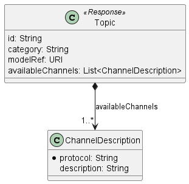

<style>
img {
  display:block;
  float: none;
  margin-left: auto;
  margin-right: auto;
}

.editor_comment
{
  color: red;
  font-weight: bold;
}

.remark
{
  color: red;
  font-weight: bold;
  font-size: 18pt;
}
</style>


<div style="font-weight:bold; font-size:33pt; font-family: Sansation;  text-align:center">
Working Draft
</br>
MEF W147 v0.2
</br>
</br>
LSO Allegro, LSO Interlude, and LSO Legato Streaming Management - Developer Guide
</br>
</br>
</br>
December 2023
</br>
</br>
<p class="remark">
This draft represents MEF work in progress and is subject to change.
</p>
</br>
</br>
</br>
<p class="remark">EXPORT CONTROL: This document contains technical data. The download, export, re-export or disclosure of the technical data contained in this document may be restricted by applicable U.S. or foreign export laws, regulations and rules and/or applicable U.S. or foreign sanctions ("Export Control Laws or Sanctions"). You agree that you are solely responsible for determining whether any Export Control Laws or Sanctions may apply to your download, export, reexport or disclosure of this document, and for obtaining (if available) any required U.S. or foreign export or reexport licenses and/or other required authorizations.</p>
</div>

<div class="page"/>

**Disclaimer**

© MEF Forum 2023. All Rights Reserved.

The information in this publication is freely available for reproduction and use
by any recipient and is believed to be accurate as of its publication date. Such
information is subject to change without notice and MEF Forum (MEF) is not
responsible for any errors. MEF does not assume responsibility to update or
correct any information in this publication. No representation or warranty,
expressed or implied, is made by MEF concerning the completeness, accuracy, or
applicability of any information contained herein and no liability of any kind
shall be assumed by MEF as a result of reliance upon such information.

The information contained herein is intended to be used without modification by
the recipient or user of this document. MEF is not responsible or liable for any
modifications to this document made by any other party.

The receipt or any use of this document or its contents does not in any way
create, by implication or otherwise:

- (a) any express or implied license or right to or under any patent, copyright,
  trademark or trade secret rights held or claimed by any MEF member which are
  or may be associated with the ideas, techniques, concepts or expressions
  contained herein; nor

- (b) any warranty or representation that any MEF member will announce any
  product(s) and/or service(s) related thereto, or if such announcements are
  made, that such announced product(s) and/or service(s) embody any or all of
  the ideas, technologies, or concepts contained herein; nor

- (c) any form of relationship between any MEF member and the recipient or user
  of this document.

Implementation or use of specific MEF standards, specifications or
recommendations will be voluntary, and no Member shall be obliged to implement
them by virtue of participation in MEF Forum. MEF is a non-profit international
organization to enable the development and worldwide adoption of agile, assured
and orchestrated network services. MEF does not, expressly or otherwise, endorse
or promote any specific products or services.

**Copyright**

© MEF Forum 2023. Any reproduction of this document, or any portion thereof,
shall contain the following statement: "Reproduced with permission of MEF
Forum." No user of this document is authorized to modify any of the information
contained herein.

<div class="page"/>

**Table of Contents**

<!-- code_chunk_output -->

- [List of Contributing Members](#list-of-contributing-members)
- [1. Abstract](#1-abstract)
- [2. Terminology and Abbreviations](#2-terminology-and-abbreviations)
- [3. Compliance Levels](#3-compliance-levels)
- [4. Introduction](#4-introduction)
  - [4.1 Description](#41-description)
  - [4.2. Conventions in the Document](#42-conventions-in-the-document)
  - [4.3. Relation to Other Documents](#43-relation-to-other-documents)
  - [4.4. Approach](#44-approach)
  - [4.5. High-Level Flow](#45-high-level-flow)
- [5. API Description](#5-api-description)
  - [5.1. High-level use cases](#51-high-level-use-cases)
  - [5.2. API Endpoint and Operation Description](#52-api-endpoint-and-operation-description)
  - [5.3. Integration of the Service-Specific Models](#53-integration-of-the-service-specific-models)
    - [5.3.1. Streaming Management API Extension](#531-streaming-management-api-extension)
      - [5.3.1.1. Response extension](#5311-response-extension)
      - [5.3.1.2. Request extension](#5312-request-extension)
    - [5.3.2. Message Data Model Extension](#532-message-data-model-extension)
  - [5.4. Model Structural Validation](#54-model-structural-validation)
  - [5.5. Security Considerations](#55-security-considerations)
- [6. API Interactions and Flows](#6-api-interactions-and-flows)
  - [6.1. Use case 1: Retrieve Available Topics List](#61-use-case-1-retrieve-available-topics-list)
  - [6.2. Use case 2: Retrieve Available Topic by an Identifier](#62-use-case-2-retrieve-available-topic-by-an-identifier)
  - [6.3. Use case 3: Subscribe To a Topic](#63-use-case-3-subscribe-to-a-topic)
  - [6.4. Use case 4: Unsubscribe From a Topic](#64-use-case-4-unsubscribe-from-a-topic)
  - [6.5. Use case 5: Retrieve Topic Subscriptions List](#65-use-case-5-retrieve-topic-subscriptions-list)
  - [6.6. Use case 6: Retrieve Topic Subscription By an Identifier](#66-use-case-6-retrieve-topic-subscription-by-an-identifier)
- [7. API Details](#7-api-details)
  - [7.1. Management API Data model](#71-management-api-data-model)
    - [7.1.1. Topic](#711-topic)
      - [7.1.1.1. `enum` Category](#7111-enum-category)
      - [7.1.1.2. Type ChannelDescription](#7112-type-channeldescription)
      - [7.1.1.3. Type Topic](#7113-type-topic)
    - [7.1.2. Subscription](#712-subscription)
      - [7.1.2.1. Type Channel](#7121-type-channel)
      - [7.1.2.2. Type ConnectionConfig](#7122-type-connectionconfig)
      - [7.1.2.3. Type Subscription](#7123-type-subscription)
      - [7.1.2.4. Type TopicSubscription](#7124-type-topicsubscription)
      - [7.1.2.5. Type TopicSubscriptionRequest](#7125-type-topicsubscriptionrequest)
    - [7.1.3. Error models](#713-error-models)
      - [7.1.3.1. Type Error](#7131-type-error)
      - [7.1.3.2. Type Error400](#7132-type-error400)
      - [7.1.3.3. `enum` Error400Code](#7133-enum-error400code)
      - [7.1.3.4. Type Error401](#7134-type-error401)
      - [7.1.3.5. `enum` Error401Code](#7135-enum-error401code)
      - [7.1.3.6. Type Error403](#7136-type-error403)
      - [7.1.3.7. `enum` Error403Code](#7137-enum-error403code)
      - [7.1.3.8. Type Error404](#7138-type-error404)
      - [7.1.3.9. Type Error422](#7139-type-error422)
      - [7.1.3.10. `enum` Error422Code](#71310-enum-error422code)
      - [7.1.3.11. Type Error500](#71311-type-error500)
  - [7.2. Message model](#72-message-model)
    - [7.2.1. Message](#721-message)
- [8. References](#8-references)
- [Appendix A. Channel binding examples](#appendix-a-channel-binding-examples)
  - [Kafka binding example](#kafka-binding-example)
  - [AMQP binding example](#amqp-binding-example)
  - [Web Socket binding example](#web-socket-binding-example)

<!-- /code_chunk_output -->

<div class="page"/>

# List of Contributing Members

The following members of the MEF participated in the development of this
document and have requested to be included in this list.

| Member |
| ------ |
|        |
|        |
|        |

**Table 1. Contributing Members**

# 1. Abstract

This standard is intended to assist implementation of the Streaming Management
functionality defined for the LSO Allegro, Legato, and Interlude Interface Reference
Points (IRPs), for which requirements and use cases are defined in MEF 133.1 (WD)
_Allegro, Interlude and Legato Fault Management and Performance Monitoring BR&UC_
[[MEFW133.1](#8-references)].
This standard normatively incorporates the following files by reference
as if they were part of this document, from the GitHub
repository:

[MEF-LSO-Legato-SDK](https://github.com/MEF-GIT/MEF-LSO-Legato-SDK)

- [`serviceApi/pm/streamingManagement.api.yaml`](https://github.com/MEF-GIT/MEF-LSO-Legato-SDK-extended/blob/working-draft/serviceApi/pm/streamingManagement.api.yaml)

**Note:** The repository contains `serviceApi/pm/streamingManagement.api.all-in-one.yaml` version of the OAS spec. This version is self-contained and does not use references to external resources.

The Streaming Management API is defined using OpenAPI 3.0 Specification
[[OAS-V3](#8-references)].

<div class="page"/>

# 2. Terminology and Abbreviations

This section defines the terms used in this document. In many cases, the
normative definitions of terms are found in other documents. In these cases,
the third column is used to provide the reference that is controlling, in other
MEF or external documents.

<table>
<tr>
  <th>Term</th>
  <th>Description</th>
  <th>Reference</th>
</tr>
<tr>
  <td>Application Program Interface (API)</td>
  <td>In the context of LSO, API describes one of the Management Interface Reference Points based on the requirements specified in an Interface Profile, along with a data model, the protocol that defines operations on the data, and the encoding format used to encode data according to the data model. In this document, API is used synonymously with REST API.</td>
  <td><a href="#8-references">[MEF55.1]</td>
</tr>
<tr>
  <td>API Gateway</td>
  <td>An API gateway is a software pattern or component that acts as an intermediary between clients and the backend services of the server.</td>
  <td>This document</td>
</tr>
<tr>
  <td>Buyer</td>
  <td>In the context of this document denotes the organization or individual acting as the customer in a transaction over a Cantata (Customer <-> Service Provider) or Sonata (Service Provider <-> Partner) Interface. The Buyer consumes streaming management API exposed through Allegro and Interlude respectively.</td>
  <td>This document; adapted from <a href="#8-references">[MEF80]</td>
</tr>
<tr>
  <td>Client</td>
  <td>In the context of this document, denotes a system that consumes the uses the stream management functionality.</td>
  <td>This document</td>
</tr>
<tr>
  <td>Consumer</td>
  <td>A component that consumes messages from a data stream. In the scope of this document, synonymous to `Client`</td>
  <td>This document</td>
</tr>
<tr>
  <td>Event</td>
  <td>A specific occurrence or a state change that is note-worthy to the system administrator.</td>
  <td><a href="#8-references">[MEFW133.1]</td>
</tr>
<tr>
  <td>Message</td>
  <td>Typically defined as a unit of information exchanged between components or services in a distributed system. In the context of this standard, a unit of information, that is a manifestation of an event exchanged between producer and consumer using an event-driven architectural pattern.</td>
  <td><a href="#8-references">[MEFW133.1]</td>
</tr>
<tr>
  <td>Producer</td>
  <td>A component that produces messages and exposes them via message stream to the consumers</td>
  <td><a href="#8-references">This document</a> </td>
</tr>
<tr>
  <td>REST API</td>
  <td>Representational State Transfer. REST provides a set of architectural constraints that, when applied as a whole, emphasizes the scalability of component interactions, the generality of interfaces, the independent deployment of components, and intermediary components to reduce interaction latency, enforce security, and encapsulate legacy systems.</td>
  <td><a href="#8-references">[REST]</a> </td>
</tr>
<tr>
  <td>Seller</td>
  <td>In the context of this document, denotes the organization or individual acting as the supplier in a transaction over a Cantata (Customer <-> Service Provider) or Sonata (Service Provider <-> Partner) Interface. The Seller exposes streaming management API through Allegro and Interlude respectively.
  </td>
  <td>This document; adapted from <a href="#8-references">[MEF80]</td>
</tr>
<tr>
  <td>Server</td>
  <td>In the context of this document, denotes a system that exposes the stream management functionality and typically produces the stream messages.</td>
  <td>This document</td>
</tr>

</table>

<div class="page"/>

# 3. Compliance Levels

The key words **"MUST"**, **"MUST NOT"**, **"REQUIRED"**, **"SHALL"**, **"SHALL
NOT"**, **"SHOULD"**, **"SHOULD NOT"**, **"RECOMMENDED"**, **"NOT
RECOMMENDED"**, **"MAY"**, and **"OPTIONAL"** in this document are to be
interpreted as described in BCP 14 (RFC 2119 [[RFC2119](#8-references)], RFC
8174 [[RFC8174](#8-references)]) when, and only when, they appear in all
capitals, as shown here. All key words must be in bold text.

Items that are **REQUIRED** (contain the words **MUST** or **MUST NOT**) are
labeled as **[Rx]** for required. Items that are **RECOMMENDED** (contain the
words **SHOULD** or **SHOULD NOT**) are labeled as **[Dx]** for desirable.
Items that are **OPTIONAL** (contain the words MAY or OPTIONAL) are labeled as
**[Ox]** for optional.

A paragraph preceded by **[CRa]<** specifies a conditional mandatory
requirement that **MUST** be followed if the condition(s) following the "<"
have been met. For example, **"[CR1]<[D38]"** indicates that Conditional
Mandatory Requirement 1 must be followed if Desirable Requirement 38 has been
met. A paragraph preceded by **[CDb]<** specifies a Conditional Desirable
Requirement that **SHOULD** be followed if the condition(s) following the "<"
have been met. A paragraph preceded by **[COc]<**specifies a Conditional
Optional Requirement that **MAY** be followed if the condition(s) following the
"<" have been met.

<div class="page"/>

# 4. Introduction

This standard specification document describes the Application Programming
Interface (API) for Service Inventory Management functionality of the LSO Allegro, Interlude, and Legato
Interface Reference Points (IRPs) as defined in the _MEF 55.1 Lifecycle Service
Orchestration (LSO): Reference Architecture and Framework_
[[MEF55.1](#8-references)]. The LSO Reference Architecture is shown in Figure 1
with the IRP highlighted.


**Figure 1. The LSO Reference Architecture**

This document is structured as follows:

- [Chapter 4](#4-introduction) provides an introduction to Streaming Management
  in a broader context of Allegro, Interlude, and Legato APIs and
  their corresponding SDKs.
- [Chapter 5](#5-introduction) briefly discusses API and the supported use cases along with mapping into MEF W133.1.
- [Chapter 6](#6-introduction) describes use cases in detail.
- [Chapter 7](#7-introduction) provides an in-detail discussion of the data model defined for the Streaming Management API

## 4.1 Description

This standard is scoped to cover APIs for Streaming Management.
Although the management API might be used in different contexts we restrict the
description in this standard to use cases that allow for exchanging performance
data as defined in MEF W133.1.

This document supports interactions over the Legato interface within a single
operator as well as interaction with the Customer Domain and Partner Domain
through Allegro and Interlude interfaces respectively.

Streaming Management API is used to:

- discover available `Topics` exposed by the `Server`
- manage subscriptions to these topics
- list existing subscriptions

## 4.2. Conventions in the Document

- Code samples are formatted using code blocks. When notation `<< some text >>`
  is used in the payload sample it indicates that a comment is provided instead
  of an example value and it might not comply with the OpenAPI definition.
- Model definitions are formatted as in-line code (e.g. `Service`).
- In UML diagrams the default cardinality of associations is `0..1`. Other
  cardinality markers are compliant with the UML standard.
- In the API details tables and UML diagrams required attributes are marked with
  a `*` next to their names.
- In UML sequence diagrams `{{variable}}` notation is used to indicate a
  variable to be substituted with a correct value.

## 4.3. Relation to Other Documents

This API implements the Performance Monitoring Streaming requirements and use
cases that are defined in [[MEFW133.1](#8-references)].

## 4.4. Approach

As presented in Figure 2. the Allegro, Interlude, and Legato API frameworks
consist of three structural components:

- Generic API framework
- Service-independent information (Function-specific information and
  Function-specific operations)
- Service-specific information (MEF service specification data model)


**Figure 2. Allegro, Interlude, and Legato API Structure**

The essential concept behind the framework is to decouple the common structure,
information, and operations from the specific service information content.

Firstly, the Generic API Framework defines a set of design rules and patterns
that are applied across all Allegro, Interlude, and Legato APIs.

Secondly, the service-independent information of the framework focuses on a
model of a particular Allegro, Interlude, or Legato functionality and is agnostic
to any of the service specifications.
For example, this standard describes
the Streaming Management model and operations that allow subscribing
to streams of any service.

Finally, the service-specific information part of the framework focuses on
service-related attributes and requirements that are being exchanged
between streaming clients and producers.

## 4.5. High-Level Flow

The Streaming API in essence allows the `Client` to subscribe to
a data stream exposed by the `Server`.
Figure 3 presents a high-level flow in which a `Client`:

1. select the topic of interest - Subscribe section;
2. consumes messages - Consume section;
3. finalizes subscription - Unsubscribe section.


**Figure 3. End-to-end high-level flow**

The _Consume_ section of this flow is not supported by management API as
it is specific to the selected data exchange protocol.
However, MEF W133.1[[MEFW133.1](#8-references)] defines requirements for
this part of the end-to-end flow.

Please note that the consumption of the data might be realized by various protocols
leveraging broker (e.g., Kafka, AMQP) or broker-less (e.g., Web Socket, SSE) communication patterns.

<div class="page"/>

# 5. API Description

This section presents the API structure and design patterns. It starts with the
high-level use cases diagram. Then it describes the REST endpoints with use
case mapping. Next, it gives an overview of the API resource model.

## 5.1. High-level use cases

Figure 4 presents a high-level use case diagram that is relevant for
streaming management API. The mapping to appropriate MEF
W133.1 use cases is provided in the bottom part of the ellipse shape representing the use case.

A full list of the use cases for streaming can be found in MEF W133.1
[[MEFW133.1](#8-references)] in section 14.
Use cases from Figure 4 are described extensively in [Chapter 6](#6-api-interactions-and-flows).


**Figure 4. Use cases**

The Service Orchestration Functionality (`SOF`) that exposes the Streaming management API,
and manages streaming infrastructure and event production is referred
to as `Server` in other parts of this document.

The `Client` interacts with the API to obtain information that allows for event consumption.
The `Client` might be a system from _Customer Domain_, _Partner Domain_'s `SOF`,
or a `Business Application` from _SP Domain_
depending on the considered IRP as presented in Figure 1.

## 5.2. API Endpoint and Operation Description

**Base URL for IRP**:

`https://{{serverBase}}{{?/seller_prefix}}/mefApi/{{irp}}/streamingManagement/v1/`

the supported IPRs for this API are `legato`, `allegro`, and `interlude`.

The following API endpoints are implemented by the Server and allow the client
to retrieve information about available topics and manage subscriptions.

`serviceApi/pm/streamingManagement.api.yaml`.

Streaming Management API to use case mapping:

| API endpoint                   | Description                                                           | Use Case mapping                                   |
| ---------------------------    | --------------------------------------------------------------------- | -------------------------------------------------- |
| `GET    /topic`                | List Topics available for Subscription                                | UC 1: Retrieve Available Topics List               |
| `GET    /topic/{{id}}`         | Retrieve Topic information by identifier                              | UC 2: Retrieve Available Topic by an Identifier    |
| `POST   /subscription`         | Subscribe to a Topic                                                  | UC 3: Subscribe To a Topic                         |
| `DELETE /subscription/{{id}}`  | Remove a Subscription for a Topic                                     | UC 4: Unsubscribe From a Topic                     |
| `GET    /subscription`         | List all the Subscriptions to the Topics                              | UC 5: Retrieve Topic Subscriptions List            |
| `GET    /subscription/{{id}}`  | Retrieve information about Subscription to a Topic                    | UC 6: Retrieve Topic Subscription By an Identifier |

**Table 2. Server-side mandatory Streaming Management API endpoints**

**[R1]** The `Server` **MUST** support Streaming Management API endpoints listed
in Table 2.

## 5.3. Integration of the Service-Specific Models

This section provides details on the extension mechanism available
for Streaming Management API
as well as the data payload that is exchanged between the `Server` and `Client`.

### 5.3.1. Streaming Management API Extension

Streaming management API allows for subscription
to available topics as explained above.

The subscription models for request and response are depicted in Figure 5.


**Figure 5. Subscription data model**

This data model allows for two types of extensions in the response and request of the API call for UC 3.

#### 5.3.1.1. Response extension

Response extension allows specifying additional information that is
required to consume data from the stream using the selected protocol.
The extension point for this information is `BindingsObject`. However,
this standard does not specify how the extension should be introduced
into the model. We recommend using _AsyncAPI Specification_ [[AsyncAPI](#8-references)] channel
binding for well-known asynchronous protocols, as defined in _AsyncApi binding definitions at GitHub_ [[AsyncApiB](#8-references)].

For example, to provide additional information for _Kafka_ channel configuration [[AsyncApiBKC](#8-references)]
can be used.

The listening below provides an example of a simple configuration for _Kafka_.

```json
{
  "bindings": {
    "kafka": {
      "topic": "metrics-kafka",
      "partitions": 1,
      "topicConfiguration": {
        "cleanup.policy": ["compact"],
        "retention.ms": 604800000
      },
      "bindingVersion": "0.4.0"
    }
  }
}
```

This sample provides details on _Kafka_ broker configuration for the subscription.
It specifically defines the topic, the number of partitions,
and the data retention configuration.
The complete description of configuration options
is beyond the scope of this standard.
For more details, please refer to the AsyncAPI
bindings configuration and the Kafka documentation.

[Appendix A.](#appendix-a-channel-binding-examples)
contains examples of bindings for additional protocols.

#### 5.3.1.2. Request extension

The baseline request payload is very simple as it allows for the
selection of a protocol from the list
of protocols defined for a given available topic.

In the case of performance-related messages, the subscription is made
for all potential subjects (e.g., services) and for the full list of
performance metrics defined for that topic.

The extension of the `TopicSubscriptionRequest` serves two purposes:

1. to allow for fine-grained specification
   of the subject and performance attributes.
1. to allow for the specification of protocol-specific parameters.
   For example, a `Server` may allow
   a `Client` to specify the consumer group name for _Kafka_.

An example model definition that accommodates both purposes is shown in Figure 6.
The model demonstrates the extension to protocol configuration and
allows for fine-grained tuning of the subscription target and
performance attributes using the `performanceAttributesNames` list.

The `topicId` effectively serves as a discriminator for the extension
model of `TopicSubscriptionRequest`, and the value of the `protocol`
attribute becomes the discriminator for the protocol configuration part.


**Figure 6. Subscription data model extension example**

### 5.3.2. Message Data Model Extension

In this document, we use the term `Message` to define a unit of information
exchanged via streaming.
The `Message` is a vessel for `Event` data and additional meta information.
The `Message` is defined in [[MEF 133.1](#8-references)] and based on [[TMF688](#8-references)].

This section uses a simplified Carrier Ethernet Performance Monitoring data model to illustrate the extension mechanism.

The Message is open for extension using a variant of the TMF extension pattern.
The discriminator attribute name is `eventType`.
Figure 7 demonstrates how the generic `Message` is specialized to represent a Carrier Ethernet Performance Monitoring model.
In this model, `eventType` discriminates a specialized `event` content.
The event content defines two distinct components. The identifier of an observation subject (`OrderedPair`) which describes what do we monitor.
In this example, it is an ordered pair of endpoints for a given service. The set of performance measurements (`CePerformanceMetrics`) defines what type of measurements we are interested in for that subject.


**Figure 7. Message specialization with an example event model**

The listing below presents an example of a simple payload that conforms
to the model defined in Figure 7.
In this case, data is encoded using JSON data format. All the attributes of the data model are sent as part of the payload.

```json
{
  "eventId": "88b6cb2d-e2ca-4093-9550-90c64096be7b",
  "eventTime": "2023-05-30T14:11:42.515835+02:00",
  "priority": "LOW",
  "event": {
    "key": {
      "serviceId": "service1",
      "fromCarrierEthernetServiceEndPoint": "1",
      "toCarrierEthernetServiceEndPoint": "2"
    },
    "metrics": {
      "oneWayHighLossIntervals": {
        "consecutiveNumberP": 38,
        "measuredOneWayChli": 71
      },
      "oneWayFrameDelay": {
        "measuredOneWayFd": 67,
        "oneWayFdPercentile": 0.14565401998011449
      },
      "oneWayAvailability": {
        "oneWayAvailability": 0.9012261669223176
      },
      "oneWayFrameLossRatio": {
        "measuredOneWayFlr": 0.478900647869665
      }
    }
  },
  "eventType": "CePerformanceStatistics"
}
```

The payload represents a single message taken at a given time for an ordered pair of endpoints for `service1`.
The message contains four performance-related metrics with their values.  

Please note that JSON is one of many possible data formats and the use of
a particular one depends on the particular technology selected for a given subscription.
For example, in the case of _Kafka_ transport, another popular format is Apache Avro [[Avro](#8-references)].

## 5.4. Model Structural Validation

The structure of the HTTP payloads exchanged via the API endpoints
is defined using OpenAPI version 3.0.

**[R2]** Implementations **MUST** use payloads that conform to these
definitions.

## 5.5. Security Considerations

There must be an authentication mechanism whereby a Server can be assured who a
Client is and vice-versa. There must also be authorization mechanisms in place
to control what a particular Client is allowed to do and what
information may be obtained. However, the definition of the exact security
mechanism and configuration is outside the scope of this document. It is being
worked on by a separate MEF Project (MEF W128).

Please note that to secure access production or consumption of the performance events
might require measures that are not in scope for MEF W128.

<div class="page"/>

# 6. API Interactions and Flows

This section provides a detailed insight into the API functionality, use cases, and flows.
It starts with Table 6 presenting a list and short description of all
business use cases then examples for each of them.

| Use Case # | Use Case Name                                | Use Case Description                                                                        | MEF W133.1 mapping |
| ---------- | -------------------------------------------- | ------------------------------------------------------------------------------------------- | ------------------ |
| UC 1       | Retrieve Available Topics List               | A request initiated by the Client to list of all available topics.                          | UC 44              |
| UC 2       | Retrieve Available Topic by an Identifier    | A request initiated by the Client to retrieve details for the selected available topic.     | UC 43              |
| UC 3       | Subscribe To a Topic                         | A request initiated by the Client to create a new subscription for the topic of interest.   | UC 46              |
| UC 4       | Unsubscribe From a Topic                     | A request initiated by the Client to remove a subscription to the topic of interest.        | UC 47              |
| UC 5       | Retrieve Topic Subscriptions List            | A request initiated by the Client to list of all existing subscriptions to the topics.      | UC 45              |
| UC 6       | Retrieve Topic Subscription By an Identifier | A request initiated by the Client to retrieve details for a selected subscription.          | n/a                |

**Table 6. Use cases description**

The detailed business requirements of each of the use cases are described
in section 14 of MEF W133.1.1 [[MEFW133.1](#8-references)].
The requirements from R131 to R145 are covered by this standard as explained in detail in the next sections.
The requirements from R146 to R150 are
not covered in the Streaming Management API.

**[R3]** The `Server` **MUST** support `application/json` format of information exchange for all the use cases.

## 6.1. Use case 1: Retrieve Available Topics List

To get detailed information about the available topics, the Client sends
a request using `GET /topic` operation with optional filtering criteria.

The flow is a simple request-response pattern, as presented in Figure 8:


**Figure 8. Use case 1: Retrieve Service by Service Identifier flow**

**[O1]** Server **MAY** return all results matching the filtering criteria [MEF W133.1 R133]

**[R4]** Server **MUST** return an empty list of Topic entities if there is
no topic matching filtering criteria [MEF W133.1 R133]

The response is a list of `Topic`s where the topic data model is presented in Figure 10.



**Figure 10. Topic response model**

An example response payload is presented below. There are three available channels
defined by the `Server`. Each topic can be consumed
by a _Kafka_ or _WebSocket_-capable `Client`
after a successful subscription.

In this example, it is assumed that `modelRef` URI points to the JsonSchema resource
that describes the data model introduced in the [section above](#53-integration-of-the-service-specific-models).

```json
[
  {
    "id": "dde8b741-f7d3-483e-8c78-5ae84f0c6bb4",
    "category": "IP",
    "modelRef": "https://example.mef.net:7070/schemas/ip/cePerformanceStatistics.1.0.0.schema.json",
    "availableChannels": [
      {
        "protocol": "kafka",
        "description": "Kafka protocol"
      },
      {
        "protocol": "web-socket",
        "description": "WS protocol"
      }
    ]
  },
  {
    "id": "963f6664-5f34-4c3b-a769-6fb6d3dc348f",
    "category": "COMPUTING",
    "modelRef": "https://example.mef.net:7070/schemas/computing/resources.1.0.0.schema.json",
    "availableChannels": [
      {
        "protocol": "kafka",
        "description": "Kafka protocol"
      },
      {
        "protocol": "web-socket",
        "description": "WS protocol"
      }
    ]
  },
  {
    "id": "ae09e5d5-9038-4f90-9531-2ba7c12aa769",
    "category": "COMPUTING",
    "modelRef": "https://example.mef.net:7070/schemas/computing/cpu.1.0.0.schema.json",
    "availableChannels": [
      {
        "protocol": "kafka",
        "description": "Kafka protocol"
      },
      {
        "protocol": "web-socket",
        "description": "WS protocol"
      }
    ]
  }
]
```

**[R5]** The `id` **MUST** be unique within the `Server` domain.

## 6.2. Use case 2: Retrieve Available Topic by an Identifier

To get detailed information about the selected available topics,
the Client sends
a request using `GET /topic/{{id}}` operation
where `{{id}}` is a unique identifier for that topic.

The flow is a simple request-response pattern, as presented in Figure 10.


**Figure 10. Use case 2: Retrieve Available Topic by an Identifier flow**

The data model of the response is presented in Figure 10.

An example response payload is presented below.

```json
{
  "id": "dde8b741-f7d3-483e-8c78-5ae84f0c6bb4",
  "category": "IP",
  "modelRef": "https://example.mef.net:7070/schemas/ip/cePerformanceStatistics.1.0.0.schema.json",
  "availableChannels": [
    {
      "protocol": "kafka",
      "description": "Kafka protocol"
    },
    {
      "protocol": "web-socket",
      "description": "WS protocol"
    }
  ]
}
```

## 6.3. Use case 3: Subscribe To a Topic

Figure 11 illustrates the flow of subscribing to a topic and
subsequently consuming from the stream that the client has subscribed
to using a broker-based solution.

The specific consumption pattern, whether broker-based (such as _Kafka_, _MQTT_, or _AMQP_)
or broker-less (such as _SSE_ or _WebSocket_), is transparent to the subscription API.

However, it is important to incorporate transport-specific details in
the subscription response, as explained in [section 5.3.1.1](#5311-response-extension).
Alternatively, these details can be agreed upon during the onboarding
process between the `Client` and the `Server`.

A subscription request might trigger various configurations of broker
and/or message producer infrastructure.

In this version of the standard, it is assumed that the configuration is
finished before the `Server` returns a response to the `Client`.
The model extension mechanism might be used to provide additional
information that allows for handling the delayed initialization of the infrastructure.


**Figure 11. Use case 3: Subscribe To a Topic flow**

**[R6]** The Client request **MUST** include the topic identifier and the protocol to be used for the subscription.

**[O2]** The Client request **MAY** include additional attributes that are necessary to configure the communication channel for the specified protocol.

**[R7]** The Server **MUST** indicate whether the request was accepted or declined with
the appropriate error code [MEF 133.1 R137]

**[R8]** The response to the subscription query **MUST** include all details
required to consume messages from the configured communication channel. [MEF 133.1 R140]

**[R9]** The Server **MUST** start streaming if the subscribe operation was successful [MEF 133.1 R140]

<div class="editor_comment">
Not supported requirements from MEFW133.1
<ul>
<li>
  R136 The Buyer/Client's Subscribe to Topic request MUST include the attributes (with the exception of those set by Seller/Server) shown in Subscribe Topic Attributes Table 70.
</li>
</ul>
</div>

The subscription request is initiated by sending a `POST` request
to  `/subscription` endpoint.
An example request payload:

```json
{
  "topicId": "dde8b741-f7d3-483e-8c78-5ae84f0c6bb4",
  "protocol": "kafka"
}
```

An example response:

```json
{
  "id": "634af680-eca7-499a-8d83-86b61242caeb",
  "connectionConfig": {
    "servers": {
      "kafka-prod": {
        "url": "https://perf.broker.mef.net:9092",
        "protocol": "kafka"
      }
    },
    "channel": {
      "name": "streaming/ce-performance/634af680-eca7-499a-8d83-86b61242caeb",
      "bindings": {
        "kafka": {
          "topic": "ce-performance-metrics-kafka-all",
          "partitions": 1,
          "topicConfiguration": {
            "cleanup.policy": ["compact"],
            "retention.ms": 604800000
          },
          "bindingVersion": "0.4.0"
        }
      }
    }
  },
  "protocol": "kafka",
  "topicId": "dde8b741-f7d3-483e-8c78-5ae84f0c6bb4"
}
```

## 6.4. Use case 4: Unsubscribe From a Topic

Figure 12 illustrates the flow of unsubscribing from a topic, using
subscription id (`sid`) obtained in use case 3.

To unsubscribe, the Client sends a request `DELETE` request to `/subscription/{{sid}}`.

An unsubscribe request might trigger various configuration changes
in broker and/or message producer infrastructure.

In this version of the standard, it is assumed that the configuration is
finished before the `Server` returns a response to the `Client`.


**Figure 12. Use case 4: Unsubscribe From a Topic flow**

**[R10]** The Server **MUST** indicate whether a request was accepted or declined with
the appropriate error code [MEF 133.1 R142, R143]

**[R11]** The Server **MUST** stop streaming if an unsubscribe operation was successful [MEF 133.1 R144]

## 6.5. Use case 5: Retrieve Topic Subscriptions List

To get detailed information about the active subscriptions,
the Client sends
a request using `GET /subscription` operation with optional filtering criteria.

The flow is a simple request-response pattern, as presented in Figure 13:


**Figure 13. Use case 5: Retrieve Topic Subscriptions List flow**

**[R12]** Server **MUST** return all results matching the filtering criteria [MEF W133.1 R134]

**[R13]** Server **MUST** return an empty list of subscriptions if there are
no subscriptions matching filtering criteria [MEF W133.1 R135]

**[O3]** Server **MAY** support responses in AsyncAPI response (`application/vnd.aai.asyncapi+json`)

Example JSON response:

```json
[
  {
    "id": "31b5485f-cf10-4a82-97f9-c7c1307ef811",
    "priority": "low",
    "connectionConfig": {
      "servers": {
        "kafka": {
          "url": "localhost:29092",
          "protocol": "kafka"
        }
      },
      "channel": {
        "name": "streaming/ce-performance/31b5485f-cf10-4a82-97f9-c7c1307ef811",
        "bindings": {
          "kafka": {
            "topic": "metrics-kafka",
            "partitions": 1,
            "topicConfiguration": {
              "cleanup.policy": ["compact"],
              "retention.ms": 604800000
            },
            "bindingVersion": "0.4.0"
          }
        }
      }
    },
    "protocol": "kafka",
    "topicId": "dde8b741-f7d3-483e-8c78-5ae84f0c6bb4"
  }
]
```

The above response may be represented as an Async API specification.
The Async API response includes all channels subscribed by the `Client` and full model definitions.
To retrieve that AsyncAPI response the `Client` sends a request using `GET /subscription` operation with `Accept` header set to `application/vnd.aai.asyncapi+json`.
If the `Server` does not support AsyncAPI response it returns `406 Not Acceptable` response. 

The above response as Async API payload (JSON encoded):

```json
{
  "asyncapi": "2.6.0",
  "info": {
    "title": "CePerformanceStatistics",
    "version": "1.0.0"
  },
  "servers": {
    "kafka": {
      "url": "localhost:29092",
      "protocol": "kafka"
    }
  },
  "channels": {
    "streaming/ce-performance/31b5485f-cf10-4a82-97f9-c7c1307ef811": {
      "subscribe": {
        "description": "read from the channel",
        "bindings": {
          "kafka": {
            "topic": "metrics-kafka",
            "partitions": 1,
            "topicConfiguration": {
              "cleanup.policy": ["compact"],
              "retention.ms": 604800000
            },
            "bindingVersion": "0.4.0"
          }
        },
        "message": {
          "$ref": "#/components/messages/Event"
        }
      }
    }
  },
  "components": {
    "schemas": {
      "CePerformanceMetrics": {
        <<< truncated content >>>
      },
      "Key": {
        <<< truncated content >>>
      },
      "CePerformanceStatistics": {
        "type": "object",
        "properties": {
          "key": {
            "$ref": "#/components/schemas/Key"
          },
          "metrics": {
            "$ref": "#/components/schemas/CePerformanceMetrics"
          }
        }
      }
    },
    "messages": {
      "Event": {
        "payload": {
          "type": "object",
          "properties": {
            "eventId": {
              "description": "Unique identifier for the event.",
              "type": "string",
              "format": "uuid"
            },
            "eventTime": {
              "description": "Date and time when the event occurred.",
              "type": "string",
              "format": "date-time"
            },
            "priority": {
              "description": "Priority of the event.",
              "type": "string",
              "enum": ["LOW", "MEDIUM", "HIGH"]
            },
            "event": {
              "$ref": "#/components/schemas/CePerformanceStatistics"
            }
          }
        }
      }
    }
  }
}
```

The model used in the above JSON listing is described in [section 5.3.2](#532-message-data-model-extension).
Please note that there are two possible renderings of the base [Message Data Model](#72-message-model) that might be used in AsyncAPI.
The first (presented above) renders all attributes as part of the AsyncAPI message payload.
The second renders some of these attributes (e.g. `eventId`) in the header part of the AsyncAPI message.

## 6.6. Use case 6: Retrieve Topic Subscription By an Identifier

To get detailed information about the subscription to a particular topic,
the Client sends
a request using `GET /subscription/{{id}}` operation
where `{{id}}` is a unique identifier for that subscription.

The flow is a simple request-response pattern, as presented in Figure 14.


**Figure 14. Use case 6: Retrieve Topic Subscription By an Identifier flow**

<div class="page"/>

# 7. API Details

## 7.1. Management API Data model

### 7.1.1. Topic

The topic model exposes information about the available topics.

#### 7.1.1.1. `enum` Category

**Description:** The category of the topic. This can be used to group topics based on their characteristics.

<table id="T_Category">
    <thead style="font-weight:bold;">
        <tr>
            <td>Value</td>
            <td>MEF W133.1</td>
        </tr>
    </thead>
    <tbody>
        <tr>
            <td>Layer 1</td>
            <td>LAYER 1</td>
        </tr><tr>
            <td>Ethernet</td>
            <td>ETHERNET</td>
        </tr><tr>
            <td>IP</td>
            <td>IP</td>
        </tr><tr>
            <td>SD-WAN</td>
            <td>SD-WAN</td>
        </tr><tr>
            <td>Computing</td>
            <td>COMPUTING</td>
        </tr><tr>
            <td>Storage</td>
            <td>STORAGE</td>
        </tr><tr>
            <td>Memory</td>
            <td>MEMORY</td>
        </tr>
    </tbody>
</table>

#### 7.1.1.2. Type ChannelDescription

**Description:**

<table id="T_ChannelDescription" style="width:100%">
    <thead style="font-weight:bold">
        <tr>
            <td>Name</td>
            <td style="width:15%">Type</td>
            <td>M/O</td>
            <td>Description</td>
            <td>MEF W133.1</td>
        </tr>
    </thead>
    <tbody>
        <tr>
        <td>protocol</td>
            <td>string</td>
            <td>M</td>
            <td>Name of a technical protocol allowing for consumption</td>
            <td>n/a</td>
        </tr><tr>
        <td>description</td>
            <td>string</td>
            <td>O</td>
            <td>Human-friendly description of the protocol</td>
            <td>n/a</td>
        </tr>
    </tbody>
</table>

#### 7.1.1.3. Type Topic

**Description:** Provides metadata describing a topic available for subscription.
This object is used to define available consumption mechanisms and the data model.

<table id="T_Topic" style="width:100%">
    <thead style="font-weight:bold">
        <tr>
            <td>Name</td>
            <td style="width:15%">Type</td>
            <td>M/O</td>
            <td>Description</td>
            <td>MEF W133.1</td>
        </tr>
    </thead>
    <tbody>
        <tr>
        <td>id</td>
            <td>string</td>
            <td>O</td>
            <td>An identifier for the topic. This can be used to uniquely identify the topic within the Server system.
</td>
            <td>Topic Identifier</td>
        </tr><tr>
        <td>category</td>
            <td><a href="#T_Category">Category</a></td>
            <td>O</td>
            <td>The category of the topic. This can be used to group topics based on their characteristics.
</td>
            <td>Topic Category</td>
        </tr><tr>
        <td>modelRef</td>
            <td>uri<br/><span style="font-size:10px;font-style:italic">format = uri</span></td>
            <td>O</td>
            <td>A reference to a model that describes the structure of the data associated with the topic.
</td>
            <td>Indirect mapping to &#x27;Service Specific Attributes&#x27;</td>
        </tr><tr>
        <td>availableChannels</td>
            <td><a href="#T_ChannelDescription">ChannelDescription</a>[]<br/><span style="font-size:10px;font-style:italic">minItems = 1</span></td>
            <td>O</td>
            <td>An array of channel descriptions that provide information about the channels through which the topic can be accessed.
</td>
            <td>Indirect mapping to &#x27;Service Specific Attributes&#x27;</td>
        </tr>
    </tbody>
</table>

**[R14]** The `modelRef` **MUST** be a valid `URI` that references
a data model that defines a contract between Client and Server
for the data exchange for all subscriptions obtained for this topic
via any of the defined channels.

**[R15]** `Server` **MUST** define at least one available channel for each `Topic`.

### 7.1.2. Subscription

The subscription models for request and response are depicted in Figure 5.
The model allows requesting (`TopicSubscriptionRequest`) consumption
of data from an available topic.
After a successful subscription provides all details allowing for consumption ( `TopicSubscription`)

#### 7.1.2.1. Type Channel

**Description:** Defines the specific protocol bindings
and configurations for the channel.

<table id="T_Channel" style="width:100%">
    <thead style="font-weight:bold">
        <tr>
            <td>Name</td>
            <td style="width:15%">Type</td>
            <td>M/O</td>
            <td>Description</td>
            <td>MEF W133.1</td>
        </tr>
    </thead>
    <tbody>
        <tr>
        <td>name</td>
            <td>uri-template<br/><span style="font-size:10px;font-style:italic">minLength = 1<br/>format = uri-template</span></td>
            <td>O</td>
            <td>The name of the channel through which the stream data is transmitted.</td>
            <td></td>
        </tr><tr>
        <td>bindings</td>
            <td><a href="http://asyncapi.com/definitions/2.6.0/bindingsObject.json">bindingsObject</a></td>
            <td>O</td>
            <td>Defines the specific protocol bindings and configurations for the channel. We reuse AsyncAPI definition of this type</td>
            <td></td>
        </tr>
    </tbody>
</table>

#### 7.1.2.2. Type ConnectionConfig

**Description:** Configuration settings for establishing a connection to the stream.

<table id="T_ConnectionConfig" style="width:100%">
    <thead style="font-weight:bold">
        <tr>
            <td>Name</td>
            <td style="width:15%">Type</td>
            <td>M/O</td>
            <td>Description</td>
            <td>MEF W133.1</td>
        </tr>
    </thead>
    <tbody>
        <tr>
        <td>servers</td>
            <td><a href="http://asyncapi.com/definitions/2.6.0/servers.json">servers</a></td>
            <td>M</td>
            <td>List of the servers through which the subscription is available. We reuse the AsyncAPI definition of this type</td>
            <td>n/a</td>
        </tr><tr>
        <td>channel</td>
            <td><a href="#T_Channel">Channel</a></td>
            <td>O</td>
            <td></td>
            <td>n/a</td>
        </tr>
    </tbody>
</table>

#### 7.1.2.3. Type Subscription

**Description:** Provides stream metadata information for stream consumption.

<table id="T_Subscription" style="width:100%">
    <thead style="font-weight:bold">
        <tr>
            <td>Name</td>
            <td style="width:15%">Type</td>
            <td>M/O</td>
            <td>Description</td>
            <td>MEF W133.1</td>
        </tr>
    </thead>
    <tbody>
        <tr>
        <td>id</td>
            <td>string</td>
            <td>M</td>
            <td>A unique identifier for the stream.</td>
            <td>Stream Identifier</td>
        </tr><tr>
        <td>description</td>
            <td>string</td>
            <td>O</td>
            <td>An explanatory description of the stream.</td>
            <td>Description</td>
        </tr><tr>
        <td>priority</td>
            <td>string</td>
            <td>O</td>
            <td>The priority level of the stream. Can be high, medium, or low.</td>
            <td>priority</td>
        </tr><tr>
        <td>connectionConfig</td>
            <td><a href="#T_ConnectionConfig">ConnectionConfig</a></td>
            <td>O</td>
            <td></td>
            <td>Addresses connection configuration concerns listed in Table 68</td>
        </tr>
    </tbody>
</table>

#### 7.1.2.4. Type TopicSubscription

**Description:** Information about the subscription to a specific topic

Inherits from:

- <a href="#T_TopicSubscriptionRequest">TopicSubscriptionRequest</a>
- <a href="#T_Subscription">Subscription</a>

#### 7.1.2.5. Type TopicSubscriptionRequest

**Description:**

<table id="T_TopicSubscriptionRequest" style="width:100%">
    <thead style="font-weight:bold">
        <tr>
            <td>Name</td>
            <td style="width:15%">Type</td>
            <td>M/O</td>
            <td>Description</td>
            <td>MEF W133.1</td>
        </tr>
    </thead>
    <tbody>
        <tr>
        <td>protocol</td>
            <td>string</td>
            <td>M</td>
            <td>Name of the protocol consumer is intended to use to consume data from &#x60;topicId&#x60;.  The name of the protocol must be one of the defined for the topic.
</td>
            <td>n/a</td>
        </tr><tr>
        <td>topicId</td>
            <td>string</td>
            <td>M</td>
            <td>Identifier of the topic consumer wants to subscribe to</td>
            <td>Topic Identifier</td>
        </tr>
    </tbody>
</table>

### 7.1.3. Error models

#### 7.1.3.1. Type Error

**Description:** Standard Class used to describe API response error Not intended to be used directly. The `code` in the HTTP header is used as a discriminator for the type of error returned in runtime.

<table id="T_Error">
    <thead style="font-weight:bold;">
        <tr>
            <td>Name</td>
            <td>Type</td>
            <td>Description</td>
        </tr>
    </thead>
    <tbody>
        <tr>
            <td>message</td>
            <td>string</td>
            <td>Text that provides mode details and corrective actions related to the error. This can be shown to a client user.</td>
        </tr><tr>
            <td>reason*</td>
            <td>string<br/><span style="font-size:10px;font-style:italic">maxLength = 255</span></td>
            <td>Text that explains the reason for the error. This can be shown to a client user.</td>
        </tr><tr>
            <td>referenceError</td>
            <td>uri<br/><span style="font-size:10px;font-style:italic">format = uri</span></td>
            <td>URL pointing to documentation describing the error</td>
        </tr>
    </tbody>
</table>

#### 7.1.3.2. Type Error400

**Description:** Bad Request. (<https://tools.ietf.org/html/rfc7231#section-6.5.1>)

Inherits from:

- <a href="#T_Error">Error</a>

<table id="T_Error400">
    <thead style="font-weight:bold;">
        <tr>
            <td>Name</td>
            <td>Type</td>
            <td>Description</td>
        </tr>
    </thead>
    <tbody>
        <tr>
            <td>code*</td>
            <td><a href="#T_Error400Code">Error400Code</a></td>
            <td></td>
        </tr>
    </tbody>
</table>

#### 7.1.3.3. `enum` Error400Code

**Description:** One of the following error codes:

- missingQueryParameter: The URI is missing a required query-string parameter
- missingQueryValue: The URI is missing a required query-string parameter value
- invalidQuery: The query section of the URI is invalid.
- invalidBody: The request has an invalid body

<table id="T_Error400Code">
    <thead style="font-weight:bold;">
        <tr>
            <td>Value</td>
            <td>MEF W133.1</td>
        </tr>
    </thead>
    <tbody>
        <tr>
            <td>missingQueryParameter</td>
            <td>MISSING_QUERY_PARAMETER</td>
        </tr><tr>
            <td>missingQueryValue</td>
            <td>MISSING_QUERY_VALUE</td>
        </tr><tr>
            <td>invalidQuery</td>
            <td>INVALID_QUERY</td>
        </tr><tr>
            <td>invalidBody</td>
            <td>INVALID_BODY</td>
        </tr>
    </tbody>
</table>

#### 7.1.3.4. Type Error401

**Description:** Unauthorized. (<https://tools.ietf.org/html/rfc7235#section-3.1>)

Inherits from:

- <a href="#T_Error">Error</a>

<table id="T_Error401">
    <thead style="font-weight:bold;">
        <tr>
            <td>Name</td>
            <td>Type</td>
            <td>Description</td>
        </tr>
    </thead>
    <tbody>
        <tr>
            <td>code*</td>
            <td><a href="#T_Error401Code">Error401Code</a></td>
            <td></td>
        </tr>
    </tbody>
</table>

#### 7.1.3.5. `enum` Error401Code

**Description:** One of the following error codes:

- missingCredentials: No credentials provided.
- invalidCredentials: Provided credentials are invalid or expired

<table id="T_Error401Code">
    <thead style="font-weight:bold;">
        <tr>
            <td>Value</td>
            <td>MEF W133.1</td>
        </tr>
    </thead>
    <tbody>
        <tr>
            <td>missingCredentials</td>
            <td>MISSING_CREDENTIALS</td>
        </tr><tr>
            <td>invalidCredentials</td>
            <td>INVALID_CREDENTIALS</td>
        </tr>
    </tbody>
</table>

#### 7.1.3.6. Type Error403

**Description:** Forbidden. This code indicates that the server understood the request but refuses to authorize it. (<https://tools.ietf.org/html/rfc7231#section-6.5.3>)

Inherits from:

- <a href="#T_Error">Error</a>

<table id="T_Error403">
    <thead style="font-weight:bold;">
        <tr>
            <td>Name</td>
            <td>Type</td>
            <td>Description</td>
        </tr>
    </thead>
    <tbody>
        <tr>
            <td>code*</td>
            <td><a href="#T_Error403Code">Error403Code</a></td>
            <td></td>
        </tr>
    </tbody>
</table>

#### 7.1.3.7. `enum` Error403Code

**Description:** This code indicates that the server understood the request but refuses to authorize it because of one of the following error codes:

- accessDenied: Access denied
- forbiddenRequester: Forbidden requester
- tooManyUsers: Too many users

<table id="T_Error403Code">
    <thead style="font-weight:bold;">
        <tr>
            <td>Value</td>
            <td>MEF W133.1</td>
        </tr>
    </thead>
    <tbody>
        <tr>
            <td>accessDenied</td>
            <td>ACCESS_DENIED</td>
        </tr><tr>
            <td>forbiddenRequester</td>
            <td>FORBIDDEN_REQUESTER</td>
        </tr><tr>
            <td>tooManyUsers</td>
            <td>TOO_MANY_USERS</td>
        </tr>
    </tbody>
</table>

#### 7.1.3.8. Type Error404

**Description:** Resource for the requested path not found. (<https://tools.ietf.org/html/rfc7231#section-6.5.4>)

Inherits from:

- <a href="#T_Error">Error</a>

<table id="T_Error404">
    <thead style="font-weight:bold;">
        <tr>
            <td>Name</td>
            <td>Type</td>
            <td>Description</td>
        </tr>
    </thead>
    <tbody>
        <tr>
            <td>code*</td>
            <td>string</td>
            <td>The following error code:
- notFound: A current representation for the target resource not found</td>
        </tr>
    </tbody>
</table>

#### 7.1.3.9. Type Error422

**Description:** Unprocessable entity due to a business validation problem. (<https://tools.ietf.org/html/rfc4918#section-11.2>)

Inherits from:

- <a href="#T_Error">Error</a>

<table id="T_Error422">
    <thead style="font-weight:bold;">
        <tr>
            <td>Name</td>
            <td>Type</td>
            <td>Description</td>
        </tr>
    </thead>
    <tbody>
        <tr>
            <td>code*</td>
            <td><a href="#T_Error422Code">Error422Code</a></td>
            <td></td>
        </tr><tr>
            <td>propertyPath</td>
            <td>string</td>
            <td>A pointer to a particular property of the payload that caused the validation issue. It is highly recommended that this property should be used.
Defined using JavaScript Object Notation (JSON) Pointer (https://tools.ietf.org/html/rfc6901).</td>
        </tr>
    </tbody>
</table>

#### 7.1.3.10. `enum` Error422Code

**Description:** One of the following error codes:

- missingProperty: The property that was expected is not present in the payload
- invalidValue: The property has an incorrect value
- invalidFormat: The property value does not comply with the expected value format
- referenceNotFound: The object referenced by the property cannot be identified in the target system
- unexpectedProperty: Additional, not expected property has been provided
- tooLargeDataset: Requested entity will produce too many data
- tooManyRecords: The number of records to be provided in the response exceeds the threshold
- tooManyRequests: The number of simultaneous requests from one API client exceeds the threshold
- otherIssue: Other problem was identified (detailed information provided in a reason)

<table id="T_Error422Code">
    <thead style="font-weight:bold;">
        <tr>
            <td>Value</td>
            <td>MEF W133.1</td>
        </tr>
    </thead>
    <tbody>
        <tr>
            <td>missingProperty</td>
            <td>MISSING_PROPERTY</td>
        </tr><tr>
            <td>invalidValue</td>
            <td>INVALID_VALUE</td>
        </tr><tr>
            <td>invalidFormat</td>
            <td>INVALID_FORMAT</td>
        </tr><tr>
            <td>referenceNotFound</td>
            <td>REFERENCE_NOT_FOUND</td>
        </tr><tr>
            <td>unexpectedProperty</td>
            <td>UNEXPECTED_PROPERTY</td>
        </tr><tr>
            <td>tooLargeDataset</td>
            <td>TOO_LARGE_DATASET</td>
        </tr><tr>
            <td>tooManyRecords</td>
            <td>TOO_MANY_RECORDS</td>
        </tr><tr>
            <td>tooManyRequests</td>
            <td>TOO_MANY_REQUESTS</td>
        </tr><tr>
            <td>otherIssue</td>
            <td>OTHER_ISSUE</td>
        </tr>
    </tbody>
</table>

#### 7.1.3.11. Type Error500

**Description:** Internal Server Error. (<https://tools.ietf.org/html/rfc7231#section-6.6.1>)

Inherits from:

- <a href="#T_Error">Error</a>

<table id="T_Error500">
    <thead style="font-weight:bold;">
        <tr>
            <td>Name</td>
            <td>Type</td>
            <td>Description</td>
        </tr>
    </thead>
    <tbody>
        <tr>
            <td>code*</td>
            <td>string</td>
            <td>The following error code:
- internalError: Internal server error - the server encountered an unexpected condition that prevented it from fulfilling the request.</td>
        </tr>
    </tbody>
</table>

## 7.2. Message model

The Message model is not part of the Stream Management API specification.
Instead, it is a model that describes the whole data payload
exchanged through a stream the Client is subscribed to.

The Message is open for extension. The details of the extension mechanism are described [above](#531-streaming-management-api-extension).

### 7.2.1. Message

The Message is produced by the `Server` and consumed by the `Client`.
The object is meant to be extended. By convention, a specialization of the `Message` should introduce an `event` attribute whose structure conforms to the data model definition indicated by `eventType`. 


**_Note_**: The `eventType` is a discriminator and plays an analogous role to `@type` attribute used in other MEF API. We use `eventType` to be compatible with the model definition from [[TMF688](#8-references)].

<table id="T_Message">
    <thead style="font-weight:bold;">
        <tr>
            <td>Name</td>
            <td>Type</td>
            <td>Description</td>
            <td>MEF W133.1</td>
        </tr>
    </thead>
    <tbody>
        <tr>
            <td>eventId*</td>
            <td>string</td>
            <td>The unique identifier of the event</td>
            <td>Event ID</td>
        </tr>
        <tr>
            <td>eventTime</td>
            <td>string</td>
            <td>Time of the event occurrence</td>
            <td>Event Time</td>
        </tr>
        <tr>
            <td>eventType*</td>
            <td>string</td>
            <td>Event type - discriminator that allows for de-marshaling of the
            event-specific data, which is added by event specialization objects</td>
            <td>Event Type</td>
        </tr>
        <tr>
            <td>priority</td>
            <td>string</td>
            <td>The priority of the event</td>
            <td>Priority</td>
        </tr>
        <tr>
            <td>description</td>
            <td>string</td>
            <td>Free text that might be associated with the event</td>
            <td>Description</td>
        </tr>
    </tbody>
</table>

**[R16]** The Message **MUST** contain mandatory attributes from the table above.

<div class="editor_comment">
Not supported requirements from MEF W133.1
<ul>
<li>
  R134 "The Buyer/Client's Subscribe to Topic request MUST include the attributes
  shown in the Subscribe Topic Attributes table." </b> The API standard do not currently support Stream Identifier and Correlation ID in the payload
</li>
</ul>
</div>

<div class="page"/>

# 8. References

- [AsyncApi] [AsyncAPI Specification](https://www.asyncapi.com/docs/reference/specification/v2.6.0) v2.6.0, February 2023
- [AsyncApiB] [AsyncApi binding definitions - Github](https://github.com/asyncapi/bindings), accessed June 2023
- [AsyncApiBKC] [AsyncApi binding definitions for kafka channel - JsonSchema](http://asyncapi.com/bindings/kafka/channel.json), accessed June 2023
- [Avro] [Apache Avro](https://avro.apache.org/docs/1.11.1/) v1.11.1, accessed June 2023
- [ITU X.734] [Information Technology - Open Systems Interconnection - Systems Management: Event Report Management Function](https://www.itu.int/rec/dologin_pub.asp?lang=e&id=T-REC-X.734-199209-I!!PDF-E&type=items), November 2013
- [OAS-v3] [Open API 3.0](http://spec.openapis.org/oas/v3.0.3.html), February
  2020
- [MEF55.1]
  [MEF 55.1](https://www.mef.net/wp-content/uploads/2021/02/MEF-55.1.pdf),
  Lifecycle Service Orchestration (LSO): Reference Architecture and Framework,
  February 2021
- [MEF79]
  [MEF 79](http://www.mef.net/resources/technical-specifications/download?id=129&fileid=file1),
  Address, Service Site, and Product Offering Qualification Management,
  Requirements and Use Cases, November 2019
- [MEF80] [MEF 80](https://www.mef.net/wp-content/uploads/MEF-80.pdf), Quote
  Management Requirements and Use Cases, July 2021
- [MEFW133.1]
  [MEF W133.1](https://wiki.mef.net/download/attachments/230622323/L87011_001_MEF%20W133.1_Cfc1_Pugaczewski.docx?version=1&modificationDate=1695038673000&api=v2),
  Allegro, Interlude and Legato Fault Management and Performance Monitoring BR&UC, June 2023, Working Draft
- [REST]
  [Chapter 5: Representational State Transfer (REST)](http://www.ics.uci.edu/~fielding/pubs/dissertation/rest_arch_style.htm),
  Fielding, Roy Thomas, Architectural Styles and the Design of Network-based
  Software Architectures (Ph.D.).
- [RFC2119] [RFC 2119](https://tools.ietf.org/html/rfc2119), Key words for use
  in RFCs to Indicate Requirement Levels, March 1997
- [RFC3986] [RFC 3986](https://tools.ietf.org/html/rfc3986#section-3), Uniform
  Resource Identifier (URI): Generic Syntax, January 2005
- [RFC8174] [RFC 8174](https://tools.ietf.org/html/rfc8174), Ambiguity of
  Uppercase vs Lowercase in RFC 2119 Key Words, May 2017
- [TMF688] [TMF688](https://www.tmforum.org/resources/standard/tmf688-event-management-api-user-guide-v4-0-0/),
  TMF688 Event Management API User Guide v4.0.0

<div class="page"/>

# Appendix A. Channel binding examples

Appendix A. provides selected examples of binding definitions
for various transport protocols.

## Kafka binding example

_Data model_: <https://github.com/asyncapi/bindings/blob/master/kafka/json_schemas/channel.json>

```json
{
  "bindings": {
    "kafka": {
      "topic": "ce-performance-metrics-kafka-all",
      "partitions": 1,
      "topicConfiguration": {
        "cleanup.policy": ["compact"],
        "retention.ms": 604800000
      },
      "bindingVersion": "0.4.0"
    }
  }
}
```

## AMQP binding example

_Data model_: <https://github.com/asyncapi/bindings/blob/master/amqp/json_schemas/channel.json>

```json
{
  "bindings": {
    "amqp": {
      "is": "queue",
      "queue": {
        "name": "ce-performance-metrics-all",
        "durable": true,
        "vhost": "/"
      },
      "bindingVersion": "0.2.0"
    }
  }
}
```

## Web Socket binding example

_Data model_: <https://github.com/asyncapi/bindings/blob/master/websockets/json_schemas/channel.json>

```json
{
  "bindings": {
    "web-socket": {
      "method": "POST",
      "bindingVersion": "0.1.0"
    }
  }
}
```

The concrete URL for the POST is provided in the `servers` section not shown in this Appendix.
