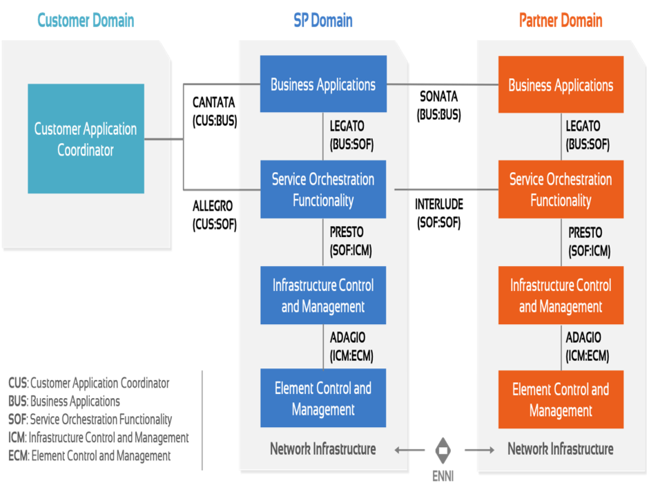
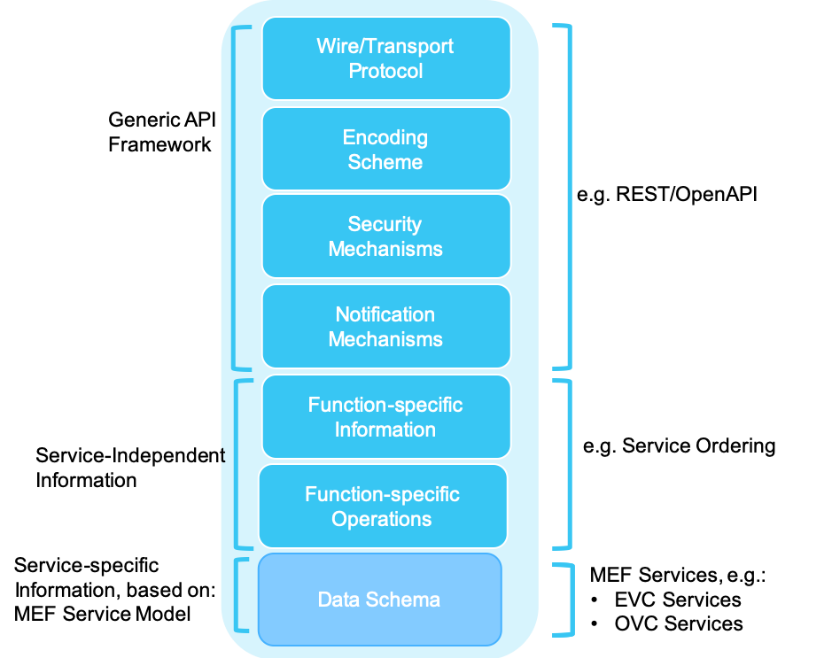
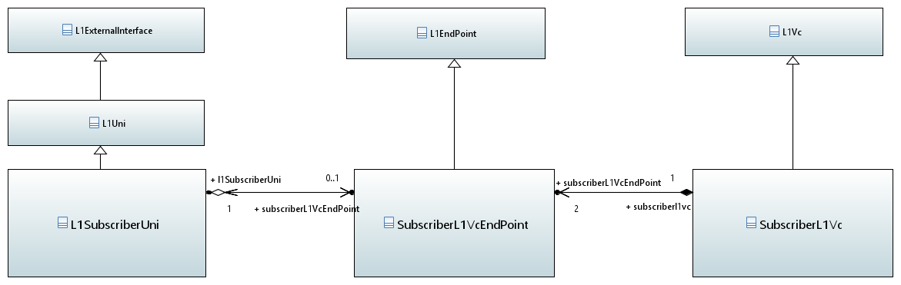
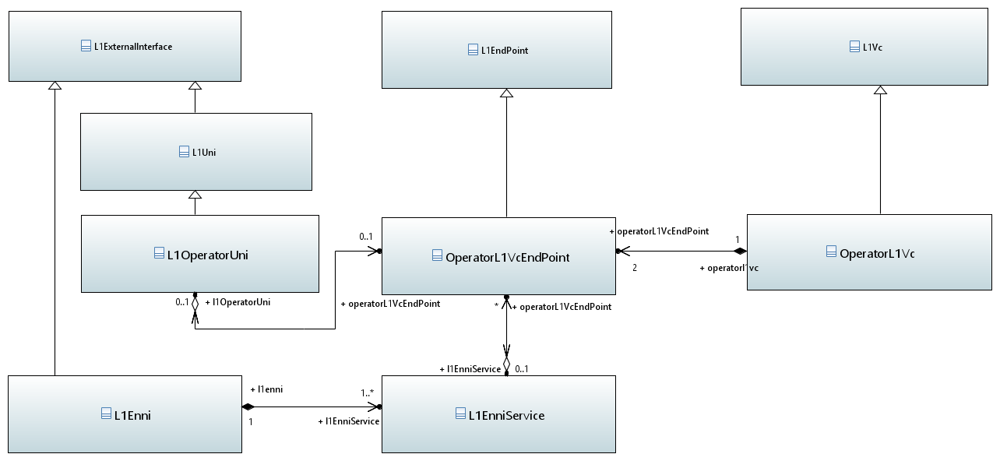
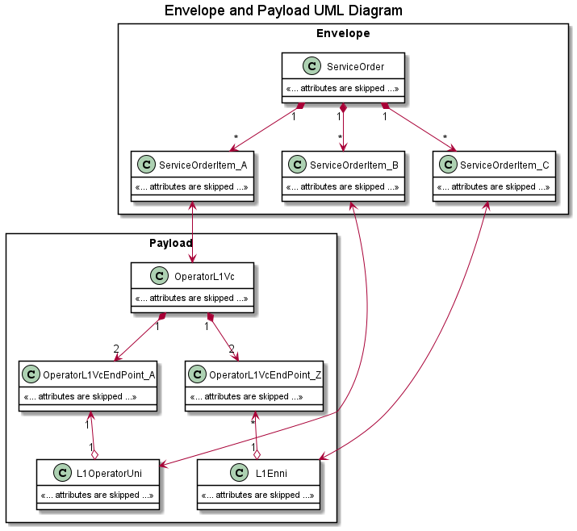
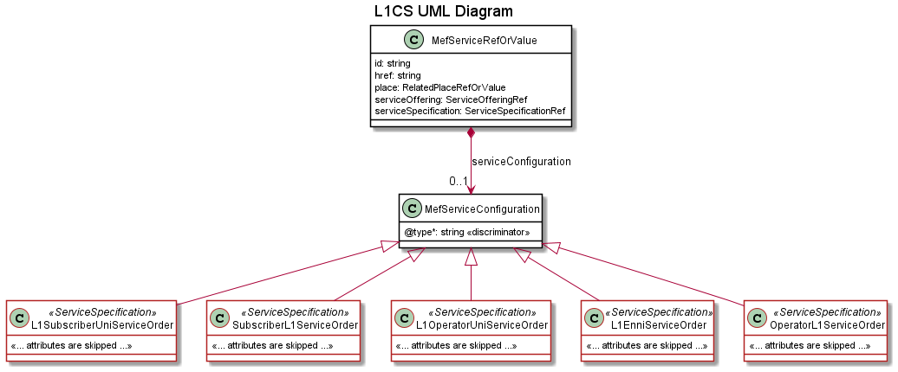
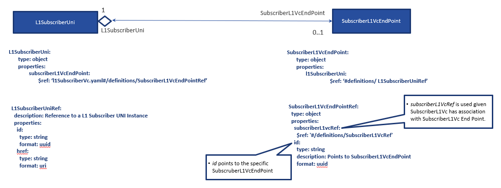
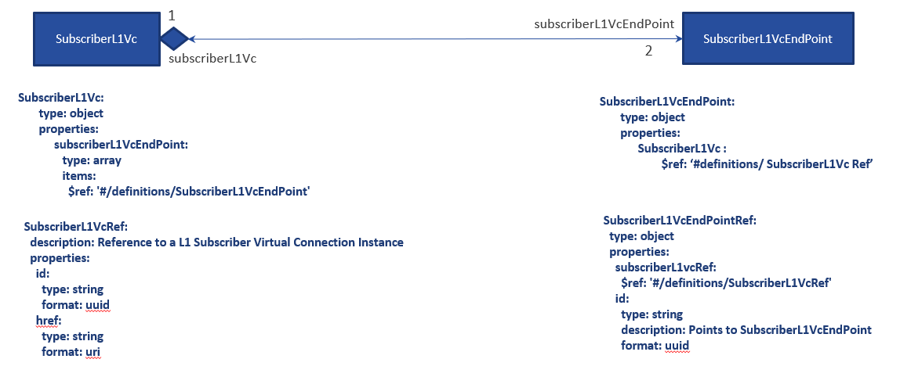
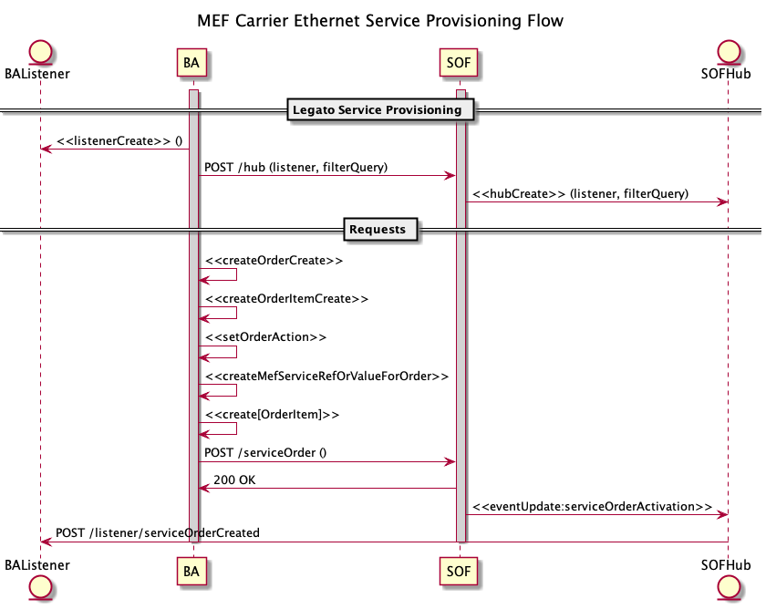

 <strong>Working Draft   MEF W103</strong> 

 

 <strong>LSO Legato Service Provisioning Specification-
 L1 Connectivity Service</strong> 

 <strong>April 2021</strong> 

 

 <strong>This draft represents MEF work in progress and is subject to change.</strong> 

Disclaimer
© MEF Forum 2021. All Rights Reserved.
 
The information in this publication is freely available for reproduction and use by any recipient and is believed to be accurate as of its publication date. Such information is subject to change without notice and MEF Forum (MEF) is not responsible for any errors. MEF does not assume responsibility to update or correct any information in this publication. No representation or warranty, expressed or implied, is made by MEF concerning the completeness, accuracy, or applicability of any information contained herein and no liability of any kind shall be assumed by MEF as a result of reliance upon such information.
The information contained herein is intended to be used without modification by the recipient or user of this document. MEF is not responsible or liable for any modifications to this document made by any other party.

The receipt or any use of this document or its contents does not in any way create, by implication or otherwise:

1. any express or implied license or right to or under any patent, copyright, trademark or trade secret rights held or claimed by any MEF member which are or may be associated with the ideas, techniques, concepts or expressions contained herein; nor
2. any warranty or representation that any MEF members will announce any product(s) and/or service(s) related thereto, or if such announcements are made, that such announced product(s) and/or service(s) embody any or all of the ideas, technologies, or concepts contained herein; nor
3. any form of relationship between any MEF member and the recipient or user of this document.

Implementation or use of specific MEF standards, specifications, or recommendations will be voluntary. This document is provided “as is” with no warranties whatsoever, express of implied, including without limitation, any warranties of merchantability, non-infringement, accuracy, completeness or fitness for any particular purpose. MEF and its members disclaim all liability, including liability for infringement of any proprietary rights, relating to use of information in this document.

 <strong>Table of Contents</strong> 

<!---Table Of Contents Here--->
- [1. List of Contributing Members](#1-list-of-contributing-members)
- [2. Abstract and Introduction](#2-abstract-and-introduction)
- [3. Terminology and Abbreviations](#3-terminology-and-abbreviations)
- [4. Overview of LSO-Legato](#4-overview-of-lso-legato)
- [5. Superclasses and Resources in support of Subscriber and Operator L1 Services](#5-superclasses-and-resources-in-support-of-subscriber-and-operator-l1-services)
- [6. Overview of Subscriber Layer 1 Services](#6-overview-of-subscriber-layer-1-services)
  - [6.1 Subscriber Layer 1 Service](#61-subscriber-layer-1-service)
- [7. Overview of Operator Layer 1 Service](#7-overview-of-operator-layer-1-service)
  - [7.1 Operator Layer 1 Service](#71-operator-layer-1-service)
- [8. Data Model Design Principles](#8-data-model-design-principles)
- [9. Data Models for Layer 1 Services](#9-data-models-for-layer-1-services)
  - [9.1. Service Order and Layer 1 Service Associations](#91-service-order-and-layer-1-service-associations)
  - [9.2. Organization and Structure of the JSON Schema](#92-organization-and-structure-of-the-json-schema)
    - [9.2.1 L1SubscriberUni-SubscriberL1VcEndPoint Relationship](#921-l1subscriberuni-subscriberl1vcendpoint-relationship)
    - [9.2.2 SubscriberL1Vc-SubscriberL1VcEndPoint Relationship](#922-subscriberl1vc-subscriberl1vcendpoint-relationship)
- [10. Layer 1 Service Superclass and Attributes](#10-layer-1-service-superclass-and-attributes)
  - [10.1 L1ExternalInterface Service Attributes](#101-l1externalinterface-service-attributes)
  - [10.2 L1Uni Service Attributes](#102-l1uni-service-attributes)
  - [10.3 L1EndPoint Service Attributes](#103-l1endpoint-service-attributes)
  - [10.4 L1Vc Service Attributes](#104-l1vc-service-attributes)
- [11. Subscriber Layer 1 Services](#11-subscriber-layer-1-services)
  - [11.1 L1SubscriberUni Service Attributes](#111-l1subscriberuni-service-attributes)
  - [11.2 L1SubscriberUniRef Service Attributes](#112-l1subscriberuniref-service-attributes)
  - [11.3 SubscriberL1VcEndPoint Service Attributes](#113-subscriberl1vcendpoint-service-attributes)
  - [11.4 SubscriberL1VcEndPointRef Service Attributes](#114-subscriberl1vcendpointref-service-attributes)
  - [11.5 SubscriberL1Vc Service Attributes](#115-subscriberl1vc-service-attributes)
  - [11.6 SubscriberL1VcRef Service Attributes](#116-subscriberl1vcref-service-attributes)
- [12. Operator Layer 1 Services](#12-operator-layer-1-services)
  - [12.1 L1OperatorUni Service Attributes](#121-l1operatoruni-service-attributes)
  - [12.2 L1OperatorUniRef Service Attributes](#122-l1operatoruniref-service-attributes)
  - [12.3 OperatorL1VcEndPoint Service Attributes](#123-operatorl1vcendpoint-service-attributes)
  - [12.4 OperatorL1VcEndPointRef Service Attributes](#124-operatorl1vcendpointref-service-attributes)
  - [12.5 OperatorL1Vc Service Attributes](#125-operatorl1vc-service-attributes)
  - [12.6 OperatorL1VcRef Service Attributes](#126-operatorl1vcref-service-attributes)
  - [12.7 L1Enni Service Attributes](#127-l1enni-service-attributes)
  - [12.8 L1EnniServiceRef Service Attributes](#128-l1enniserviceref-service-attributes)
  - [12.9 L1EnniService Service Attributes](#129-l1enniservice-service-attributes)
- [13. Common Resources](#13-common-resources)
  - [13.1 AdminState](#131-adminstate)
  - [13.2 OperationalState](#132-operationalstate)
  - [13.3 Identifier45](#133-identifier45)
  - [13.4 Integer](#134-integer)
  - [13.5 PositiveInteger](#135-positiveinteger)
  - [13.6 NaturalNumber](#136-naturalnumber)
  - [13.7 TimeAndDate](#137-timeanddate)
  - [13.8 TimeInterval](#138-timeinterval)
  - [13.9 TimeIntervalUnit](#139-timeintervalunit)
- [14. L1 Service Resources](#14-l1-service-resources)
  - [14.1 L1UniPhysicalLayer](#141-l1uniphysicallayer)
  - [14.2 L1NniPhysicalLayer](#142-l1nniphysicallayer)
  - [14.3 L1NniCodingFunction](#143-l1nnicodingfunction)
  - [14.4 OTUk Overhead](#144-otuk-overhead)
  - [14.5 HighOrderODUkOverhead](#145-highorderodukoverhead)
  - [14.6 PathOverhead](#146-pathoverhead)
  - [14.7 L1VcEndPointMap](#147-l1vcendpointmap)
  - [14.8 Time](#148-time)
  - [14.9 L1ServiceLevelSpecification](#149-l1servicelevelspecification)
  - [14.10 Sls1WDelayPerformanceMetric](#1410-sls1wdelayperformancemetric)
  - [14.11 Sls1wErroredSecondPerformanceMetric](#1411-sls1werroredsecondperformancemetric)
  - [14.12 Sls1wSeverelyErroredSecondPerformanceMetric](#1412-sls1wseverelyerroredsecondperformancemetric)
  - [14.13 Sls1wAvailabilityPerformanceMetric](#1413-sls1wavailabilityperformancemetric)
  - [14.14 Sls1wUnavailableSecondPerformanceMetric](#1414-sls1wunavailablesecondperformancemetric)
  - [14.15 ClientProtocol](#1415-clientprotocol)
  - [14.16 EnabledDisabled](#1416-enableddisabled)
  - [14.17 L1VcEndPointExternalInterfaceType](#1417-l1vcendpointexternalinterfacetype)
  - [14.18 Protection](#1418-protection)
  - [14.19 TributarySlotRate](#1419-tributaryslotrate)
  - [14.20 LineRate](#1420-linerate)
  - [14.21 L1UniCodingFunction](#1421-l1unicodingfunction)
  - [14.22 MultiplexingSequences](#1422-multiplexingsequences)
    - [14.22.1 HighOrderODU4MultiplexingSequences](#14221-highorderodu4multiplexingsequences)
    - [14.22.2 HighOrderODU3MultiplexingSequences](#14222-highorderodu3multiplexingsequences)
    - [14.22.3 HighOrderODU2And2EMultiplexingSequences](#14223-highorderodu2and2emultiplexingsequences)
    - [14.22.4 HighOrderODU1MultiplexingSequences](#14224-highorderodu1multiplexingsequences)
  - [14.23 L1UniOpticalInterfaceFunction](#1423-l1uniopticalinterfacefunction)
    - [14.23.1 Eth1000BaseXOpticalInterfaceFunction](#14231-eth1000basexopticalinterfacefunction)
    - [14.23.2 Eth10GBaseROpticalInterfaceFunction](#14232-eth10gbaseropticalinterfacefunction)
    - [14.23.3 Eth10GBaseWOpticalInterfaceFunction](#14233-eth10gbasewopticalinterfacefunction)
    - [14.23.4 Eth40GBaseROpticalInterfaceFunction](#14234-eth40gbaseropticalinterfacefunction)
    - [14.23.5 Eth100GBaseROpticalInterfaceFunction](#14235-eth100gbaseropticalinterfacefunction)
    - [14.23.6 Fc100OpticalInterfaceFunction](#14236-fc100opticalinterfacefunction)
    - [14.23.7 Fc200OpticalInterfaceFunction](#14237-fc200opticalinterfacefunction)
    - [14.23.8 Fc400OpticalInterfaceFunction](#14238-fc400opticalinterfacefunction)
    - [14.23.9 Fc800OpticalInterfaceFunction](#14239-fc800opticalinterfacefunction)
    - [14.23.10 Fc1200OpticalInterfaceFunction](#142310-fc1200opticalinterfacefunction)
    - [14.23.11 Fc1600OpticalInterfaceFunction](#142311-fc1600opticalinterfacefunction)
    - [14.23.12 Fc3200OpticalInterfaceFunction](#142312-fc3200opticalinterfacefunction)
    - [14.23.13 Stm1OpticalInterfaceFunction](#142313-stm1opticalinterfacefunction)
    - [14.23.14 Stm4OpticalInterfaceFunction](#142314-stm4opticalinterfacefunction)
    - [14.23.15 Stm16OpticalInterfaceFunction](#142315-stm16opticalinterfacefunction)
    - [14.23.16 Stm64OpticalInterfaceFunction](#142316-stm64opticalinterfacefunction)
    - [14.23.17 Stm256OpticalInterfaceFunction](#142317-stm256opticalinterfacefunction)
    - [14.23.18 Oc3OpticalInterfaceFunction](#142318-oc3opticalinterfacefunction)
    - [14.23.19 Oc12OpticalInterfaceFunction](#142319-oc12opticalinterfacefunction)
    - [14.23.20 Oc48OpticalInterfaceFunction](#142320-oc48opticalinterfacefunction)
    - [14.23.21 Oc192OpticalInterfaceFunction](#142321-oc192opticalinterfacefunction)
    - [14.23.22 Oc768OpticalInterfaceFunction](#142322-oc768opticalinterfacefunction)
  - [14.24 L1EnniOpticalInterfaceFunction](#1424-l1enniopticalinterfacefunction)
    - [14.24.1 Otu1OpticalInterfaceFunction](#14241-otu1opticalinterfacefunction)
    - [14.24.2 Otu2And2EOpticalInterfaceFunction](#14242-otu2and2eopticalinterfacefunction)
    - [14.24.3 Otu3OpticalInterfaceFunction](#14243-otu3opticalinterfacefunction)
    - [14.24.4 Otu4OpticalInterfaceFunction](#14244-otu4opticalinterfacefunction)
- [15. Legato Service Order for L1 Connectivity Services](#15-legato-service-order-for-l1-connectivity-services)
  - [15.1 Legato Envelope and Payload Association](#151-legato-envelope-and-payload-association)
- [16. References](#16-references)

# 1. List of Contributing Members

The following members of the MEF participated in the development of this document and have requested to be included in this list.

# 2. Abstract and Introduction

This MEF Standard consisting of this Develop Guide and its associated software artifacts (JSON Schemas) defines and describes the product-specific payload for the LSO-Legato API for the Layer 1 Connectivity Service. The document starts with an overview of LSO-Legato and the L1 Subscriber and Operator services. It then provides a basic information model for the MEF L1CS Attributes including tables of all of the Service Attributes supported by all of the Subscriber and Operator L1CS payloads along the the characteristics of each. The final sections describe the Data Model in both a technology-independent way and a technology-specific way focused on JSON. The JSON model, itself, is an independent software artifact.

This document can be thought of as a "developer's guide" for the API. MEF Services are described by a set of Service Attributes, specific information that is agreed between the provider and the user of the service, that describes some aspect of the service behavior or capability. The document the describes the Service Attributes used for Subscriber layer 1 and Operator layer 1 services. Subscriber layer 1 service attributes are defined in MEF 63 and Operatyr layer 1 service attributes are defined in MEF 64.

The following sections provide background on Lifecycle Services Orchestration and Layer 1 connectivity services. This is followed by an abbreviated information model that describes how the Service Attributes of MEF Layer 1 Connectivity Services are organized. A technology-independent overview of the data model is presented followed by an overview of the actual JSON Schemas. After this are tables of the Service Attributes that include the Service Attribute Name, JSON Name, description, the reference to the MEF standard and section, data type, and, when appropriate, validation notes that describe relationships between the various Service Attributes.

# 3. Terminology and Abbreviations

This section defines the terms used in this document. In many cases, the normative definitions to terms are found in other documents. In these cases, the third column is used to provide the reference that is controlling, in other MEF or external documents. If the reference includes an asterisk (*), the definition has been adapted from the original.   

<TABLE style="border:solid; border-width:1px; border-color:#aaaaaa; padding:4px;border-collapse: collapse; ">
<TR style="background-color:lightsalmon"><TD style="width:25%; text-align:center"><strong>Term</strong></TD><TD style="width:50%; text-align:center"><strong>Definition</strong></TD><td style="width:20%; text-align:center"><strong>Reference</strong></TD></TR>

<TR style="border-width: 1px; border-style: solid; border-color: grey">
<TD>Business Applications</TD>
<TD>The Service Provider functionality supporting Business Management Layer functionality (e.g., product catalog, ordering, billing, relationship management, etc.)</TD>
<TD style="text-align:center"><a href="https://wiki.mef.net/display/CESG/MEF+55+-+LSO+Reference+Architecture">MEF 55</a></TD></TR>

<TR style="border-width: 1px; border-style: solid; border-color: grey">
<TD>BUS</TD>
<TD>See <i>Business Applications</i></TD>
<TD style="text-align:center"><a href="https://wiki.mef.net/display/CESG/MEF+55+-+LSO+Reference+Architecture">MEF 55</a></TD></TR>

<TR style="border-width: 1px; border-style: solid; border-color: grey">
<TD>Business Functions</TD>
<TD>In the context of this document Business Functions refer to <em>Preorder Qualification (POQ)</em>, <em>Order</em>, <em>Quote</em>, and <em>Inventory</em>.</TD>
<TD style="text-align:center">This Document</TD></TR>

<TR style="border-width: 1px; border-style: solid; border-color: grey">
<TD>Inventory</TD>
<TD>See <i>Product Inventory</i></TD>
<TD style="text-align:center">xxx</TD></TR>

<TR style="border-width: 1px; border-style: solid; border-color: grey">
<TD>L1 ENNI</TD>
<TD><i>Layer 1 External Network Network Interface.</i></TD>
<TD style="text-align:center"><a href="https://wiki.mef.net/display/CESG/MEF+64+-+Operator+Layer+1+Service+Attributes+and+Services">MEF 64</a></TD></TR>

<TR style="border-width: 1px; border-style: solid; border-color: grey">
<TD> L1 Operator</TD>
<TD><i>An organization with administrative control over a net-work and which provides services to an L1 Super Op-erator or to an L1 Service Provider.</i></TD>
<TD style="text-align:center"><a href="https://wiki.mef.net/display/CESG/MEF+64+-+Operator+Layer+1+Service+Attributes+and+Services">MEF 64</a></TD></TR>

<TR style="border-width: 1px; border-style: solid; border-color: grey">
<TD> L1 Service</TD>
<TD><i>A connectivity service which delivers Layer 1 Charac-teristic Information that is specified using Service At-tributes as defined in a MEF Specification.</i></TD>
<TD style="text-align:center"><a href="https://wiki.mef.net/display/CESG/MEF+63+-+Subscriber+Layer+1+Service+Attributes">MEF 63</a></TD></TR>

<TR style="border-width: 1px; border-style: solid; border-color: grey">
<TD> L1 Subscriber</TD>
<TD><i>A The end-user of a Subscriber Layer 1 Service.</i></TD>
<TD style="text-align:center"><a href="https://wiki.mef.net/display/CESG/MEF+63+-+Subscriber+Layer+1+Service+Attributes">MEF 63</a></TD></TR>

<TR style="border-width: 1px; border-style: solid; border-color: grey">
<TD> L1 UNI</TD>
<TD><i>Layer 1 User Network Interface.</i></TD>
<TD style="text-align:center"><a href="https://wiki.mef.net/display/CESG/MEF+63+-+Subscriber+Layer+1+Service+Attributes">MEF 63</a></TD></TR>

<TR style="border-width: 1px; border-style: solid; border-color: grey">
<TD> L1 Virtual Connec-tion</TD>
<TD><i>An association of two Layer 1 Virtual Connection End Points that limits the transport of Layer 1 Characteris-tic Information between those Layer 1 Virtual Connec-tion End Points.</i></TD>
<TD style="text-align:center"><a href="https://wiki.mef.net/display/CESG/MEF+63+-+Subscriber+Layer+1+Service+Attributes">MEF 63</a></TD></TR>

<TR style="border-width: 1px; border-style: solid; border-color: grey">
<TD> Layer 1 External Network Network Interface</TD>
<TD><i>The demarcation point marking the boundary of re-sponsibility between two L1 Operators whose net-works are operated as separate administrative domains.</i></TD>
<TD style="text-align:center"><a href="https://wiki.mef.net/display/CESG/MEF+64+-+Operator+Layer+1+Service+Attributes+and+Services">MEF 64</a></TD></TR>

<TR style="border-width: 1px; border-style: solid; border-color: grey">
<TD> Operator</TD>
<TD><i>Used within this Standard for brevity when referring to an L1 Operator.</i></TD>
<TD style="text-align:center"><a href="https://wiki.mef.net/display/CESG/MEF+64+-+Operator+Layer+1+Service+Attributes+and+Services">MEF 64</a></TD></TR>

<TR style="border-width: 1px; border-style: solid; border-color: grey">
<TD> Operator Layer 1 Service</TD>
<TD><i>A connectivity service provided by an Operator to an L1 Super Operator or to a Service Provider that deliv-ers Layer 1 Characteristic Information between two External Interfaces where at least one External Inter-face is an L1 ENNI, specified using the Service Attrib-utes in this Standard.</i></TD>
<TD style="text-align:center"><a href="https://wiki.mef.net/display/CESG/MEF+64+-+Operator+Layer+1+Service+Attributes+and+Services">MEF 64</a></TD></TR>

<TR style="border-width: 1px; border-style: solid; border-color: grey">
<TD>Order Item</TD>
<TD>An orderable item that has its own action and lifecycle and is part of an Order. It can relate to the other items within the same Order.</TD>
<TD style="text-align:center"><a href="https://wiki.mef.net/display/CESG/MEF+57.1+-+Ethernet+Ordering+Business+Requirements+and+Use+Cases">MEF 57.1</a></TD></TR>

<TR style="border-width: 1px; border-style: solid; border-color: grey">
<TD>Partner</TD>
<TD>An organization providing Products and Services to the Service Provider in order to allow the Service Provider to instantiate and manage Service Components external to the Service Provider domain.</TD>
<TD style="text-align:center"><a href="https://wiki.mef.net/display/CESG/MEF+55+-+LSO+Reference+Architecture">MEF 55</a></TD></TR>

<TR style="border-width: 1px; border-style: solid; border-color: grey">
<TD>Product Inventory</TD>
<TD>The inventory managed by the seller resulting from Product Order completion.</TD>
<TD style="text-align:center"><a href="https://wiki.mef.net/display/CESG/MEF+81+-+LSO+Product+Inventory+Requirements+and+Use+Cases">MEF 81</a></TD></TR>

<TR style="border-width: 1px; border-style: solid; border-color: grey">
<TD>POQ</TD>
<TD>See *Product Offering Qualification*</TD>
<TD style="text-align:center"><a href="https://wiki.mef.net/display/CESG/MEF+79+-+LSO+Product+Serviceability+Requirements+and+Use+Cases">MEF 79</a></TD></TR>

<TR style="border-width: 1px; border-style: solid; border-color: grey">
<TD>Product Offering Qualification</TD>
<TD>One or more Product Offering Qualification Items formulated into a requirement made by a Buyer to a Seller.</TD>
<TD style="text-align:center"><a href="https://wiki.mef.net/display/CESG/MEF+79+-+LSO+Product+Serviceability+Requirements+and+Use+Cases">MEF 79</a></TD></TR>

<TR style="border-width: 1px; border-style: solid; border-color: grey">
<TD>Product Offering Qualification Item</TD>
<TD>An individual article included in a POQ that describes a Product of a particular type (Product Offering).  The objective is to determine if it is feasible for the Seller to deliver this item as described and for the Seller to inform the Buyer of the estimated time interval to complete this delivery. </TD>
<TD style="text-align:center"><a href="https://wiki.mef.net/display/CESG/MEF+79+-+LSO+Product+Serviceability+Requirements+and+Use+Cases">MEF 79</a></TD></TR>

<TR style="border-width: 1px; border-style: solid; border-color: grey">
<TD>Seller</TD>
<TD>A Service Provider or a Partner who is providing service to a Buyer. For the purposes of this document, a Seller is the Partner document who is providing the product to the Buyer.</TD>
<TD style="text-align:center"><a href="https://wiki.mef.net/display/CESG/MEF+57.1+-+Ethernet+Ordering+Business+Requirements+and+Use+Cases">MEF 57.1</a></TD></TR>

<TR style="border-width: 1px; border-style: solid; border-color: grey">
<TD>Service Attribute</TD>
<TD>Specific information that is agreed between the provider and the user of the service, that describes some aspect of the service behavior or capability.</TD>
<TD style="text-align:center"><a href="https://wiki.mef.net/display/CESG/MEF+10.4+-+Subscriber+Ethernet+Service+Attributes">MEF 10.4</a></TD></TR>

<TR style="border-width: 1px; border-style: solid; border-color: grey">
<TD>Service Provider</TD>
<TD>In the context of this document, a Service Provider is an Ethernet Service Provider.</TD>
<TD style="text-align:center">This Document</TD></TR>

<TR style="border-width: 1px; border-style: solid; border-color: grey">
<TD>Sonata</TD>
<TD> The Management Interface Reference Point supporting the management and operations interactions (e.g., ordering, billing, trouble management, etc.) between two network providers (e.g., Service Provider Domain and Partner Domain). For example, the Service Provider Business Applications may use Sonata to place an order to a Partner provider for an access service that is needed as a part of an end-to-end Connectivity Service. Since cross domain interactions are supported, additional security considerations need to be addressed on this Management Interface Reference Point.</TD>
<TD style="text-align:center"><a href="https://wiki.mef.net/display/CESG/MEF+55+-+LSO+Reference+Architecture">MEF 55</a></TD></TR>

<TR style="border-width: 1px; border-style: solid; border-color: grey">
<TD>Subscriber</TD>
<TD>In the context of this document, the end-user of an Ethernet Service.</TD>
<TD style="text-align:center"><a href="https://wiki.mef.net/display/CESG/MEF+10.4+-+Subscriber+Ethernet+Service+Attributes">MEF 10.4  *</a></TD></TR>

</TABLE>

# 4. Overview of LSO-Legato

[MEF 55](https://wiki.mef.net/display/CESG/MEF+55+-+LSO+Reference+Architecture) describes the Reference Architecture for Lifecycle Service Orchestration (LSO) of MEF-defined connectivity services. MEF 55 defines seven LSO Reference Points that are abstract interconnection points between different domains - either within the service provider domain (intra-domain) or between service provider and other business entities (inter-domain). One of these LSO Reference Points is LSO Legato which defines the abstract boundary point between a Service Provider's or Partner's Business Application (BA) and Service Orchestration Functionality (SOF) for providing connectivity services provisioning.

|  |
|:--:|
| <i>Figure 1 - LSO Reference Architecture</i> |

The access to automated service provisioning functionality is provided using the Service Provisioning API at LSO Legato. LSO Legato provides a suite of APIs for provisioning, inventory, performance management which are standardized by MEF as LSO Legato APIs, and which are made available by MEF in a series of releases of the LSO Legato SDK.

The LSO Legato APIs comprise two parts: one is the service-independent functionality, or Basic API Structure, and the second is the service-specific payload, or Information Payload, as shown in diagram below.

|  |
|:--:|
| <i>Figure 2 - TMForum API Envelope/MEF Payload</i> |

This document defines the service-specific payload, shown as Data Model in the figure above, specifically for a MEF 3.0 Subscriber and Operator Layer 1 services as defined in [MEF 63](https://wiki.mef.net/display/CESG/MEF+63+-+Subscriber+Layer+1+Service+Attributes) and [MEF 64](https://wiki.mef.net/display/CESG/MEF+64+-+Operator+Layer+1+Service+Attributes+and+Services).

# 5. Superclasses and Resources in support of Subscriber and Operator L1 Services

There are common attributes shared between each of the three main resources across Subscriber and Operator L1 services. The MEF Service Model Information Model - L1CS [[MEF 111]](https://www.mef.net/resources/mef-111-mef-services-model-information-model-for-layer-1-connectivity-service/) defines four super classes:

- L1ExternalInterface
- L1EndPoint
- L1Vc
- L1Uni

The inherited relationship between the Subscriber and Operator L1 Service objects and the respective superclasses are described later in this document. The inheritence relationship in the information model is mapped to the schema using the 'allOf' keyword.

# 6. Overview of Subscriber Layer 1 Services

## 6.1 Subscriber Layer 1 Service

A Subscriber Layer 1 Service is built on an Subscriber L1 Virtual Connection(VC) which is an association of L1 Subscriber UNIs (actually it is an association of Subscriber L1 End Points, however each Subscriber L1 End Point is associated with a UNI, so externally the Subscriber L1 VC looks like an association of UNIs). Subscriber Layer 1 Service and their Service Attributes are described in [MEF 63](https://wiki.mef.net/display/CESG/MEF+63+-+Subscriber+Layer+1+Service+Attributes) and it provides only point-to-point service.

|  |
|:--:|
| <i>Figure 3 - Subscriber L1cs Service Model</i> |

A L1 Subscriber UNI is a subclass of abstract class, L1Uni. L1Uni is a subclass of L1ExternalInterface. SubscriberL1EndPoint is a subclass of L1EndPoint. SubscriberL1Vc is subclass of L1Vc. The corresponding schema leverage the 'allOf' keyword in order to support polymorphism. 

# 7. Overview of Operator Layer 1 Service

## 7.1 Operator Layer 1 Service

An Operator Layer 1 Service is built on an Operator L1 Virtual Connection. An Operator L1VC has an association with two Operator L1 End Points. Operator Layer 1 Services and their Service Attributes are described in [MEF 64](https://wiki.mef.net/display/CESG/MEF+64+-+Operator+Layer+1+Service+Attributes+and+Services). As with Subscriber Layer 1 Services, Operator L1 Service provides only point-to-point service.

|  |
|:--:|
| <i>Figure 4 - Operator L1cs Service Model</i> |

Each of Operator Layer 1 Service main classes are sub-classed from a parent class that holds common attributes that are used by similar class in the Subscriber Layer 1 Service. The main Operator L1 Service classes are L1OperatorUni, OperatorL1VcEndPoint, OperatorL1Vc, L1Enni and L1EnniService. The superclasses are L1ExternalInterface, L1EndPoint, L1Vc and L1Uni. 

The Network Operators connect to each at ENNIs and each Operator L1VC delivers OTUk Frames between the UNIs and ENNIs, within the Network Operator's footprint. So, whereas an Subscriber L1 Service associates a set of L1UNIs, an Operator Layer 1 Service associatesone or two E-NNIs and zero or one UNI.

# 8. Data Model Design Principles

The design for the API Schema is based on a number of assumptions

1. The requirements for which attributes are necessary at Service Order, Inventory and other APIs in future will use the same schemas.  Specifically, there currently are not separated schemas for each functional area.

2. A service order must support multiple service order items.  A service order item includes L1SubscriberUni, SubscriberL1EvcEndPoint and SubscriberL1Vc for Subscriber Layer 1 Services.  A service order item includes L1OperatorUni, L1EnniService, OperatorL1VcEndPoint and OperatorL1Vc for Operator Layer 1 Services.

3. The common resources are stored in a Layer 1 Service Common schema and is available for both Subscriber and Operator Layer 1 Service schemas.

4. The use of common attributes are supported using superclasses in an information model. Analogously, the schemas support polymorphism using the 'allOf' keyword in the schemas.

5. For the main resources in both the Subscriber Layer 1 and Operator Layer 1 Service schemas there exists two-way relationships.  The reference pattern detailed later in the document is used.

# 9. Data Models for Layer 1 Services

The Legato API is based on the TMForum API format approach with a service-agnostic envelope and a service-specific payload. The envelope part of the API defines service agnostic Order Items. The payload part of the API defines service specific resources.

## 9.1. Service Order and Layer 1 Service Associations

The Layer 1 Service resources for both Subscriber and Operator Layer 1 Services are positioned in the payload. The association between the Legato Service Order Envelope Service Order Items and the Layer 1 Services resources is illustrated in the figure below.

<i>Figure 5 - Legato Service Order Envelope/MEF Payload Association</i>

The developer will make the association between an Envelope Service Order Item and a specific Layer 1 resource by instantiating a sub-classed MefServiceConfiguration. Sub-classed MefServiceConfiguration objects or resources include the set of Subscriber Layer 1 and Operator Layer 1 Service objects (resources).

The envelope has two main objects, Service Order and Service Order Item. A Service Order can have one or many Service Order Items. The payload depends on the specific Layer 1 service intending to be activated.

<i>Figure 6 - Legato Service Order Envelope/MEF Payload Association</i>

## 9.2. Organization and Structure of the JSON Schema

The organization and structure of the Schemas are in the following directory structure including schema file names:

spec/legato:

- l1CsCommon.yaml
- l1Enni.yaml
- l1OperatorUni.yaml
- l1OperatorVc.yaml
- l1Sls.yaml
- l1SubscriberUni.yaml
- l1SubscriberVc.yaml
  
### 9.2.1 L1SubscriberUni-SubscriberL1VcEndPoint Relationship

The following section discusses the mapping of the information model object relationship between L1 Subscriber Uni and Subscriber L1Vc EndPoint to the schema.

|  |
|:--:|
| <i>Figure 7 - L1SubscriberUni:SubscriberL1VcEndPoint Relationship</i> |

### 9.2.2 SubscriberL1Vc-SubscriberL1VcEndPoint Relationship

The following section discusses the mapping of the information model object relationship between SubscriberL1Vc and SubscriberL1VcEndPoint End Point to the schema.

|  |
|:--:|
| <i>Figure 8 - SubscriberL1Vc:SubscriberL1VcEndPoint Relationship</i> |
NOTE: Similar relationships and corresponding mappings exist for Operator Layer 1 Services and corresponding objects/resources.

# 10. Layer 1 Service Superclass and Attributes

The following section defines the set of superclasses that are used by the Layer 1 services. The superclass resource with associated attributes defined are:

- L1ExternalInterface Service Attributes,
- L1Uni Service Attributes,
- L1EndPoint Service Attributes,
- L1Vc Service Attributes
  
These are superclasses in support of L1SubscriberUni, SubscriberL1VcEndPoint, SubscriberL1Vc, L1OperatorUni, L1Enni, OperatorL1VcEndPoint and OperatorL1Vc which are detailed later in the document.

## 10.1 L1ExternalInterface Service Attributes

The L1ExternalInterface represents the physical interface used for L1 services. It contains the common attributes of L1Uni and L1Enni.

Name | Type | Description | Notes
------------ | ------------- | ------------- | -------------
**admininstrativeState** | [**AdminState**](AdminState.md) |  | [optional] [default to null]
**operationalState** | [**OperationalState**](OperationalState.md) |  | [optional] [default to null]

## 10.2 L1Uni Service Attributes

The L1Uni represents the physical interface used for L1 services with common attributes. This is an abstract class and the superclass of L1SubscriberUni and L1OperatorUni. It contains the common attributes of L1SubscriberUni and L1OperatorUni not included in L1ExternalInterface superclass.

Name | Type | Description | Notes
------------ | ------------- | ------------- | -------------
**physicalLayer** | [**L1UniPhysicalLayer**](L1UniPhysicalLayer.md) |  | [optional] [default to null]
**admininstrativeState** | [**AdminState**](AdminState.md) |  | [optional] [default to null]
**operationalState** | [**OperationalState**](OperationalState.md) |  | [optional] [default to null]

## 10.3 L1EndPoint Service Attributes

The L1EndPoint represents the Subscriber L1 End Point or the Operator L1 End Point. This is an abstract class and the superclass of SubscriberL1VcEndPoint and OperatorL1VcEndPoint.  It contains the common attributes of SubscriberL1EndPoint and OperatorL1EndPoint.

Name | Type | Description | Notes
------------ | ------------- | ------------- | -------------
**administrativeState** | [**AdminState**](AdminState.md) |  | [optional] [default to null]
**operationalState** | [**OperationalState**](OperationalState.md) |  | [optional] [default to null]

## 10.4 L1Vc Service Attributes

The L1Vc represents the SubscriberL1Vc or Operator L1Vc. This is an abstract class and the superclass of SubscriberL1Vc and OperatorL1Vc. It contains the common attributes of SubscriberL1Vc and OperatorL1Vc classes

Name | Type | Description | Notes
------------ | ------------- | ------------- | -------------
**administrativeState** | [**AdminState**](AdminState.md) |  | [optional] [default to null]
**operationalState** | [**OperationalState**](OperationalState.md) |  | [optional] [default to null]
**l1ServiceLevelSpecification** | [**L1ServiceLevelSpecification**](L1ServiceLevelSpecification.md) |The Subscriber L1VC Service Level Specification (SLS) Service Attribute is the technical specification of aspects of the service performance agreed to by the Service Provider and Subscriber. Reference MEF 63 Section 8.2.3 and MEF 64 Section 8.4.3 Operator L1VC Service Level Specification Service Attribute.| [optional] [default to null]

# 11. Subscriber Layer 1 Services

The following section provides the resources and corresponding attributes in support of Subscriber Layer 1 Service.  The three main resources are:

- L1SubscriberUni Service Attributes
- SubscriberL1VcEndPoint Service Attributes
- SubscriberL1Vc Service Attributes

## 11.1 L1SubscriberUni Service Attributes

The UNI is the physical demarcation point between the responsibility of the L1 Service Provider and the responsibility of the L1 Subscriber. Reference MEF 63 Section 8.

Name | Type | Description | Notes
------------ | ------------- | ------------- | -------------
**identifier** | [**Identifier45**](Identifier45.md) | The value of the UNI ID Service Attribute is a string that is used to allow Subscriber and Service Provider to uniquely identify the UNI. Reference MEF 63 Section 8.1.1 UNI ID Service Attribute. | [optional] [default to null]
**subscriberL1VcEndPoint** | [**SubscriberL1VcEndPointRef**](SubscriberL1VcEndPoint.md) |  SubscriberL1VcEndPoint association to  L1SubscriberUni. | [optional] [default to null]
**administrativeState** | [**AdminState**](AdminState.md) |  | [optional] [default to null]
**operationalState** | [**OperationalState**](OperationalState.md) |  | [optional] [default to null]

## 11.2 L1SubscriberUniRef Service Attributes

Pointer to L1SubscriberUniRef resource.

Name | Type | Description | Notes
------------ | ------------- | ------------- | -------------
**href** | [**URI**](URI.md) |  | [optional] [default to null]
**id** | [**UUID**](UUID.md) |  | [optional] [default to null]

## 11.3 SubscriberL1VcEndPoint Service Attributes

A Subscriber L1VC End Point is a logical entity at a given UNI that is associated with L1CI passing over that UNI. Reference MEF 63 Section 8.3.

Name | Type | Description | Notes
------------ | ------------- | ------------- | -------------
**identifier** | [**Identifier45**](Identifier45.md) |The value of the Subscriber L1VC End Point identifier Service Attribute is a string that is used to allow the Subscriber and Service Provider to uniquely identify the Subscriber L1VC End Point. Reference MEF 63 Section 8.3.1.| [optional] [default to null]
**l1SubscriberUni** | [**L1SubscriberUniRef**](L1SubscriberUni.md) |L1SubscriberUni association to SubscriberL1VcEndPoint.| [optional] [default to null]
**subscriberL1Vc** | [**SubscriberL1VcRef**](SubscriberL1VcRef.md) |SubscriberL1Vc association to SubscriberL1VcEndPoint.| [optional] [default to null]
**administrativeState** | [**AdminState**](AdminState.md) |  | [optional] [default to null]
**operationalState** | [**OperationalState**](OperationalState.md) |  | [optional] [default to null]

## 11.4 SubscriberL1VcEndPointRef Service Attributes

Pointer to SubscriberL1VcEndPointRef resource.

Name | Type | Description | Notes
------------ | ------------- | ------------- | -------------
**subscriberL1vcRef** | [**URI**](URI.md) |  | [optional] [default to null]
**id** | [**UUID**](UUID.md) |  | [optional] [default to null]

## 11.5 SubscriberL1Vc Service Attributes

A subscriber L1VC represents the logical attachment of a Subscriber L1VC to two SubscriberL1VCEndPoint. Reference MEF 63 Section 8.2.

Name | Type | Description | Notes
------------ | ------------- | ------------- | -------------
**identifier** | [**Identifier45**](Identifier45.md) | The value of the Subscriber L1VC ID service attribute is a string that is used to identify the Subscriber L1VC within the service provider network. Reference MEF 63 Section 8.2.1.. | [optional] [default to null]
**subscriberL1VcEndPoint** | [**List**](SubscriberL1VcEndPoint.md) | SubscriberL1VC association to SubscriberL1VcEndPoint.. | [optional] [default to null]
**administrativeState** | [**AdminState**](AdminState.md) |  | [optional] [default to null]
**operationalState** | [**OperationalState**](OperationalState.md) |  | [optional] [default to null]
**l1ServiceLevelSpecification** | [**L1Sls**](L1Sls.md) | The Subscriber L1VC Service Level Specification (SLS) Service Attribute is the technical specification of aspects of the service performance agreed to by the Service Provider and Subscriber. Reference MEF 63 Section 8.2.3 and MEF 64 Section 8.4.3 Operator L1VC Service Level Specification Service Attribute. | [optional] [default to null]

## 11.6 SubscriberL1VcRef Service Attributes

Pointer to SubscriberL1VcRef resource.

Name | Type | Description | Notes
------------ | ------------- | ------------- | -------------
**href** | [**URI**](URI.md) |  | [optional] [default to null]
**id** | [**UUID**](UUID.md) |  | [optional] [default to null]

# 12. Operator Layer 1 Services

The following section provides the resources and corresponding attributes in support of Operator Layer 1 Services.  The five main resources are:

- L1OperatorUni Service Attributes
- OperatorL1VcEndPoint Service Attributes
- OperatorL1Vc Service Attributes
- L1Enni Service Attributes
- L1EnniService Service Attributes

## 12.1 L1OperatorUni Service Attributes

The L1 Operator UNI Service Attribute values are agreed to by the SP/SO and the Operator.

Name | Type | Description | Notes
------------ | ------------- | ------------- | -------------
**identifier** | [**Identifier45**](Identifier45.md) | An identifier for the UNI intended for SP/SO and Operator to uniquely identify the UNI. Reference MEF 64 Section 8.3.1 Operator UNI Identifier Service Attribute. | [optional] [default to null]
**operatorL1VcEndPoint** | [**OperatorL1VcEndPointRef**](OperatorL1VcEndPointRef.md) | Attribute pointing Operator L1VCEnd Point. | [optional] [default to null]
**physicalLayer** | [**L1UniPhysicalLayer**](.md) |  | [optional] [default to null]
**administrativeState** | [**AdminState**](AdminState.md) |  | [optional] [default to null]
**operationalState** | [**OperationalState**](OperationalState.md) |  | [optional] [default to null]

## 12.2 L1OperatorUniRef Service Attributes

Pointer to L1OperatorUniRef resource.

Name | Type | Description | Notes
------------ | ------------- | ------------- | -------------
**href** | [**URI**](URI.md) |  | [optional] [default to null]
**id** | [**UUID**](UUID.md) |  | [optional] [default to null]

## 12.3 OperatorL1VcEndPoint Service Attributes

An Operator L1VC End Point represents the logical attachment of an Operator L1VC to an EI. Reference MEF 64 Section 8.5 Operator L1VC End Point Service Attributes.

Name | Type | Description | Notes
------------ | ------------- | ------------- | -------------
**identifier** | [**Identifier45**](Identifier45.md) | An identifier for the Operator L1VC End Point is a string that is used to allow the SP/SO and operator to uniquely identify the Operator L1VC End Point. Reference MEF 64 Section 8.5.1 Operator L1VC End Point Identifier Service Attribute. | [optional] [default to null]
**l1VcEndPointMap** | [**L1VcEndPointMap**](L1VcEndPointMap.md) | The L1VC End Point Map specifies which bits that cross the ENNI are mapped to and from the Operator L1VC End Point and Tributary Slot rate. The L1VC End Point Map is empty when the Operator L1VC End Point is associated with UNI. Reference MEF 64 Section 8.5.4 Operator L1VC End Point Map Service Attribute. | [optional] [default to null]
**l1EnniService** | [**L1EnniServiceRef**](L1EnniService.md) | Attribute pointing L1EnniService. | [optional] [default to null]
**l1OperatorUni** | [**L1OperatorUniRef**](L1OperatorUni.md) | Attribute pointing L1 Operator UNI. | [optional] [default to null]
**operatorL1Vc** | [**OperatorL1VcRef**](OperatorL1VcRef.md) | Attribute pointing Operator L1Vc. | [optional] [default to null]
**administrativeState** | [**AdminState**](AdminState.md) |  | [optional] [default to null]
**operationalState** | [**OperationalState**](OperationalState.md) |  | [optional] [default to null]

## 12.4 OperatorL1VcEndPointRef Service Attributes

Pointer to OperatorL1VcEndPointRef resource.

Name | Type | Description | Notes
------------ | ------------- | ------------- | -------------
**operatorL1VcRef** | [**URI**](URI.md) |  | [optional] [default to null]
**id** | [**UUID**](UUID.md) |  | [optional] [default to null]

## 12.5 OperatorL1Vc Service Attributes

An Operator L1VC is an association of two Operator L1VC End Points. Reference MEF 64 Section 8.4 Operator L1VC Service Attributes

Name | Type | Description | Notes
------------ | ------------- | ------------- | -------------
**identifier** | [**Identifier45**](Identifier45.md) | An identifier for the Operator L1VC is a string that is used to allow the SP/SO and operator to uniquely identify an Operator L1VC. Reference MEF 64 Section 8.4.1 Operator L1VC Identifier Service Attribute. | [optional] [default to null]
**operatorL1VcEndPoint** | [**List**](OperatorL1VcEndPoint.md) | Attribute pointing Operator L1VC End Point class. | [optional] [default to null]
**l1ServiceLevelSpecification** | [**L1Sls**](L1Sls.md) | The Subscriber L1VC Service Level Specification (SLS) Service Attribute is the technical specification of aspects of the service performance agreed to by the Service Provider and Subscriber. Reference MEF 63 Section 8.2.3 and MEF 64 Section 8.4.3 Operator L1VC Service Level Specification Service Attribute. | [optional] [default to null]
**administrativeState** | [**AdminState**](AdminState.md) |  | [optional] [default to null]
**operationalState** | [**OperationalState**](OperationalState.md) |  | [optional] [default to null]

## 12.6 OperatorL1VcRef Service Attributes

Pointer to OperatorL1VcRef resource.

Name | Type | Description | Notes
------------ | ------------- | ------------- | -------------
**href** | [**URI**](URI.md) |  | [optional] [default to null]
**id** | [**UUID**](UUID.md) |  | [optional] [default to null]

## 12.7 L1Enni Service Attributes

The L1 ENNI class controls Operator Network behaviors that enable Operator Networks to be interconnected and exchanged OTUk frames. The interconnection is achieved by the Operators
agreeing on the value for each ENNI attributes. Reference MEF 64 Section 8.1 ENNI Common Attributes.

Name | Type | Description | Notes
------------ | ------------- | ------------- | -------------
**peeringIdentifier** | [**Identifier45**](Identifier45.md) | The ENNI Peering Identifier value is a string used to allow the Operators at ENNI to uniquely identify the ENNI. Reference MEF 64 Section 8.1.1 ENNI Peering Identifier Common Attribute.| [optional] [default to null]
**listOfPhysicalLayer** | [**L1NniPhysicalLayer**](L1NniPhysicalLayer.md) | The list of coding function and wavelength structure supporting the ENNI. Reference MEF 64 Section 8.1.2 ENNI List of Physical Layers Common Attribute. | [optional] [default to null]
**protection** | [**Protection**](Protection.md) | The protection protocol deployed at ENNI for the ODU container exchanged by the Operator. Reference MEF 64 Section 8.1.3 ENNI Protection Common Attribute. | [optional] [default to null]
**l1EnniService** | [**L1EnniService**](L1EnniService.md) | Attribute pointing to L1ENNIService. | [optional] [default to null]
**administrativeState** | [**AdminState**](AdminState.md) |  | [optional] [default to null]
**operationalState** | [**OperationalState**](OperationalState.md) |  | [optional] [default to null]

## 12.8 L1EnniServiceRef Service Attributes

Pointer to L1EnniServiceRef resource.

Name | Type | Description | Notes
------------ | ------------- | ------------- | -------------
**href** | [**URI**](URI.md) |  | [optional] [default to null]
**id** | [**UUID**](UUID.md) |  | [optional] [default to null]

## 12.9 L1EnniService Service Attributes

For each instance of an ENNI, there are multiple sets of ENNI Service Attributes. The value for
each ENNI Service Attribute in a set for an Operator network is specific to the SP/SO that is
using the ENNI. Reference MEF 64[6] Section 8.2 ENNI Service Attributes.

Name | Type | Description | Notes
------------ | ------------- | ------------- | -------------
**peeringIdentifier** | [**Identifier45**](Identifier45.md) | The Operator ENNI Identifier Service Attribute value is a string used to allow the SP/SO and Operator to uniquely identify the ENNI. Reference MEF 64 Section 8.2.1 Operator ENNI Identifier Service Attribute| [optional] [default to null]
**multiplexingCapabilityList** | [**MultiplexingSequences**](MultiplexingSequences.md) | The multiplexing capability list indicates the list of operator's ability to multiplex a given LO ODUj into HO ODUk (singlestage), or multiplex a given LO ODUi into a HO ODUj and into a SHO ODUk (two-stage), or more multiplexing stages. Reference MEF 64 Section 8.2.2 Operator Multiplexing Capability List Service Attribute. | [optional] [default to null]
**pathOverhead** | [**PathOverhead**](PathOverhead.md) | The path overhead represents the overhead values corresponding t oeach of the SHO/HO/LO ODU paths carried across an ENNI which is terminated in an Operator's network. Reference MEF 64 Section 8.2.3 Operator Path Overhead Service Attribute. | [optional] [default to null]
**operatorL1VcEndPoint** | [**OperatorL1VcEndPoint**](OperatorL1VcEndPoint.md) | Attribute pointing to Operator L1VC End Point. | [optional] [default to null]

# 13. Common Resources

This section details the data types and enumerations that are used by muliple resources and therefore supported in a common area.

## 13.1 AdminState

This enumeration is for Administrative states. Refer to ITU-T X.731.

Name | Type | Description | Notes
------------ | ------------- | ------------- | -------------
**state** | [**String**](string.md) |  | [optional] [default to null]

## 13.2 OperationalState

This enumeration is for Operational states. Refer to ITU-T X.731.
Contains Enumeration Literals:

Name | Type | Description | Notes
------------ | ------------- | ------------- | -------------
**state** | [**String**](string.md) |  | [optional] [default to null]

## 13.3 Identifier45

Data type attribute unique by network administrative domain, containing no more than 45 charac-ters and non-null RFC Display String but not contain the characters 0x00 through 0x1F.

## 13.4 Integer

Data type with single attribute which is an Integer.

## 13.5 PositiveInteger

Data type with single attribute, positiveint, which is an Integer > 0.

## 13.6 NaturalNumber

This is a whole, non-negative number.

## 13.7 TimeAndDate

This data type is for Time and Date in UTC. The datatype specifies year, month, day, hour, minute and second to represent the time and date.

Name | Type | Description | Notes
------------ | ------------- | ------------- | -------------
**year** | [**PositiveInteger**](PositiveInteger.md) |  | [optional] [default to null]
**month** | [**PositiveInteger**](PositiveInteger.md) |  | [optional] [default to null]
**day** | [**PositiveInteger**](PositiveInteger.md) |  | [optional] [default to null]
**hour** | [**PositiveInteger**](PositiveInteger.md) |  | [optional] [default to null]
**minute** | [**PositiveInteger**](PositiveInteger.md) |  | [optional] [default to null]
**second** | [**PositiveInteger**](PositiveInteger.md) |  | [optional] [default to null]

## 13.8 TimeInterval

Time interval T for PM. E.g., 1 month, 20 days, 2 weeks, etc. The datatype specifies a time period and unit.

Name | Type | Description | Notes
------------ | ------------- | ------------- | -------------
**number** | [**PositiveInteger**](PositiveInteger.md) |  | [optional] [default to null]
**unit** | [**TimeIntervalUnit**](TimeIntervalUnit.md) |  | [optional] [default to null]

## 13.9 TimeIntervalUnit

Time interval unit, e.g., month, day, week, hour, etc..
Contains Enumeration Literals:

# 14. L1 Service Resources

This section details the data types and enumerations that are defined for L1 Services.

## 14.1 L1UniPhysicalLayer

The L1UniPhysical Layer Service Attribute specifies the Client Protocol, the l1UniCoding Function and the l1UniOptical Interface Function. Reference MEF 63 Section 8.1.2 Physical
Layer Service Attribute

Name | Type | Description | Notes
------------ | ------------- | ------------- | -------------
**clientProtocol** | [**ClientProtocol**](ClientProtocol.md) | The Client Protocol must be one of the following values: Ethernet, Fiber Channel, SDH or SONET. Reference MEF 63 Section 8.1.2. | [optional] [default to null]
**l1UniOpticalInterfaceFunction** | [**L1UniOpticalInterfaceFunction**](L1UniOpticalInterfaceFunction.md) | Optical Interface Function value. Reference MEF 63 Section 8.1.2. | [optional] [default to null]
**l1UniCodingFunction** | [**L1UniCodingFunction**](L1UniCodingFunction.md) | The coding function value. Reference MEF 63 Section 8.1.2. | [optional] [default to null]

## 14.2 L1NniPhysicalLayer

The L1 NNI Physical Layer Service Attribute is a list of 2-tuples of the L1 NNI Coding Function and L1 NNI Optical Interface Function. Reference MEF 64 Section 8.1.2 ENNI List of Physical Layers Common Attribute.

Name | Type | Description | Notes
------------ | ------------- | ------------- | -------------
**l1NniOpticalInterfaceFunction** | [**L1NniOpticalInterfaceFunction**](L1NniOpticalInterfaceFunction.md) | Pointer to NNI Optical Interface Function.  | [optional] [default to null]
**l1NniCodingFunction** | [**L1NniCodingFunction**](L1NniCodingFunction.md) | Pointer to NNI Coding Function. | [optional] [default to null]

## 14.3 L1NniCodingFunction

L1 NNI Coding function is a 3-tuple of the <k, OTUk OH, HO ODUk OH>. k is an index representing the physical layer line rate. OTUk OH is a list of overhead values corresponding to
the terminated OTUk. HO ODUk OH is either None or List where the value represents the overhead values corresponding to the terminated HO ODUk.

Name | Type | Description | Notes
------------ | ------------- | ------------- | -------------
**otukOverHead** | [**OtukOverHead**](OtukOverHead.md) | A list of overhead values corresponding to the terminated OTUk. | [optional] [default to null]
**highOrderOduk** | [**HighOrderOdukOverHead**](HighOrderOdukOverHead.md) | The overhead values corresponding tothe terminated HO ODUk (or SHO ODUk), where each entry in the list has the value Disabled or Enabled. | [optional] [default to null]
**lineRate** | [**LineRate**](HighOrderOdukOverHead.md) | LineRate representing the OTLk.4/OTUk physical layer line rate.  | [optional] [default to null]

## 14.4 OTUk Overhead

OTUk Overhead must be a list of three pairs {field,values} with each field and corresponding values.

Name | Type | Description | Notes
------------ | ------------- | ------------- | -------------
**otukTti** | [**EnabledDisabled**](EnabledDisabled.md) | OTUk Trail Trace Identifier. | [optional] [default to null]
**otukGcc0** | [**EnabledDisabled**](EnabledDisabled.md) | OTUk General Communications Channel. | [optional] [default to null]
**otukOsmc** | [**EnabledDisabled**](EnabledDisabled.md) | OTUk OTN Synchronization Messaging Channel.  | [optional] [default to null]

## 14.5 HighOrderODUkOverhead

The value of HO ODUk OH is either None or List of overhead values corresponding to the terminated HO ODUk, where each entry in the list has the value Disabled or Enabled.

Name | Type | Description | Notes
------------ | ------------- | ------------- | -------------
**superHighOrderHighOrderOdukTti** | [**EnabledDisabled**](EnabledDisabled.md) | Super High Order/High Order ODUk Trail Trace Identifier. | [optional] [default to null]
**superHighOrderHighOrderOdukGcc1** | [**EnabledDisabled**](EnabledDisabled.md) | Super High Order/High Order ODUk General Communications Channel 1. | [optional] [default to null]
**superHighOrderHighOrderOdukGcc2** | [**EnabledDisabled**](EnabledDisabled.md) | Super High Order/High Order ODUk General Communications Channel 2.  | [optional] [default to null]
**superHighOrderHighOrderOdukAps** | [**EnabledDisabled**](EnabledDisabled.md) | Super High Order/High Order ODUk Automatic Protection Switching.  | [optional] [default to null]

## 14.6 PathOverhead

An ODU path is the connectivity between the locations where the path overhead is terminated. Either None or List. When the value of the Operator Path Overhead Service Attribute is List, the entries are the overhead values corresponding to each of the SHO/HO/LO ODU paths carried across an ENNI which is terminated in an Operator’s network. Reference MEF 64 Section 8.2.3 Operator Path Overhead Service Attribute.

Name | Type | Description | Notes
------------ | ------------- | ------------- | -------------
**oduTti** | [**EnabledDisabled**](EnabledDisabled.md) | Overhead value, corresponding to each of the SHO/HO/LO ODU paths carried across an ENNI, ODU TTI is enabled or disabled | [optional] [default to null]
**oduGcc1** | [**EnabledDisabled**](EnabledDisabled.md) | Overhead value, corresponding to each of the SHO/HO/LO ODU paths carried across an ENNI, ODU GCC1 is enabled or disabled. | [optional] [default to null]
**oduGcc2** | [**EnabledDisabled**](EnabledDisabled.md) | Overhead value, corresponding to each of the SHO/HO/LO ODU paths carried across an ENNI, ODU GCC2 is enabled or disabled| [optional] [default to null]
**oduAps** | [**EnabledDisabled**](EnabledDisabled.md) | Overhead value, corresponding to each of the SHO/HO/LO ODU paths carried across an ENNI, ODU APS is enabled or disabled.  | [optional] [default to null]

## 14.7 L1VcEndPointMap

Either Not Applicable or non-empty list of tuples of attributes in Table 22. Reference MEF 64 Section 8.5.4 Operator L1VC End Point Map Service Attribute.

Name | Type | Description | Notes
------------ | ------------- | ------------- | -------------
**lineRate** | [**LineRate**](LineRate.md) | Line Rate representing element in the set {1,2,..,k} and k is specified in the value of ENNI List of Physical Layer Common Attribute for the ENNI Identified by the value of Operator L1VC End Point External Interface Identifier Service Attribute. | [optional] [default to null]
**tributarySlotRate** | [**TributarySlotRate**](TributarySlotRate.md) | Tributary Slot Rate indicates the normal Tributary Slot rate. | [optional] [default to null]
**triburatySlots** | [**Integer**](Integer.md) | Tributary Slot is list of integers that represents Tributary Slots occupied in a HO ODUi.  | [optional] [default to null]

## 14.8 Time

A data type used to represent time in various units.

Name | Type | Description | Notes
------------ | ------------- | ------------- | -------------
**time** | [**EFloat**](EFloat.md) | Time as a float value | [optional] [default to null]
**timeUnits** | [**TimeUnits**](TimeUnits.md) | Time units as a set of enumerations. | [optional] [default to null]

## 14.9 L1ServiceLevelSpecification

The Subscriber L1VC Service Level Specification (SLS) Service Attribute is the technical specification of aspects of the service performance agreed to by the Service Provider and the Subscriber. For any given SLS, a given Performance Metric may or may not be specified. The value of the Subscriber L1VC SLS Service Attribute is either None or a 3-tuple of the form
(t-s, T, PM) where: 

1) t-s is a time that represents the date and time for the start of the SLS. 
2) T is a duration that is used in conjunction with t-s to specify a contiguous sequence of time intervals for determining when performance objectives are met. The units for T are not constrained. For example, a calendar month is an allowable value. Since the duration of a month varies it could be specified as, e.g. from midnight on the 10th of one month up to but not including midnight on the 10th of the following month.
3) PM is a list where each element in the list consists of a Performance Metric Name, a list of parameter values specific to the definition of the Performance Metric, and Performance Metric Objective.

Name | Type | Description | Notes
------------ | ------------- | ------------- | -------------
**startTime** | [**TimeAndDate**](TimeAndDate.md) | StartTime is a time that represents the date and time for the start of the SLS. | [optional] [default to null]
**duration** | [**TimeIntervalT**](TimeIntervalT.md) | Duration is a duration that is used in conjunction with ts to specify a contiguous sequence of time intervals for determining when performance objectives are met. The units for T are not constrained. | [optional] [default to null]
**sls1wAvailabilityPerformanceMetric** | [**Sls1wAvailabilityPerformanceMEtric**](Sls1wAvailabilityPerformanceMEtric.md) | One way availability performance metric. | [optional] [default to null]
**sls1wDelayPerformanceMetric** | [**Sls1wDelayPerformanceMetric**](Sls1wDelayPerformanceMetric.md) | One way delay performance metric. | [optional] [default to null]
**sls1wErroredSecondPerformanceMetric** | [**Sls1wErroredSecondPerformanceMetric**](Sls1wErroredSecondPerformanceMetric.md) | One way errored second performance metric. | [optional] [default to null]
**sls1wSeverelyErroredSecondPerformanceMetric** | [**Sls1wSeverelyErroredSecondPerformanceMetric**](Sls1wSeverelyErroredSecondPerformanceMetric.md) | One way severely errored second performance metric. | [optional] [default to null]
**sls1wUnavailableSecondPerformanceMetric** | [**Sls1wUnavailableSecondPerformanceMetric**](Sls1wUnavailableSecondPerformanceMetric.md) | One way unavailable second performance metric. | [optional] [default to null]

## 14.10 Sls1WDelayPerformanceMetric

MEF 63:The One-way Delay for the L1CI that ingresses at UNI 1 and that egresses at UNI 2 is defined as the time elapsed from the reception of the first bit of the ingress L1CI at UNI 1 until the reception of that first bit of the corresponding L1CI egressing at UNI 2. The SLS MUST define the One-way Delay Performance Metric Objective as met during Available Time(AT) over T-l for a PM entry if and only if measured delay D <= delayObjective. MEF 64: The One-way Delay for the L1CI that ingresses at External Interface 1 and that egresses at External Interface 2 is defined as the time elapsed from the reception of the first bit of the ingress L1CI at External Interface 1 until the reception of that first bit of the corresponding
L1CI egressing at External Interface 2. The SLS MUST define the One-way Delay Performance Metric Objective as met during Available Time over T-l for a PM entry if and only if measured delay D <= delayObjective.

Name | Type | Description | Notes
------------ | ------------- | ------------- | -------------
**percentile** | [**PositiveInteger**](PositiveInteger.md) | MEF 63 & MEF 64: the Pd-percentile allows the One-way Delay Performance Metric Objective to be met although different delays may occur following a protection switch. To place an upper bound on any longer delays a second One-way Delay Performance Metric Objective for a higher Pd_percentile value (e.g., 100th) may be specified. | [optional] [default to null]
**delayObjective** | [**Time**](Time.md) | MEF 63 & MEF 64: The value of the One-way Del | [optional] [default to null]
**orderedPairSrc** | [**L1EndPoint**](L1EndPoint.md) | MEF 63: Ordered pair of Subscriber L1VC EPs. MEF 64: Ordered pair of Operator L1VC EPs. | [optional] [default to null]
**orderedPairDst** | [**L1EndPoint**](L1EndPoint.md) | MEF 63: Ordered pair of Subscriber L1VC EPs. MEF 64: Ordered pair of Operator L1VC EPs. | [optional] [default to null]

## 14.11 Sls1wErroredSecondPerformanceMetric

An errored second (ES) is defined as one second sigma-k in Available Time with at least one errored block (EB) and is not a SES. An EB is defined as a block in which one or more bits are in error. In this specification the L1CI corresponds to a block. MEF 63 & MEF 64: The SLS MUST define the One-way Errored Second Performance Metric Objective as met during Available Time over T-l for a PM entry if and only if measured Errored Second PM <= erroredSecondObjective.

Name | Type | Description | Notes
------------ | ------------- | ------------- | -------------
**erroredSecondObjective** | [**PositiveInteger**](PositiveInteger.md) | MEF 63 & MEF 64: The value of the One-way Errored Second Performance Metric, integer >=0 | [optional] [default to null]
**orderedPairSrc** | [**L1EndPoint**](L1EndPoint.md) | MEF 63: Ordered pair of Subscriber L1VC EPs. MEF 64: Ordered pair of Operator L1VC EPs. | [optional] [default to null]
**orderedPairDst** | [**L1EndPoint**](L1EndPoint.md) | MEF 63: Ordered pair of Subscriber L1VC EPs. MEF 64: Ordered pair of Operator L1VC EPs. | [optional] [default to null]

## 14.12 Sls1wSeverelyErroredSecondPerformanceMetric

A Severely Errored Second (SES) is defined as: - One second sigma-k which contains >= 15% errored L1CI, or - One second sigma-k which contains a defect (e.g., loss of signal), where a
defect on ingress to (client protocol specific), or within the Service Provider's network (transport technology specific) may result in the insertion of a replacement signal (transport technology specific). Note that if a replacement signal is not inserted, a defect (such as a loss of signal) may propagate to the egress UNI. Note that a SES is not counted as a ES.
MEF 63 & MEF 64: The SLS MUST define the One-way Severely Errored Second Performance Metric Objective as met during Available Time over T-l for a PM entry if and only if measured Severely Errored Second PM <= severelyErroredSecondObjective.

Name | Type | Description | Notes
------------ | ------------- | ------------- | -------------
**severelyErroredSecondObjective** | [**PositiveInteger**](PositiveInteger.md) | MEF 63 & MEF 64: The value of the One-way Severely Errored Second Performance Metric, integer >=0 | [optional] [default to null]
**orderedPairSrc** | [**L1EndPoint**](L1EndPoint.md) | MEF 63: Ordered pair of Subscriber L1VC EPs. MEF 64: Ordered pair of Operator L1VC EPs. | [optional] [default to null]
**orderedPairDst** | [**L1EndPoint**](L1EndPoint.md) | MEF 63: Ordered pair of Subscriber L1VC EPs. MEF 64: Ordered pair of Operator L1VC EPs. | [optional] [default to null]

## 14.13 Sls1wAvailabilityPerformanceMetric

Availability is defined as the percentage of Available Time over a given interval T-l which does not include Maintenance Interval Time (MIT). MEF 63 & MEF 64: The SLS MUST define the One-way Availability Performance Metric Objective as met over T-l for a PM entry if and only if measured Availability PM >= availabilityObjective.

Name | Type | Description | Notes
------------ | ------------- | ------------- | -------------
**availabilityObjective** | [**PositiveInteger**](PositiveInteger.md) | MEF 63 & MEF 64: The value of the One-way Availability Performance Metric, percentage > 0 | [optional] [default to null]
**orderedPairSrc** | [**L1EndPoint**](L1EndPoint.md) | MEF 63: Ordered pair of Subscriber L1VC EPs. MEF 64: Ordered pair of Operator L1VC EPs. | [optional] [default to null]
**orderedPairDst** | [**L1EndPoint**](L1EndPoint.md) | MEF 63: Ordered pair of Subscriber L1VC EPs. MEF 64: Ordered pair of Operator L1VC EPs. | [optional] [default to null]

## 14.14 Sls1wUnavailableSecondPerformanceMetric

An Unavailable Second (UAS) is defined as a second during Unavailable Time (UAT). MEF 63 & MEF64: The SLS MUST define the One-way Unavailable Second Performance Metric Objective as met over T-l for a PM entry if and only if measured Unavailable Seconds PM <= unavailableSecondObjective.

Name | Type | Description | Notes
------------ | ------------- | ------------- | -------------
**unavailableSecondObjective** | [**PositiveInteger**](PositiveInteger.md) | MEF 63 & MEF 64: The value of the One-way Unavailable Second Performance Metric, integer >=0 | [optional] [default to null]
**orderedPairSrc** | [**L1EndPoint**](L1EndPoint.md) | MEF 63: Ordered pair of Subscriber L1VC EPs. MEF 64: Ordered pair of Operator L1VC EPs. | [optional] [default to null]
**orderedPairDst** | [**L1EndPoint**](L1EndPoint.md) | MEF 63: Ordered pair of Subscriber L1VC EPs. MEF 64: Ordered pair of Operator L1VC EPs. | [optional] [default to null]

## 14.15 ClientProtocol

Enumeration representing Client Protocol of L1 Physical Layer. This enumeration lists the one of values on following list:

- ETHERNET
- FIBERCHANNEL
- SDH
- SONET

## 14.16 EnabledDisabled

Enumeration used to indicate state as ENABLED OR DISABLED.

## 14.17 L1VcEndPointExternalInterfaceType

Enumeration used to indicate if the L1VC End Point is either UNI or ENNI.

## 14.18 Protection

Enumeration representing the protection protocol deployed at ENNI for the ODU container exchanged by the Operator. The enumeration value is either None or One of the rows as specified in G.873.1 Section 8.5, Table 8-1. This enumeration lists the one of values on following list:

- 1_PLUS_1_UNIDIR_SNC_I
- 1_PLUS_1_BIDIR_SNC_I
- 1_TO_N_BIDIR_SNC_I
- 1_PLUS_1_UNIDIR_SNC_NE
- 1_PLUS_1_BIDIR_SNC_NE
- 1_PLUS_1_UNIDIR_SNC_NS
- 1_PLUS_1_BIDIR_SNC_NS
- 1_PLUS_1_UNIDIR_SNC_S
- 1_PLUS_1_BIDIR_SNC_S
- 1_TO_N_BIDIR_SNC_S
- 1_PLUS_1_UNIDIR_CL-SNCG_1
- 1_PLUS_1_BIDIR_CL-SNCG_1
- 1_TO_1_BIDIR_CL-SNCG_1
  

## 14.19 TributarySlotRate

Enumeration representing Tributary Slot rate in Gb/s. This enumeration lists the one of values on following list:

- 1.25
- 2.5

## 14.20 LineRate

Enumeration representing physical line rate. This enumeration lists the one of values on following list:

- OTU1
- OTU2
- OTU2E
- OTU3
- OTU4

## 14.21 L1UniCodingFunction

MEF 63 Coding Function <c>, functionality which encodes bits for transmission and the corresponding decode upon reception. This enumeration lists the one of values on following list:

- 1000BASE-X
- 10GBASE-W
- 10GBASE-R
- 40GBASE-R
- 100GBASE-R
- FC-100
- FC-200
- FC-400
- FC-800
- FC-1200
- FC-1600
- FC-3200
- STM-1
- STM-4
- STM-16
- STM-64
- STM-256
- OC-3
- OC-12
- OC-48
- OC-192
- OC-768

## 14.22 MultiplexingSequences

Enumeration represents the possible multiplexing sequences for a given LO ODU into HO ODU using nomenclature. The set of enumeration list varies depending on the selection of lineRate in the L1Enni as follows:

- Enumeration list in section 14.22.1 when lineRate = OTU4
- Enumeration list in section 14.22.2 when lineRate = OTU 3
- Enumeration list in section 14.22.3 when lineRate = OTU2 or OTU2E
- Enumeration list in section 14.22.4 when lineRate = OTU1

### 14.22.1 HighOrderODU4MultiplexingSequences

Enumeration representing the available multiplexing sequences when Line Rate equals OTU4. This enumeration lists the one of values on following list:

- ODU0-ODU1-ODU2-ODU3-ODU4TO64
- ODU0-ODU1-ODU3-ODU4TO64
- ODU0-ODU1-ODU2-ODU4TO80
- ODU0-ODU1-ODU4TO80
- ODU0-ODU2-ODU3-ODU4TO64
- ODU0-ODU2-ODU4TO80
- ODU0-ODU3-ODU4TO64
- ODU0-ODU4TO80
- ODU1-ODU2-ODU3-ODU4TO32
- ODU1-ODU2-ODU4TO40
- ODU1-ODU3-ODU4TO32
- ODU1-ODU4TO40
- ODUFLEX-ODU2-ODU3-ODU4TO10G
- ODUFLEX-ODU2-ODU4TO10G
- ODUFLEX-ODU3-ODU4TO40G
- ODUFLEX-ODU4TO100G
- ODU2-ODU3-ODU4TO8
- ODU2-ODU4TO10
- ODU2E-ODU3-ODU4TO6
- ODU2E-ODU4TO10
- ODU3-ODU4TO2
  
### 14.22.2 HighOrderODU3MultiplexingSequences

Enumeration representing the available multiplexing sequences when Line Rate equals OTU3. This enumeration lists the one of values on following list:

- ODU0-ODU1-ODU2-ODU3TO32
- ODU0-ODU1-ODU3TO32
- ODU0-ODU2-ODU3TO32
- ODU0-ODU3TO32
- ODU1-ODU2-ODU3TO16_1.25TS
- ODU1-ODU2-ODU3TO16_2.5TS
- ODU1-ODU3TO16_1.25TS
- ODU1-ODU3TO16_2.5TS
- ODUFLEX-ODU2-ODU3TO10G
- ODUFLEX-ODU3TO40G
- ODU2-ODU3TO4_1.25TS
- ODU2-ODU3TO4_2.5TS
- ODU2E-ODU3TO3

### 14.22.3 HighOrderODU2And2EMultiplexingSequences

Enumeration representing the available multiplexing sequences when Line Rate equals OTU2. This enumeration lists the one of values on following list:

- ODU0-ODU1-ODU2TO8
- ODU0-ODU2TO8
- ODU1-ODU2TO4_1.25TS
- ODU1-ODU2TO4_2.5TS
- ODUFLEX-ODU2TO10G

### 14.22.4 HighOrderODU1MultiplexingSequences

Enumeration representing the available multiplexing sequences when Line Rate equals OTU1. This enumeration lists the one of values on following list:

- ODU0-ODU1TO2

## 14.23 L1UniOpticalInterfaceFunction

Enumeration representing the Optical Interface Function value for L1UniPhysicalLayer, functionality which converts encoded electrical bits into an optical signal(s) and the corresponding conversion into electrical format upon reception. The set of enumeration list varies depending on the selection of L1UniCodingFunction in the L1UniPhysicalLayer as follows:

- Enumeration list in section 14.23.1 when L1UniCodingFunction = 1000BASE-X
- Enumeration list in section 14.23.2 when L1UniCodingFunction = 10GBASE-R
- Enumeration list in section 14.23.3 when L1UniCodingFunction = 10GBASE-W
- Enumeration list in section 14.23.4 when L1UniCodingFunction = 40GBASE-R
- Enumeration list in section 14.23.5 when L1UniCodingFunction = 100GBASE-R
- Enumeration list in section 14.23.6 when L1UniCodingFunction = FC-100
- Enumeration list in section 14.23.7 when L1UniCodingFunction = FC-200
- Enumeration list in section 14.23.8 when L1UniCodingFunction = FC-400
- Enumeration list in section 14.23.9 when L1UniCodingFunction = FC-800
- Enumeration list in section 14.23.10 when L1UniCodingFunction = FC-1200
- Enumeration list in section 14.23.11 when L1UniCodingFunction = FC-1600
- Enumeration list in section 14.23.12 when L1UniCodingFunction = FC-3200
- Enumeration list in section 14.23.13 when L1UniCodingFunction = STM-1
- Enumeration list in section 14.23.14 when L1UniCodingFunction = STM-4
- Enumeration list in section 14.23.15 when L1UniCodingFunction = STM-16
- Enumeration list in section 14.23.16 when L1UniCodingFunction = STM-64
- Enumeration list in section 14.23.17 when L1UniCodingFunction = STM-256
- Enumeration list in section 14.23.18 when L1UniCodingFunction = OC-3
- Enumeration list in section 14.23.19 when L1UniCodingFunction = OC-12
- Enumeration list in section 14.23.20 when L1UniCodingFunction = OC-48
- Enumeration list in section 14.23.21 when L1UniCodingFunction = OC-192
- Enumeration list in section 14.23.22 when L1UniCodingFunction = OC-768

### 14.23.1 Eth1000BaseXOpticalInterfaceFunction

Enumeration representing IEEE Std 802.3, 1000BASE-X PCS clause 36 coding function. This enumeration lists the one of values on following list:

- SX-PMD
- LX-PMD
- LX10-PMD
- BX10-PMD

### 14.23.2 Eth10GBaseROpticalInterfaceFunction

Enumeration representing IEEE Std 802.3, 10GBASE-R (LAN PHY) PCS clause 49 coding function. This enumeration lists the one of values on following list:

- LR-PMD
- ER-PMD

### 14.23.3 Eth10GBaseWOpticalInterfaceFunction

Enumeration representing IEEE Std 802.3, 10GBASE-W (WAN PHY) PCS clause 49 and WIS clause 50 coding function. This enumeration lists the one of values on following list:

- LW-PMD
- EW-PMD

### 14.23.4 Eth40GBaseROpticalInterfaceFunction

Enumeration representing IEEE Std 802.3, 40GBASE-R PCS clause 82 coding function. This enumeration lists the one of values on following list:

- LR4-PMD
- ER4-PMD
- FR-PMD

### 14.23.5 Eth100GBaseROpticalInterfaceFunction

Enumeration representing IEEE Std 802.3, 100GBASE-R PCS clause 82 coding function. This enumeration lists the one of values on following list:

- LR4-PMD
- ER4-PMD

### 14.23.6 Fc100OpticalInterfaceFunction

Enumeration representing ANSI INCITS 424-2007[R2012], February 2007: FC-100 FC-FS-2 clause 5 FC-1 8B/10B coding function (1.0625 Gb/s). This enumeration lists the one of values on following list:

- FC-PI-2-100-SM-LC-L

### 14.23.7 Fc200OpticalInterfaceFunction

Enumeration representing ANSI INCITS 424-2007[R2012], February 2007: FC-200 FC-FS-2 clause 5 FC-1 8B/10B coding function (2.125 Gb/s). This enumeration lists the one of values on following list:

- FC-PI-2-200-SM-LC-L

### 14.23.8 Fc400OpticalInterfaceFunction

Enumeration representing ANSI INCITS 424-2007[R2012], February 2007: FC-400 FC-FS-2 clause 5 FC-1 8B/10B coding function (4.250 Gb/s). This enumeration lists the one of values on following list:

- FC-PI-5-400-SM-LC-L
- FC-PI-5-400-SM-LC-M

### 14.23.9 Fc800OpticalInterfaceFunction

Enumeration representing ANSI INCITS 424-2007[R2012], February 2007: FC-800 FC-FS-2 clause 5 FC-1 8B/10B coding function (8.500 Gb/s). This enumeration lists the one of values on following list:

- FC-PI-5-800-SM-LC-L
- FC-PI-5-800-SM-LC-I

### 14.23.10 Fc1200OpticalInterfaceFunction

Enumeration representing ANSI INCITS 364-2003, November 2003: FC-1200 (10.51875 Gb/s) FC-10GFC clause 13 FC-1 coding function (10.51875 Gb/s). This enumeration lists the one of values on following list:

- FC-10GFC-1200-SM-LL-L

### 14.23.11 Fc1600OpticalInterfaceFunction

Enumeration representing ANSI INCITS 470-2011, December 2011: FC-FS-3 clause 5 FC-1 64B/66B coding function (14.025 Gb/s). This enumeration lists the one of values on following list:

- FC-PI-5-1600-SM-LC-L
- FC-PI-5-1600-SM-LZ-I

### 14.23.12 Fc3200OpticalInterfaceFunction

Enumeration representing ANSI INCITS 488-2016, December 2016: FC-FS-4 clause 5 FC-1 64B/66B coding function plus 256B/257B transcoding and FEC encoding (28.05 Gb/s). This enumeration lists the one of values on following list:

- FC-PI-6-3200-SM-LC-L

### 14.23.13 Stm1OpticalInterfaceFunction

Enumeration representing ITU-T G.707/Y.1322, January 2007: framer, N=1. This enumeration lists the one of values on following list:

- I-1
- S-1.1
- S-1.2
- L-1.1
- L-1.2
- L-1.3

### 14.23.14 Stm4OpticalInterfaceFunction

Enumeration representing ITU-T G.707/Y.1322, January 2007: framer, N=4. This enumeration lists the one of values on following list:

- I-4
- S-4.1
- S-4.2
- L-4.1
- L-4.2
- L-4.3

### 14.23.15 Stm16OpticalInterfaceFunction

Enumeration representing ITU-T G.707/Y.1322, January 2007: framer, N=16. This enumeration lists the one of values on following list:

- I-16
- S-16.1
- S-16.2
- L-16.1
- L-16.2
- L-16.3

### 14.23.16 Stm64OpticalInterfaceFunction

Enumeration representing ITU-T G.707/Y.1322, January 2007: framer, N=64. This enumeration lists the one of values on following list:

- I-64.lr
- I-64.l
- I-64.2r
- I-64.2
- I-64.3
- I-64.5
- S-64.1
- S-64.2
- S-64.3
- S-64.5
- L-64.1
- L-64.2
- L-64.3

### 14.23.17 Stm256OpticalInterfaceFunction

Enumeration representing ITU-T G.707/Y.1322, January 2007: framer, N=256. This enumeration lists the one of values on following list:

- VSR2000-3R1
- VSR2000-3R2
- VSR2000-3R3
- VSR2000-3R5
- VSR2000-3M1
- VSR2000-3M2
- VSR2000-3M3
- VSR2000-3M5
- VSR2000-3H2
- VSR2000-3H3
- VSR2000-3H5

### 14.23.18 Oc3OpticalInterfaceFunction

Enumeration representing Telcordia GR-253-CORE Issue 5, October 2009: framer, N=3. This enumeration lists the one of values on following list:

- SR-1
- IR-1
- IR-2
- LR-1
- LR-2
- LR-3

### 14.23.19 Oc12OpticalInterfaceFunction

Enumeration representing Telcordia GR-253-CORE Issue 5, October 2009: framer, N=12. This enumeration lists the one of values on following list:

- SR-1
- IR-1
- IR-2
- LR-1
- LR-2
- LR-3
- VR-1
- VR-2
- VR-3
- UR-2
- UR-3

### 14.23.20 Oc48OpticalInterfaceFunction

Enumeration representing Telcordia GR-253-CORE Issue 5, October 2009: framer, N=48. This enumeration lists the one of values on following list:

- SR-1
- IR-1
- IR-2
- LR-1
- LR-2
- LR-3
- VR-2
- VR-3
- UR-2
- UR-3
  

### 14.23.21 Oc192OpticalInterfaceFunction

Enumeration representing Telcordia GR-253-CORE Issue 5, October 2009: framer, N=192. This enumeration lists the one of values on following list:

- SR-1
- SR-2
- IR-1
- IR-2
- IR-3
- LR-1
- LR-2
- LR-2a
- LR-2b
- LR-2c
- LR-3
- VR-2a
- VR-2B
- VR-3

### 14.23.22 Oc768OpticalInterfaceFunction

Enumeration representing Telcordia GR-253-CORE Issue 5, October 2009: framer, N=768. This enumeration lists the one of values on following list:

- SR-1
- SR-2
- IR-1
- IR-2
- IR-3
- LR-1
- LR-2
- LR-3

## 14.24 L1EnniOpticalInterfaceFunction

Enumeration representing the Optical Interface Function value for L1NniPhysicalLayer. The set of enumeration list varies depending on the selection of lineRate in L1NniCodingFunction of the L1NniPhysicalLayer as follows:

- Enumeration list in section 14.24.1 when lineRate = OTU1
- Enumeration list in section 14.24.2 when lineRate = OTU2 or OTU2E
- Enumeration list in section 14.24.3 when lineRate = OTU3
- Enumeration list in section 14.24.4 when lineRate = OTU4

### 14.24.1 Otu1OpticalInterfaceFunction

Enumeration representing value of l1EnniOpticalInterfaceFunction when Line Rate attribute equals to OTU1. This enumeration lists the one of values on following list:

- P16S1-1D2
- P32S1-1D2
- P16S1-1D5
- P32S1-1D5
- P16L1-1A2
- P16L1-1A5
- P1I1-1D1
- P1S1-1D1
- P1S1-1D2
- P1L1-1D1
- P1L1-1D2
- 1L1-1D2F
- P1U1-1A2
- 1U1-1B2F
- P1U1-1A3
- 1U1-1B3F
- P1U1-1A5
- 1U1-1B5F

### 14.24.2 Otu2And2EOpticalInterfaceFunction

Enumeration representing l1EnniOpticalInterfaceFunction when Line Rate attribute equals to OTU2 or OTU2E. This enumeration lists the one of values on following list:

- P4I1-2D1
- 4I1-2D1F
- P16I1-2D2
- P32I1-2D2
- P16I1-2D3
- P16I1-2D5
- P32I1-2D5
- P16S1-2B2
- P16S1-2C2
- P32S1-2B2
- P32S1-2C2
- P16S1-2C3
- P16S1-2B5
- P16S1-2C5
- P32S1-2B5
- P32S1-2C5
- P16L1-2A2
- P16L1-2A5
- P1I1-2D1R
- P1I1-2D1
- P1I1-2D2R
- P1I1-2D2
- P1I1-2D3
- P1I1-2D5
- P1S1-2D1
- P1S1-2D2A
- P1S1-2D2B
- 1S1-2D2BF
- P1S1-2D3A
- P1S1-2D3B
- 1S1-2D3BF
- P1S1-2D5A
- P1S1-2D5B
- 1S1-2D5BF
- P1L1-2D1
- P1L1-2D2
- 1L1-2D2F
- P1L1-2B2FE
- L1L-2D2FE
- P1V1-2C2
- 1V1-2C2F
- P1V1-2B2E
- 1V1-2B2FE
- P1V1-2B5
- 1V1-2B5F

### 14.24.3 Otu3OpticalInterfaceFunction

Enumeration representing l1EnniOpticalInterfaceFunction when Line Rate attribute equals to OTU3. This enumeration lists the one of values on following list:

- P1I1-3D1
- 1I1-3D1F
- P1I1-3D3
- P1I1-3D5
- P1S1-3D1
- 1S1-3D1F
- P1S1-3C2
- P1S1-3C3
- P1S1-3C5
- P1L1-3C1
- 1L1-3C1F
- P1L1-3A2
- 1L1-3C2F
- 1L1-3C2FD
- P1L1-3A3
- 1L1-3C3F
- 1L1-3C3FD
- P1L1-3A5
- 1L1-3C5F
- 1L1-3C5FD
- P1L1-7A2
- P1L1-7A3
- P1L1-7A5
- P4I1-2D1
- 4I1-2D1F
- P16I1-2D2
- P32I1-2D2
- P16I1-2D3
- P16I1-2D5
- P32I1-2D5
- P16S1-2B2
- P16S1-2C2
- P32S1-2B2
- P32S1-2C2
- P16S1-2C3
- P16S1-2B5
- P16S1-2C5
- P32S1-2B5
- P32S1-2C5
- P16L1-2A2
- P16L1-2A5
- C4S1-2D1
- C4L1-2D1

### 14.24.4 Otu4OpticalInterfaceFunction

Enumeration representing l1EnniOpticalInterfaceFunction when Line Rate attribute equals to OTU4. This enumeration lists the one of values on following list:

- 4I1-9D1F
- 4L1-9C1F
- 4L1-9D1F
- C4S1-9D1F

# 15. Legato Service Order for L1 Connectivity Services

The following section details how the two components of the Legato API are associated. Specifically discussed are the binding between the Envelope and Payload.  

## 15.1 Legato Envelope and Payload Association

The following section provides the developer with a guide on how to associate the envelope part of the Legato API with the Layer 1 Service payload. A sequence diagram illustrating the pseudo steps needed to create payload, associate to envelope and POST request.

The Legato Envelope and Payload are associated with the Order and specifically OrderItem. The Envelope OrderItem is associated with a Payload resource such as L1SubscriberUni.

The figure below illustrates the sequencing of coding operations used in building the Legato Envelope and associated set of Layer 1 Service specific Order Items. Once the Order is complete it is communicate to the server-side (SOF) with a POST message.

|  |
|:--:|
| <i>Figure 9 - MEF Layer 1 Service Provisioning Flow</i> |

# 16. References
[MEF 55](https://wiki.mef.net/display/CESG/MEF+55+-+LSO+Reference+Architecture), *Lifecycle Service Orchestration (LSO): Reference Architecture and Framework*, March 2016

[MEF 63](https://wiki.mef.net/display/CESG/MEF+63+-+Subscriber+Layer+1+Service+Attributes), *Subscriber Layer 1 Service Attributes and Services*, August 2018

[MEF 64](https://wiki.mef.net/display/CESG/MEF+64+-+Operator+Layer+1+Service+Attributes+and+Services), *Operator Layer 1 Service Attributes and Services*, February 2020

[MEF 79](https://wiki.mef.net/display/CESG/MEF+79+-+LSO+Product+Serviceability+Requirements+and+Use+Cases), *Address, Service Site, and Product Offering Qualification Management, Requirements and Use Cases*, November 2019 

[MEF 80](https://wiki.mef.net/display/CESG/MEF+80+-+LSO+Product+Quotation+Requirements+and+Use+Cases+-+Draft+Standard), *Quote Management, Requirements and Use Cases - Draft Standard*, December, 2019

[MEF 81](https://wiki.mef.net/display/CESG/MEF+81+-+LSO+Product+Inventory+Requirements+and+Use+Cases), *Product Inventory Management, Requirements and Use Cases*, November 2019