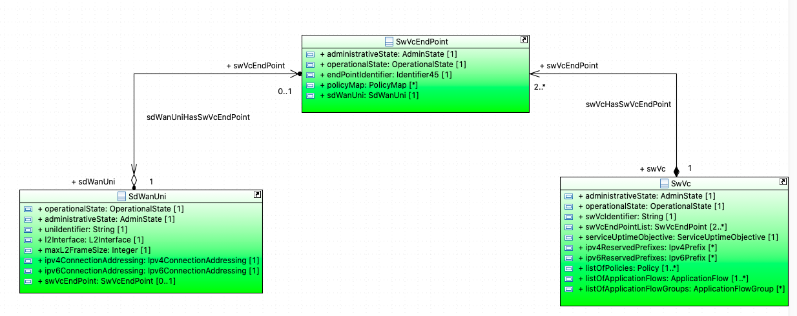
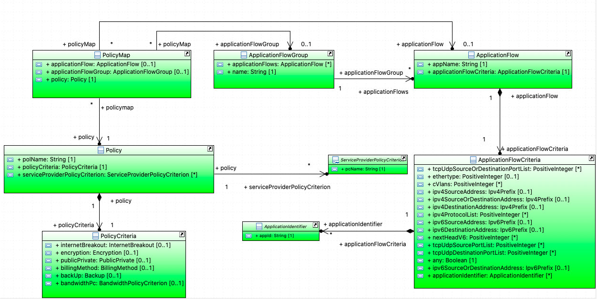
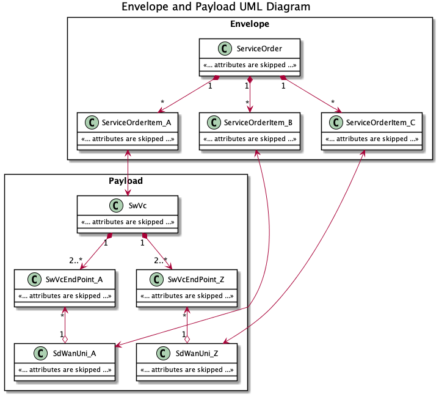
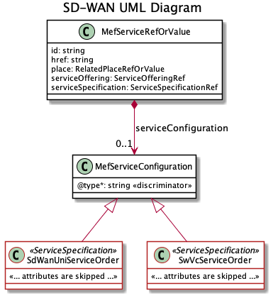
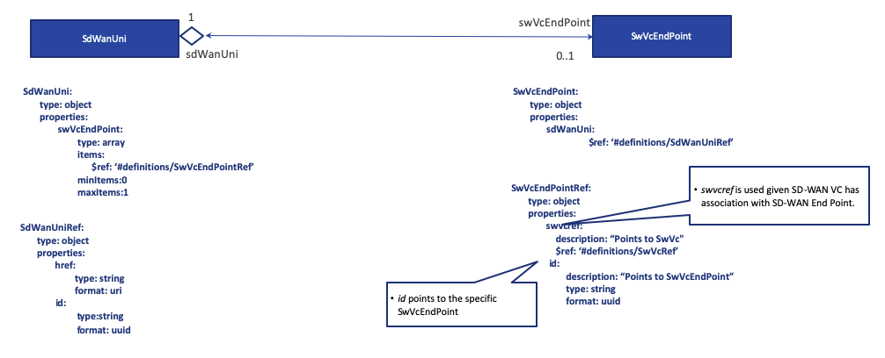
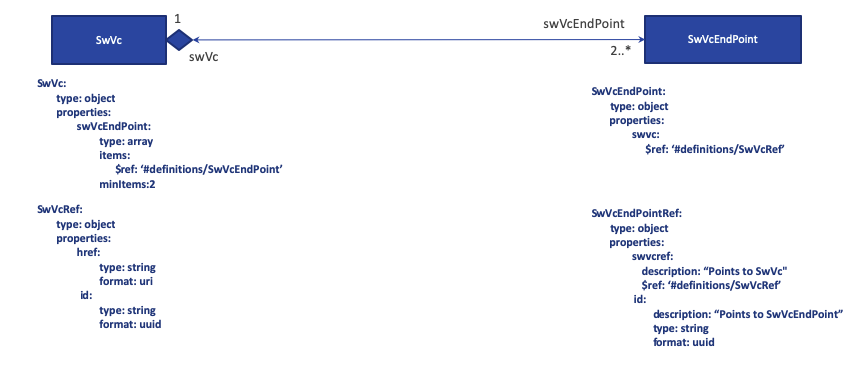
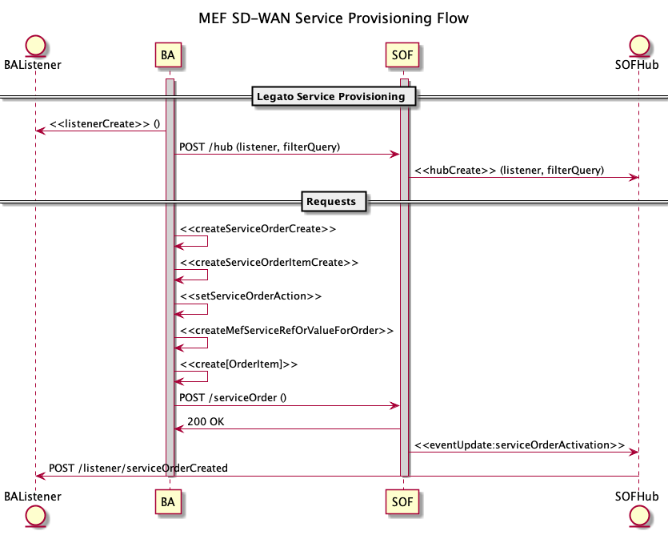

 <strong>Working Draft   MEF W100 v0.1</strong> 

 

 <strong>LSO Legato Service Provisioning Specification —  SD-WAN Schema Guide</strong> 

 <strong>April 2022</strong> 

 

 <strong>This draft represents MEF work in progress and is subject to change.</strong> 

Disclaimer
© MEF Forum 2022. All Rights Reserved.

The information in this publication is freely available for reproduction and use by any recipient and is believed to be accurate as of its publication date. Such information is subject to change without notice and MEF Forum (MEF) is not responsible for any errors. MEF does not assume responsibility to update or correct any information in this publication. No representation or warranty, expressed or implied, is made by MEF concerning the completeness, accuracy, or applicability of any information contained herein and no liability of any kind shall be assumed by MEF as a result of reliance upon such information.
The information contained herein is intended to be used without modification by the recipient or user of this document. MEF is not responsible or liable for any modifications to this document made by any other party.

The receipt or any use of this document or its contents does not in any way create, by implication or otherwise:

1. any express or implied license or right to or under any patent, copyright, trademark or trade secret rights held or claimed by any MEF member which are or may be associated with the ideas, techniques, concepts or expressions contained herein; nor
2. any warranty or representation that any MEF members will announce any product(s) and/or service(s) related thereto, or if such announcements are made, that such announced product(s) and/or service(s) embody any or all of the ideas, technologies, or concepts contained herein; nor
3. any form of relationship between any MEF member and the recipient or user of this document.

Implementation or use of specific MEF standards, specifications, or recommendations will be voluntary. This document is provided “as is” with no warranties whatsoever, express of implied, including without limitation, any warranties of merchantability, non-infringement, accuracy, completeness or fitness for any particular purpose. MEF and its members disclaim all liability, including liability for infringement of any proprietary rights, relating to use of information in this document.

 <strong>Table of Contents</strong> 

<!---Table Of Contents Here--->
- [1. List of Contributing Members](#1-list-of-contributing-members)
- [2. Abstract and Introduction](#2-abstract-and-introduction)
- [3. Terminology and Abbreviations](#3-terminology-and-abbreviations)
- [4. Overview of LSO-Legato](#4-overview-of-lso-legato)
- [5. Overview of SD-WAN Services](#5-overview-of-sd-wan-services)
- [6. Data Model Design Principles](#6-data-model-design-principles)
- [7. Data Models for SD-WAN Services](#7-data-models-for-sd-wan-services)
  - [7.1 Service Order and SD-WAN Service Component Associations](#71-service-order-and-sd-wan-service-component-associations)
  - [7.2. Organization and Structure of the JSON Schemas](#72-organization-and-structure-of-the-json-schemas)
    - [7.2.1 SdWanUni-SwVcEndPoint Relationship](#721-sdwanuni-swvcendpoint-relationship)
    - [7.2.2 SwVc-SwVcEndPoint Relationship](#722-swvc-swvcendpoint-relationship)
- [8. SD-WAN Main Resources and Service Attributes](#8-sd-wan-main-resources-and-service-attributes)
  - [8.1 SdWanUni Service Attributes](#81-sdwanuni-service-attributes)
  - [8.2 SdWanUniRef Attributes](#82-sdwanuniref-attributes)
  - [8.3 SdWanVc Service Attributes](#83-sdwanvc-service-attributes)
  - [8.4 SwVcEndPoint Service Attributes](#84-swvcendpoint-service-attributes)
  - [8.5 SwVcEndPointRef Attributes](#85-swvcendpointref-attributes)
- [9. Policy and Application Flows Resource and Attributes](#9-policy-and-application-flows-resource-and-attributes)
  - [9.1 ApplicationFlow Attributes](#91-applicationflow-attributes)
  - [9.2 ApplicationFlowCriteria Attributes](#92-applicationflowcriteria-attributes)
  - [9.3 ApplicationFlowGroup Attributes](#93-applicationflowgroup-attributes)
  - [9.4 ApplicationIdentifier Attributes](#94-applicationidentifier-attributes)
  - [9.5 PolicyMap](#95-policymap)
  - [9.6 Policy](#96-policy)
  - [9.7 ServiceProvider PolicyCriteron](#97-serviceprovider-policycriteron)
- [10. SD-WAN Common Resources and Attributes](#10-sd-wan-common-resources-and-attributes)
  - [10.1 AdministrativeState Attributes](#101-administrativestate-attributes)
  - [10.2 Backup Attributes](#102-backup-attributes)
  - [10.3 BandwidthPolicyCriteron Attributes](#103-bandwidthpolicycriteron-attributes)
  - [10.4 BillingMethod Attributes](#104-billingmethod-attributes)
  - [10.5 Encryption Attributes](#105-encryption-attributes)
  - [10.6 InternetBreakout Attributes](#106-internetbreakout-attributes)
  - [10.7 Ipv4ConnectionAddressing Attributes](#107-ipv4connectionaddressing-attributes)
  - [10.8 Ipv4Prefix Attributes](#108-ipv4prefix-attributes)
  - [10.9 Ipv4Subnet Attributes](#109-ipv4subnet-attributes)
  - [10.10 Ipv6ConnectionAddressing Attributes](#1010-ipv6connectionaddressing-attributes)
  - [10.11 Ipv6Prefix Attributes](#1011-ipv6prefix-attributes)
  - [10.12 Ipv6Subnet Attributes](#1012-ipv6subnet-attributes)
  - [10.13 L2Interface Attributes](#1013-l2interface-attributes)
  - [10.14 OperationalState Attributes](#1014-operationalstate-attributes)
  - [10.15 Period Attributes](#1015-period-attributes)
  - [10.16 PublicPrivate Attributes](#1016-publicprivate-attributes)
  - [10.17 ServiceUptimeObjective Attributes](#1017-serviceuptimeobjective-attributes)
  - [10.18 TimeAndDate Attributes](#1018-timeanddate-attributes)
  - [10.19 TimeUnits Attributes](#1019-timeunits-attributes)
- [11. Legato Service Order for SD-WAN Services](#11-legato-service-order-for-sd-wan-services)
  - [11.1 Legato Envelope and MEF Payload Association](#111-legato-envelope-and-mef-payload-association)
- [12. References](#12-references)

# 1. List of Contributing Members

The following members of the MEF participated in the development of this document and have requested to be included in this list.

# 2. Abstract and Introduction

This MEF Standard consisting of this Develop Guide and its associated software artifacts (JSON Schemas) defines and describes the product-specific payload for the LSO-Legato API for the SD-WAN Services. The document starts with an overview of LSO-Legato and the SD-WAN Services. It then provides a basic information model for the MEF SD-WAN Resources and corresponding Attributes including tables of all of the Service Attributes supported by SD-WAN Services, Policy and Application Flow payloads along the the characteristics of each. The final sections describe the Data Model in both a technology-independent way and a technology-specific way focused on JSON. The JSON model, itself, is an independent software artifact.

This document can be thought of as a "developer's guide" for the API. MEF Services are described by a set of Service Attributes, specific information that is agreed between the provider and the subscriber of the service, that describes some aspect of the service behavior or capability. The document the describes the Service Attributes used for SD-WAN Services.

The following sections provide background on Lifecycle Services Orchestration and SD-WAN Services. This is followed by an abbreviated information model that describes how the Service Attributes of MEF SD-WAN Services are organized. A technology-independent overview of the data model is presented followed by an overview of the actual JSON Schemas. After this are tables of the Service Attributes that include the Service Attribute Name, JSON Name, description, the reference to the MEF standard and section, data type, and, when appropriate, validation notes that describe relationships between the various Service Attributes.

# 3. Terminology and Abbreviations

This section defines the terms used in this document. In many cases, the normative definitions to terms are found in other documents. In these cases, the third column is used to provide the reference that is controlling, in other MEF or external documents. If the reference includes an asterisk (*), the definition has been adapted from the original.   

<TABLE style="border:solid; border-width:1px; border-color:#aaaaaa; padding:4px;border-collapse: collapse; ">
<TR style="background-color:blue"><TD style="width:25%; text-align:center"><strong>Term</strong></TD><TD style="width:50%; text-align:center"><strong>Definition</strong></TD><td style="width:20%; text-align:center"><strong>Reference</strong></TD></TR>

<TR style="border-width: 1px; border-style: solid; border-color: grey">
<TD>BA</TD>
<TD>The Service Provider functionality supporting Business Management Layer functionality (e.g., product catalog, ordering, billing, relationship management, etc.) </TD>
<TD style="text-align:center"><a href="https://wiki.mef.net/display/CESG/MEF+55.1+-+MEN+Architecture+Framework">MEF 55.1</a></TD></TR>

<TR style="border-width: 1px; border-style: solid; border-color: grey">
<TD>Legato</TD>
<TD>Specific information that is agreed between the provider and the user of the service, that describes some aspect of the service behavior or capability.</TD>
<TD style="text-align:center"><a href="https://wiki.mef.net/display/CESG/MEF+55.1+-+MEN+Architecture+Framework">MEF 55.1</a></TD></TR>

<TR style="border-width: 1px; border-style: solid; border-color: grey">
<TD>Information Model</TD>
<TD>Models managed objects at a conceptual level, independent of any specific implementation or protocols used to transport the data. MEF uses UML Class Diagrams to model Information Models.</TD>
<TD style="text-align:center"><a href="https://wiki.mef.net/display/CESG/MEF+4+-+MEN+Architecture+Framework">MEF 4</a></TD></TR>

<TR style="border-width: 1px; border-style: solid; border-color: grey">
<TD>SOF</TD>
<TD>The set of service management layer functionality supporting an agile framework to streamline and automate the service lifecycle in a sustainable fashion for coordinated management supporting design, fulfillment, control, testing, problem management, quality management, usage measurements, security management, analytics, and policy-based management capabilities providing coordinated end-to-end management and control of Layer 2 and Layer 3 Connectivity Services.</TD>
<TD style="text-align:center"><a href="https://wiki.mef.net/display/CESG/MEF+55.1+-+MEN+Architecture+Framework">MEF 55.1</a></TD></TR>

</TABLE>

# 4. Overview of LSO-Legato

[MEF 55.1](https://wiki.mef.net/display/CESG/MEF+55+-+LSO+Reference+Architecture) describes the Reference Architecture for Lifecycle Service Orchestration (LSO) of MEF-defined connectivity services. MEF 55.1 defines seven LSO Reference Points that are abstract interconnection points between different domains - either within the service provider domain (intra-domain) or between service provider and other business entities (inter-domain). One of these LSO Reference Points is LSO Legato which defines the abstract boundary point between a Service Provider's or Partner's Business Application (BA) and Service Orchestration Functionality (SOF) for providing connectivity services provisioning.

|  |
|:--:|
| <i>Figure 1 - LSO Reference Architecture</i> |

The access to automated service provisioning functionality is provided using the Service Provisioning API at LSO Legato. LSO Legato provides a suite of APIs for provisioning, inventory and performance management, which are standardized by MEF as LSO Legato APIs, and which are made available by MEF in a series of releases of the LSO Legato SDK.

The LSO Legato APIs comprise two parts: one is the service-independent functionality, or Basic API Structure, and the second is the service-specific payload, or Information Payload, as shown in diagram below.

|  |
|:--:|
| <i>Figure 2 - TMForum API Envelope/MEF Payload</i> |

This document defines the service-specific payload, shown as JSON Data Model in the figure above, specifically for a MEF 70 SD-WAN Services as defined in [MEF 70](https://wiki.mef.net/display/CESG/MEF+10.4+-+Subscriber+Ethernet+Service+Attributes) and [MEF 82](https://wiki.mef.net/display/CESG/MEF+82++-+MEF+Services+Model%3A+Information+Model+for+SD-WAN+Services).

The LSO Legato APIs basic API structure is comprised of two parts: one is the service-independent functionality, and the second is the service-specific payload, as shown in diagram below.

# 5. Overview of SD-WAN Services

An SD-WAN Service provides a virtual overlay network that enables application-aware, policy-driven and orchestrated connectivity between SD-WAN User Network Interfaces (UNIs) and provides the logical construct of a L3 Virtual Private Router Network for a Subscriber that conveys IP Packets between Subscriber locations as defined in [MEF 70](https://wiki.mef.net/display/CESG/MEF+10.4+-+Subscriber+Ethernet+Service+Attributes).

|  |
|:--:|
| <i>Figure 3 - SD-WAN Service Model</i> |

An SD-WAN Service is described in terms of SD-WAN UNIs, SD-WAN Virtual Connections (SWVCs) between those SD-WAN UNIs and SWVC End Points (SWVC EPs) at the SD-WAN UNIs.  The SD-WAN Service is an overlay service that operates over one or more Underlay Connectivity Services (UCSs).

Traffic is forwarded within an SD-WAN Service based on Application Flow.  IP Packets received by the Service Provider at an SD-WAN UNI are mapped to Application Flows based on a set of criteria, and Policies can then be applied to the Application Flow to describe rules and constraints on how the traffic for the Application Flow is forwarded.

|  |
|:--:|
| <i>Figure 4 - SD-WAN Policy and Application Flows</i> |

# 6. Data Model Design Principles

The design for the API Schema is based on a number of assumptions

1. The requirements for which attributes are necessary at Service Order, Inventory and other APIs in future will use the same schemas.  Specifically, there currently are not separated schemas for each functional area.

2. A service order must support multiple service order items.  A service order item includes SdWanUni and/or SwVc for SD-WAN Services. SwVc has an associated SwVcEndPoint.

3. The common resources are stored in a SD-WAN Common schema.

4. For the main resources in SD-WAN schemas there exists two-way relationships.  The reference pattern detailed later in the document is used.

# 7. Data Models for SD-WAN Services

The Legato API is based on the TMForum API format approach with a service-agnostic envelope and a service-specific payload.  The envelope part of the API defines service agnostic Order Items.  The payload part of the API defines service specific resources.

## 7.1 Service Order and SD-WAN Service Component Associations

The SD-WAN Service resources are positioned in the payload. The association between the Legato Service Order Envelope Service Order Items and the SD-WAN Services resources is illustrated in the figure below.

<i>Figure 5 - Legato Service Order Envelope/MEF Payload Association</i>

The developer makes the association between an Envelope Service Order Item and a specific SD-WAN resource by instantiating a sub-classed MefServiceConfiguration. Sub-classed MefServiceConfiguration objects or resources include the set of SD-WAN Service objects (resources).

The envelope has two main objects, Service Order and Service Order Item. A Service Order can have many Service Order Items. The payload depends on the specific SD-WAN Service intended to be activated.  

<i>Figure 6 - SD-WAN Extension</i>

## 7.2. Organization and Structure of the JSON Schemas

The organization and structure of the Schemas are in the following directory structure and schema file names:

spec/legato:

- sdWanCommon.yaml
- sdWanUni.yaml
- sdWanVc.yaml
  
### 7.2.1 SdWanUni-SwVcEndPoint Relationship

The following section discusses the mapping of the information model object relationship between SD-WAN UNI and SD-WAN VC End Point to the schema.

|  |
|:--:|
| <i>Figure 7 - SdWanUni:SwVcEndPoint Relationship</i> |

### 7.2.2 SwVc-SwVcEndPoint Relationship

The following section discusses the mapping of the information model object relationship between Subscriber UNI and EVC End Point to the schema.

|  |
|:--:|
| <i>Figure 8 - SwVc:SwVcEndPoint Relationship</i> |

# 8. SD-WAN Main Resources and Service Attributes

The following section defines the main set of resources that are used by the SD-WAN services.  The resource with associated attributes defined are:

- SdWanUni Service Attributes,
- SdWanUniRef Attributes,
- SdWanVc Service Attributes,
- SwVcEndPoint Service Attributes,
- SwVcEndPointRef Attributes
  
These are the main resources that define SD-WAN Services.  Additional resources defined later in document are for Policy and Application Flows. A common set of likely reusable resource for other models are defined in a common section later in the document.

## 8.1 SdWanUni Service Attributes

SdWanUni is a class that represents the boundary between the responsibility of the Subscriber and the responsibility of the Service Provider. Reference MEF 70, Section 6.4 SD-WAN UNI.

Name | Type | Description | Notes
------------ | ------------- | ------------- | -------------
**administrativeState** | [**AdministrativeState**](AdministrativeState.md) |This attribute denotes the administrative state of SD-WAN UNI. The values supported are LOCKED and UNLOCKED. When set to UNLOCKED, the SD-WAN UNI is enabled and ready to forward traffic. When set to LOCKED, the SD-WAN UNI is disabled and will block (i.e., not forward) traffic.  | [optional] [default to null]
**operationalState** | [**OperationalState**](OperationalState.md) | This enumeration is for Operational states. Refer to ITU-T X.731. | [optional] [default to null]
**uniIdentifier** | [**String**](string.md) | Identification of the UNI for management purposes. Reference MEF 70, Section 10.1 SD-WAN UNI Identifier Service Attribute. | [optional] [default to null]
**l2Interface** | [**L2Interface**](L2Interface.md) | Describes the underlying L2 technology for the UNI. Reference MEF 70, Section 10.2 SD-WAN UNI L2 Interface Service Attribute. | [optional] [default to null]
**maxL2FrameSize** | [**Integer**](integer.md) | Specifies the maximum length L2 frame that is accepted by the Service Provider. Reference MEF 70, Section 10.3 SD-WAN UNI Maximum L2 Frame Size Service Attribute. | [optional] [default to null]
**ipv4ConnectionAddressing** | [**Ipv4ConnectionAddressing**](Ipv4ConnectionAddressing.md) |  | [optional] [default to null]
**ipv6ConnectionAddressing** | [**Ipv6ConnectionAddressing**](Ipv6ConnectionAddressing.md) |  | [optional] [default to null]
**swVcEndPoint** | [**List**](SwVcEndPointRef.md) |  | [optional] [default to null]

## 8.2 SdWanUniRef Attributes

The SdWanUniRef provides a pointer to the SD WAN UNI in order for the SD-WAN VC End Point to have a reference to SD-WAN UNI.

Name | Type | Description | Notes
------------ | ------------- | ------------- | -------------
**href** | [**URI**](URI.md) |  | [optional] [default to null]
**id** | [**UUID**](UUID.md) |  | [optional] [default to null]

## 8.3 SdWanVc Service Attributes

 SdWanVc is a class that represents a SD-WAN Virtual Connection. Reference MEF 70 Section 6.8 SD-WAN Virtual Connection.

Name | Type | Description | Notes
------------ | ------------- | ------------- | -------------
**administrativeState** | [**AdministrativeState**](AdministrativeState.md) |  | [optional] [default to null]
**operationalState** | [**OperationalState**](OperationalState.md) |  | [optional] [default to null]
**swVcIdentifier** | [**String**](string.md) | Identification of the SWVC for management purposes. Reference MEF 70, Section 8.1. | [optional] [default to null]
**swVcEndPointList** | [**List**](SwVcEndPoint.md) | The SWVC End Point that are connected by the SWVC. Reference MEF 70 Section 8.2 SWVC End Point List Service Attribute. | [optional] [default to null]
**serviceUptimeObjective** | [**ServiceUptimeObjective**](ServiceUptimeObjective.md) |  | [optional] [default to null]
**ipv4ReservedPrefixes** | [**List**](Ipv4Prefix.md) | Specifies a list of IPv4 Prefixes that the Service Provider reserves for use for the SWVC within their own network or for distribution to the Subscriber via DHCP. Reference MEF 70 Section 8.4 SWVC Reserved Prefixes Service Attribute. | [optional] [default to null]
**ipv6ReservedPrefixes** | [**List**](Ipv6Prefix.md) | Specifies a list of IPv6 Prefixes that the Service Provider reserves for use for the SWVC within their own network or for distribution to the Subscriber via DHCP or SLAAC. Reference MEF 70 Section 8.4 SWVC Reserved Prefixes Service Attribute. | [optional] [default to null]
**listOfPolicies** | [**List**](Policy.md) | A list of the Policies that can be applied to Application Flows carried by the SWVC End Points. Reference MEF 10.4 Section 8.5 SWVC List of Policies Service Attribute. | [optional] [default to null]
**listOfApplicationFlows** | [**List**](ApplicationFlow.md) | Specifies the Application Flows that can be recognized by the SD-WAN service and information about how to identify IP packets in each Application Flow. Reference MEF 70 Section 8.7 SWVC List of Application Flows Service Attribute. | [optional] [default to null]
**listOfApplicationFlowGroups** | [**List**](ApplicationFlowGroup.md) | A list (possibly empty) of Application Flow Group names. Reference MEF 70 Section 8.6 SWVC List of Application Flow Groups Service Attribute. | [optional] [default to null]

## 8.4 SwVcEndPoint Service Attributes

SwVcEndPoint is a class that represents a logical construct at an SD-WAN UNI that partitions Ingress IP Packets into Applications, applies Policy to each IP Packet based on the associated Application, and selets an appropriate path to transport the IP Packet over the SWVC. Reference MEF 70, Section 9 SD-WAN Virtual Connection (SWVC) End Point.

Name | Type | Description | Notes
------------ | ------------- | ------------- | -------------
**administrativeState** | [**AdministrativeState**](AdministrativeState.md) |  | [optional] [default to null]
**operationalState** | [**OperationalState**](OperationalState.md) |  | [optional] [default to null]
**endPointIdentifier** | [**String**](string.md) | Identfication of the SWVC End Point for management purposes. Reference MEF 70 Section 9.1 SWVC End Point Identifier Service Attribute. | [optional] [default to null]
**policyMap** | [**List**](PolicyMap.md) | Maps Policies to Application Flows and Application Flow Groups. Reference MEF 70 Section 9.3 SWVC End Point Policy Map. | [optional] [default to null]
**swvc** | [**SwVcRef**](SwVcRef.md) |  | [optional] [default to null]
**sdWanUni** | [**SdWanUniRef**](SdWanUniRef.md) |  | [optional] [default to null]

## 8.5 SwVcEndPointRef Attributes

The SwVcEndPointRef provides a pointer to the SD WAN VC in order for the SD-WAN VC End Point to have a reference to SD-WAN VC.

Name | Type | Description | Notes
------------ | ------------- | ------------- | -------------
**swvcref** | [**SwVcRef**](SwVcRef.md) |  | [optional] [default to null]
**id** | [**UUID**](UUID.md) | Points to SwVcEndPoint | [optional] [default to null]

# 9. Policy and Application Flows Resource and Attributes

The following section provides the set of resource and corresponding attributes in support of SD-WAN Policy and Application Flow definitions.

## 9.1 ApplicationFlow Attributes

A subset of the IP packets that arrive at an Ingress SD-WAN UNI, identified by a set of Application Flow Criteria, and distinct from the subset for any other Application Flow at that SD-WAN UNI. Reference MEF 70 Table 1-Terminology and Abbreviations.

Name | Type | Description | Notes
------------ | ------------- | ------------- | -------------
**appName** | [**String**](string.md) | Identifier String that is used to refer to Application Flow. | [optional] [default to null]
**applicationFlowCriteria** | [**ApplicationFlowCriteria**](ApplicationFlowCriteria.md) |  | [optional] [default to null]

## 9.2 ApplicationFlowCriteria Attributes

ApplicationFlowCriterion is a resource used to describe Application Flow MUST include the Criteria. 
Reference MEF 70 Section 8.7 SWVC List of Application Flows Service Attribute [R46] Table 4 - Required Application Flow Criteria.

Name | Type | Description | Notes
------------ | ------------- | ------------- | -------------
**ethertype** | [**List**](integer.md) | Ethertype. Integer in the range 0x600 to 0xffff. Reference MEF 70 Section 8.7 Table-4 Required Application Flow Criteria. | [optional] [default to null]
**cVlans** | [**List**](integer.md) | C-VLAN ID List. Integer in range 0 to 4096. Reference MEF 70 Section 8.7 Table-4 Required Application Flow Criteria. | [optional] [default to null]
**ipv4SourceAddress** | [**List**](Ipv4Prefix.md) | IPv4 Source Address. Reference MEF 70 Section 8.7 Table-4 Required Application Flow Criteria. | [optional] [default to null]
**ipv4DestinationAddress** | [**List**](Ipv4Prefix.md) | IPv4 Destination Address. Reference MEF 70 Section 8.7 Table-4 Required Application Flow Criteria. | [optional] [default to null]
**ipv4SourceOrDestinationAddress** | [**List**](Ipv4Prefix.md) | IPv4 Source or Destination Address. Reference MEF 70 Section 8.7 Table-4 Required Application Flow Criteria. | [optional] [default to null]
**ipv4ProtocolList** | [**List**](integer.md) | IPv4 Destination Address. Reference MEF 70 Section 8.7 Table-4 Required Application Flow Criteria. | [optional] [default to null]
**ipv6SourceAddress** | [**List**](Ipv6Prefix.md) | IPv6 Source Address. Reference MEF 70 Section 8.7 Table-4 Required Application Flow Criteria. | [optional] [default to null]
**ipv6DestinationAddress** | [**List**](Ipv6Prefix.md) | IPv6 Destination Address. Reference MEF 70 Section 8.7 Table-4 Required Application Flow Criteria. | [optional] [default to null]
**ipv6SourceOrDestinationAddress** | [**List**](Ipv6Prefix.md) | IPv6 Source or Destination Address. Reference MEF 70 Section 8.7 Table-4 Required Application Flow Criteria. | [optional] [default to null]
**nextHeadV6** | [**List**](integer.md) | IPv6 Next Header List. Reference MEF 70 Section 8.7 Table-4 Required Application Flow Criteria. | [optional] [default to null]
**tcpUdpSourcePortList** | [**List**](integer.md) | TCP/UDP Source Port List. Reference MEF 70 Section 8.7 Table-4 Required Application Flow Criteria. | [optional] [default to null]
**tcpUdpDestinationPortList** | [**List**](integer.md) | TCP/UDP Destination Port List. Reference MEF 70 Section 8.7 Table-4 Required Application Flow Criteria. | [optional] [default to null]
**tcpUdpSourceOrDestinationPortList** | [**List**](integer.md) | TCP/UDP Source or Destination Port List. Reference MEF 70 Section 8.7 Table-4 Required Application Flow Criteria. | [optional] [default to null]
**any** | [**Boolean**](boolean.md) | Match Any IP Packet. Reference MEF 70 Section 8.7 Table-4 Required Application Flow Criteria. | [optional] [default to null]
**applicationIdentifier** | [**List**](ApplicationIdentifier.md) |  | [optional] [default to null]

## 9.3 ApplicationFlowGroup Attributes

An aggregation of Application Flows at an SD-WAN UNI that can be used to assign a common Policy to the Application Flows and/or share bandwidth commitments and limitations amoung Application Flows. Reference MEF 70 Table 1-Terminology and Abbreviations.

Name | Type | Description | Notes
------------ | ------------- | ------------- | -------------
**name** | [**String**](string.md) | Application Flow Group name. | [optional] [default to null]
**applicationFlows** | [**List**](ApplicationFlow.md) | Associated Application Flows. | [optional] [default to null]

## 9.4 ApplicationIdentifier Attributes

Abstract resource intended to be extended (subclassed) to Service Provider defined Application
Identifier.

Name | Type | Description | Notes
------------ | ------------- | ------------- | -------------
**appId** | [**String**](string.md) | Application Identfier as a String. Reference MEF 70 Section 8.7 [R47]. | [optional] [default to null]

## 9.5 PolicyMap

Specifies the Policies that are assigned to Application Flows and Application Flow Groups at the SWVC End Point.
Reference MEF 70 Section 9.3 SWVC End Point Policy Map.

Name | Type | Description | Notes
------------ | ------------- | ------------- | -------------
**applicationFlow** | [**List**](ApplicationFlow.md) | Pointer to Application Flow. | [optional] [default to null]
**applicationFlowGroup** | [**List**](ApplicationFlowGroup.md) | Pointer to Application Flow Group. | [optional] [default to null]
**policy** | [**Policy**](Policy.md) |  | [optional] [default to null]

## 9.6 Policy

Policy that has Policy Name (polName) and Policy Criterion (polCl). A Policy is a list of Policy Criteria.
Policies are assigned to Application Flows and Application Flow Groups at each SWVC End Point.

Name | Type | Description | Notes
------------ | ------------- | ------------- | -------------
**polName** | [**String**](string.md) | An identifier String that specifies the name of Policy. polName cannot be &#39;block&#39;. | [optional] [default to null]
**policyCriteria** | [**PolicyCriteria**](PolicyCriteria.md) |  | [optional] [default to null]
**serviceProviderPolicyCriterion** | [**List**](ServiceProviderPolicyCriterion.md) | Pointer to Service Provider Policy Criteria. | [optional] [default to null]

## 9.7 ServiceProvider PolicyCriteron

Abstract resource representing Service Provider defined policy criteria in form of <pcName,pcParam>. Reference
MEF 70 Section 8.5 SWVC List of Policies Service Attribute.

Name | Type | Description | Notes
------------ | ------------- | ------------- | -------------
**policyCriteria** | [**List**](string.md) |  | [optional] [default to null]

# 10. SD-WAN Common Resources and Attributes

The following section provides resources and associated attributes for resources considered as common and reusable in for multiple areas within the data model.

## 10.1 AdministrativeState Attributes

This enumeration is for Administrative states. Refer to ITU-T X.731.

- LOCKED:
  - The resource is administratively prohibited from performing services for its users.
- UNLOCKED:
  - The resource is administratively permitted to perform services for its users.

## 10.2 Backup Attributes

Backup is an enumeration that represents a Policy Criterion when at least one non-Backup UCS available at an SD-WAN Edge. Reference MEF 70 Section 8.5.6 BACKUP Policy Criterion.

- YES:
  - Enumeration literal for Backup PolicyCriterion where Application Flows canbe forwarded over a backup path (if thereis non-backup path available). Reference MEF 70[1]Section 8.5.6 [R32].
- NO:
  - Enumeration literal for Backup Policy Criterion where Application Flow mustbe discarded if only Backup UCSs to the destination egress UNI are available. Reference MEF 70[1]Section 8.5.6 BACKUP Policy Criterion.[R32].

## 10.3 BandwidthPolicyCriteron Attributes

BandwidthPolicyCriterion is a data type that specifies a rate (bandwidth) limit on an Application Flow or Application Flow Group. Reference MEF 70 Section 8.5.7 BANDWIDTH Policy Criterion.

Name | Type | Description | Notes
------------ | ------------- | ------------- | -------------
**commit** | [**List**](integer.md) | Average information rate in bits per second that is committed to the Application Flow or none. Reference MEF 70 Section 8.5.7. | [optional] [default to null]
**max** | [**List**](integer.md) | Limit on the average information rate in bits per second that can be used by the Application Flow or none.  Reference MEF 70 Section 8.5.7. | [optional] [default to null]

## 10.4 BillingMethod Attributes

BillingMethod is an enumeration representing a Policy Criterion provides control over the charge type of the network that can be used to forward an Application Flow. Reference MEF 70 Section 8.5.5 BILLING-METHOD Policy Criterion.

- FLAT_RATE_ONLY:
  - Enumeration literal for Billing Method Policy Criterion that indicates that traffic must be forwarded over an Underlay Connectivity Service with flat-rate (i.e., time-based) charging. Reference MEF 70[1]Section 8.5.5 [R30].
- EITHER:
  - Enumeration literal for Billing Method Policy Criterion that indicates thatthe billing method must not be considered in the forwarding decision for the Application Flow. Reference MEF 70[1]Section 8.5.5 [R31].

## 10.5 Encryption Attributes

Encryption is an enumeration that represents a Policy Criterion used to specify whether or not encryption is required. Reference MEF 70 Section 8.5.2 ENCRYPTION Policy Criterion.

- YES:
  - Enumeration literal for Encryption Policy Criterion when Encryption is set and Application Flow mustbe encrypted before it is forwardedover the Underlay Connectivity Service. Reference MEF 70[1]Section 8.5.2 [R23].
  
- EITHER:
  - Enumeration literal for Encryption Policy Criterion if Encryption is set to Either and Policy Criterion mustnotbe considered in theforwarding decision for the Application Flow. Reference MEF 70[1]Section 8.5.2 [R24].

## 10.6 InternetBreakout Attributes

InternetBreakout is an enumeration that represents a Policy Criterion that indicates whether the Application Flow should be forwarded directly to the Internet using Internet Breakout. Reference MEF 70[1]Section 8.5.4 INTERNET-BREAKOUT Policy Criterion.

- YES:
  - Enumeration literal for InternetBreakout Policy Criterion when Application Flow mustbe forwarded to the Internet over an Internet UCS.  Reference MEF 70[1]Section 8.5.4 [R27].
  
- NO:
  - Enumeration literal for InternetBreakout Policy Criterion when the Application Flow, if it is not blocked or discarded for other reasons, mustbe forwarded into the SWVC and delivered to another SD-WAN End Point in the SWVC. Reference MEF 70[1]Section 8.5.4 [R28].
  
## 10.7 Ipv4ConnectionAddressing Attributes

Ipv4ConnectionAddressing is a data type representing how IPv4 addresses are allocated to the devices on the Subscriber side of the UNI. For DHCP and Static the Primary Subnet and Secondary Subnet List must be included. Reference MEF 70 Section 10.4 SD-WAN UNI IPv4 Connection Addressing Service Attribute.

Name | Type | Description | Notes
------------ | ------------- | ------------- | -------------
**ipv4AddressType** | [**String**](string.md) | IPv4 Connection Address mechanism. Possible values are None, Static or DHCP. | [optional] [default to null]
**ipv4PrimarySubnet** | [**List**](Ipv4Subnet.md) | Primary IPv4 Subnet. Includes IPv4 Prefix and Service Provider IPv4 Addresses. | [optional] [default to null]
**ipv4SecondarySubnetList** | [**List**](Ipv4Subnet.md) | Secondary IPv4 Subnet List. Includes IPv4 Prefix and Service Provider IPv4 Addresses. | [optional] [default to null]

## 10.8 Ipv4Prefix Attributes

Ipv4Prefix is a data type representing an IPv4 prefix using slash notation.

Name | Type | Description | Notes
------------ | ------------- | ------------- | -------------
**ipv4Address** | [**String**](string.md) | IPv4 address represented as a string. | [optional] [default to null]
**prefixLength** | [**Integer**](integer.md) | IPv4 prefix length with range 0-31. | [optional] [default to null]

## 10.9 Ipv4Subnet Attributes

Ipv4Subnet is a data type representing an IPv4 subnet logical partition of an IP network. Included is list of Service Provider IPv4 addresses.

Name | Type | Description | Notes
------------ | ------------- | ------------- | -------------
**ipv4Prefix** | [**Ipv4Prefix**](Ipv4Prefix.md) |  | [optional] [default to null]
**serviceProviderIpv4Addresses** | [**List**](string.md) | List of Service Provider IPv4 addresses. | [optional] [default to null]

## 10.10 Ipv6ConnectionAddressing Attributes

IPv6ConnectionAddressing is a data type that specifies how IPv6 addresses are allocated to the devices on the Subscriber side of the UNI. For DHCP, SLAAC and Static, IPv6 Prefix and Service Provider IPv6 Addresses are needed. Reference MEF 70 Section 10.5 SD-WAN UNI IPv6 Connection Addressing Service Attribute.

Name | Type | Description | Notes
------------ | ------------- | ------------- | -------------
**ipv6AddressType** | [**String**](string.md) | IPv6 Connection Address mechanism. Possible values are None, DHCP, SLAAC, Static or LL-only. | [optional] [default to null]
**ipv6SubnetList** | [**List**](Ipv6Subnet.md) |  | [optional] [default to null]

## 10.11 Ipv6Prefix Attributes

Ipv6Prefix is a data type representing an IPv6 prefix using slash notation.

Name | Type | Description | Notes
------------ | ------------- | ------------- | -------------
**ipv4Address** | [**String**](string.md) | IPv4 address represented as a string. | [optional] [default to null]
**prefixLength** | [**Integer**](integer.md) | IPv4 prefix length with range 0-31. | [optional] [default to null]

## 10.12 Ipv6Subnet Attributes

IPv6Subnet is a data type representing an IPv6 subnet logical partition of an IP network. Included is list of Service Provider IPv6 addresses.

Name | Type | Description | Notes
------------ | ------------- | ------------- | -------------
**ipv6Prefix** | [**Ipv6Prefix**](Ipv6Prefix.md) |  | [optional] [default to null]
**serviceProviderIpv6Addresses** | [**List**](string.md) | List of IPv6 Service Provider addresses. | [optional] [default to null]

## 10.13 L2Interface Attributes

L2Interface is a data type that describes the underlying network layer that carries IP Packets across the UNI. The possible values are UT/PT and CVLANx. Reference MEF 70 Section 10.2 SD-WAN UNI L2 Interface Service Attribute.

Name | Type | Description | Notes
------------ | ------------- | ------------- | -------------
**l2InterfaceType** | [**String**](string.md) | L2InterfaceType is an enumeration that describes the underlying network layer that carries IP Packets across the UNI. The possible values are UT/PT and CVLANx. Reference MEF 70 Section 10.2. | [optional] [default to null]
**vlanId** | [**List**](integer.md) | VLAN ID. | [optional] [default to null]

## 10.14 OperationalState Attributes

This enumeration is for Operational states.  Refer to ITU-T X.731. Contails Enumeration Literals:

- DISABLED:
  - The resource is operationally disabled.
- ENABLED:
  - The resource is operationally enabled.

## 10.15 Period Attributes

Period data type with value and specified time unit.  

Name | Type | Description | Notes
------------ | ------------- | ------------- | -------------
**value** | [**Integer**](integer.md) | Time value represented as an integer. | [optional] [default to null]
**units** | [**TimeUnits**](TimeUnits.md) |  | [optional] [default to null]

## 10.16 PublicPrivate Attributes

PublicPrivate is an enumeration representing a Policy Criterion provides control over whether or not an Application Flow can traverse a public Internet Underlay Connectivity Service. Reference MEF 70 Section 8.5.3 PUBLIC-PRIVATE Policy Criterion.

- PRIVATE_ONLY:
  - Enumeration literal for PublicPrivate Policy Criterion set to PrivateOnly and Application Flow must be forwarded over Underlay Connectivity Services that do not traverse the  public Internet. Reference MEF 70 Section 8.5.3 [R25].

- EITHER:
  - Enumeration literal for PublicPrivate Policy Criteron when Policy Criterion must not be considered in the forwarding decision for Application Flow. Reference MEF 70 Section 8.5.3 [R26].

## 10.17 ServiceUptimeObjective Attributes

ServiceUptimeObject is a data type that represents the SWVC service up time objective. It defines that proportion of time, during a given 
time period Tk, that the service is working from the perspective of the Subscriber, excluding an pre-agreed exceptions. Reference MEF 70 Section 8.3 SWVC Service Uptime Objective Service Attribute.

Name | Type | Description | Notes
------------ | ------------- | ------------- | -------------
**startTime** | [**TimeAndDate**](TimeAndDate.md) |  | [optional] [default to null]
**period** | [**Period**](Period.md) |  | [optional] [default to null]
**uptimeObjective** | [**Integer**](integer.md) | Objective for Service Uptime expressed as a percentage. | [optional] [default to null]

## 10.18 TimeAndDate Attributes

This data type is for Time and Date in UTC.

Name | Type | Description | Notes
------------ | ------------- | ------------- | -------------
**day** | [**Integer**](integer.md) | This denotes the day. | [optional] [default to null]
**hour** | [**Integer**](integer.md) | This denotes the hour. | [optional] [default to null]
**minute** | [**Integer**](integer.md) | This denotes the minute. | [optional] [default to null]
**month** | [**Integer**](integer.md) | This denotes the month. | [optional] [default to null]
**second** | [**Integer**](integer.md) | This denotes the second. | [optional] [default to null]
**year** | [**Integer**](integer.md) | This denotes the year. | [optional] [default to null]

## 10.19 TimeUnits Attributes

TimeUnits is an enumeration representing time units.

- MINUTES:
  - Minute is enumeration literal.
- HOUR:
  - Hour is enumberation literal.
- DAY:
  - Day is enumeration literal.
- WEEK:
  - Week is enumeration literal.
- MONTH:
  - Month is enumeration literal.
- YEAR:
  - Year is enumeration literal.

# 11. Legato Service Order for SD-WAN Services

The following section details how the two components of the Legato API are associated from an implementation perspective.  Specifically discussed are the binding between the Envelope and Payload.

## 11.1 Legato Envelope and MEF Payload Association

The following section provides the developer with a guide on how to associate the envelope part of the Legato API with the Carrier Ethernet payload. A sequence diagram illustrating the pseudo steps needed to create payload, associate to envelope and POST request.

The Legato Envelope and Payload are associated with the Order and specifically OrderItem.  The Envelope OrderItem is associated with a Payload resource such as CarrierEthernetSubscriberUni.

The figure below illustrates the sequencing of coding operations used in building the Legato Envelope and associated set of Carrier Ethernet specific Order Items.  Once the Order is complete it is communicate to the server-side (SOF) with a POST message.

# 12. References

[MEF 4](https://wiki.mef.net/display/CESG/MEF+4+-+MEN+Architecture+Framework), *Metro Ethernet Network Architecture - Part 1: Generic Framework*, May 2004

[MEF 55.1](https://wiki.mef.net/display/CESG/MEF+55+-+LSO+Reference+Architecture), *Lifecycle Service Orchestration (LSO): Reference Architecture and Framework*, January 2020

[MEF 70](https://wiki.mef.net/display/CESG/MEF+70+-+SD-WAN+Service+Attributes+and+Services+Definition), *SD-WAN Service Attributes and Service Definition*, July 2019

[MEF 82](https://wiki.mef.net/display/CESG/MEF+82++-+MEF+Services+Model%3A+Information+Model+for+SD-WAN+Services), *MEF Services Model: Information Model for SD-WAN Services*, July 2020